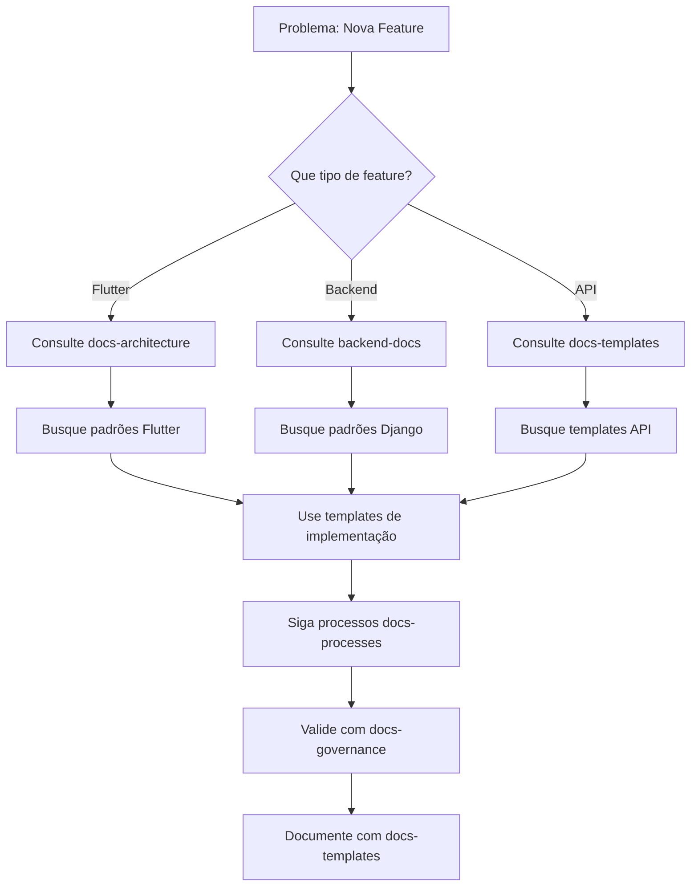
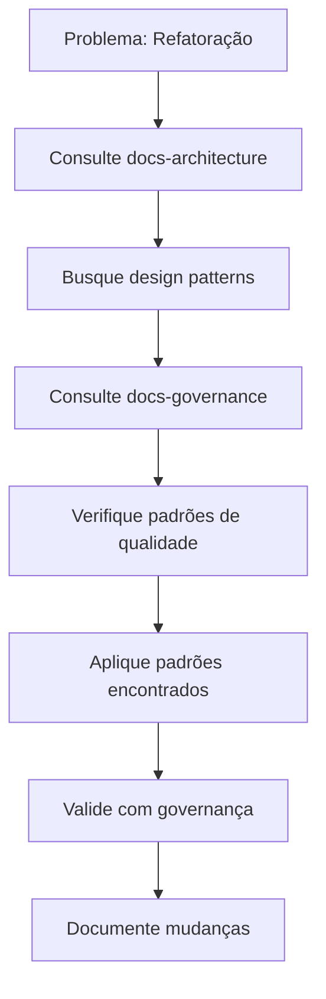
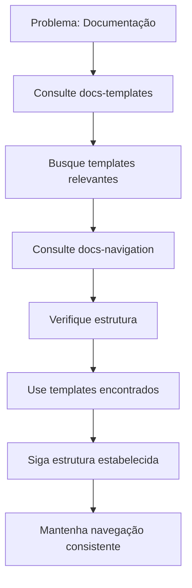

# 🗺️ **Mapa de Navegação do Projeto Docs**

## 🎯 **Visão Geral**

Este mapa visual representa a estrutura completa do projeto docs, mostrando como navegar entre diferentes categorias e recursos disponíveis.

---

## 📊 **Estrutura Hierárquica**

```
📚 PROJETO DOCS
├── 🏗️ ARQUITETURA E DESIGN PATTERNS
│   ├── 📁 architecture/
│   │   ├── design-patterns/
│   │   ├── escalabilidade/
│   │   ├── evolutionary-architecture/ (EN | PT-BR)
│   │   ├── ddd/strategic-ddd/ (EN | PT-BR)
│   │   ├── cqrs/ (EN | PT-BR)
│   │   ├── event-driven-architecture/ (EN | PT-BR)
│   │   └── transcricao-aula-design-patterns/
│   └── 🔍 Coleção MCP: docs-architecture
│
├── 📋 TEMPLATES DE DOCUMENTAÇÃO
│   ├── 📁 templates/
│   │   ├── 🏗️ Arquitetura
│   │   │   ├── c4-model-template.md
│   │   │   ├── database-schema-template.md
│   │   │   ├── api-documentation-template.md
│   │   │   ├── microservices-template.md
│   │   │   └── high-level-architecture-template.md
│   │   ├── 💻 Desenvolvimento
│   │   │   ├── user-story-template.md
│   │   │   ├── use-case-template.md
│   │   │   ├── bdd-template.md
│   │   │   ├── test-plan-template.md
│   │   │   └── test-case-template.md
│   │   ├── 🎯 Governança
│   │   │   ├── data-governance-template.md
│   │   │   ├── threat-model-template.md
│   │   │   ├── rfc-template.md
│   │   │   ├── adr-template.md
│   │   │   └── trg-template.md
│   │   ├── 🔄 Processos
│   │   │   ├── sprint-planning-template.md
│   │   │   ├── daily-standup-template.md
│   │   │   ├── sprint-review-template.md
│   │   │   ├── retrospective-template.md
│   │   │   └── weekly-status-meeting-template.md
│   │   └── 🤝 Reuniões
│   │       ├── kickoff-meeting-template.md
│   │       ├── technical-review-template.md
│   │       └── architecture-review-template.md
│   └── 🔍 Coleção MCP: docs-templates
│
├── 🔄 PROCESSOS DE DESENVOLVIMENTO
│   ├── 📁 processes/
│   │   ├── sprint-processos-burndown/
│   │   │   ├── sprint-processos/
│   │   │   ├── ferramentas/
│   │   │   └── exemplos-praticos/
│   │   └── technical-decision-making/ (EN | PT-BR)
│   └── 🔍 Coleção MCP: docs-processes
│
├── 🎯 GOVERNANÇA E REGRAS
│   ├── 📁 governance/
│   └── 🔍 Coleção MCP: docs-governance
│
├── 🧪 TESTING E QUALIDADE
│   ├── 📁 testing/
│   └── 🔍 Coleção MCP: docs-testing
│
├── 🧭 NAVEGAÇÃO E ESTRUTURA
│   ├── 📁 navigation/
│   │   ├── README.md
│   │   ├── docs-central-summary.md
│   │   └── docs-central-usage-guide.md
│   └── 🔍 Coleção MCP: docs-navigation
│
└── 📚 DOCUMENTOS CENTRAIS
    ├── 🧠 GUIA_CENTRAL.md
    ├── 📋 INDICE_ORGANIZACIONAL.md
    ├── 🗺️ MAPA_NAVEGACAO.md
    └── 📖 NAVIGATION.md
```

---

## 🔄 **Fluxo de Navegação por Cenário**

### **Cenário 1: Implementação de Nova Feature**



### **Cenário 2: Refatoração de Código**



### **Cenário 3: Documentação de Projeto**



---

## 🎯 **Mapa de Decisões**

### **Quando Usar Cada Recurso**

| **Situação** | **Recurso** | **Coleção MCP** | **Ação** |
|---------------|-------------|-----------------|----------|
| **Implementar Feature** | Padrões Arquiteturais | `docs-architecture` | Buscar padrões específicos |
| **Documentar Projeto** | Templates | `docs-templates` | Usar template apropriado |
| **Seguir Processo** | Processos | `docs-processes` | Aplicar metodologia |
| **Validar Qualidade** | Governança | `docs-governance` | Verificar regras |
| **Estruturar Docs** | Navegação | `docs-navigation` | Seguir estrutura |

### **Fluxo de Decisão**

```
1. Identifique o problema
   ↓
2. Determine a categoria
   ↓
3. Consulte a coleção MCP apropriada
   ↓
4. Aplique o recurso encontrado
   ↓
5. Valide com governança
   ↓
6. Documente o resultado
```

---

## 🔍 **Busca Semântica por Categoria**

### **Arquitetura e Design**
```typescript
// Padrões arquiteturais
mcp_hive-vectorizer_search_vectors(
  collection: "docs-architecture",
  query: "padrões arquiteturais Flutter",
  limit: 10
)

// Design patterns específicos
mcp_hive-vectorizer_search_vectors(
  collection: "docs-architecture",
  query: "decorator pattern Flutter",
  limit: 10
)
```

### **Templates de Documentação**
```typescript
// Templates de documentação
mcp_hive-vectorizer_search_vectors(
  collection: "docs-templates",
  query: "template FRD",
  limit: 10
)

// Templates de arquitetura
mcp_hive-vectorizer_search_vectors(
  collection: "docs-templates",
  query: "C4 model template",
  limit: 10
)
```

### **Processos de Desenvolvimento**
```typescript
// Processos de desenvolvimento
mcp_hive-vectorizer_search_vectors(
  collection: "docs-processes",
  query: "sprint processos",
  limit: 10
)

// Workflows e metodologias
mcp_hive-vectorizer_search_vectors(
  collection: "docs-processes",
  query: "burndown chart",
  limit: 10
)
```

### **Governança e Regras**
```typescript
// Governança organizacional
mcp_hive-vectorizer_search_vectors(
  collection: "docs-governance",
  query: "regras desenvolvimento",
  limit: 10
)

// Padrões de qualidade
mcp_hive-vectorizer_search_vectors(
  collection: "docs-governance",
  query: "code review",
  limit: 10
)
```

---

## 📊 **Métricas de Navegação**

### **Indicadores de Uso**
- **Consultas por Categoria**: Frequência de uso de cada coleção
- **Templates Mais Utilizados**: Templates mais acessados
- **Padrões Mais Buscados**: Padrões arquiteturais mais consultados
- **Processos Mais Seguidos**: Metodologias mais aplicadas

### **Alertas de Navegação**
- **Recursos Não Utilizados**: Templates ou padrões não acessados
- **Navegação Ineficiente**: Caminhos longos para encontrar recursos
- **Recursos Duplicados**: Conteúdo similar em diferentes locais
- **Links Quebrados**: Referências que não funcionam

---

## 🎯 **Boas Práticas de Navegação**

### **Para IAs**
1. **Sempre consulte o MCP Vectorizer** antes de implementar
2. **Use templates disponíveis** como base
3. **Siga padrões estabelecidos** encontrados
4. **Mantenha governança atualizada** com mudanças

### **Para Desenvolvedores**
1. **Navegue por categoria** para encontrar recursos
2. **Use o índice organizacional** para localizar conteúdo
3. **Siga o fluxo de decisão** para cada situação
4. **Mantenha documentação atualizada** com mudanças

---

## 🔗 **Links de Navegação Rápida**

### **Documentos Centrais**
- [🧠 Guia Central](GUIA_CENTRAL.md) - Cérebro do projeto
- [📋 Índice Organizacional](INDICE_ORGANIZACIONAL.md) - Organização por assunto
- [🗺️ Mapa de Navegação](MAPA_NAVEGACAO.md) - Este documento
- [📖 Navegação](NAVIGATION.md) - Estrutura geral

### **Categorias Principais**
- [🏗️ Arquitetura](architecture/README.md) - Padrões e design
- [📋 Templates](templates/README.md) - Modelos de documentação
- [🔄 Processos](processes/README.md) - Metodologias de desenvolvimento
- [🧭 Navegação](navigation/README.md) - Estrutura e organização

---

## 🎯 **Conclusão**

Este mapa de navegação serve como **guia visual** para explorar todo o ecossistema de conhecimento do projeto docs. Use-o para:

1. **Entender a estrutura** completa do projeto
2. **Navegar eficientemente** entre categorias
3. **Encontrar recursos** apropriados para cada situação
4. **Seguir fluxos** de decisão estabelecidos
5. **Manter consistência** em todas as atividades

**Lembre-se**: O projeto docs é a fonte única de verdade - consulte-o sempre via MCP Vectorizer para garantir qualidade, consistência e conformidade com os padrões estabelecidos.

---

**Última atualização**: $(date)
**Mantenedor**: Equipe Skynet
**Versão**: 1.0
**Status**: Ativo e Mantido
