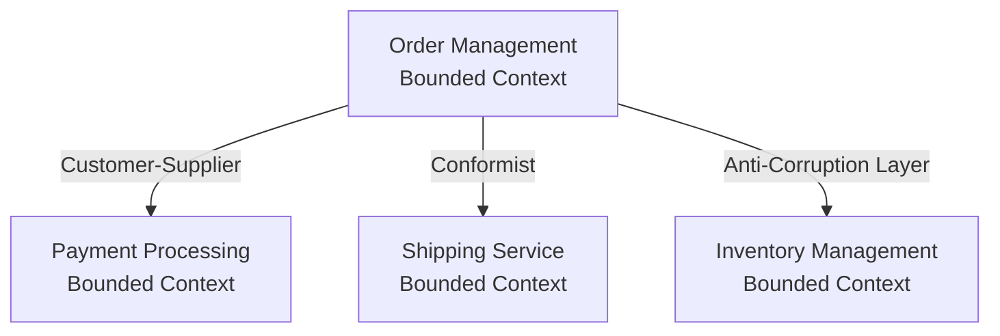

# 🎯 Strategic Domain-Driven Design Guide

## 📋 Overview

Strategic DDD is the foundation of Domain-Driven Design. It focuses on understanding and modeling the business domain at a strategic level, identifying bounded contexts, mapping relationships between contexts, and classifying subdomains.

**Key Principle**: Strategic DDD should come first, before tactical patterns. Understanding the domain boundaries and relationships is more important than implementing complex tactical patterns.

> "Strategic DDD is almost always applicable. It's obvious today, but wasn't when created." - From architecture insights

---

## 🎯 Why Strategic DDD First?

### The Strategic Foundation

Strategic DDD provides:

1. **Domain Understanding**: Deep understanding of the business domain and its boundaries
2. **Context Boundaries**: Clear boundaries between different parts of the system
3. **Relationship Mapping**: Understanding how different contexts relate and interact
4. **Subdomain Classification**: Identifying what's core, supporting, or generic
5. **Strategic Decisions**: Making informed decisions about where to invest effort

### Strategic vs Tactical

**Strategic DDD** (Do First):
- Bounded Context identification
- Context Mapping
- Subdomain classification
- Domain modeling at strategic level

**Tactical DDD** (Apply When Needed):
- Aggregates, Entities, Value Objects
- Domain Services
- Repository patterns
- Complex business logic modeling

**Key Insight**: One bounded context might use Transaction Script, while another uses Domain Model. The choice depends on complexity, not dogma.

---

## 🏛️ Core Concepts

### 1. Bounded Context

A **Bounded Context** is a boundary within which a particular domain model is valid. It defines the context in which terms have specific meanings.

**Characteristics**:
- Has its own domain model
- Has its own ubiquitous language
- Has clear boundaries
- Can be implemented independently

**Example**:
```
Order Management Context
- Order: An order placed by a customer
- Customer: The person placing the order
- Payment: Payment processing for the order

Inventory Management Context  
- Product: A physical item in stock
- Stock: Available quantity
- Warehouse: Storage location

Note: "Order" means different things in each context!
```

### 2. Context Mapping

**Context Mapping** is the process of identifying and documenting relationships between bounded contexts.

**Common Patterns**:
- **Shared Kernel**: Shared codebase between contexts
- **Customer-Supplier**: One context depends on another
- **Conformist**: One context conforms to another's model
- **Anti-Corruption Layer**: Translation layer between contexts
- **Separate Ways**: Independent contexts with no dependencies
- **Partnership**: Collaborative relationship between contexts

See [Context Mapping Patterns](./context-mapping-patterns.md) for detailed patterns.

### 3. Subdomain Classification

**Subdomains** are parts of the business domain. They are classified as:

1. **Core Domain**: The unique value proposition of the business
   - Highest investment priority
   - Built in-house
   - Requires deep domain expertise

2. **Supporting Subdomain**: Important but not differentiating
   - Built in-house or outsourced
   - Supports core domain
   - Medium investment priority

3. **Generic Subdomain**: Common functionality, not unique
   - Should be outsourced/integrated
   - Low investment priority
   - Use existing solutions when possible

See [Subdomain Classification](./subdomain-classification.md) for detailed guidance.

---

## 🔍 Bounded Context Identification

### Techniques for Identifying Bounded Contexts

1. **Language Boundaries**
   - Where terminology changes meaning
   - Where different teams use different terms
   - Where concepts are ambiguous

2. **Team Boundaries**
   - Different teams working on different parts
   - Different deployment schedules
   - Different technologies

3. **Business Boundaries**
   - Different business capabilities
   - Different business rules
   - Different business processes

4. **Data Boundaries**
   - Different data ownership
   - Different data consistency requirements
   - Different data access patterns

See [Bounded Context Identification](./bounded-context-identification.md) for detailed techniques.

---

## 🗺️ Context Mapping

Context Mapping helps visualize and understand relationships between bounded contexts.

### Context Map Example



### Mapping Process

1. **Identify Contexts**: List all bounded contexts
2. **Identify Relationships**: Determine how contexts relate
3. **Document Patterns**: Document the relationship pattern
4. **Plan Integration**: Plan how contexts will integrate
5. **Monitor Evolution**: Update map as contexts evolve

See [Context Mapping Patterns](./context-mapping-patterns.md) for detailed patterns and integration strategies.

---

## 🎯 Subdomain Classification

### Classification Framework

**Core Domain**:
- ✅ Unique to your business
- ✅ Competitive advantage
- ✅ High complexity
- ✅ Requires deep expertise

**Supporting Subdomain**:
- ⚠️ Important but not unique
- ⚠️ Supports core domain
- ⚠️ Medium complexity
- ⚠️ Can be built or outsourced

**Generic Subdomain**:
- ❌ Common across industries
- ❌ No competitive advantage
- ❌ Low complexity
- ❌ Should be outsourced

### Decision Framework

```
Question: Is this unique to our business?
├─ Yes → Is it our competitive advantage?
│   ├─ Yes → Core Domain
│   └─ No → Supporting Subdomain
└─ No → Generic Subdomain (outsource)
```

See [Subdomain Classification](./subdomain-classification.md) for detailed decision framework and examples.

---

## 📚 Practical Examples

### Example 1: E-Commerce Platform

**Bounded Contexts**:
- Product Catalog
- Order Management
- Payment Processing
- Shipping & Logistics
- Customer Management

**Subdomain Classification**:
- **Core**: Product Catalog (unique product discovery)
- **Supporting**: Order Management, Customer Management
- **Generic**: Payment Processing (Stripe), Shipping (FedEx API)

**Context Mapping**:
```
Order Management → Customer-Supplier → Payment Processing
Order Management → Conformist → Shipping Service
Order Management → Anti-Corruption Layer → Product Catalog
```

### Example 2: SaaS Application

**Bounded Contexts**:
- User Management
- Feature Flags
- Billing & Subscription
- Analytics

**Subdomain Classification**:
- **Core**: Feature Flags (unique business logic)
- **Supporting**: User Management, Analytics
- **Generic**: Billing & Subscription (Stripe Billing)

---

## 🛠️ Implementation Strategies

### Strategy 1: Start with Event Storming

Event Storming helps identify:
- Domain events
- Bounded context boundaries
- Context relationships

Use the [Event Storming Template](../../../templates/ddd/event-storming-template.md) for workshops.

### Strategy 2: Identify Core Domain First

1. Map all subdomains
2. Classify each as Core, Supporting, or Generic
3. Focus investment on Core Domain
4. Outsource Generic Subdomains

### Strategy 3: Evolve Boundaries

Bounded contexts evolve:
- Start with rough boundaries
- Refine as understanding deepens
- Split contexts when needed
- Merge contexts when appropriate

---

## 📊 Decision Matrix

### When to Use Strategic DDD

| Scenario | Strategic DDD | Alternative |
|----------|---------------|-------------|
| Complex business domain | ✅ Essential | ❌ Risk of confusion |
| Multiple teams | ✅ Essential | ❌ Communication issues |
| Large system | ✅ Essential | ❌ Monolithic problems |
| Simple CRUD app | ⚠️ Optional | ✅ May be overkill |
| Single team, small domain | ⚠️ Optional | ✅ May be overkill |

### When to Split a Context

| Indicator | Action |
|-----------|--------|
| Team conflicts | Split context |
| Different deployment schedules | Split context |
| Different technologies | Split context |
| Ambiguous terminology | Split context |
| Different data models | Split context |

---

## 🔗 Related Documentation

- [Bounded Context Identification](./bounded-context-identification.md) - Techniques for identifying contexts
- [Context Mapping Patterns](./context-mapping-patterns.md) - Detailed context mapping patterns
- [Subdomain Classification](./subdomain-classification.md) - Classification framework and examples
- [Event Storming Template](../../../templates/ddd/event-storming-template.md) - Template for event storming workshops
- [Bounded Context Template](../../../templates/ddd/bounded-context-template.md) - Template for documenting bounded contexts
- [Evolutionary Architecture Guide](../evolutionary-architecture/README.md) - How strategic DDD supports evolution
- [CQRS Guide](../cqrs/README.md) - How CQRS emerges from DDD

---

## 📖 References

- **Eric Evans** - Domain-Driven Design (Blue Book)
- **Vaughn Vernon** - Implementing Domain-Driven Design (Red Book)
- **Alberto Brandolini** - Event Storming
- **Strategic DDD** - Always applicable, start here

**Versão em Português**: [Guia de DDD Estratégico (PT-BR)](./pt-br/README.md)

---

**Version**: 1.0  
**Last Updated**: 2025  
**Maintainer**: Skynet Documentation Team

---

## 🎯 Quick Start Checklist

- [ ] Understand why Strategic DDD comes first
- [ ] Learn bounded context concepts
- [ ] Practice context mapping
- [ ] Classify subdomains in your domain
- [ ] Identify bounded contexts in your system
- [ ] Map relationships between contexts
- [ ] Document your strategic model
- [ ] Plan evolution strategy

