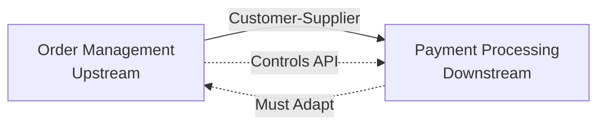
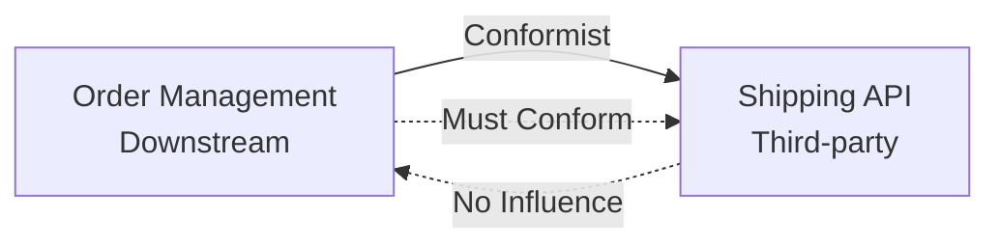
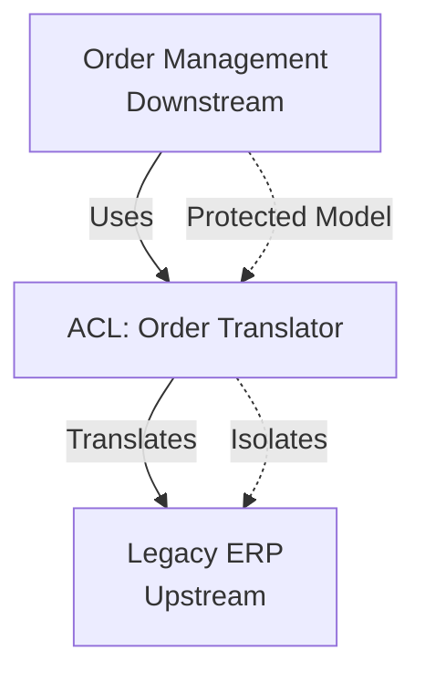
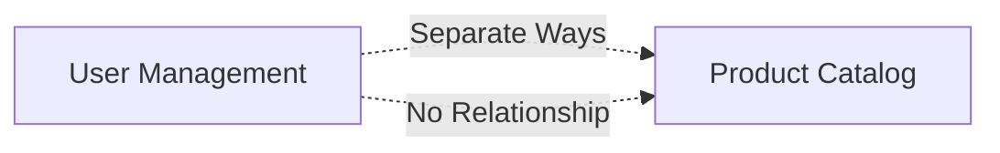
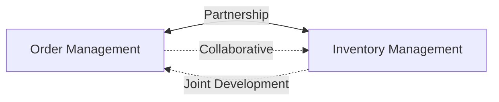
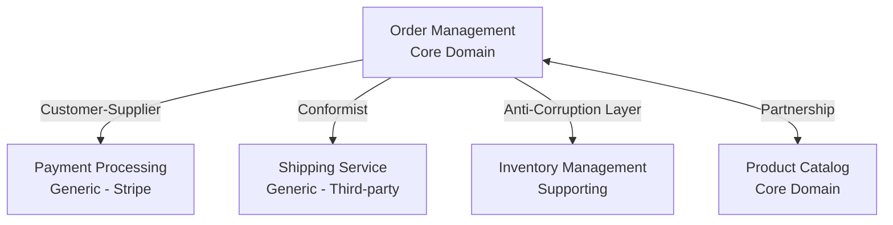

# 🗺️ Context Mapping Patterns

## 📋 Overview

Context Mapping is the process of identifying and documenting relationships between bounded contexts. Understanding these relationships is crucial for designing integration strategies and managing dependencies.

**Key Principle**: Each relationship between contexts requires a specific integration strategy.

---

## 🎯 Context Mapping Patterns

### 1. Shared Kernel

**Definition**: Two teams share a small subset of the domain model.

**Characteristics**:
- Shared codebase
- Requires coordination between teams
- Changes require agreement from both teams
- High risk of conflicts

**Use When**:
- Small, stable shared model
- Both teams need the same model
- Coordination is feasible

**Integration Strategy**:
- Shared library or module
- Versioned shared package
- Clear ownership and change process

**Example**:
```
Order Management ←→ Shared Kernel ←→ Payment Processing
                   (Shared: Money, Currency)
```

**Warning**: Use sparingly. Shared kernels can become a bottleneck.

---

### 2. Customer-Supplier

**Definition**: Downstream team depends on upstream team. Upstream team has no dependency on downstream.

**Characteristics**:
- Clear dependency direction
- Upstream team controls the model
- Downstream team must adapt
- Upstream team has priority

**Use When**:
- Clear dependency relationship
- Upstream team can meet downstream needs
- Downstream team can adapt to upstream model

**Integration Strategy**:
- Upstream team provides API
- Downstream team consumes API
- SLA for upstream team
- Versioning strategy

**Example**:
```
Order Management (Upstream)
    ↓ (Customer-Supplier)
Payment Processing (Downstream)
```

**Diagram**:


---

### 3. Conformist

**Definition**: Downstream team must conform to upstream model without influence.

**Characteristics**:
- Downstream has no influence
- Upstream model is fixed (legacy, third-party)
- Downstream must adapt completely
- No negotiation possible

**Use When**:
- Integrating with legacy systems
- Integrating with third-party systems
- Upstream team is external
- No possibility to influence upstream

**Integration Strategy**:
- Conform to upstream model
- Isolate conformity in adapter
- Minimize impact on downstream domain

**Example**:
```
Order Management (Downstream)
    ↓ (Conformist)
Shipping Service API (Third-party, Upstream)
```

**Diagram**:


---

### 4. Anti-Corruption Layer (ACL)

**Definition**: Downstream team creates a translation layer to protect its model from upstream corruption.

**Characteristics**:
- Translation layer between contexts
- Protects downstream model
- Isolates upstream model
- Additional complexity

**Use When**:
- Upstream model doesn't fit downstream needs
- Need to protect downstream model
- Upstream model is legacy or third-party
- Translation is feasible

**Integration Strategy**:
- Create adapter/translator layer
- Translate between models
- Isolate upstream model
- Maintain downstream model integrity

**Example**:
```
Order Management (Downstream)
    ↓ (Anti-Corruption Layer)
    ACL: Order Translator
    ↓
Legacy ERP System (Upstream)
```

**Diagram**:


**Implementation Example**:
```typescript
// Anti-Corruption Layer
class OrderTranslator {
  translateLegacyOrderToDomain(legacyOrder: LegacyOrder): Order {
    return {
      id: legacyOrder.orderNumber,
      customerId: legacyOrder.customer.code,
      items: legacyOrder.lineItems.map(item => ({
        productId: item.product.sku,
        quantity: item.qty,
        price: Money.fromLegacy(item.price)
      }))
    };
  }
}
```

---

### 5. Separate Ways

**Definition**: Two contexts have no relationship and can evolve independently.

**Characteristics**:
- No dependencies
- Independent evolution
- No integration needed
- Complete isolation

**Use When**:
- No business relationship
- No technical dependency
- Independent domains
- Can evolve separately

**Integration Strategy**:
- No integration needed
- Separate deployments
- Independent teams
- No coordination required

**Example**:
```
User Management (Separate)
    (no relationship)
Product Catalog (Separate)
```

**Diagram**:


---

### 6. Partnership

**Definition**: Two teams work together closely, sharing development and integration.

**Characteristics**:
- Collaborative relationship
- Shared development
- Mutual dependencies
- Requires coordination

**Use When**:
- Strong business relationship
- Mutual dependencies
- Close collaboration is feasible
- Shared goals

**Integration Strategy**:
- Collaborative development
- Shared planning
- Joint releases
- Continuous communication

**Example**:
```
Order Management ←→ Partnership ←→ Inventory Management
                    (Shared: Stock allocation)
```

**Diagram**:


**Warning**: Requires strong coordination. Can be difficult to maintain.

---

## 🗺️ Context Map Example

### E-Commerce Platform Context Map



**Legend**:
- **Core Domain**: Order Management, Product Catalog
- **Supporting**: Inventory Management
- **Generic**: Payment Processing, Shipping Service

**Relationships**:
- Order → Payment: Customer-Supplier (Order controls payment API)
- Order → Shipping: Conformist (Must conform to shipping API)
- Order → Inventory: Anti-Corruption Layer (Translates inventory model)
- Order ↔ Catalog: Partnership (Collaborative relationship)

---

## 🔄 Integration Strategies

### Strategy 1: Synchronous Integration

**Use When**:
- Immediate consistency required
- Low latency acceptable
- Low volume
- Direct API calls

**Patterns**:
- REST API
- gRPC
- GraphQL

**Example**:
```typescript
// Order Management calls Payment Processing
class OrderService {
  async processPayment(orderId: string, amount: Money) {
    const payment = await this.paymentService.charge({
      orderId,
      amount,
      currency: amount.currency
    });
    return payment;
  }
}
```

### Strategy 2: Asynchronous Integration

**Use When**:
- Eventual consistency acceptable
- High volume
- Decoupling desired
- Event-driven architecture

**Patterns**:
- Message queues (RabbitMQ, SQS)
- Event streaming (Kafka)
- Pub/Sub (Pub/Sub, SNS)

**Example**:
```typescript
// Order Management publishes event
class OrderService {
  async createOrder(order: Order) {
    await this.orderRepository.save(order);
    await this.eventPublisher.publish({
      type: 'OrderCreated',
      orderId: order.id,
      customerId: order.customerId,
      total: order.total
    });
  }
}

// Inventory Management subscribes to event
class InventoryEventHandler {
  async handleOrderCreated(event: OrderCreatedEvent) {
    await this.inventoryService.reserveItems(
      event.orderId,
      event.items
    );
  }
}
```

### Strategy 3: Database Integration

**Use When**:
- Shared database acceptable
- Tight coupling acceptable
- Same team owns both contexts
- Simple integration

**Warning**: Use sparingly. Can lead to coupling issues.

---

## 📊 Pattern Selection Matrix

| Relationship | Integration Pattern | Technology | When to Use |
|--------------|-------------------|------------|-------------|
| Customer-Supplier | REST API | HTTP/REST | Upstream provides API |
| Customer-Supplier | Events | Message Queue | Decoupling desired |
| Conformist | Adapter | HTTP/REST | Third-party API |
| Anti-Corruption Layer | Translator | Any | Model mismatch |
| Partnership | Shared API | REST/gRPC | Collaborative development |
| Shared Kernel | Shared Library | Library | Small shared model |

---

## 🚫 Anti-Patterns

### ❌ Big Ball of Mud

**Problem**: All contexts integrated without clear boundaries.

**Solution**: Identify bounded contexts and apply proper patterns.

### ❌ Shared Database

**Problem**: Multiple contexts sharing same database.

**Solution**: Separate databases per context, use integration patterns.

### ❌ Tight Coupling

**Problem**: Contexts tightly coupled, can't evolve independently.

**Solution**: Use appropriate patterns (ACL, events) to decouple.

### ❌ Wrong Pattern

**Problem**: Using wrong pattern for relationship.

**Solution**: Understand relationship type, choose appropriate pattern.

---

## ✅ Validation Checklist

Before finalizing a context map:

- [ ] All bounded contexts identified
- [ ] All relationships mapped
- [ ] Appropriate pattern chosen for each relationship
- [ ] Integration strategy defined
- [ ] Technology choices documented
- [ ] Evolution strategy planned
- [ ] Dependencies clear
- [ ] Integration risks identified

---

## 🔗 Related Documentation

- [Strategic DDD Guide](./README.md) - Overview of Strategic DDD
- [Bounded Context Identification](./bounded-context-identification.md) - How to identify contexts
- [Subdomain Classification](./subdomain-classification.md) - Classifying subdomains
- [Event-Driven Architecture Guide](../event-driven-architecture/README.md) - Event-driven integration
- [CQRS Guide](../cqrs/README.md) - CQRS and context boundaries

**Versão em Português**: [Padrões de Context Mapping (PT-BR)](./pt-br/context-mapping-patterns.md)

---

**Version**: 1.0  
**Last Updated**: 2025  
**Maintainer**: Skynet Documentation Team

