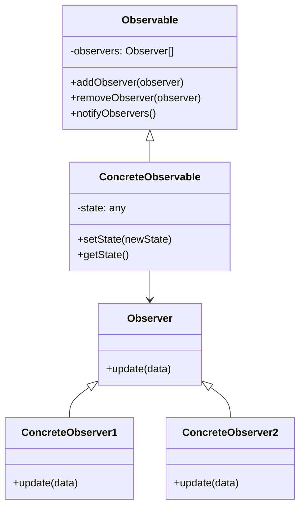

# Padrão Observer (Observador)

## 🎯 Visão Geral

O **Padrão Observer** é um padrão comportamental que define uma dependência um-para-muitos entre objetos, de modo que quando um objeto muda de estado, todos os seus dependentes são automaticamente notificados e atualizados. É um dos padrões mais poderosos do catálogo, oferecendo flexibilidade e escalabilidade excepcionais.

## 🏗️ Características Importantes

### **Padrão Mais Poderoso do Catálogo**
- **Flexibilidade extrema** para notificações
- **Desacoplamento total** entre observável e observadores
- **Escalabilidade** para múltiplos observadores
- **Programação reativa** orientada a eventos

### **Nomes Alternativos**
- **Pub/Sub** (Publisher/Subscriber)
- **Event Listener**
- **Event Subscriber**
- **Publisher/Subscriber**
- **Event-Driven Programming**

### **Agnóstico de Linguagem**
- **Funciona** em qualquer linguagem de programação
- **Aplicável** em qualquer framework
- **Implementado** em frameworks modernos (Laravel, Spring, Symfony)

## 🚨 Problema que Resolve

### Cenário: Sistema de Criptomoedas

Imagine um sistema financeiro que monitora o preço do Bitcoin e precisa executar múltiplas ações quando o preço muda.

#### ❌ **Problema sem Observer**

```php
class Bitcoin 
{
    private float $price;
    
    public function setPrice(float $newPrice): void 
    {
        if ($newPrice !== $this->price) {
            $this->price = $newPrice;
            
            // Problema: Muitos ifs e lógica exposta
            $this->logPriceChange($newPrice);
            
            if ($this->calculateVariation() > 0.10) {
                $this->notifyInvestors($newPrice);
            }
            
            if ($this->calculateVariation() > 0.20) {
                $this->updateNewsPlatform($newPrice);
            }
        }
    }
}
```

#### 🔥 **Problemas Identificados**

1. **Violação de Responsabilidade**
   - Classe Bitcoin conhece demais sobre regras de negócio
   - Mistura de responsabilidades
   - Dificulta manutenção

2. **Exposição de Regras de Negócio**
   - Cliente precisa saber que é 10% para notificação
   - Cliente precisa saber que é 20% para plataforma
   - Regras de negócio expostas no código

3. **Duplicação de Código**
   - Mesma lógica em múltiplos lugares
   - Dificuldade para lembrar todos os pontos
   - Inconsistência entre implementações

4. **Acoplamento Forte**
   - Bitcoin depende de classes específicas
   - Mudanças afetam múltiplos pontos
   - Dificulta testes unitários

## 🏗️ Arquitetura da Solução

### Componentes do Observer

```mermaid
graph TB
    subgraph "Observable (Observável)"
        O[Bitcoin]
        O --> N[notifyObservers()]
    end
    
    subgraph "Observers (Observadores)"
        O1[PriceLogger]
        O2[InvestorNotifier]
        O3[NewsPlatform]
    end
    
    O --> O1
    O --> O2
    O --> O3
```

### Estrutura de Classes



## ✅ Vantagens

### 1. **Desacoplamento Total**
- **Observável** não conhece observadores específicos
- **Observadores** não conhecem detalhes do observável
- **Independência** entre componentes
- **Flexibilidade** para adicionar/remover observadores

### 2. **Programação Reativa**
- **Reação automática** a mudanças de estado
- **Orientação a eventos** natural
- **Sincronização** automática entre objetos
- **Responsividade** do sistema

### 3. **Escalabilidade**
- **Múltiplos observadores** sem impacto
- **Adição/remoção** dinâmica de observadores
- **Performance** otimizada
- **Manutenibilidade** alta

### 4. **Flexibilidade**
- **Diferentes tipos** de observadores
- **Regras específicas** por observador
- **Configuração** dinâmica
- **Extensibilidade** fácil

## ❌ Desvantagens

### 1. **Complexidade de Debug**
- **Fluxo não linear** de execução
- **Dificuldade** para rastrear notificações
- **Dependências** implícitas
- **Ordem** de execução não garantida

### 2. **Memory Leaks**
- **Referências circulares** podem ocorrer
- **Observadores** não removidos adequadamente
- **Garbage collection** pode ser afetado
- **Gerenciamento** de ciclo de vida necessário

### 3. **Performance**
- **Notificações** podem ser custosas
- **Múltiplos observadores** impactam performance
- **Sincronização** pode ser lenta
- **Overhead** de notificações

### 4. **Acoplamento Implícito**
- **Dependências** não explícitas
- **Ordem** de execução não garantida
- **Efeitos colaterais** inesperados
- **Debugging** complexo

## 🎯 Casos de Uso Comuns

### 1. **Sistemas de Notificação**
- **Email** quando status muda
- **SMS** para alertas críticos
- **Push notifications** em tempo real
- **Webhooks** para integrações

### 2. **Sistemas de Cache**
- **Invalidação** automática de cache
- **Atualização** de dados em tempo real
- **Sincronização** entre sistemas
- **Propagação** de mudanças

### 3. **Sistemas de Log**
- **Logging** automático de eventos
- **Auditoria** de mudanças
- **Monitoramento** de sistema
- **Rastreamento** de ações

### 4. **Sistemas de UI**
- **Atualização** automática de interface
- **Sincronização** entre componentes
- **Reatividade** de dados
- **Binding** de dados

### 5. **Sistemas de Eventos**
- **Event sourcing** para auditoria
- **CQRS** para separação de responsabilidades
- **Microservices** para comunicação
- **Message queues** para processamento

## 🔄 Comparação: Com vs Sem Observer

### ❌ **Sem Observer (Problema)**

```php
class Bitcoin 
{
    private float $price;
    
    public function setPrice(float $newPrice): void 
    {
        if ($newPrice !== $this->price) {
            $this->price = $newPrice;
            
            // Exposição de regras de negócio
            $this->logPriceChange($newPrice);
            
            if ($this->calculateVariation() > 0.10) {
                $this->notifyInvestors($newPrice);
            }
            
            if ($this->calculateVariation() > 0.20) {
                $this->updateNewsPlatform($newPrice);
            }
        }
    }
}
```

**Problemas:**
- Violação de responsabilidade única
- Exposição de regras de negócio
- Acoplamento forte
- Dificuldade de manutenção

### ✅ **Com Observer (Solução)**

```php
// Interface para observadores
interface BitcoinPriceObserver 
{
    public function update(float $price): void;
}

// Classe observável
class Bitcoin 
{
    private float $price;
    private array $observers = [];
    
    public function addObserver(BitcoinPriceObserver $observer): void 
    {
        $this->observers[] = $observer;
    }
    
    public function setPrice(float $newPrice): void 
    {
        if ($newPrice !== $this->price) {
            $this->price = $newPrice;
            $this->notifyObservers();
        }
    }
    
    private function notifyObservers(): void 
    {
        foreach ($this->observers as $observer) {
            $observer->update($this->price);
        }
    }
}

// Observadores específicos
class PriceLogger implements BitcoinPriceObserver 
{
    public function update(float $price): void 
    {
        // Log de qualquer alteração
        echo "📊 Preço do Bitcoin: R$ {$price}\n";
    }
}

class InvestorNotifier implements BitcoinPriceObserver 
{
    public function update(float $price): void 
    {
        // Notificação apenas se variação > 10%
        if ($this->calculateVariation($price) > 0.10) {
            echo "📱 Notificando investidores: R$ {$price}\n";
        }
    }
}

class NewsPlatform implements BitcoinPriceObserver 
{
    public function update(float $price): void 
    {
        // Atualização apenas se variação > 20%
        if ($this->calculateVariation($price) > 0.20) {
            echo "📰 Atualizando plataforma de notícias: R$ {$price}\n";
        }
    }
}
```

**Benefícios:**
- Desacoplamento total
- Responsabilidades separadas
- Fácil manutenção
- Escalabilidade

## 🛠️ Boas Práticas

### 1. **Use Observer Quando:**
- **Múltiplos objetos** precisam reagir a mudanças
- **Desacoplamento** é importante
- **Flexibilidade** de notificações é necessária
- **Programação reativa** é desejada

### 2. **Evite Observer Quando:**
- **Apenas um observador** é necessário
- **Performance** é crítica
- **Debugging** é complexo
- **Over-engineering** para casos simples

### 3. **Implementação Correta:**
- **Interface clara** para observadores
- **Gerenciamento** adequado de ciclo de vida
- **Tratamento de erros** em notificações
- **Documentação** clara do comportamento

### 4. **Cuidados com Performance:**
- **Limite** o número de observadores
- **Otimize** notificações custosas
- **Use** notificações assíncronas quando possível
- **Monitore** performance regularmente

## 🔧 Extensões Avançadas

### 1. **Observer com Event Bus**
- **Centralização** de eventos
- **Roteamento** inteligente
- **Filtros** e transformações
- **Middleware** para processamento

### 2. **Observer com Priority**
- **Ordem** de execução controlada
- **Prioridades** para observadores
- **Dependências** entre observadores
- **Rollback** em caso de falha

### 3. **Observer Assíncrono**
- **Notificações** não bloqueantes
- **Processamento** em background
- **Retry** automático em falhas
- **Circuit breaker** para proteção

### 4. **Observer com Filtering**
- **Filtros** por tipo de evento
- **Condições** específicas
- **Transformações** de dados
- **Validações** antes da notificação

## 📊 Quando Usar Observer

### **Indicadores Positivos**
- **Múltiplos objetos** interessados em mudanças
- **Desacoplamento** é importante
- **Flexibilidade** de notificações
- **Programação reativa** desejada

### **Indicadores Negativos**
- **Apenas um observador** necessário
- **Performance** é crítica
- **Debugging** complexo
- **Over-engineering** para casos simples

### **Alternativas**
- **Callback functions** para casos simples
- **Event Bus** para sistemas complexos
- **Message Queue** para processamento assíncrono
- **Reactive Streams** para programação reativa

## 🎯 Conclusão

O padrão Observer é um dos mais poderosos do catálogo, oferecendo flexibilidade e escalabilidade excepcionais. É fundamental para programação reativa e sistemas orientados a eventos.

**Use quando:** Múltiplos objetos precisam reagir a mudanças, desacoplamento é importante
**Evite quando:** Apenas um observador, performance crítica, over-engineering
**Lembre-se:** É programação reativa - objetos reagem a eventos automaticamente


