# Diagramas - Padrão Observer

## 🏗️ Arquitetura Geral

### Estrutura de Classes

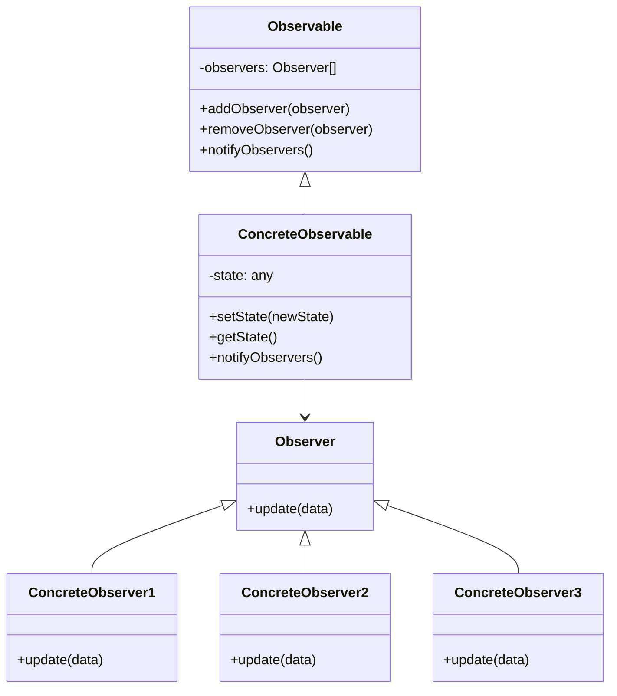
```mermaid
classDiagram
    class Observable {
        -observers: Observer[]
        +addObserver(observer)
        +removeObserver(observer)
        +notifyObservers()
    }
    
    class Observer {
        +update(data)
    }
    
    class ConcreteObservable {
        -state: any
        +setState(newState)
        +getState()
        +notifyObservers()
    }
    
    class ConcreteObserver1 {
        +update(data)
    }
    
    class ConcreteObserver2 {
        +update(data)
    }
    
    class ConcreteObserver3 {
        +update(data)
    }
    
    Observable <|-- ConcreteObservable
    Observer <|-- ConcreteObserver1
    Observer <|-- ConcreteObserver2
    Observer <|-- ConcreteObserver3
    ConcreteObservable --> Observer
```

### Diagrama de Componentes

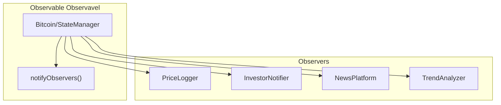
```mermaid
graph TB
    subgraph "Observable Observavel"
        O[Bitcoin/StateManager]
        O --> N["notifyObservers()"]
    end
    
    subgraph "Observers"
        O1[PriceLogger]
        O2[InvestorNotifier]
        O3[NewsPlatform]
        O4[TrendAnalyzer]
    end
    
    O --> O1
    O --> O2
    O --> O3
    O --> O4
```

## 🔄 Fluxos de Funcionamento

### Fluxo Básico do Observer

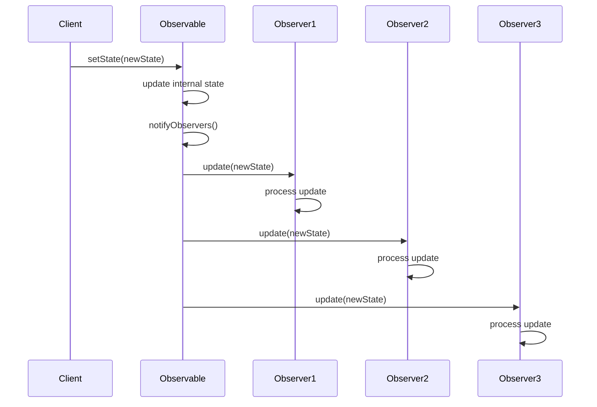
```mermaid
sequenceDiagram
    participant Client
    participant Observable
    participant Observer1
    participant Observer2
    participant Observer3
    
    Client->>Observable: setState(newState)
    Observable->>Observable: update internal state
    Observable->>Observable: notifyObservers()
    
    Observable->>Observer1: update(newState)
    Observer1->>Observer1: process update
    
    Observable->>Observer2: update(newState)
    Observer2->>Observer2: process update
    
    Observable->>Observer3: update(newState)
    Observer3->>Observer3: process update
```

### Fluxo com Tratamento de Erros

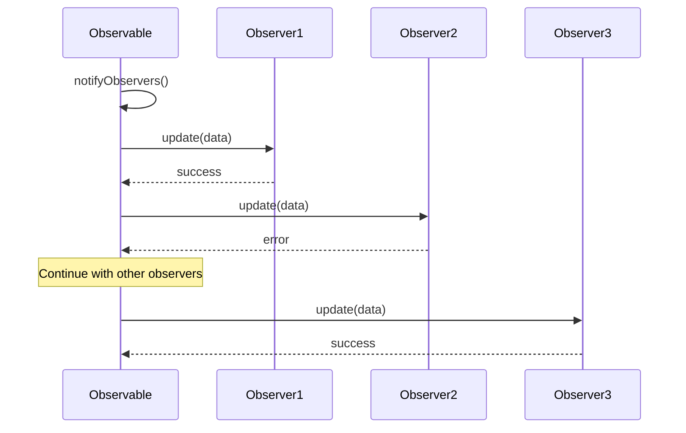
```mermaid
sequenceDiagram
    participant Observable
    participant Observer1
    participant Observer2
    participant Observer3
    
    Observable->>Observable: notifyObservers()
    
    Observable->>Observer1: update(data)
    Observer1-->>Observable: success
    
    Observable->>Observer2: update(data)
    Observer2-->>Observable: error
    Note over Observable: Continue with other observers
    
    Observable->>Observer3: update(data)
    Observer3-->>Observable: success
```

### Fluxo de Adição/Remoção de Observadores

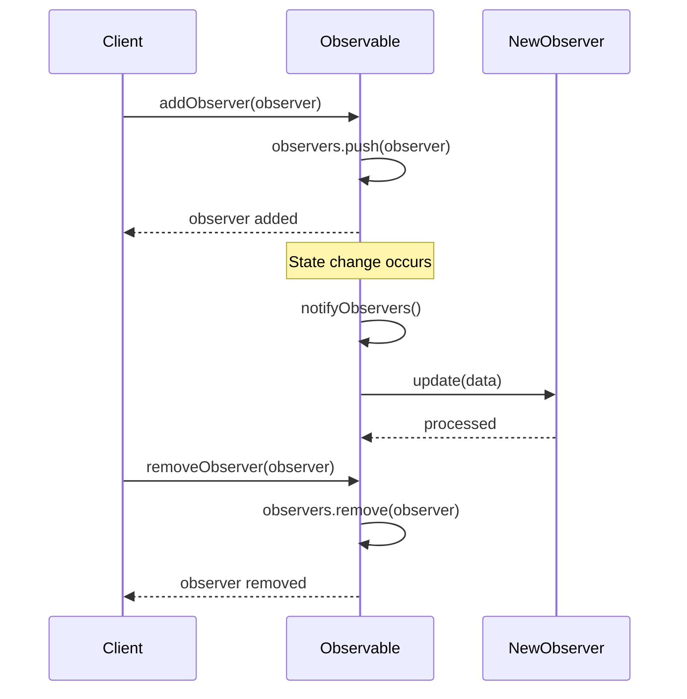
```mermaid
sequenceDiagram
    participant Client
    participant Observable
    participant NewObserver
    
    Client->>Observable: addObserver(observer)
    Observable->>Observable: observers.push(observer)
    Observable-->>Client: observer added
    
    Note over Observable: State change occurs
    
    Observable->>Observable: notifyObservers()
    Observable->>NewObserver: update(data)
    NewObserver-->>Observable: processed
    
    Client->>Observable: removeObserver(observer)
    Observable->>Observable: observers.remove(observer)
    Observable-->>Client: observer removed
```

## 🎯 Casos de Uso Específicos

### Sistema de Criptomoedas

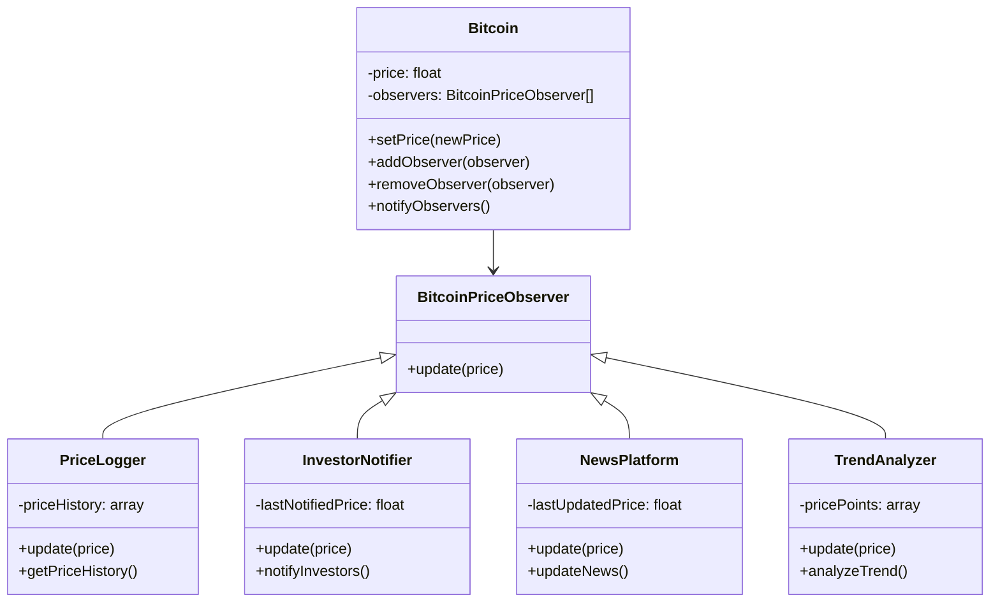
```mermaid
classDiagram
    class Bitcoin {
        -price: float
        -observers: BitcoinPriceObserver[]
        +setPrice(newPrice)
        +addObserver(observer)
        +removeObserver(observer)
        +notifyObservers()
    }
    
    class BitcoinPriceObserver {
        +update(price)
    }
    
    class PriceLogger {
        -priceHistory: array
        +update(price)
        +getPriceHistory()
    }
    
    class InvestorNotifier {
        -lastNotifiedPrice: float
        +update(price)
        +notifyInvestors()
    }
    
    class NewsPlatform {
        -lastUpdatedPrice: float
        +update(price)
        +updateNews()
    }
    
    class TrendAnalyzer {
        -pricePoints: array
        +update(price)
        +analyzeTrend()
    }
    
    Bitcoin --> BitcoinPriceObserver
    BitcoinPriceObserver <|-- PriceLogger
    BitcoinPriceObserver <|-- InvestorNotifier
    BitcoinPriceObserver <|-- NewsPlatform
    BitcoinPriceObserver <|-- TrendAnalyzer
```

### Sistema de Notificação

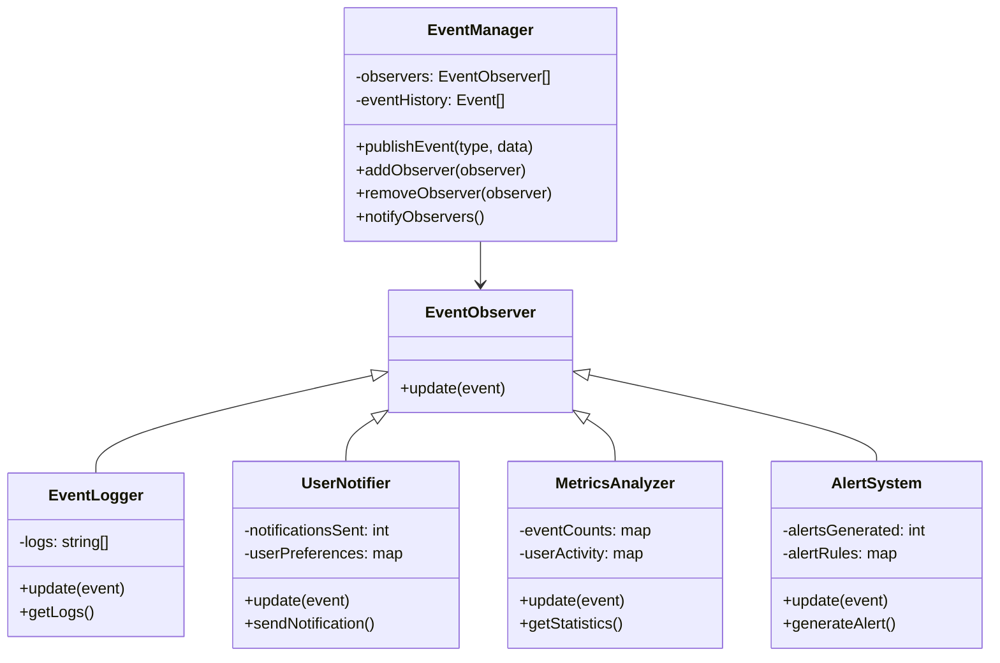
```mermaid
classDiagram
    class EventManager {
        -observers: EventObserver[]
        -eventHistory: Event[]
        +publishEvent(type, data)
        +addObserver(observer)
        +removeObserver(observer)
        +notifyObservers()
    }
    
    class EventObserver {
        +update(event)
    }
    
    class EventLogger {
        -logs: string[]
        +update(event)
        +getLogs()
    }
    
    class UserNotifier {
        -notificationsSent: int
        -userPreferences: map
        +update(event)
        +sendNotification()
    }
    
    class MetricsAnalyzer {
        -eventCounts: map
        -userActivity: map
        +update(event)
        +getStatistics()
    }
    
    class AlertSystem {
        -alertsGenerated: int
        -alertRules: map
        +update(event)
        +generateAlert()
    }
    
    EventManager --> EventObserver
    EventObserver <|-- EventLogger
    EventObserver <|-- UserNotifier
    EventObserver <|-- MetricsAnalyzer
    EventObserver <|-- AlertSystem
```

### Sistema de UI Reativa

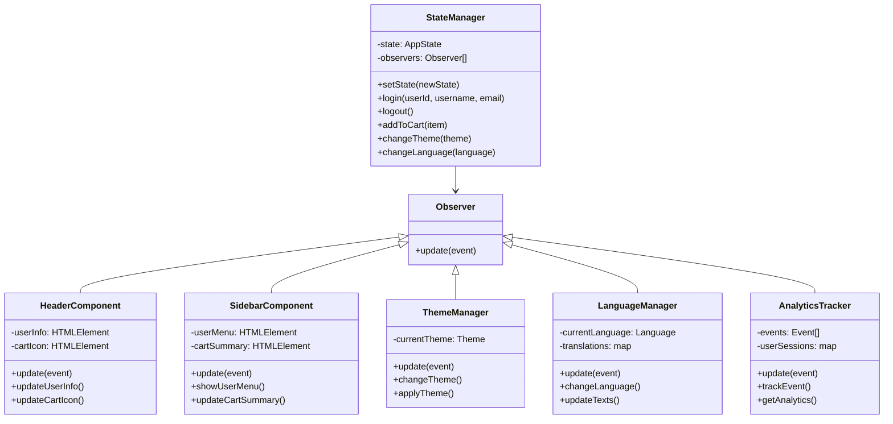
```mermaid
classDiagram
    class StateManager {
        -state: AppState
        -observers: Observer[]
        +setState(newState)
        +login(userId, username, email)
        +logout()
        +addToCart(item)
        +changeTheme(theme)
        +changeLanguage(language)
    }
    
    class Observer {
        +update(event)
    }
    
    class HeaderComponent {
        -userInfo: HTMLElement
        -cartIcon: HTMLElement
        +update(event)
        +updateUserInfo()
        +updateCartIcon()
    }
    
    class SidebarComponent {
        -userMenu: HTMLElement
        -cartSummary: HTMLElement
        +update(event)
        +showUserMenu()
        +updateCartSummary()
    }
    
    class ThemeManager {
        -currentTheme: Theme
        +update(event)
        +changeTheme()
        +applyTheme()
    }
    
    class LanguageManager {
        -currentLanguage: Language
        -translations: map
        +update(event)
        +changeLanguage()
        +updateTexts()
    }
    
    class AnalyticsTracker {
        -events: Event[]
        -userSessions: map
        +update(event)
        +trackEvent()
        +getAnalytics()
    }
    
    StateManager --> Observer
    Observer <|-- HeaderComponent
    Observer <|-- SidebarComponent
    Observer <|-- ThemeManager
    Observer <|-- LanguageManager
    Observer <|-- AnalyticsTracker
```

## 🔧 Variações do Padrão

### Observer com Event Bus

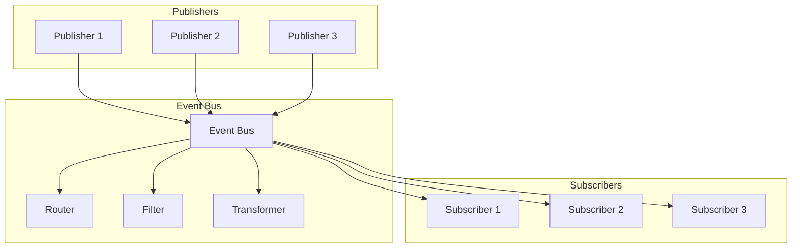
```mermaid
graph TB
    subgraph "Event Bus"
        EB[Event Bus]
        EB --> R[Router]
        EB --> F[Filter]
        EB --> T[Transformer]
    end
    
    subgraph "Publishers"
        P1[Publisher 1]
        P2[Publisher 2]
        P3[Publisher 3]
    end
    
    subgraph "Subscribers"
        S1[Subscriber 1]
        S2[Subscriber 2]
        S3[Subscriber 3]
    end
    
    P1 --> EB
    P2 --> EB
    P3 --> EB
    
    EB --> S1
    EB --> S2
    EB --> S3
```

### Observer com Priority

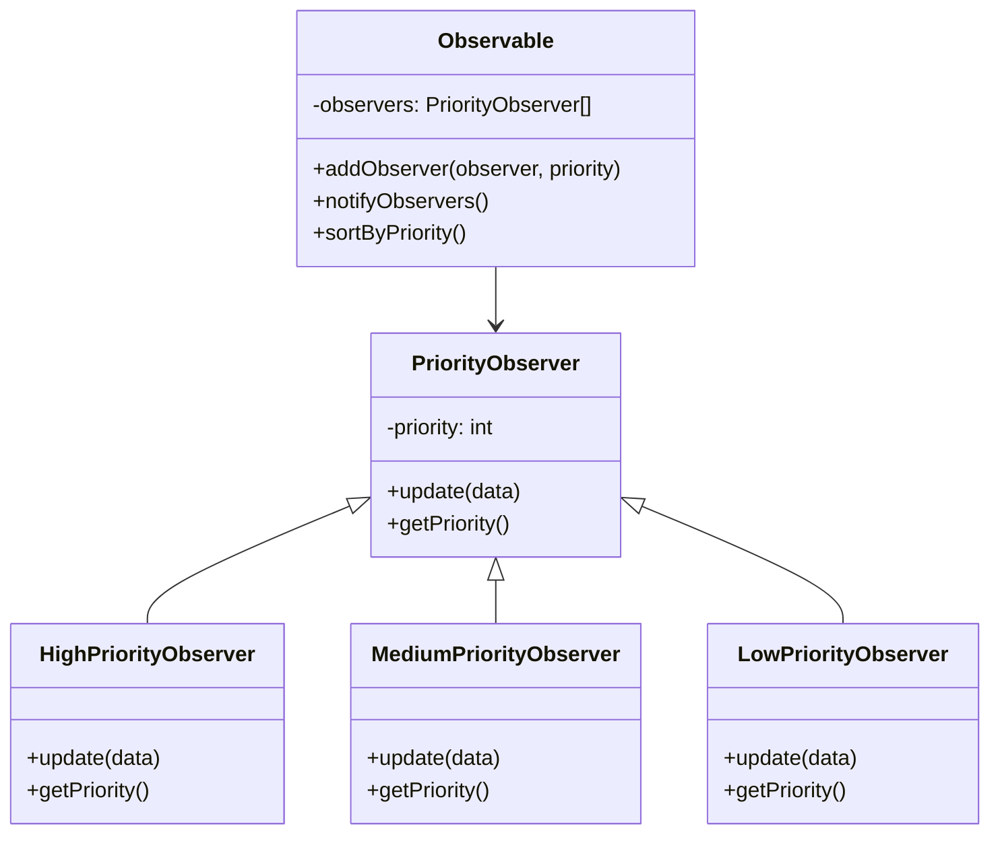
```mermaid
classDiagram
    class PriorityObserver {
        -priority: int
        +update(data)
        +getPriority()
    }
    
    class Observable {
        -observers: PriorityObserver[]
        +addObserver(observer, priority)
        +notifyObservers()
        +sortByPriority()
    }
    
    class HighPriorityObserver {
        +update(data)
        +getPriority()
    }
    
    class MediumPriorityObserver {
        +update(data)
        +getPriority()
    }
    
    class LowPriorityObserver {
        +update(data)
        +getPriority()
    }
    
    Observable --> PriorityObserver
    PriorityObserver <|-- HighPriorityObserver
    PriorityObserver <|-- MediumPriorityObserver
    PriorityObserver <|-- LowPriorityObserver
```

### Observer Assíncrono

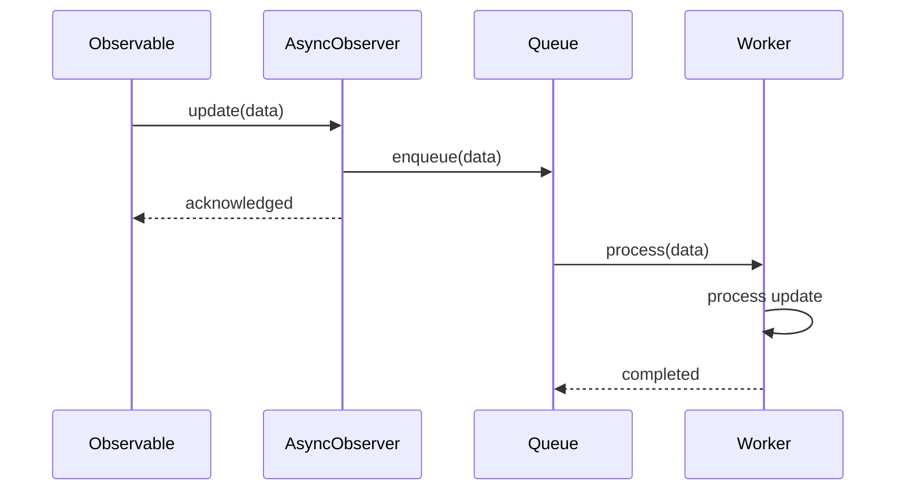
```mermaid
sequenceDiagram
    participant Observable
    participant AsyncObserver
    participant Queue
    participant Worker
    
    Observable->>AsyncObserver: update(data)
    AsyncObserver->>Queue: enqueue(data)
    AsyncObserver-->>Observable: acknowledged
    
    Queue->>Worker: process(data)
    Worker->>Worker: process update
    Worker-->>Queue: completed
```

### Observer com Filtering

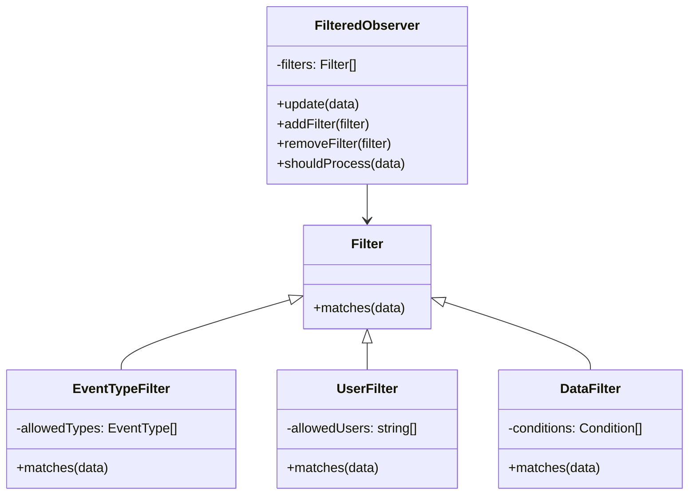
```mermaid
classDiagram
    class FilteredObserver {
        -filters: Filter[]
        +update(data)
        +addFilter(filter)
        +removeFilter(filter)
        +shouldProcess(data)
    }
    
    class Filter {
        +matches(data)
    }
    
    class EventTypeFilter {
        -allowedTypes: EventType[]
        +matches(data)
    }
    
    class UserFilter {
        -allowedUsers: string[]
        +matches(data)
    }
    
    class DataFilter {
        -conditions: Condition[]
        +matches(data)
    }
    
    FilteredObserver --> Filter
    Filter <|-- EventTypeFilter
    Filter <|-- UserFilter
    Filter <|-- DataFilter
```

## 📊 Estados e Transições

### Estado do Observable

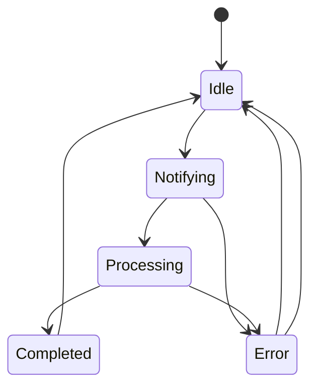
```mermaid
stateDiagram-v2
    [*] --> Idle
    Idle --> Notifying
    Notifying --> Processing
    Processing --> Completed
    Completed --> Idle
    
    Notifying --> Error
    Error --> Idle
    
    Processing --> Error
    Error --> Idle
```

### Estado dos Observadores

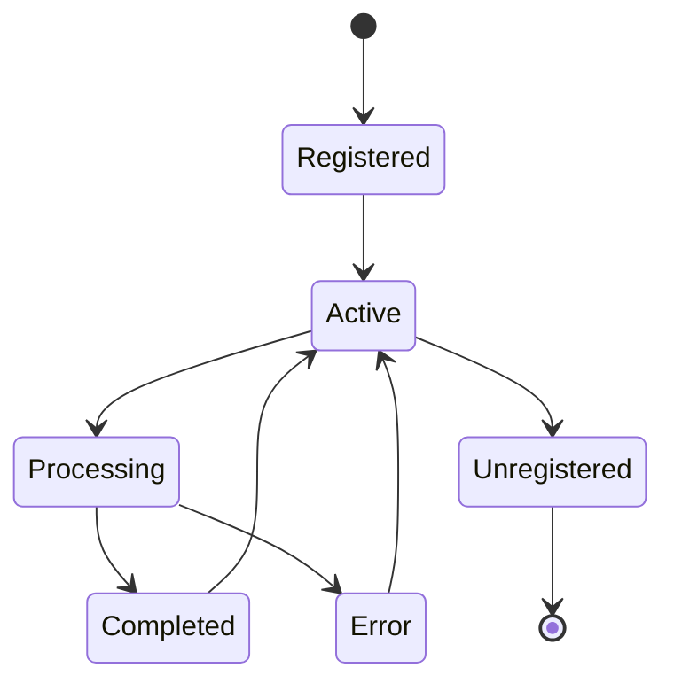
```mermaid
stateDiagram-v2
    [*] --> Registered
    Registered --> Active
    Active --> Processing
    Processing --> Completed
    Completed --> Active
    
    Processing --> Error
    Error --> Active
    
    Active --> Unregistered
    Unregistered --> [*]
```

### Transições de Eventos

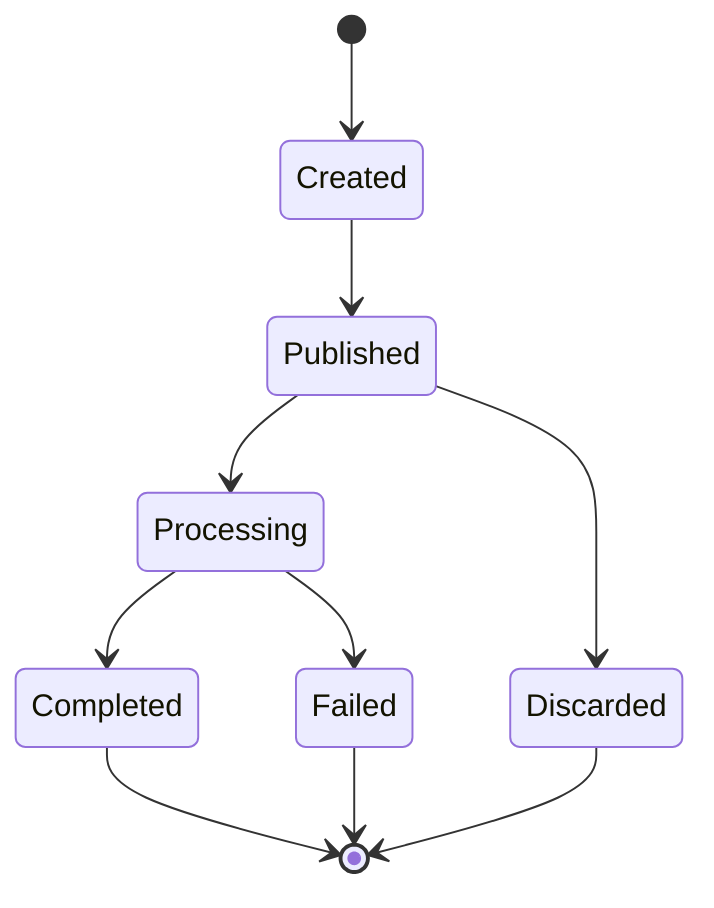
```mermaid
stateDiagram-v2
    [*] --> Created
    Created --> Published
    Published --> Processing
    Processing --> Completed
    Completed --> [*]
    
    Processing --> Failed
    Failed --> [*]
    
    Published --> Discarded
    Discarded --> [*]
```

## 🔄 Fluxos de Erro

### Tratamento de Erros

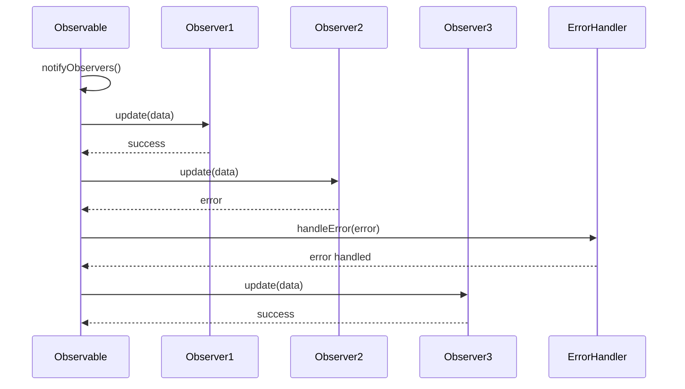
```mermaid
sequenceDiagram
    participant Observable
    participant Observer1
    participant Observer2
    participant Observer3
    participant ErrorHandler
    
    Observable->>Observable: notifyObservers()
    
    Observable->>Observer1: update(data)
    Observer1-->>Observable: success
    
    Observable->>Observer2: update(data)
    Observer2-->>Observable: error
    Observable->>ErrorHandler: handleError(error)
    ErrorHandler-->>Observable: error handled
    
    Observable->>Observer3: update(data)
    Observer3-->>Observable: success
```

### Circuit Breaker Pattern

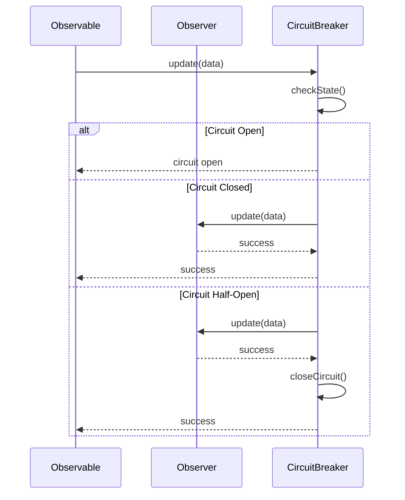
```mermaid
sequenceDiagram
    participant Observable
    participant Observer
    participant CircuitBreaker
    
    Observable->>CircuitBreaker: update(data)
    CircuitBreaker->>CircuitBreaker: checkState()
    
    alt Circuit Open
        CircuitBreaker-->>Observable: circuit open
    else Circuit Closed
        CircuitBreaker->>Observer: update(data)
        Observer-->>CircuitBreaker: success
        CircuitBreaker-->>Observable: success
    else Circuit Half-Open
        CircuitBreaker->>Observer: update(data)
        Observer-->>CircuitBreaker: success
        CircuitBreaker->>CircuitBreaker: closeCircuit()
        CircuitBreaker-->>Observable: success
    end
```

### Retry Strategy

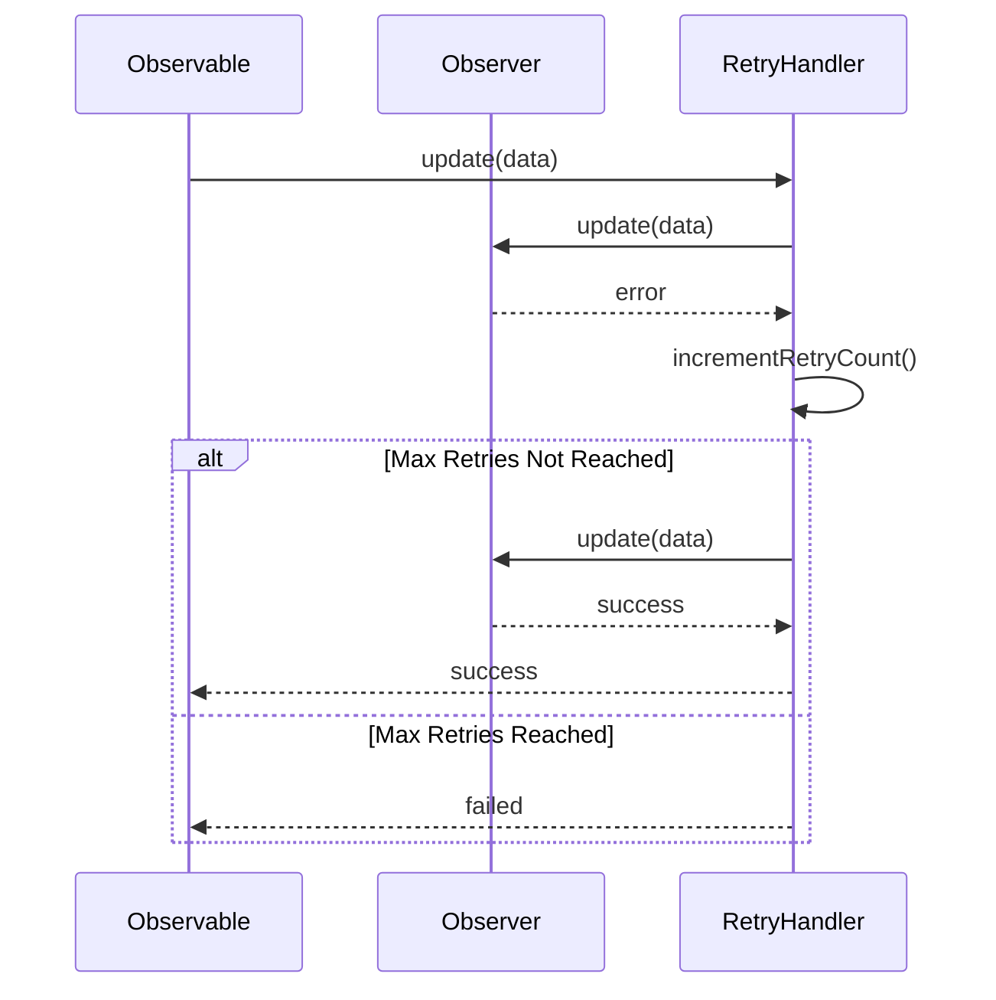
```mermaid
sequenceDiagram
    participant Observable
    participant Observer
    participant RetryHandler
    
    Observable->>RetryHandler: update(data)
    RetryHandler->>Observer: update(data)
    Observer-->>RetryHandler: error
    
    RetryHandler->>RetryHandler: incrementRetryCount()
    
    alt Max Retries Not Reached
        RetryHandler->>Observer: update(data)
        Observer-->>RetryHandler: success
        RetryHandler-->>Observable: success
    else Max Retries Reached
        RetryHandler-->>Observable: failed
    end
```

## 🎨 Padrões Relacionados

### Observer + Strategy

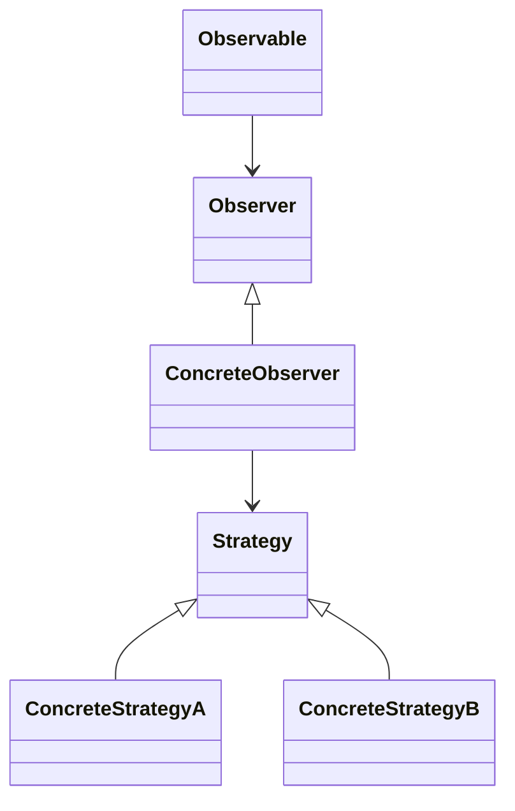
```mermaid
classDiagram
    class Observable
    class Observer
    class Strategy
    class ConcreteStrategyA
    class ConcreteStrategyB
    class ConcreteObserver
    
    Observable --> Observer
    Observer <|-- ConcreteObserver
    ConcreteObserver --> Strategy
    Strategy <|-- ConcreteStrategyA
    Strategy <|-- ConcreteStrategyB
```

### Observer + Command

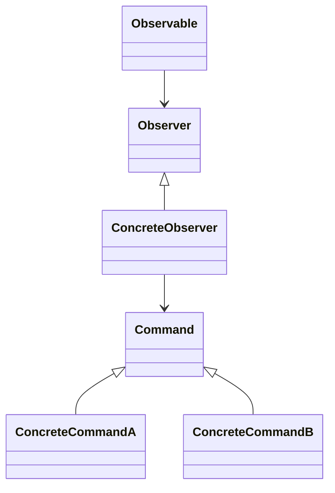
```mermaid
classDiagram
    class Observable
    class Observer
    class Command
    class ConcreteCommandA
    class ConcreteCommandB
    class ConcreteObserver
    
    Observable --> Observer
    Observer <|-- ConcreteObserver
    ConcreteObserver --> Command
    Command <|-- ConcreteCommandA
    Command <|-- ConcreteCommandB
```

### Observer + Mediator

```mermaid
classDiagram
    class Observable
    class Observer
    class Mediator
    class ConcreteMediator
    class ConcreteObserver
    
    Observable --> Observer
    Observer <|-- ConcreteObserver
    ConcreteObserver --> Mediator
    Mediator <|-- ConcreteMediator
```

## 📈 Métricas e Monitoramento

### Diagrama de Métricas

```mermaid
graph TB
    subgraph "Métricas de Performance"
        MP[Performance Metrics]
        MP1[Notification Time]
        MP2[Observer Count]
        MP3[Error Rate]
    end
    
    subgraph "Métricas de Negócio"
        MB[Business Metrics]
        MB1[Event Count]
        MB2[User Engagement]
        MB3[System Health]
    end
    
    subgraph "Métricas Técnicas"
        MT[Technical Metrics]
        MT1[Memory Usage]
        MT2[CPU Usage]
        MT3[Network I/O]
    end
    
    MP --> MP1
    MP --> MP2
    MP --> MP3
    
    MB --> MB1
    MB --> MB2
    MB --> MB3
    
    MT --> MT1
    MT --> MT2
    MT --> MT3
```

### Fluxo de Monitoramento

```mermaid
sequenceDiagram
    participant Observable
    participant Observer
    participant Monitor
    participant Metrics
    
    Observable->>Monitor: startTimer()
    Observable->>Observer: update(data)
    Observer-->>Observable: success
    Observable->>Monitor: endTimer()
    Monitor->>Metrics: recordMetrics()
    Metrics-->>Monitor: metrics recorded
```

## 🔄 Evolução do Padrão

### Versão Simples

```mermaid
graph TB
    O[Observable]
    Obs[Observer]
    
    O --> Obs
```

### Versão com Interface

```mermaid
graph TB
    O[Observable]
    I[Observer Interface]
    Obs[Concrete Observer]
    
    O --> I
    I --> Obs
```

### Versão com Event Bus

```mermaid
graph TB
    O[Observable]
    EB[Event Bus]
    Obs1[Observer 1]
    Obs2[Observer 2]
    Obs3[Observer 3]
    
    O --> EB
    EB --> Obs1
    EB --> Obs2
    EB --> Obs3
```

### Versão com Priority

```mermaid
graph TB
    O[Observable]
    P[Priority Queue]
    Obs1[High Priority]
    Obs2[Medium Priority]
    Obs3[Low Priority]
    
    O --> P
    P --> Obs1
    P --> Obs2
    P --> Obs3
```

## 🎯 Comparação com Outros Padrões

### Observer vs Pub/Sub

```mermaid
graph TB
    subgraph "Observer"
        O[Observable]
        Obs1[Observer 1]
        Obs2[Observer 2]
    end
    
    subgraph "Pub/Sub"
        P[Publisher]
        B[Broker]
        S1[Subscriber 1]
        S2[Subscriber 2]
    end
    
    O --> Obs1
    O --> Obs2
    P --> B
    B --> S1
    B --> S2
```

### Observer vs Mediator

```mermaid
graph TB
    subgraph "Observer"
        O[Observable]
        Obs[Observer]
    end
    
    subgraph "Mediator"
        M[Mediator]
        C1[Colleague 1]
        C2[Colleague 2]
    end
    
    O --> Obs
    M --> C1
    M --> C2
```

### Observer vs Command

```mermaid
graph TB
    subgraph "Observer"
        O[Observable]
        Obs[Observer]
    end
    
    subgraph "Command"
        C[Command]
        R[Receiver]
    end
    
    O --> Obs
    C --> R
```

