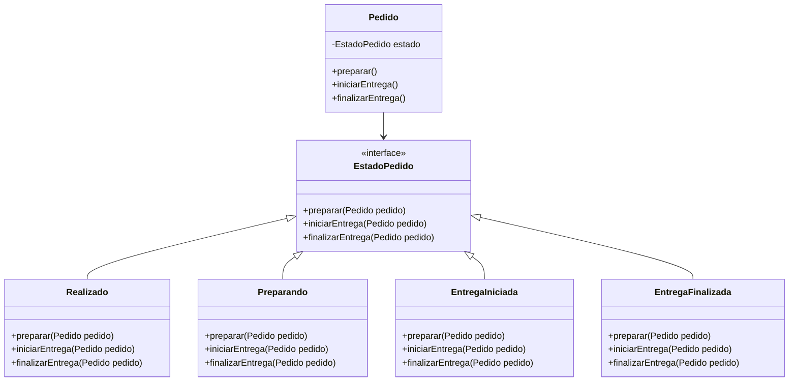
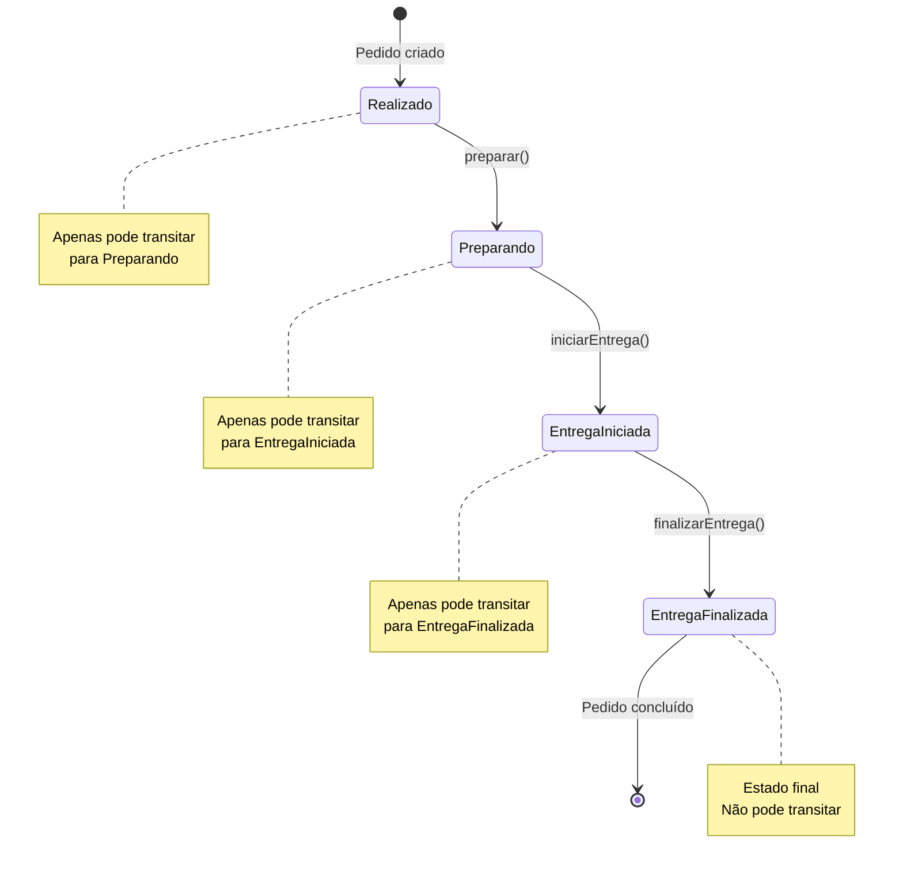

# Padrão State - Design Pattern Comportamental

## 📋 Visão Geral

O **Padrão State** é um padrão de projeto comportamental que permite que um objeto altere seu comportamento quando seu estado interno muda. O objeto parecerá ter mudado de classe, mas na verdade está transitando entre diferentes estados encapsulados.

## 🎯 Problema que Resolve

### Problemas Comuns sem o Padrão State

#### 1. **Controle de Estados com Strings**
```php
// ❌ PROBLEMA: Uso de strings para controle de estado
class Pedido {
    private string $estado = "realizado";
    
    public function getEstado(): string {
        return $this->estado;
    }
    
    public function setEstado(string $estado): void {
        $this->estado = $estado;
    }
}

// Uso problemático
$pedido = new Pedido();
$pedido->setEstado("preparando"); // Pode ser escrito errado
$pedido->setEstado("PREPARANDO"); // Inconsistência de case
$pedido->setEstado("entregue_finalizada"); // Pode pular estados
```

#### 2. **Problemas Identificados**
- **Inconsistência**: Diferentes formas de escrever o mesmo estado
- **Falta de Controle**: Qualquer código pode alterar o estado
- **Violação de Regras**: Estados podem ser pulados ou alterados incorretamente
- **Falta de Encapsulamento**: Lógica de negócio espalhada pelo código
- **Dificuldade de Manutenção**: Mudanças nas regras afetam múltiplos lugares

## 🏗️ Solução com o Padrão State

### Arquitetura da Solução



### Componentes do Padrão

#### 1. **Context (Contexto)**
- Representa o objeto que tem estados
- Mantém referência para o estado atual
- Delega operações para o estado atual

#### 2. **State (Estado)**
- Interface que define métodos para operações específicas
- Cada estado implementa comportamentos diferentes

#### 3. **ConcreteState (Estado Concreto)**
- Implementações específicas de cada estado
- Contém a lógica de transição entre estados
- Controla quando e como o estado pode mudar

## 🔄 Fluxo de Estados

### Estados do Pedido (Exemplo iFood)



### Regras de Transição

| Estado Atual | Ação Permitida | Próximo Estado | Ações Bloqueadas |
|---------------|----------------|----------------|------------------|
| Realizado | `preparar()` | Preparando | `iniciarEntrega()`, `finalizarEntrega()` |
| Preparando | `iniciarEntrega()` | EntregaIniciada | `preparar()`, `finalizarEntrega()` |
| EntregaIniciada | `finalizarEntrega()` | EntregaFinalizada | `preparar()`, `iniciarEntrega()` |
| EntregaFinalizada | - | - | Todas as ações |

## 💡 Vantagens do Padrão State

### ✅ Benefícios

1. **Encapsulamento de Comportamento**
   - Cada estado encapsula seu comportamento específico
   - Lógica de negócio centralizada em cada estado

2. **Controle de Transições**
   - Estados controlam suas próprias transições
   - Impossível pular estados ou fazer transições inválidas

3. **Extensibilidade**
   - Fácil adicionar novos estados
   - Modificar comportamento sem afetar outros estados

4. **Eliminação de Condicionais**
   - Remove grandes blocos if/else
   - Código mais limpo e legível

5. **Princípio Tell, Don't Ask**
   - Objetos fazem ações, não expõem dados
   - Melhor encapsulamento

### ❌ Desvantagens

1. **Complexidade Inicial**
   - Mais classes para gerenciar
   - Pode ser overkill para casos simples

2. **Curva de Aprendizado**
   - Conceito mais avançado
   - Requer entendimento de OOP

## 🛠️ Implementação Prática

### Estrutura de Arquivos

```
src/
├── State/
│   ├── EstadoPedido.php          # Interface
│   ├── Realizado.php             # Estado inicial
│   ├── Preparando.php            # Estado de preparação
│   ├── EntregaIniciada.php       # Estado de entrega
│   └── EntregaFinalizada.php     # Estado final
├── Pedido.php                    # Contexto
└── index.php                     # Código cliente
```

### Implementação em PHP

#### 1. Interface do Estado
```php
<?php

interface EstadoPedido {
    public function preparar(Pedido $pedido): void;
    public function iniciarEntrega(Pedido $pedido): void;
    public function finalizarEntrega(Pedido $pedido): void;
}
```

#### 2. Estado Realizado
```php
<?php

class Realizado implements EstadoPedido {
    public function preparar(Pedido $pedido): void {
        // Pode transitar para preparando
        $pedido->setEstado(new Preparando());
    }
    
    public function iniciarEntrega(Pedido $pedido): void {
        throw new DomainException("Pedido ainda não foi preparado");
    }
    
    public function finalizarEntrega(Pedido $pedido): void {
        throw new DomainException("Pedido ainda não foi preparado");
    }
}
```

#### 3. Estado Preparando
```php
<?php

class Preparando implements EstadoPedido {
    public function preparar(Pedido $pedido): void {
        throw new DomainException("Pedido já está sendo preparado");
    }
    
    public function iniciarEntrega(Pedido $pedido): void {
        // Pode transitar para entrega iniciada
        $pedido->setEstado(new EntregaIniciada());
    }
    
    public function finalizarEntrega(Pedido $pedido): void {
        throw new DomainException("Pedido não pode ser finalizado pois ainda está sendo preparado");
    }
}
```

#### 4. Classe Pedido (Contexto)
```php
<?php

class Pedido {
    private EstadoPedido $estado;
    
    public function __construct() {
        // Sempre inicia como realizado
        $this->estado = new Realizado();
    }
    
    public function preparar(): void {
        $this->estado->preparar($this);
    }
    
    public function iniciarEntrega(): void {
        $this->estado->iniciarEntrega($this);
    }
    
    public function finalizarEntrega(): void {
        $this->estado->finalizarEntrega($this);
    }
    
    public function setEstado(EstadoPedido $estado): void {
        $this->estado = $estado;
    }
    
    public function getEstado(): string {
        return get_class($this->estado);
    }
}
```

#### 5. Código Cliente
```php
<?php

// Uso correto do padrão
$pedido = new Pedido();
echo "Estado inicial: " . $pedido->getEstado() . "\n";

// Fluxo correto
$pedido->preparar();
echo "Após preparar: " . $pedido->getEstado() . "\n";

$pedido->iniciarEntrega();
echo "Após iniciar entrega: " . $pedido->getEstado() . "\n";

$pedido->finalizarEntrega();
echo "Após finalizar: " . $pedido->getEstado() . "\n";

// Tentativas de violar regras (geram exceções)
try {
    $pedido->iniciarEntrega(); // Já está finalizado
} catch (DomainException $e) {
    echo "Erro: " . $e->getMessage() . "\n";
}
```

## 🎯 Casos de Uso Comuns

### 1. **Sistemas de Pedidos**
- E-commerce, delivery, restaurantes
- Estados: Pendente → Processando → Enviado → Entregue

### 2. **Sistemas de Aprovação**
- Documentos, orçamentos, projetos
- Estados: Rascunho → Pendente → Aprovado → Rejeitado

### 3. **Sistemas de Pagamento**
- Transações financeiras
- Estados: Pendente → Processando → Aprovado → Rejeitado

### 4. **Sistemas de Usuário**
- Contas de usuário
- Estados: Inativo → Ativo → Suspenso → Bloqueado

### 5. **Sistemas de Workflow**
- Processos empresariais
- Estados: Iniciado → Em Andamento → Revisão → Concluído

## 🔧 Boas Práticas

### 1. **Nomenclatura Clara**
```php
// ✅ BOM: Nomes descritivos
class PedidoRealizado implements EstadoPedido
class PedidoEmPreparacao implements EstadoPedido
class PedidoEmEntrega implements EstadoPedido

// ❌ RUIM: Nomes genéricos
class Estado1 implements EstadoPedido
class Estado2 implements EstadoPedido
```

### 2. **Tratamento de Exceções**
```php
// ✅ BOM: Exceções específicas e informativas
throw new DomainException("Pedido já foi entregue ao cliente");

// ❌ RUIM: Exceções genéricas
throw new Exception("Erro");
```

### 3. **Imutabilidade dos Estados**
```php
// ✅ BOM: Estados imutáveis
class Realizado implements EstadoPedido {
    // Sem propriedades mutáveis
}

// ❌ RUIM: Estados com estado interno
class Realizado implements EstadoPedido {
    private bool $processado = false; // Evitar
}
```

### 4. **Documentação dos Estados**
```php
/**
 * Estado inicial de um pedido
 * 
 * Transições permitidas:
 * - preparar() → Preparando
 * 
 * Transições bloqueadas:
 * - iniciarEntrega() → DomainException
 * - finalizarEntrega() → DomainException
 */
class Realizado implements EstadoPedido {
    // Implementação...
}
```

## 🚀 Extensões Avançadas

### 1. **Estados com Dados**
```php
interface EstadoPedido {
    public function preparar(Pedido $pedido, array $dados = []): void;
    public function iniciarEntrega(Pedido $pedido, array $dados = []): void;
    public function finalizarEntrega(Pedido $pedido, array $dados = []): void;
}
```

### 2. **Histórico de Estados**
```php
class Pedido {
    private array $historicoEstados = [];
    
    public function setEstado(EstadoPedido $estado): void {
        $this->historicoEstados[] = [
            'estado' => get_class($estado),
            'timestamp' => new DateTime()
        ];
        $this->estado = $estado;
    }
}
```

### 3. **Estados com Timeout**
```php
class Preparando implements EstadoPedido {
    private DateTime $inicioPreparacao;
    
    public function __construct() {
        $this->inicioPreparacao = new DateTime();
    }
    
    public function iniciarEntrega(Pedido $pedido): void {
        $tempoDecorrido = (new DateTime())->diff($this->inicioPreparacao);
        
        if ($tempoDecorrido->i < 5) { // Menos de 5 minutos
            throw new DomainException("Pedido ainda não pode sair para entrega");
        }
        
        $pedido->setEstado(new EntregaIniciada());
    }
}
```

## 📊 Comparação: Com vs Sem Padrão State

### Sem Padrão State
```php
class Pedido {
    private string $estado = "realizado";
    
    public function preparar(): void {
        if ($this->estado === "realizado") {
            $this->estado = "preparando";
        } else {
            throw new Exception("Estado inválido");
        }
    }
    
    public function iniciarEntrega(): void {
        if ($this->estado === "preparando") {
            $this->estado = "entrega_iniciada";
        } else {
            throw new Exception("Estado inválido");
        }
    }
    
    // Muitos if/else, difícil manutenção
}
```

### Com Padrão State
```php
class Pedido {
    private EstadoPedido $estado;
    
    public function preparar(): void {
        $this->estado->preparar($this);
    }
    
    public function iniciarEntrega(): void {
        $this->estado->iniciarEntrega($this);
    }
    
    // Código limpo, cada estado controla suas transições
}
```

## 🎓 Conclusão

O **Padrão State** é uma ferramenta poderosa para gerenciar estados complexos em objetos, oferecendo:

- **Controle rigoroso** sobre transições de estado
- **Encapsulamento** da lógica de negócio
- **Extensibilidade** para novos estados
- **Manutenibilidade** do código
- **Eliminação** de condicionais complexas

### Quando Usar
- Objetos com múltiplos estados
- Comportamento que muda baseado no estado
- Necessidade de controle rigoroso de transições
- Sistemas com regras de negócio complexas

### Quando NÃO Usar
- Estados simples com poucas transições
- Casos onde if/else são suficientes
- Quando a complexidade não justifica o padrão

---

**Última atualização**: $(date)
**Mantenedor**: Equipe Skynet
**Versão**: 1.0

