# Diagramas do Padrão State

## 📊 Arquitetura Geral

### Diagrama de Classes

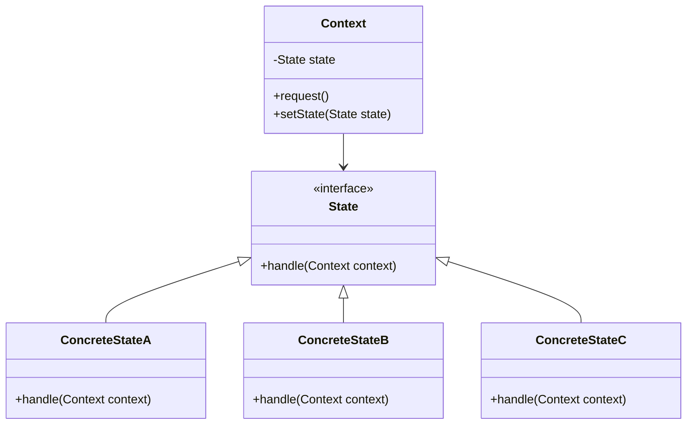

### Componentes do Padrão

| Componente | Responsabilidade | Exemplo |
|------------|------------------|---------|
| **Context** | Mantém referência para o estado atual | Classe `Pedido` |
| **State** | Interface que define operações | Interface `EstadoPedido` |
| **ConcreteState** | Implementa comportamento específico | Classes `Realizado`, `Preparando`, etc. |

## 🔄 Fluxo de Estados

### Diagrama de Estados - Pedido iFood

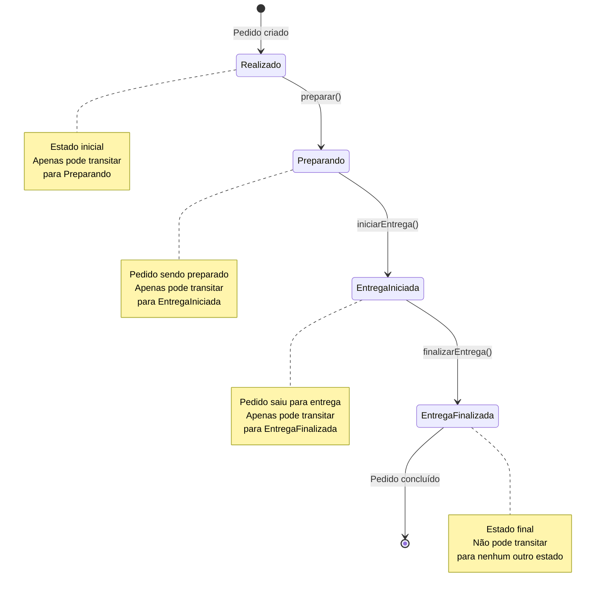

### Tabela de Transições

| Estado Atual | Ação | Próximo Estado | Condição |
|---------------|------|----------------|----------|
| Realizado | `preparar()` | Preparando | ✅ Sempre permitido |
| Realizado | `iniciarEntrega()` | - | ❌ Bloqueado |
| Realizado | `finalizarEntrega()` | - | ❌ Bloqueado |
| Preparando | `preparar()` | - | ❌ Bloqueado |
| Preparando | `iniciarEntrega()` | EntregaIniciada | ✅ Sempre permitido |
| Preparando | `finalizarEntrega()` | - | ❌ Bloqueado |
| EntregaIniciada | `preparar()` | - | ❌ Bloqueado |
| EntregaIniciada | `iniciarEntrega()` | - | ❌ Bloqueado |
| EntregaIniciada | `finalizarEntrega()` | EntregaFinalizada | ✅ Sempre permitido |
| EntregaFinalizada | Qualquer ação | - | ❌ Todas bloqueadas |

## 🏗️ Arquitetura Detalhada

### Estrutura de Arquivos

```
src/
├── State/
│   ├── EstadoPedido.php          # Interface
│   ├── Realizado.php            # Estado inicial
│   ├── Preparando.php            # Estado de preparação
│   ├── EntregaIniciada.php       # Estado de entrega
│   └── EntregaFinalizada.php     # Estado final
├── Pedido.php                    # Contexto
└── index.php                     # Código cliente
```

### Diagrama de Sequência - Fluxo Normal

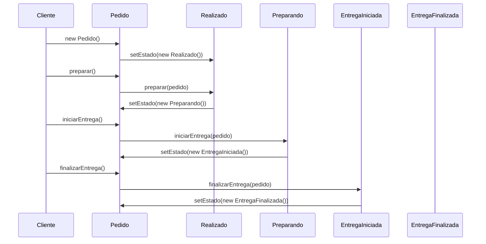

### Diagrama de Sequência - Tentativa de Violação

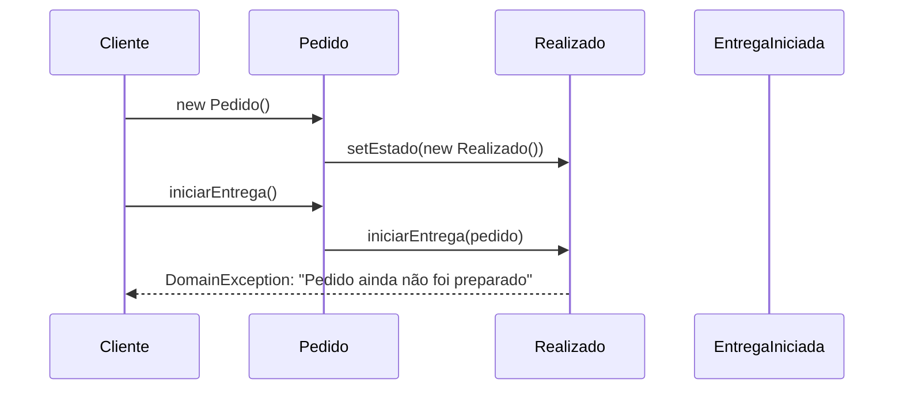

## 🎯 Padrões de Implementação

### 1. Interface State

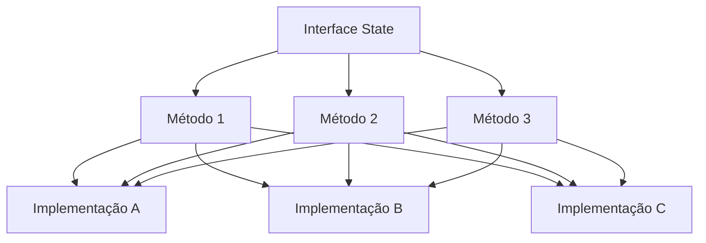

### 2. Context com Estados

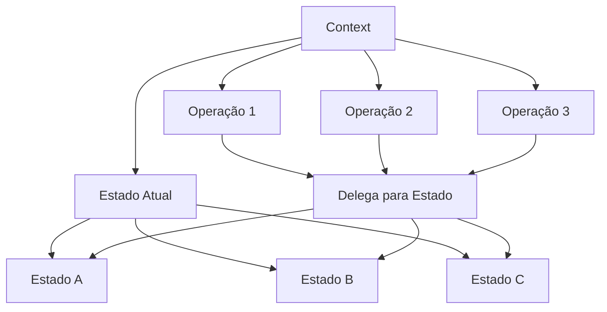

## 🔧 Variações do Padrão

### 1. State com Dados

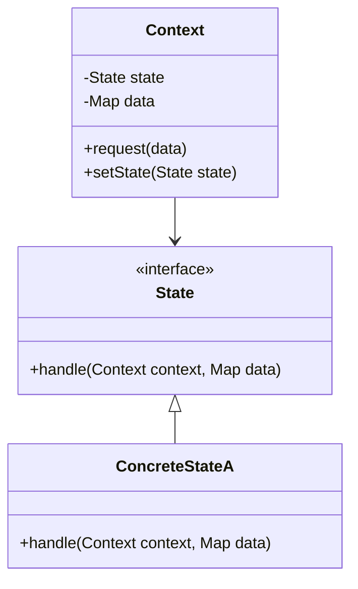

### 2. State com Histórico

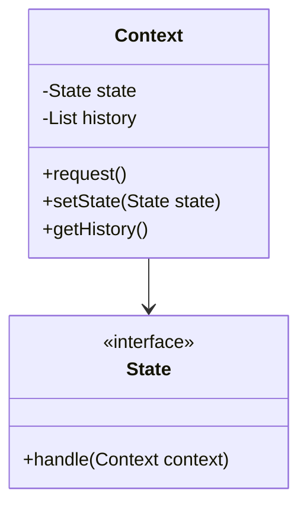

### 3. State com Timeout

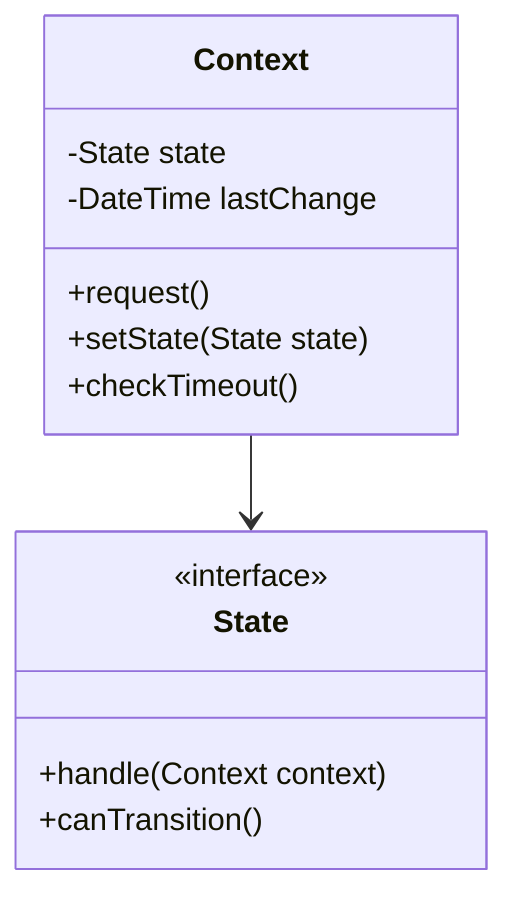

## 📈 Métricas e Monitoramento

### Diagrama de Métricas

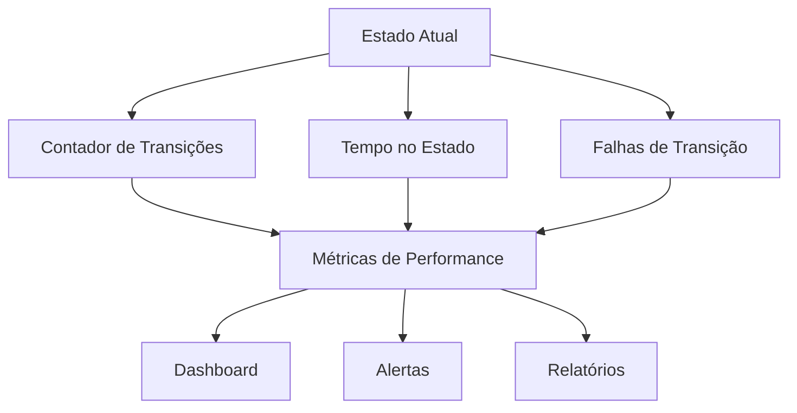

### Tabela de Métricas

| Métrica | Descrição | Valor Ideal |
|---------|------------|--------------|
| **Transições por minuto** | Número de mudanças de estado | < 100 |
| **Tempo médio no estado** | Duração média em cada estado | Variável |
| **Taxa de falhas** | % de transições que falharam | < 1% |
| **Estados órfãos** | Estados que não podem transitar | 0 |

## 🚀 Extensões Avançadas

### 1. State Machine

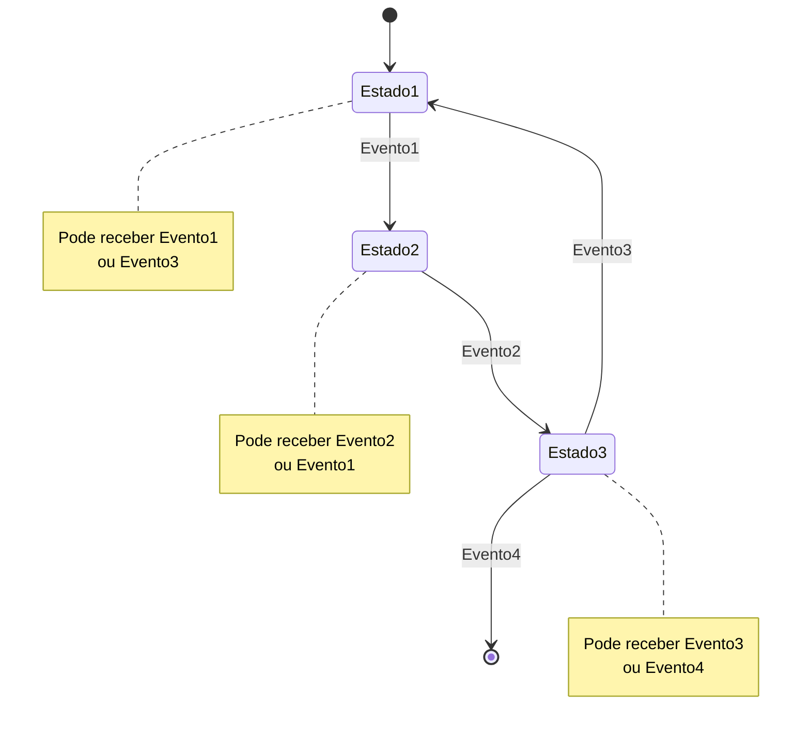

### 2. Hierarchical State

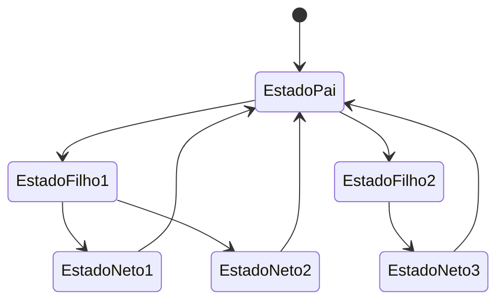

### 3. Parallel State

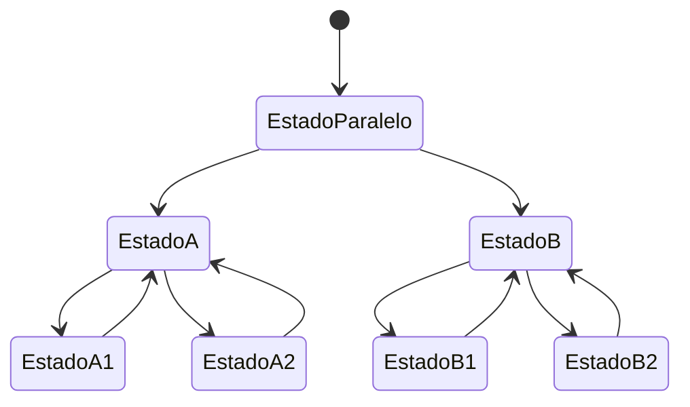

## 🎯 Conclusão

Os diagramas apresentados mostram:

1. **Arquitetura clara** do padrão State
2. **Fluxos de transição** bem definidos
3. **Prevenção de violações** de regras
4. **Extensibilidade** para casos complexos
5. **Monitoramento** e métricas de qualidade

O padrão State oferece uma solução robusta e escalável para gerenciar estados complexos em aplicações, garantindo que as regras de negócio sejam sempre respeitadas.

---

**Última atualização**: $(date)
**Mantenedor**: Equipe Skynet
**Versão**: 1.0


