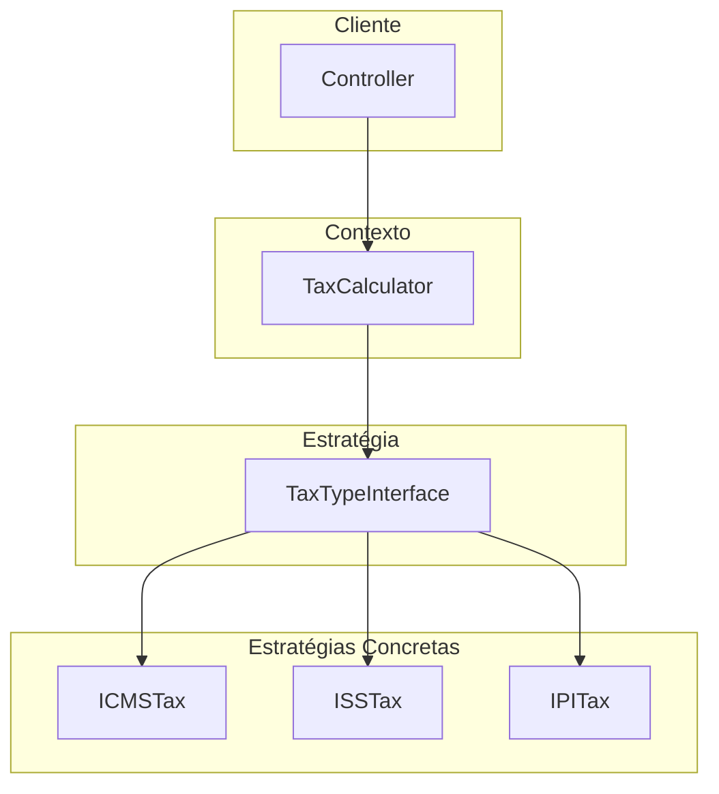
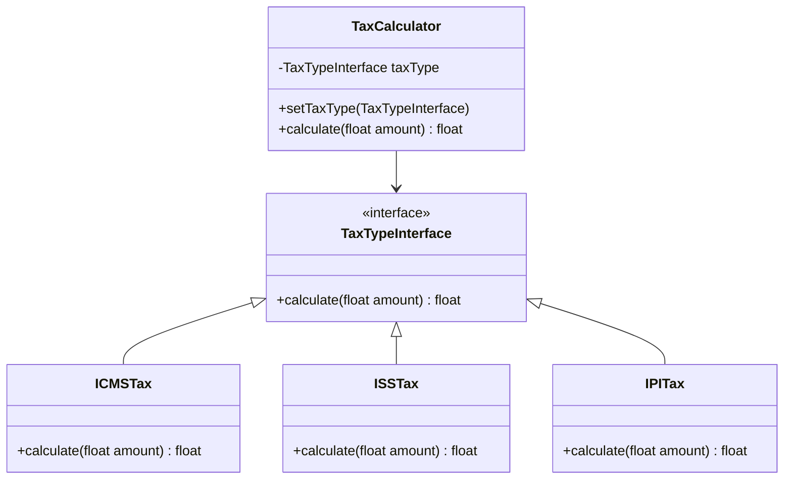

# Padrão Strategy (Estratégia)

## 🎯 Visão Geral

O **Padrão Strategy** é um padrão comportamental que permite definir uma família de algoritmos, encapsulá-los e torná-los intercambiáveis. O Strategy permite que o algoritmo varie independentemente dos clientes que o utilizam.

## 🚨 Problema que Resolve

### Cenário: Sistema de Cálculo de Impostos

Imagine um sistema financeiro que precisa calcular diferentes tipos de impostos (ICMS, ISS, IPI) baseado no tipo de imposto e valor faturado pelo usuário.

#### ❌ **Problema sem Strategy**

```php
class TaxCalculator 
{
    public function calculate(string $taxType, float $amount): float 
    {
        if ($taxType === 'ICMS') {
            return $amount * 0.04; // 4%
        }
        
        if ($taxType === 'ISS') {
            return $amount * 0.11; // 11%
        }
        
        if ($taxType === 'IPI') {
            return $amount * 0.15; // 15%
        }
        
        throw new InvalidArgumentException('Tipo de imposto inválido');
    }
}
```

#### 🔥 **Problemas Identificados**

1. **Violação do Single Responsibility Principle (SRP)**
   - A classe tem múltiplas responsabilidades (calcular ICMS, ISS, IPI)
   - Cada mudança de percentual força modificação na classe

2. **Violação do Open/Closed Principle (OCP)**
   - Para adicionar novo imposto (ex: IVA), precisa modificar a classe
   - Classe aberta para modificação, não para extensão

3. **Obsessão por Tipos Primitivos**
   - Uso de strings para representar tipos de imposto
   - Falta de comportamento e validação

4. **Acoplamento Alto**
   - Lógica de negócio acoplada a implementação específica
   - Dificulta testes e manutenção

## 🏗️ Arquitetura da Solução

### Componentes do Strategy



### Estrutura de Classes



## ✅ Vantagens

### 1. **Respeita Princípios SOLID**
- **SRP**: Cada estratégia tem uma única responsabilidade
- **OCP**: Aberto para extensão, fechado para modificação
- **DIP**: Dependência de abstração, não de implementação

### 2. **Flexibilidade**
- Algoritmos intercambiáveis em tempo de execução
- Fácil adição de novas estratégias
- Configuração dinâmica de comportamento

### 3. **Testabilidade**
- Cada estratégia pode ser testada isoladamente
- Fácil criação de mocks e stubs
- Testes unitários mais simples

### 4. **Manutenibilidade**
- Código mais limpo e organizado
- Separação clara de responsabilidades
- Facilita refatoração

## ❌ Desvantagens

### 1. **Complexidade Adicional**
- Mais classes e interfaces
- Pode ser over-engineering para casos simples

### 2. **Cliente Precisa Conhecer Estratégias**
- Cliente deve escolher a estratégia correta
- Pode gerar camada adicional de ifs/switch

### 3. **Overhead de Performance**
- Indireção através de interfaces
- Múltiplas chamadas de método

## 🎯 Casos de Uso Comuns

### 1. **Sistemas de Pagamento**
- Diferentes gateways (Stripe, PayPal, PagSeguro)
- Múltiplas formas de pagamento

### 2. **Sistemas de Notificação**
- Email, SMS, Push, WhatsApp
- Diferentes provedores de notificação

### 3. **Sistemas de Relatórios**
- PDF, Excel, CSV, JSON
- Múltiplos formatos de saída

### 4. **Sistemas de Validação**
- Validação de CPF, CNPJ, Email
- Diferentes regras de validação

### 5. **Sistemas de Cálculo**
- Impostos, descontos, comissões
- Múltiplas fórmulas de cálculo

## 🔄 Comparação: Com vs Sem Strategy

### ❌ **Sem Strategy (Problema)**

```php
// Violação de princípios SOLID
class TaxCalculator 
{
    public function calculate(string $taxType, float $amount): float 
    {
        if ($taxType === 'ICMS') {
            return $amount * 0.04;
        }
        
        if ($taxType === 'ISS') {
            return $amount * 0.11;
        }
        
        if ($taxType === 'IPI') {
            return $amount * 0.15;
        }
        
        // Para adicionar IVA, precisa modificar esta classe
        if ($taxType === 'IVA') {
            return $amount * 0.28;
        }
        
        throw new InvalidArgumentException('Tipo inválido');
    }
}
```

**Problemas:**
- Múltiplas responsabilidades
- Aberto para modificação
- Acoplamento alto
- Difícil de testar

### ✅ **Com Strategy (Solução)**

```php
// Interface da estratégia
interface TaxTypeInterface 
{
    public function calculate(float $amount): float;
}

// Estratégias concretas
class ICMSTax implements TaxTypeInterface 
{
    public function calculate(float $amount): float 
    {
        return $amount * 0.04;
    }
}

class ISSTax implements TaxTypeInterface 
{
    public function calculate(float $amount): float 
    {
        return $amount * 0.11;
    }
}

// Contexto
class TaxCalculator 
{
    private TaxTypeInterface $taxType;
    
    public function setTaxType(TaxTypeInterface $taxType): self 
    {
        $this->taxType = $taxType;
        return $this;
    }
    
    public function calculate(float $amount): float 
    {
        return $this->taxType->calculate($amount);
    }
}
```

**Benefícios:**
- Responsabilidade única
- Aberto para extensão
- Baixo acoplamento
- Fácil de testar

## 🛠️ Boas Práticas

### 1. **Use Strategy Quando:**
- Múltiplas formas de executar uma tarefa
- Algoritmos que variam frequentemente
- Necessidade de trocar algoritmos em runtime
- Quer evitar ifs/switch complexos

### 2. **Evite Strategy Quando:**
- Apenas uma forma de executar a tarefa
- Algoritmos raramente mudam
- Overhead de complexidade não se justifica

### 3. **Implementação Correta:**
- Interface bem definida
- Estratégias focadas e coesas
- Contexto simples e claro
- Nomenclatura descritiva

### 4. **Testes:**
- Teste cada estratégia isoladamente
- Use mocks para o contexto
- Valide comportamento em runtime

## 🔧 Extensões Avançadas

### 1. **Strategy com Factory**
- Factory para criar estratégias
- Encapsula lógica de seleção
- Reduz acoplamento do cliente

### 2. **Strategy com Registry**
- Registry de estratégias disponíveis
- Configuração dinâmica
- Descoberta automática

### 3. **Strategy com Builder**
- Builder para configurar estratégias
- Configuração complexa
- Validação de parâmetros

### 4. **Strategy com Chain of Responsibility**
- Cadeia de estratégias
- Fallback automático
- Processamento sequencial

## 📚 Referências

- **Gang of Four**: Design Patterns - Elements of Reusable Object-Oriented Software
- **Refactoring Guru**: [Strategy Pattern](https://refactoring.guru/design-patterns/strategy)
- **Source Making**: [Strategy Pattern](https://sourcemaking.com/design_patterns/strategy)

## 🎯 Conclusão

O padrão Strategy é uma ferramenta poderosa para resolver problemas de múltiplos algoritmos, mas deve ser usado com sabedoria. Ele resolve problemas de violação de princípios SOLID e melhora a testabilidade, mas adiciona complexidade ao sistema.

**Use quando:** Múltiplas formas de executar uma tarefa
**Evite quando:** Complexidade não se justifica
**Lembre-se:** O cliente precisa conhecer as diferenças entre estratégias


