# Diagramas - Padrão Strategy

## 🏗️ Arquitetura Geral

### Estrutura de Classes

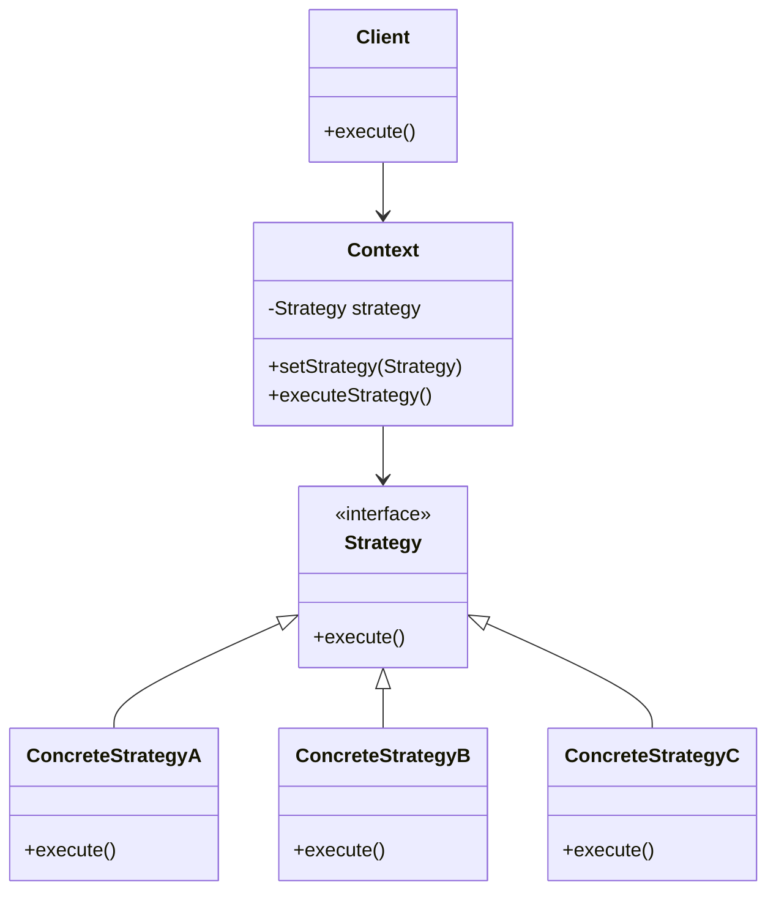
```mermaid
classDiagram
    class Client {
        +execute()
    }
    
    class Context {
        -Strategy strategy
        +setStrategy(Strategy)
        +executeStrategy()
    }
    
    class Strategy {
        <<interface>>
        +execute()
    }
    
    class ConcreteStrategyA {
        +execute()
    }
    
    class ConcreteStrategyB {
        +execute()
    }
    
    class ConcreteStrategyC {
        +execute()
    }
    
    Client --> Context
    Context --> Strategy
    Strategy <|-- ConcreteStrategyA
    Strategy <|-- ConcreteStrategyB
    Strategy <|-- ConcreteStrategyC
```

### Diagrama de Componentes

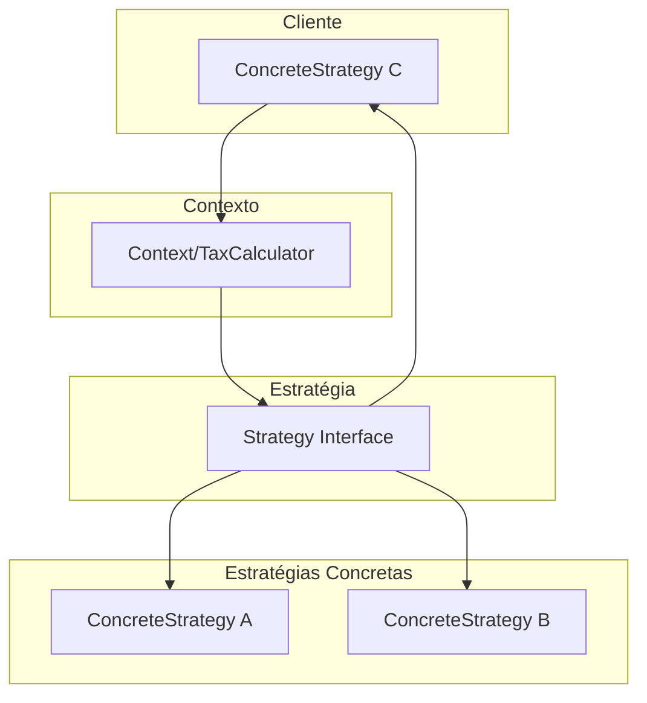
```mermaid
graph TB
    subgraph "Cliente"
        C[Controller/Client]
    end
    
    subgraph "Contexto"
        CTX[Context/TaxCalculator]
    end
    
    subgraph "Estratégia"
        I[Strategy Interface]
    end
    
    subgraph "Estratégias Concretas"
        A[ConcreteStrategy A]
        B[ConcreteStrategy B]
        C[ConcreteStrategy C]
    end
    
    C --> CTX
    CTX --> I
    I --> A
    I --> B
    I --> C
```

## 🔄 Fluxos de Funcionamento

### Fluxo Básico do Strategy

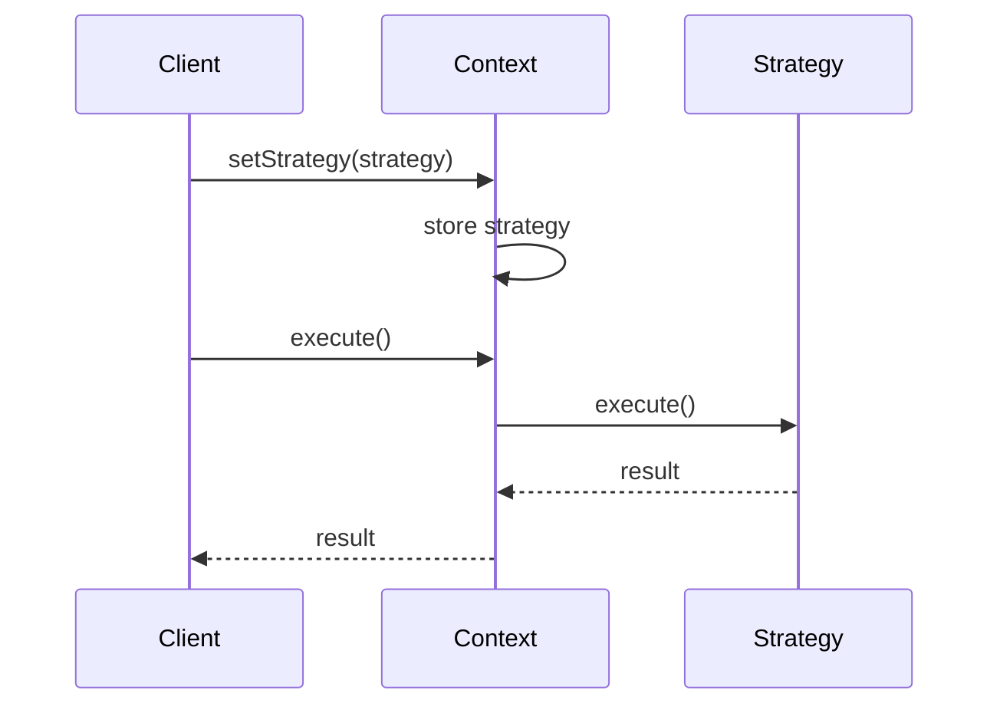
```mermaid
sequenceDiagram
    participant Client
    participant Context
    participant Strategy
    
    Client->>Context: setStrategy(strategy)
    Context->>Context: store strategy
    Client->>Context: execute()
    Context->>Strategy: execute()
    Strategy-->>Context: result
    Context-->>Client: result
```

### Fluxo com Factory

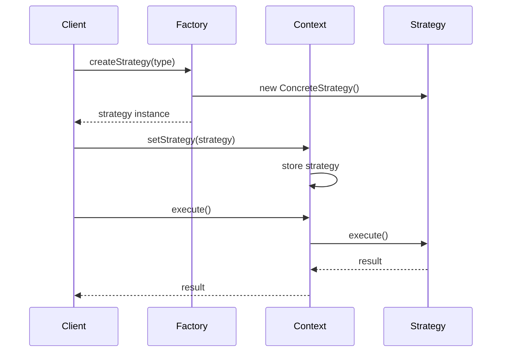
```mermaid
sequenceDiagram
    participant Client
    participant Factory
    participant Context
    participant Strategy
    
    Client->>Factory: createStrategy(type)
    Factory->>Strategy: new ConcreteStrategy()
    Factory-->>Client: strategy instance
    Client->>Context: setStrategy(strategy)
    Context->>Context: store strategy
    Client->>Context: execute()
    Context->>Strategy: execute()
    Strategy-->>Context: result
    Context-->>Client: result
```

### Fluxo de Validação

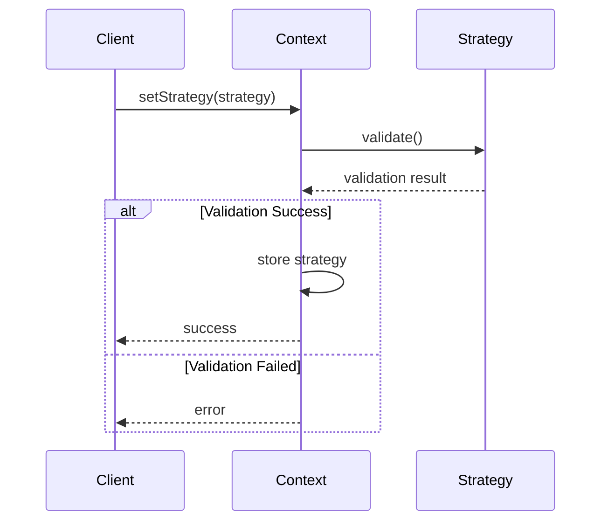
```mermaid
sequenceDiagram
    participant Client
    participant Context
    participant Strategy
    
    Client->>Context: setStrategy(strategy)
    Context->>Strategy: validate()
    Strategy-->>Context: validation result
    
    alt Validation Success
        Context->>Context: store strategy
        Context-->>Client: success
    else Validation Failed
        Context-->>Client: error
    end
```

## 🎯 Casos de Uso Específicos

### Sistema de Cálculo de Impostos

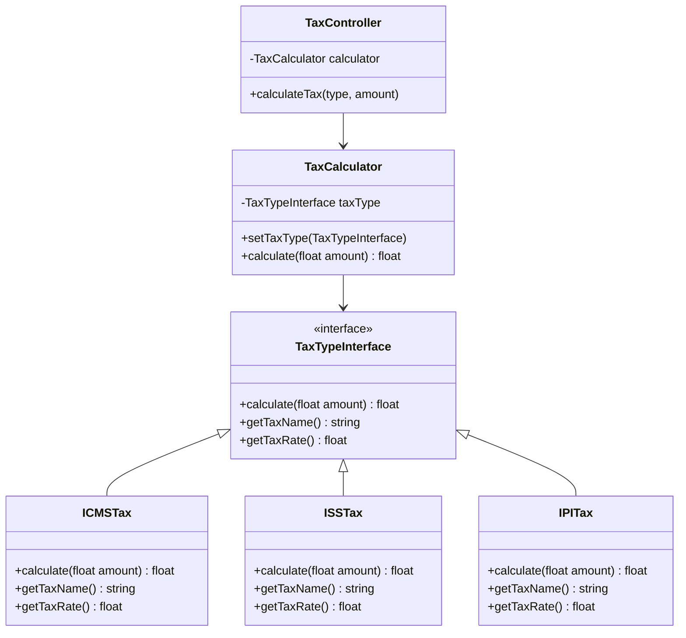
```mermaid
classDiagram
    class TaxController {
        -TaxCalculator calculator
        +calculateTax(type, amount)
    }
    
    class TaxCalculator {
        -TaxTypeInterface taxType
        +setTaxType(TaxTypeInterface)
        +calculate(float amount) float
    }
    
    class TaxTypeInterface {
        <<interface>>
        +calculate(float amount) float
        +getTaxName() string
        +getTaxRate() float
    }
    
    class ICMSTax {
        +calculate(float amount) float
        +getTaxName() string
        +getTaxRate() float
    }
    
    class ISSTax {
        +calculate(float amount) float
        +getTaxName() string
        +getTaxRate() float
    }
    
    class IPITax {
        +calculate(float amount) float
        +getTaxName() string
        +getTaxRate() float
    }
    
    TaxController --> TaxCalculator
    TaxCalculator --> TaxTypeInterface
    TaxTypeInterface <|-- ICMSTax
    TaxTypeInterface <|-- ISSTax
    TaxTypeInterface <|-- IPITax
```

### Sistema de Pagamentos

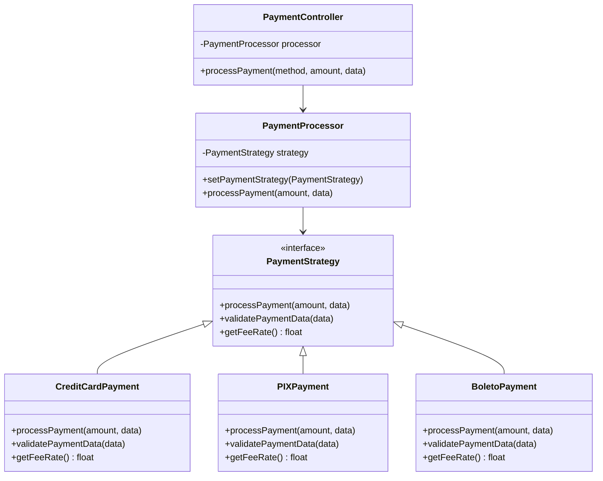
```mermaid
classDiagram
    class PaymentController {
        -PaymentProcessor processor
        +processPayment(method, amount, data)
    }
    
    class PaymentProcessor {
        -PaymentStrategy strategy
        +setPaymentStrategy(PaymentStrategy)
        +processPayment(amount, data)
    }
    
    class PaymentStrategy {
        <<interface>>
        +processPayment(amount, data)
        +validatePaymentData(data)
        +getFeeRate() float
    }
    
    class CreditCardPayment {
        +processPayment(amount, data)
        +validatePaymentData(data)
        +getFeeRate() float
    }
    
    class PIXPayment {
        +processPayment(amount, data)
        +validatePaymentData(data)
        +getFeeRate() float
    }
    
    class BoletoPayment {
        +processPayment(amount, data)
        +validatePaymentData(data)
        +getFeeRate() float
    }
    
    PaymentController --> PaymentProcessor
    PaymentProcessor --> PaymentStrategy
    PaymentStrategy <|-- CreditCardPayment
    PaymentStrategy <|-- PIXPayment
    PaymentStrategy <|-- BoletoPayment
```

### Sistema de Notificações

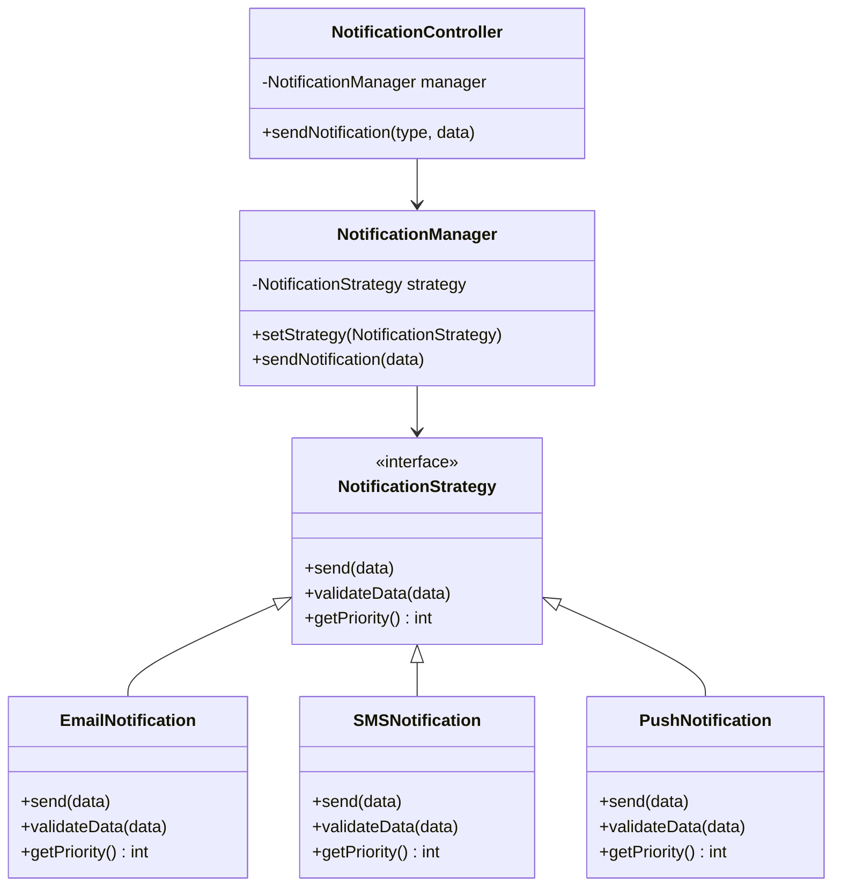
```mermaid
classDiagram
    class NotificationController {
        -NotificationManager manager
        +sendNotification(type, data)
    }
    
    class NotificationManager {
        -NotificationStrategy strategy
        +setStrategy(NotificationStrategy)
        +sendNotification(data)
    }
    
    class NotificationStrategy {
        <<interface>>
        +send(data)
        +validateData(data)
        +getPriority() int
    }
    
    class EmailNotification {
        +send(data)
        +validateData(data)
        +getPriority() int
    }
    
    class SMSNotification {
        +send(data)
        +validateData(data)
        +getPriority() int
    }
    
    class PushNotification {
        +send(data)
        +validateData(data)
        +getPriority() int
    }
    
    NotificationController --> NotificationManager
    NotificationManager --> NotificationStrategy
    NotificationStrategy <|-- EmailNotification
    NotificationStrategy <|-- SMSNotification
    NotificationStrategy <|-- PushNotification
```

## 🔧 Variações do Padrão

### Strategy com Factory

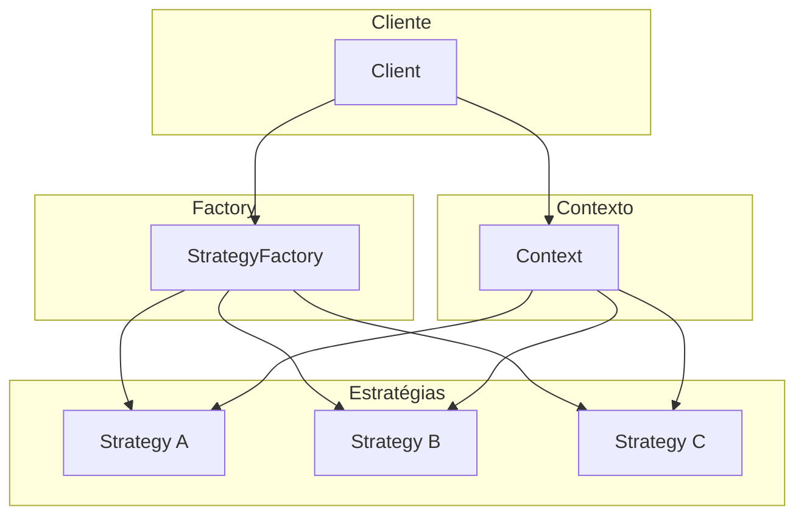
```mermaid
graph TB
    subgraph "Cliente"
        C[Client]
    end
    
    subgraph "Factory"
        F[StrategyFactory]
    end
    
    subgraph "Contexto"
        CTX[Context]
    end
    
    subgraph "Estratégias"
        S1[Strategy A]
        S2[Strategy B]
        S3[Strategy C]
    end
    
    C --> F
    F --> S1
    F --> S2
    F --> S3
    C --> CTX
    CTX --> S1
    CTX --> S2
    CTX --> S3
```

### Strategy com Registry

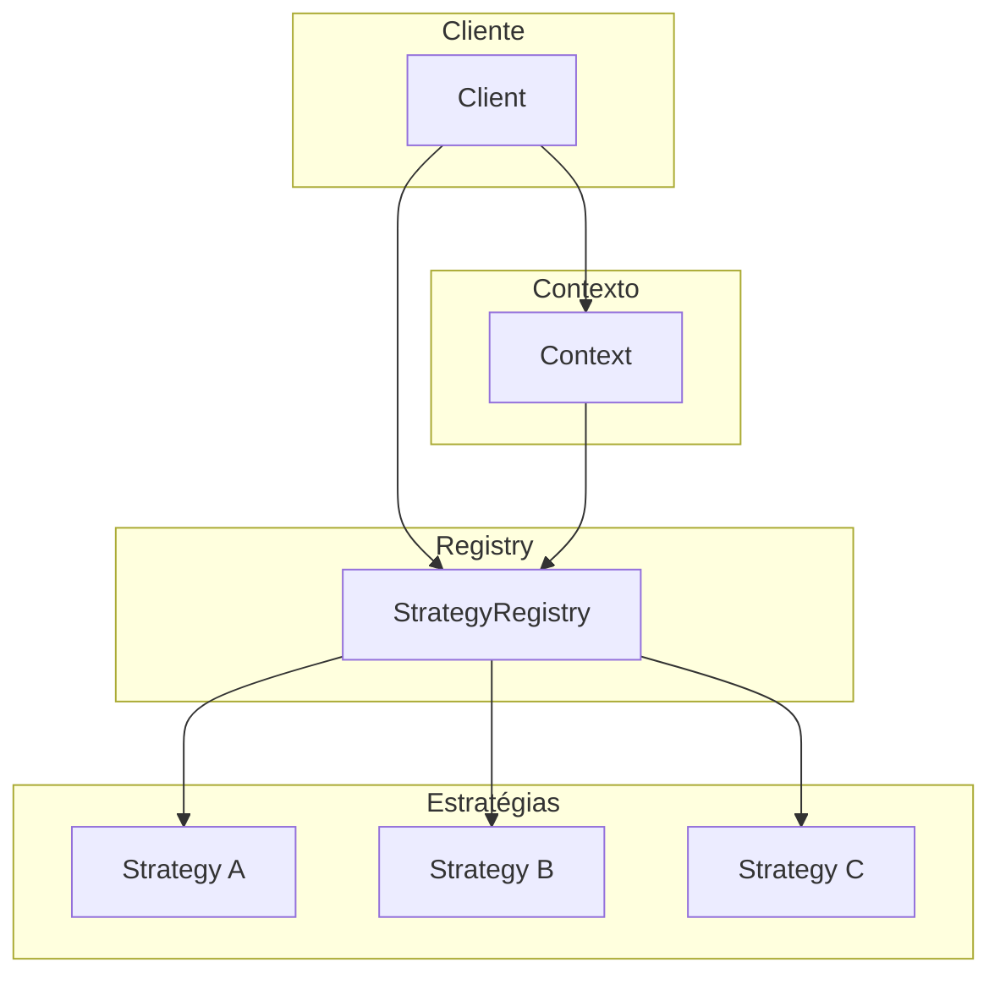
```mermaid
graph TB
    subgraph "Cliente"
        C[Client]
    end
    
    subgraph "Registry"
        R[StrategyRegistry]
    end
    
    subgraph "Contexto"
        CTX[Context]
    end
    
    subgraph "Estratégias"
        S1[Strategy A]
        S2[Strategy B]
        S3[Strategy C]
    end
    
    C --> R
    R --> S1
    R --> S2
    R --> S3
    C --> CTX
    CTX --> R
```

### Strategy com Builder

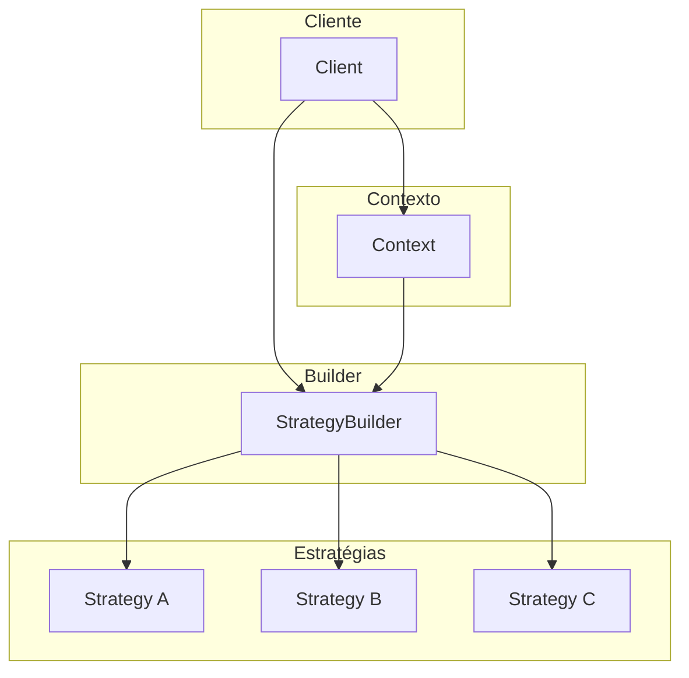
```mermaid
graph TB
    subgraph "Cliente"
        C[Client]
    end
    
    subgraph "Builder"
        B[StrategyBuilder]
    end
    
    subgraph "Contexto"
        CTX[Context]
    end
    
    subgraph "Estratégias"
        S1[Strategy A]
        S2[Strategy B]
        S3[Strategy C]
    end
    
    C --> B
    B --> S1
    B --> S2
    B --> S3
    C --> CTX
    CTX --> B
```

## 📊 Métricas e Monitoramento

### Diagrama de Métricas

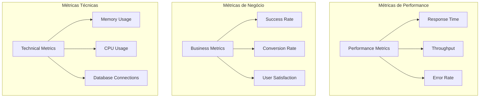
```mermaid
graph TB
    subgraph "Métricas de Performance"
        MP[Performance Metrics]
        MP1[Response Time]
        MP2[Throughput]
        MP3[Error Rate]
    end
    
    subgraph "Métricas de Negócio"
        MB[Business Metrics]
        MB1[Success Rate]
        MB2[Conversion Rate]
        MB3[User Satisfaction]
    end
    
    subgraph "Métricas Técnicas"
        MT[Technical Metrics]
        MT1[Memory Usage]
        MT2[CPU Usage]
        MT3[Database Connections]
    end
    
    MP --> MP1
    MP --> MP2
    MP --> MP3
    
    MB --> MB1
    MB --> MB2
    MB --> MB3
    
    MT --> MT1
    MT --> MT2
    MT --> MT3
```

### Fluxo de Monitoramento

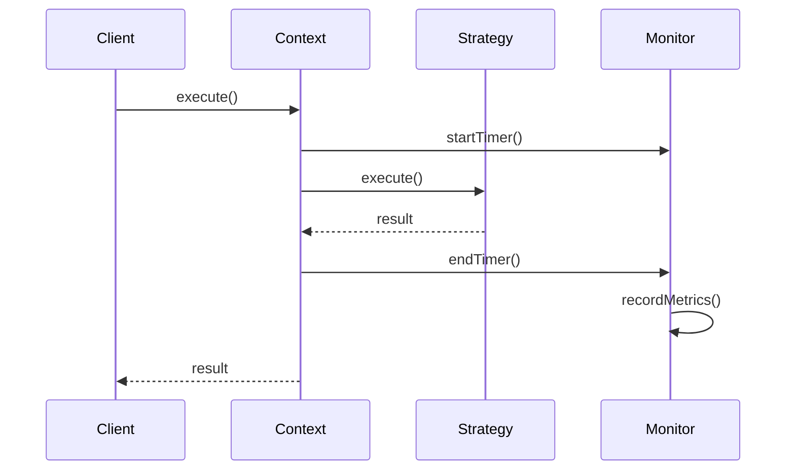
```mermaid
sequenceDiagram
    participant Client
    participant Context
    participant Strategy
    participant Monitor
    
    Client->>Context: execute()
    Context->>Monitor: startTimer()
    Context->>Strategy: execute()
    Strategy-->>Context: result
    Context->>Monitor: endTimer()
    Monitor->>Monitor: recordMetrics()
    Context-->>Client: result
```

## 🎨 Padrões Relacionados

### Strategy + Factory

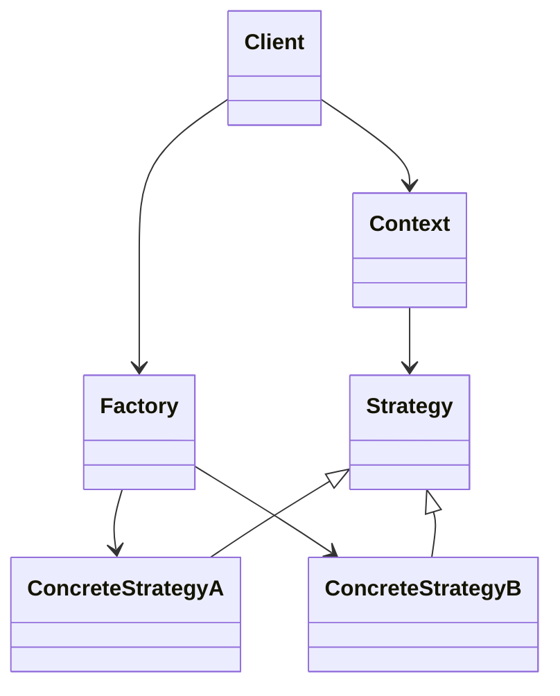
```mermaid
classDiagram
    class Client
    class Factory
    class Context
    class Strategy
    class ConcreteStrategyA
    class ConcreteStrategyB
    
    Client --> Factory
    Factory --> ConcreteStrategyA
    Factory --> ConcreteStrategyB
    Client --> Context
    Context --> Strategy
    Strategy <|-- ConcreteStrategyA
    Strategy <|-- ConcreteStrategyB
```

### Strategy + Template Method

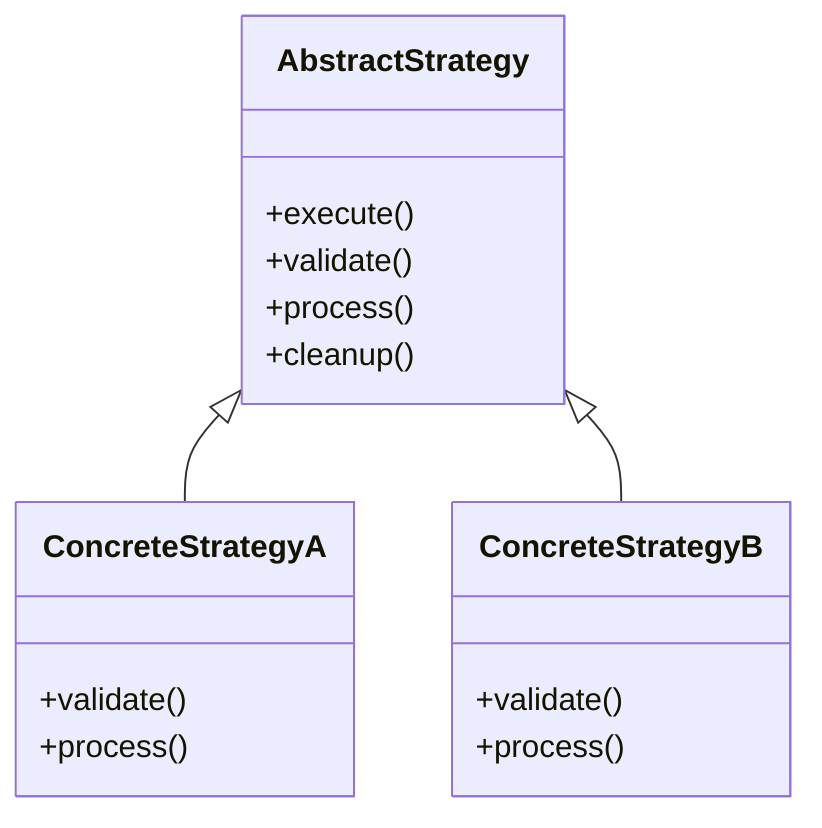
```mermaid
classDiagram
    class AbstractStrategy {
        +execute()
        +validate()
        +process()
        +cleanup()
    }
    
    class ConcreteStrategyA {
        +validate()
        +process()
    }
    
    class ConcreteStrategyB {
        +validate()
        +process()
    }
    
    AbstractStrategy <|-- ConcreteStrategyA
    AbstractStrategy <|-- ConcreteStrategyB
```

### Strategy + Chain of Responsibility

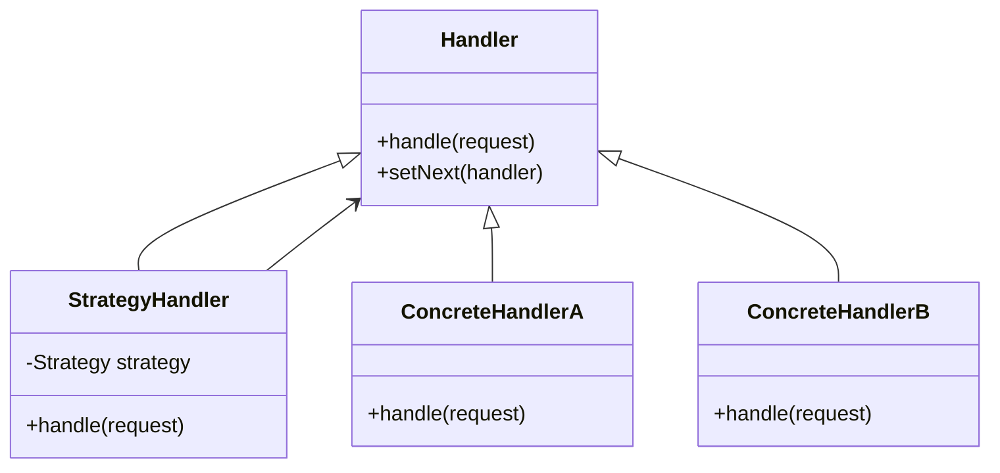
```mermaid
classDiagram
    class Handler {
        +handle(request)
        +setNext(handler)
    }
    
    class StrategyHandler {
        -Strategy strategy
        +handle(request)
    }
    
    class ConcreteHandlerA {
        +handle(request)
    }
    
    class ConcreteHandlerB {
        +handle(request)
    }
    
    Handler <|-- StrategyHandler
    Handler <|-- ConcreteHandlerA
    Handler <|-- ConcreteHandlerB
    StrategyHandler --> Handler
```

## 🔄 Estados e Transições

### Estado das Estratégias

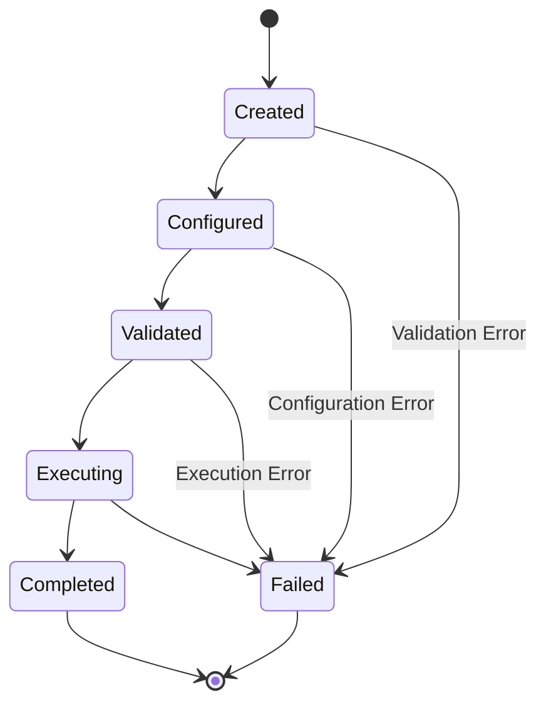
```mermaid
stateDiagram-v2
    [*] --> Created
    Created --> Configured
    Configured --> Validated
    Validated --> Executing
    Executing --> Completed
    Executing --> Failed
    Completed --> [*]
    Failed --> [*]
    
    Created --> Failed : Validation Error
    Configured --> Failed : Configuration Error
    Validated --> Failed : Execution Error
```

### Transições de Contexto

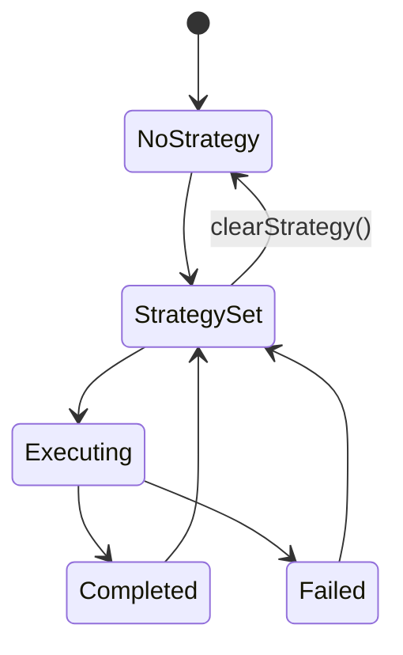
```mermaid
stateDiagram-v2
    [*] --> NoStrategy
    NoStrategy --> StrategySet
    StrategySet --> Executing
    Executing --> Completed
    Executing --> Failed
    Completed --> StrategySet
    Failed --> StrategySet
    StrategySet --> NoStrategy : clearStrategy()
```

## 📈 Evolução do Padrão

### Versão Simples

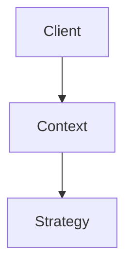
```mermaid
graph TB
    C[Client]
    CTX[Context]
    S[Strategy]
    
    C --> CTX
    CTX --> S
```

### Versão com Factory

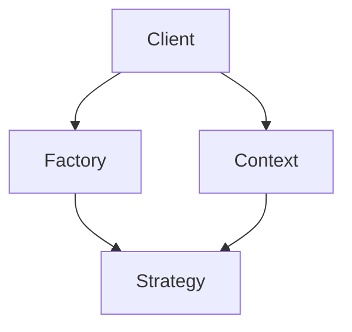
```mermaid
graph TB
    C[Client]
    F[Factory]
    CTX[Context]
    S[Strategy]
    
    C --> F
    F --> S
    C --> CTX
    CTX --> S
```

### Versão com Registry

```mermaid
graph TB
    C[Client]
    R[Registry]
    CTX[Context]
    S[Strategy]
    
    C --> R
    R --> S
    C --> CTX
    CTX --> R
```

### Versão com Builder

```mermaid
graph TB
    C[Client]
    B[Builder]
    CTX[Context]
    S[Strategy]
    
    C --> B
    B --> S
    C --> CTX
    CTX --> B
```

