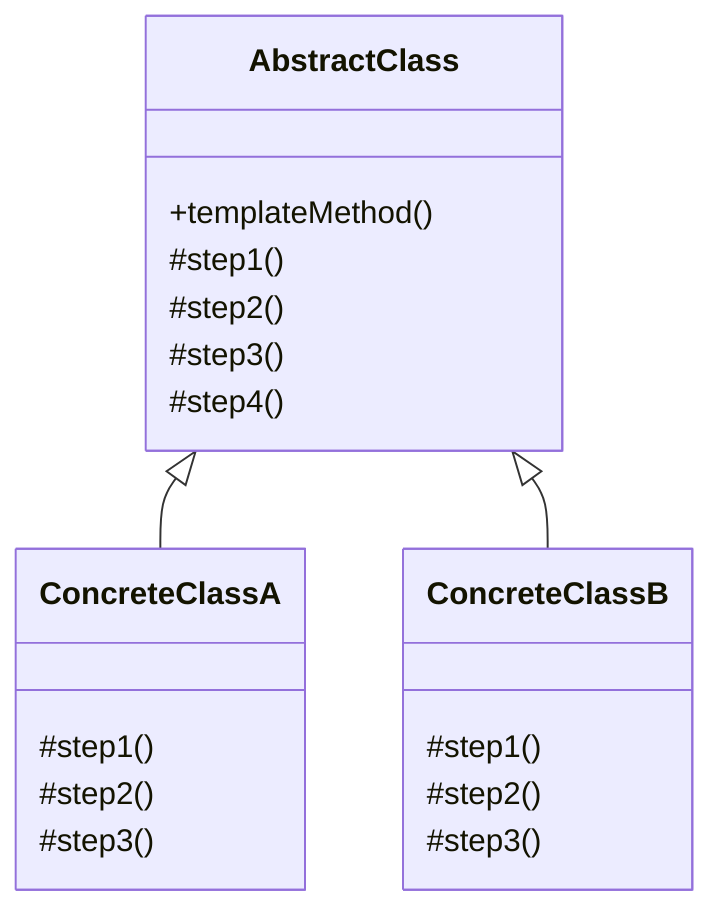

# Padrão Template Method (Método Template)

## 🎯 Visão Geral

O **Padrão Template Method** é um padrão comportamental que define o esqueleto de um algoritmo na superclasse, mas deixa as subclasses sobrescreverem algumas etapas específicas do algoritmo sem alterar a estrutura geral. É um dos padrões mais simples de implementar, porém extremamente poderoso quando o assunto é evitar duplicação de código.

## 🏗️ Características Importantes

### **Padrão Mais Simples de Implementar**
- **Implementação direta** com herança
- **Estrutura clara** e bem definida
- **Fácil de entender** e aplicar
- **Poderoso** para evitar duplicação de código

### **Problema que Resolve**
- **Duplicação de código** em múltiplas classes
- **Manutenção complexa** quando código está espalhado
- **Inconsistência** entre implementações similares
- **Violação do DRY** (Don't Repeat Yourself)

### **Agnóstico de Linguagem**
- **Funciona** em qualquer linguagem de programação
- **Aplicável** em qualquer framework
- **Foco na arquitetura** por trás do padrão
- **Arte de fazer a coisa certa**

## 🚨 Problema que Resolve

### Cenário: Sistema de Mineração de Dados

Imagine uma empresa de mineração de dados que criou um sistema para processar diferentes tipos de documentos.

#### **Linha do Tempo do Problema**

**Versão 1.0**: Sistema para arquivos `.doc`
```php
class DocDataMiner {
    public function mine() {
        $this->openFile();
        $this->extractDocData();
        $this->parseDocData();
        $this->analyzeData();
        $this->sendReport();
    }
}
```

**Versão 2.0**: Adicionado suporte para arquivos `.csv`
```php
class CsvDataMiner {
    public function mine() {
        $this->openFile();
        $this->extractCsvData();
        $this->parseCsvData();
        $this->analyzeData();
        $this->sendReport();
    }
}
```

**Versão 3.0**: Adicionado suporte para arquivos `.pdf`
```php
class PdfDataMiner {
    public function mine() {
        $this->openFile();
        $this->extractPdfData();
        $this->parsePdfData();
        $this->analyzeData();
        $this->sendReport();
    }
}
```

#### 🔥 **Problemas Identificados**

1. **Duplicação de Código**
   - Métodos `analyzeData()` e `sendReport()` são idênticos
   - Mesmo fluxo de execução em todas as classes
   - Violação do princípio DRY

2. **Manutenção Complexa**
   - Alteração em `analyzeData()` requer mudança em 3 lugares
   - Risco de inconsistência entre implementações
   - Dificuldade para lembrar todos os pontos de alteração

3. **Ordem de Execução**
   - Fluxo deve ser respeitado: abrir → extrair → parsear → analisar → enviar
   - Alteração da ordem em uma classe quebra o funcionamento
   - Necessidade de centralizar o controle do fluxo

4. **Novos Desenvolvedores**
   - Risco de esquecer implementar algum método
   - Dificuldade para entender o fluxo completo
   - Possibilidade de quebrar funcionalidades existentes

## 🏗️ Arquitetura da Solução

### Estrutura do Template Method



### Componentes do Padrão

1. **Abstract Class (Classe Abstrata)**
   - Define o template method
   - Implementa métodos comuns
   - Declara métodos abstratos para personalização

2. **Concrete Classes (Classes Concretas)**
   - Implementam métodos abstratos
   - Podem sobrescrever métodos comuns
   - Mantêm a estrutura do algoritmo

3. **Template Method**
   - Define o esqueleto do algoritmo
   - Controla a ordem de execução
   - Centraliza a lógica comum

## ✅ Vantagens

### 1. **Eliminação de Duplicação**
- **Código comum** centralizado na superclasse
- **Manutenção** em um único local
- **Consistência** entre implementações
- **Redução** de bugs por inconsistência

### 2. **Controle de Fluxo**
- **Ordem de execução** garantida
- **Estrutura** do algoritmo preservada
- **Flexibilidade** para personalizações específicas
- **Padronização** do processo

### 3. **Facilidade de Manutenção**
- **Alterações** em um único lugar
- **Novos tipos** fáceis de adicionar
- **Testes** mais simples
- **Documentação** clara do fluxo

### 4. **Extensibilidade**
- **Novas implementações** sem alterar existentes
- **Personalizações** específicas por classe
- **Reutilização** de código comum
- **Flexibilidade** para casos especiais

## ❌ Desvantagens

### 1. **Complexidade de Herança**
- **Hierarquia** pode ficar complexa
- **Acoplamento** forte entre classes
- **Dificuldade** para entender o fluxo completo
- **Debugging** mais complexo

### 2. **Rigidez da Estrutura**
- **Alterações** na estrutura afetam todas as subclasses
- **Flexibilidade** limitada para casos especiais
- **Dificuldade** para quebrar a ordem quando necessário
- **Over-engineering** para casos simples

### 3. **Violação do Princípio de Inversão de Dependência**
- **Dependência** de implementação concreta
- **Dificuldade** para testar isoladamente
- **Acoplamento** com a hierarquia de herança
- **Flexibilidade** limitada para mudanças

### 4. **Dificuldade de Entendimento**
- **Fluxo** não é óbvio para novos desenvolvedores
- **Necessidade** de entender toda a hierarquia
- **Documentação** deve ser muito clara
- **Curva de aprendizado** mais alta

## 🎯 Casos de Uso Comuns

### 1. **Sistemas de Processamento de Dados**
- **Mineração de dados** de diferentes fontes
- **Processamento de arquivos** em formatos diversos
- **Extração de informações** de documentos
- **Análise de dados** com algoritmos similares

### 2. **Sistemas de Relatórios**
- **Geração de relatórios** em diferentes formatos
- **Processamento de dados** para relatórios
- **Envio de relatórios** por diferentes canais
- **Formatação** de dados para apresentação

### 3. **Sistemas de Autenticação**
- **Login** com diferentes provedores
- **Validação** de credenciais
- **Autorização** de usuários
- **Gerenciamento** de sessões

### 4. **Sistemas de Notificação**
- **Envio de notificações** por diferentes canais
- **Formatação** de mensagens
- **Processamento** de destinatários
- **Rastreamento** de entregas

### 5. **Sistemas de Pagamento**
- **Processamento** de diferentes tipos de pagamento
- **Validação** de dados
- **Integração** com gateways
- **Confirmação** de transações

## 🔄 Comparação: Com vs Sem Template Method

### ❌ **Sem Template Method (Problema)**

```php
class DocDataMiner {
    public function mine() {
        $this->openFile();
        $this->extractDocData();
        $this->parseDocData();
        $this->analyzeData(); // Duplicado
        $this->sendReport();  // Duplicado
    }
}

class CsvDataMiner {
    public function mine() {
        $this->openFile();
        $this->extractCsvData();
        $this->parseCsvData();
        $this->analyzeData(); // Duplicado
        $this->sendReport();  // Duplicado
    }
}

class PdfDataMiner {
    public function mine() {
        $this->openFile();
        $this->extractPdfData();
        $this->parsePdfData();
        $this->analyzeData(); // Duplicado
        $this->sendReport();  // Duplicado
    }
}
```

**Problemas:**
- Duplicação de código
- Manutenção complexa
- Risco de inconsistência
- Violação do DRY

### ✅ **Com Template Method (Solução)**

```php
abstract class DataMiner {
    // Template Method - define o esqueleto
    public function mine() {
        $this->openFile();
        $this->extractData();
        $this->parseData();
        $this->analyzeData(); // Implementação comum
        $this->sendReport();  // Implementação comum
    }
    
    // Métodos abstratos para personalização
    abstract protected function openFile(): string;
    abstract protected function extractData(string $fileContent): array;
    abstract protected function parseData(array $rawData): array;
    
    // Implementações comuns
    protected function analyzeData(): void {
        // Lógica comum de análise
    }
    
    protected function sendReport(): void {
        // Lógica comum de envio
    }
}

class DocDataMiner extends DataMiner {
    protected function openFile(): string {
        // Implementação específica para DOC
    }
    
    protected function extractData(string $fileContent): array {
        // Implementação específica para DOC
    }
    
    protected function parseData(array $rawData): array {
        // Implementação específica para DOC
    }
}
```

**Benefícios:**
- Eliminação de duplicação
- Manutenção centralizada
- Controle de fluxo garantido
- Facilidade para adicionar novos tipos

## 🛠️ Boas Práticas

### 1. **Use Template Method Quando:**
- **Múltiplas classes** com algoritmos similares
- **Duplicação de código** é um problema
- **Ordem de execução** deve ser controlada
- **Manutenção** centralizada é desejada

### 2. **Evite Template Method Quando:**
- **Apenas uma implementação** é necessária
- **Algoritmos são muito diferentes**
- **Flexibilidade** extrema é necessária
- **Over-engineering** para casos simples

### 3. **Implementação Correta:**
- **Template method** deve ser final
- **Métodos abstratos** bem definidos
- **Documentação** clara do fluxo
- **Testes** para cada implementação

### 4. **Cuidados com Herança:**
- **Use herança** com sabedoria
- **Evite** hierarquias muito profundas
- **Considere** composição como alternativa
- **Documente** bem o comportamento

## 🔧 Extensões Avançadas

### 1. **Template Method com Hooks**
- **Métodos opcionais** para personalização
- **Hooks** para pontos específicos
- **Flexibilidade** sem quebrar a estrutura
- **Implementação** gradual de funcionalidades

### 2. **Template Method com Strategy**
- **Algoritmos** intercambiáveis
- **Flexibilidade** para diferentes estratégias
- **Composição** em vez de herança
- **Testabilidade** melhorada

### 3. **Template Method com Observer**
- **Notificações** em pontos específicos
- **Desacoplamento** entre componentes
- **Flexibilidade** para extensões
- **Manutenibilidade** melhorada

### 4. **Template Method com Factory**
- **Criação** de objetos específicos
- **Encapsulamento** da lógica de criação
- **Flexibilidade** para diferentes tipos
- **Reutilização** de código comum

## 📊 Quando Usar Template Method

### **Indicadores Positivos**
- **Algoritmos similares** em múltiplas classes
- **Duplicação de código** é um problema
- **Ordem de execução** deve ser controlada
- **Manutenção centralizada** é desejada

### **Indicadores Negativos**
- **Apenas uma implementação** necessária
- **Algoritmos muito diferentes**
- **Flexibilidade extrema** necessária
- **Over-engineering** para casos simples

### **Alternativas**
- **Strategy Pattern** para algoritmos intercambiáveis
- **Command Pattern** para operações complexas
- **Chain of Responsibility** para processamento sequencial
- **Composition** em vez de herança

## 🎯 Conclusão

O padrão Template Method é uma solução elegante para eliminar duplicação de código quando múltiplas classes seguem o mesmo algoritmo com pequenas variações. É especialmente útil em sistemas legados onde a duplicação já existe e precisa ser refatorada.

**Use quando:** Múltiplas classes com algoritmos similares, duplicação de código é problema
**Evite quando:** Apenas uma implementação, algoritmos muito diferentes, over-engineering
**Lembre-se:** É herança com propósito - use com sabedoria para não criar complexidade desnecessária


