# Diagramas - Padrão Template Method

## 🏗️ Arquitetura Geral

### Estrutura de Classes

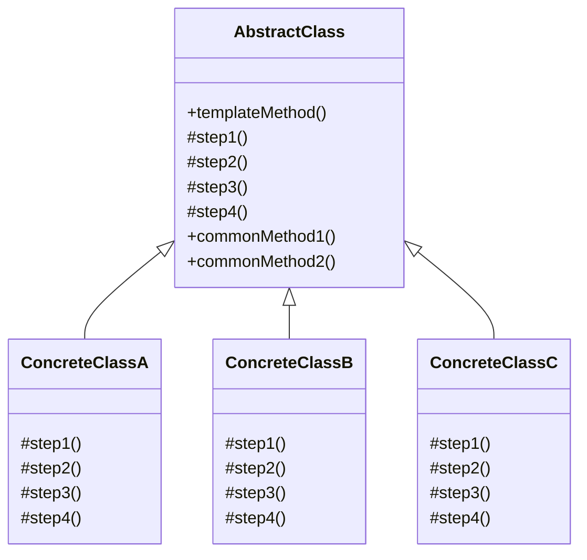
```mermaid
classDiagram
    class AbstractClass {
        +templateMethod()
        #step1()
        #step2()
        #step3()
        #step4()
        +commonMethod1()
        +commonMethod2()
    }
    
    class ConcreteClassA {
        #step1()
        #step2()
        #step3()
        #step4()
    }
    
    class ConcreteClassB {
        #step1()
        #step2()
        #step3()
        #step4()
    }
    
    class ConcreteClassC {
        #step1()
        #step2()
        #step3()
        #step4()
    }
    
    AbstractClass <|-- ConcreteClassA
    AbstractClass <|-- ConcreteClassB
    AbstractClass <|-- ConcreteClassC
```

### Diagrama de Componentes

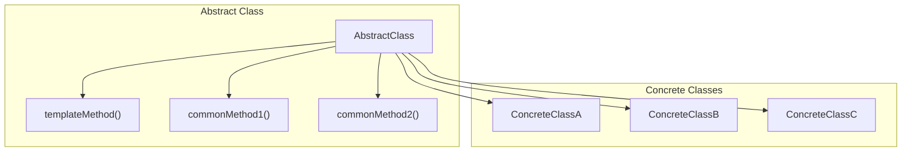
```mermaid
graph TB
    subgraph "Abstract Class"
        AC[AbstractClass]
        AC --> TM["templateMethod()"]
        AC --> CM1["commonMethod1()"]
        AC --> CM2["commonMethod2()"]
    end
    
    subgraph "Concrete Classes"
        CC1[ConcreteClassA]
        CC2[ConcreteClassB]
        CC3[ConcreteClassC]
    end
    
    AC --> CC1
    AC --> CC2
    AC --> CC3
```

## 🔄 Fluxos de Funcionamento

### Fluxo Básico do Template Method

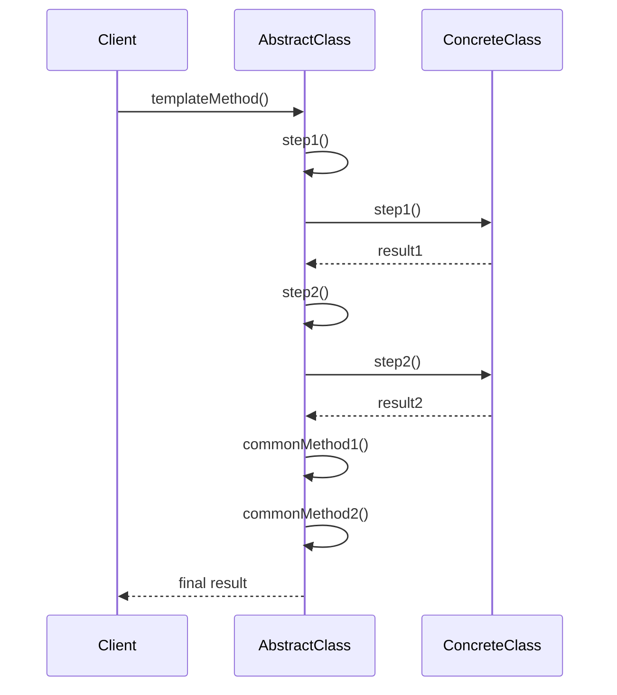
```mermaid
sequenceDiagram
    participant Client
    participant AbstractClass
    participant ConcreteClass
    
    Client->>AbstractClass: templateMethod()
    AbstractClass->>AbstractClass: step1()
    AbstractClass->>ConcreteClass: step1()
    ConcreteClass-->>AbstractClass: result1
    
    AbstractClass->>AbstractClass: step2()
    AbstractClass->>ConcreteClass: step2()
    ConcreteClass-->>AbstractClass: result2
    
    AbstractClass->>AbstractClass: commonMethod1()
    AbstractClass->>AbstractClass: commonMethod2()
    
    AbstractClass-->>Client: final result
```

### Fluxo com Validação e Tratamento de Erros

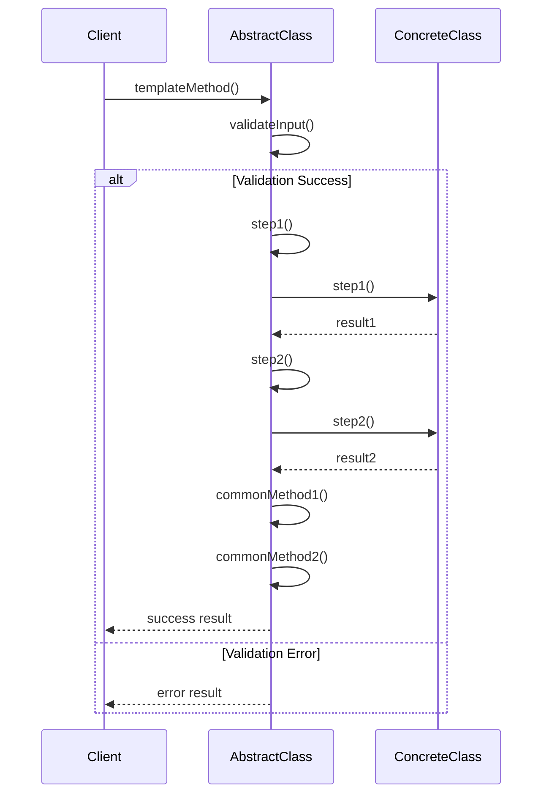
```mermaid
sequenceDiagram
    participant Client
    participant AbstractClass
    participant ConcreteClass
    
    Client->>AbstractClass: templateMethod()
    
    AbstractClass->>AbstractClass: validateInput()
    
    alt Validation Success
        AbstractClass->>AbstractClass: step1()
        AbstractClass->>ConcreteClass: step1()
        ConcreteClass-->>AbstractClass: result1
        
        AbstractClass->>AbstractClass: step2()
        AbstractClass->>ConcreteClass: step2()
        ConcreteClass-->>AbstractClass: result2
        
        AbstractClass->>AbstractClass: commonMethod1()
        AbstractClass->>AbstractClass: commonMethod2()
        
        AbstractClass-->>Client: success result
    else Validation Error
        AbstractClass-->>Client: error result
    end
```

### Fluxo de Extensibilidade

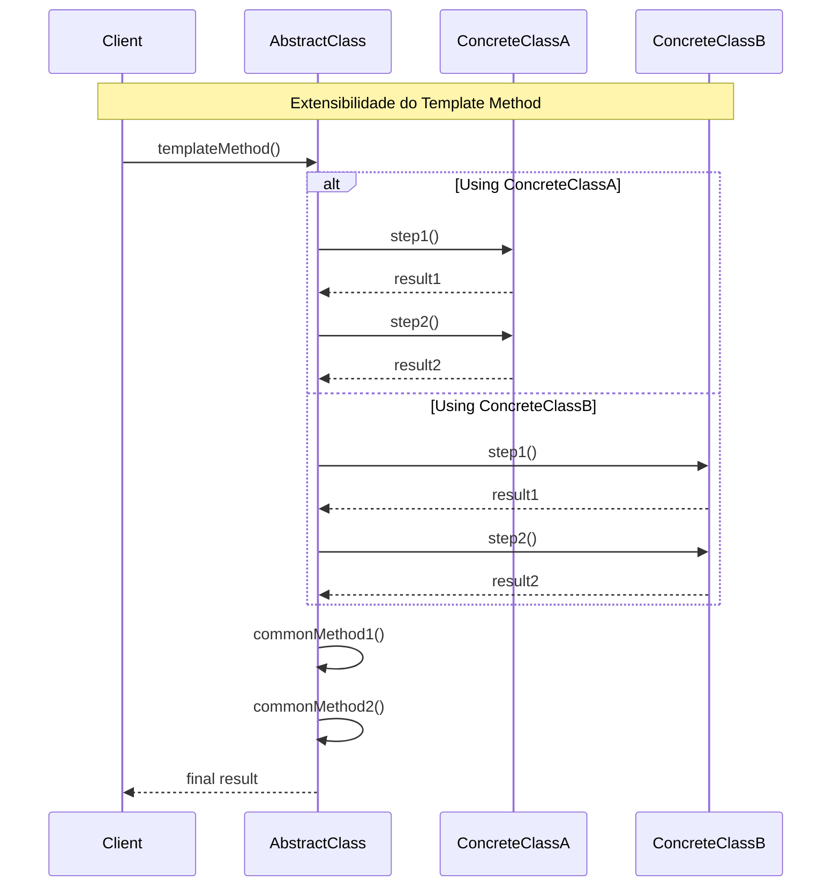
```mermaid
sequenceDiagram
    participant Client
    participant AbstractClass
    participant ConcreteClassA
    participant ConcreteClassB
    
    Note over Client, ConcreteClassB: Extensibilidade do Template Method
    
    Client->>AbstractClass: templateMethod()
    
    alt Using ConcreteClassA
        AbstractClass->>ConcreteClassA: step1()
        ConcreteClassA-->>AbstractClass: result1
        AbstractClass->>ConcreteClassA: step2()
        ConcreteClassA-->>AbstractClass: result2
    else Using ConcreteClassB
        AbstractClass->>ConcreteClassB: step1()
        ConcreteClassB-->>AbstractClass: result1
        AbstractClass->>ConcreteClassB: step2()
        ConcreteClassB-->>AbstractClass: result2
    end
    
    AbstractClass->>AbstractClass: commonMethod1()
    AbstractClass->>AbstractClass: commonMethod2()
    
    AbstractClass-->>Client: final result
```

## 🎯 Casos de Uso Específicos

### Sistema de Mineração de Dados

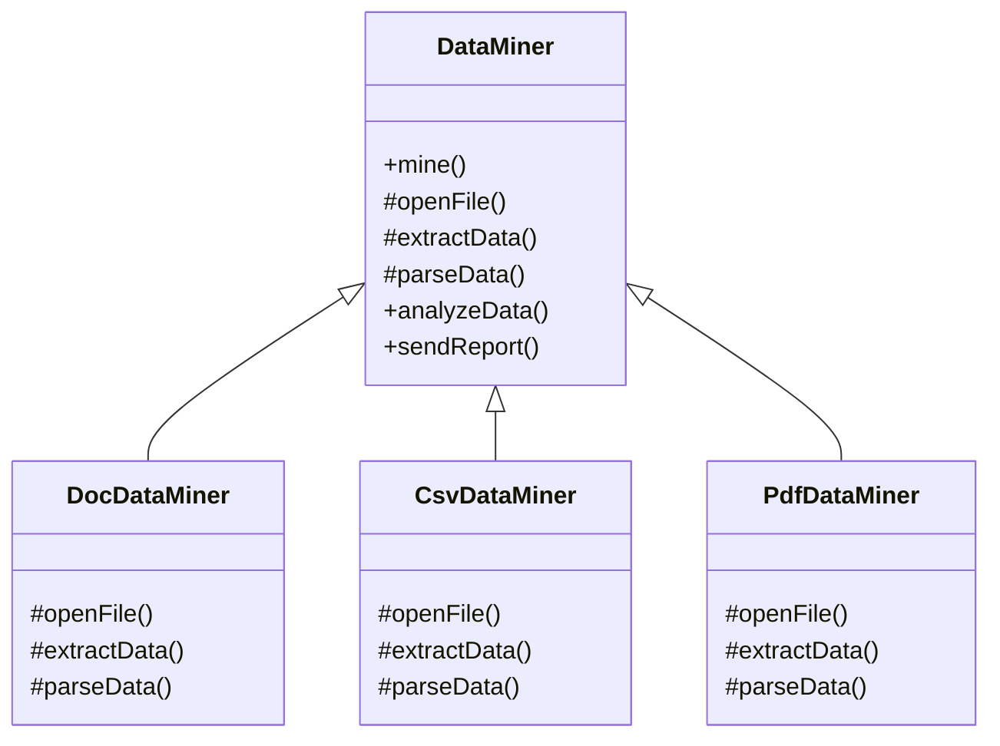
```mermaid
classDiagram
    class DataMiner {
        +mine()
        #openFile()
        #extractData()
        #parseData()
        +analyzeData()
        +sendReport()
    }
    
    class DocDataMiner {
        #openFile()
        #extractData()
        #parseData()
    }
    
    class CsvDataMiner {
        #openFile()
        #extractData()
        #parseData()
    }
    
    class PdfDataMiner {
        #openFile()
        #extractData()
        #parseData()
    }
    
    DataMiner <|-- DocDataMiner
    DataMiner <|-- CsvDataMiner
    DataMiner <|-- PdfDataMiner
```

### Sistema de Relatórios

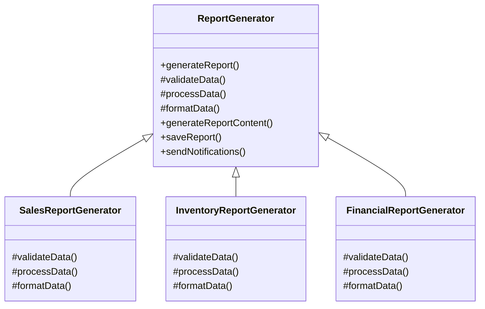
```mermaid
classDiagram
    class ReportGenerator {
        +generateReport()
        #validateData()
        #processData()
        #formatData()
        +generateReportContent()
        +saveReport()
        +sendNotifications()
    }
    
    class SalesReportGenerator {
        #validateData()
        #processData()
        #formatData()
    }
    
    class InventoryReportGenerator {
        #validateData()
        #processData()
        #formatData()
    }
    
    class FinancialReportGenerator {
        #validateData()
        #processData()
        #formatData()
    }
    
    ReportGenerator <|-- SalesReportGenerator
    ReportGenerator <|-- InventoryReportGenerator
    ReportGenerator <|-- FinancialReportGenerator
```

### Sistema de Autenticação

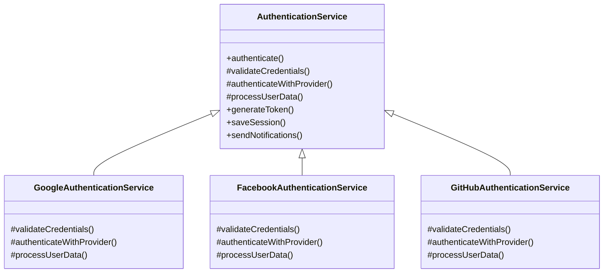
```mermaid
classDiagram
    class AuthenticationService {
        +authenticate()
        #validateCredentials()
        #authenticateWithProvider()
        #processUserData()
        +generateToken()
        +saveSession()
        +sendNotifications()
    }
    
    class GoogleAuthenticationService {
        #validateCredentials()
        #authenticateWithProvider()
        #processUserData()
    }
    
    class FacebookAuthenticationService {
        #validateCredentials()
        #authenticateWithProvider()
        #processUserData()
    }
    
    class GitHubAuthenticationService {
        #validateCredentials()
        #authenticateWithProvider()
        #processUserData()
    }
    
    AuthenticationService <|-- GoogleAuthenticationService
    AuthenticationService <|-- FacebookAuthenticationService
    AuthenticationService <|-- GitHubAuthenticationService
```

## 🔧 Variações do Padrão

### Template Method com Hooks

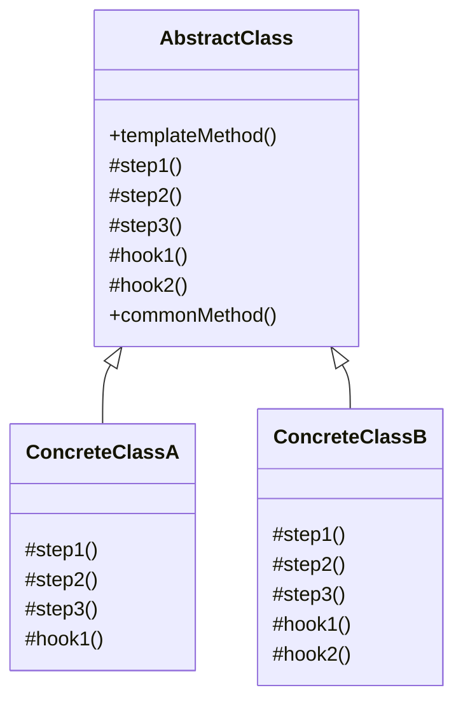
```mermaid
classDiagram
    class AbstractClass {
        +templateMethod()
        #step1()
        #step2()
        #step3()
        #hook1()
        #hook2()
        +commonMethod()
    }
    
    class ConcreteClassA {
        #step1()
        #step2()
        #step3()
        #hook1()
    }
    
    class ConcreteClassB {
        #step1()
        #step2()
        #step3()
        #hook1()
        #hook2()
    }
    
    AbstractClass <|-- ConcreteClassA
    AbstractClass <|-- ConcreteClassB
```

### Template Method com Strategy

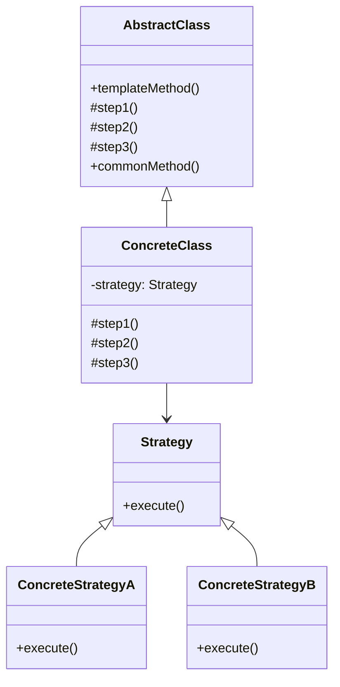
```mermaid
classDiagram
    class AbstractClass {
        +templateMethod()
        #step1()
        #step2()
        #step3()
        +commonMethod()
    }
    
    class Strategy {
        +execute()
    }
    
    class ConcreteStrategyA {
        +execute()
    }
    
    class ConcreteStrategyB {
        +execute()
    }
    
    class ConcreteClass {
        #step1()
        #step2()
        #step3()
        -strategy: Strategy
    }
    
    AbstractClass <|-- ConcreteClass
    Strategy <|-- ConcreteStrategyA
    Strategy <|-- ConcreteStrategyB
    ConcreteClass --> Strategy
```

### Template Method com Observer

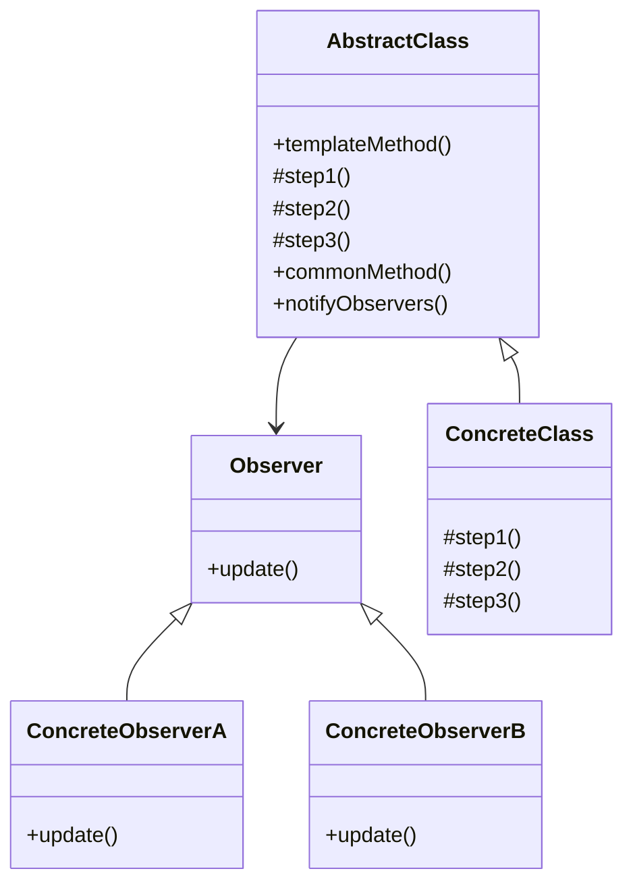
```mermaid
classDiagram
    class AbstractClass {
        +templateMethod()
        #step1()
        #step2()
        #step3()
        +commonMethod()
        +notifyObservers()
    }
    
    class Observer {
        +update()
    }
    
    class ConcreteObserverA {
        +update()
    }
    
    class ConcreteObserverB {
        +update()
    }
    
    class ConcreteClass {
        #step1()
        #step2()
        #step3()
    }
    
    AbstractClass <|-- ConcreteClass
    AbstractClass --> Observer
    Observer <|-- ConcreteObserverA
    Observer <|-- ConcreteObserverB
```

### Template Method com Factory

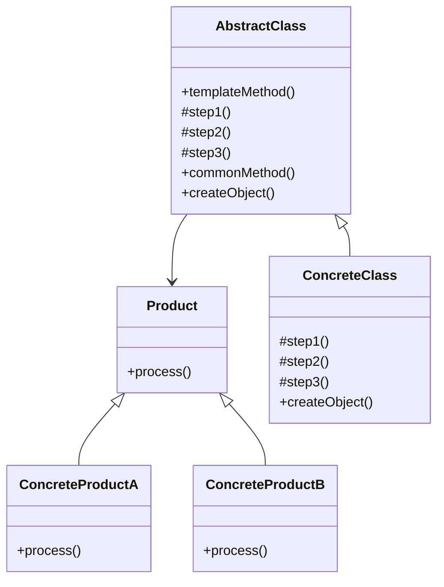
```mermaid
classDiagram
    class AbstractClass {
        +templateMethod()
        #step1()
        #step2()
        #step3()
        +commonMethod()
        +createObject()
    }
    
    class Product {
        +process()
    }
    
    class ConcreteProductA {
        +process()
    }
    
    class ConcreteProductB {
        +process()
    }
    
    class ConcreteClass {
        #step1()
        #step2()
        #step3()
        +createObject()
    }
    
    AbstractClass <|-- ConcreteClass
    AbstractClass --> Product
    Product <|-- ConcreteProductA
    Product <|-- ConcreteProductB
```

## 📊 Estados e Transições

### Estado do Template Method

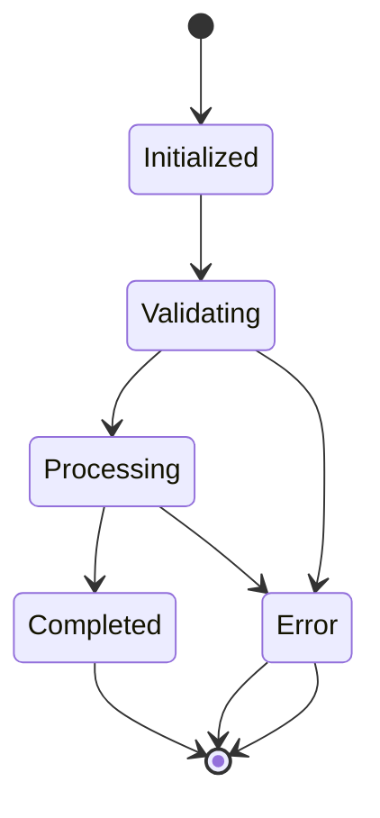
```mermaid
stateDiagram-v2
    [*] --> Initialized
    Initialized --> Validating
    Validating --> Processing
    Processing --> Completed
    Completed --> [*]
    
    Validating --> Error
    Error --> [*]
    
    Processing --> Error
    Error --> [*]
```

### Estado das Classes Concretas

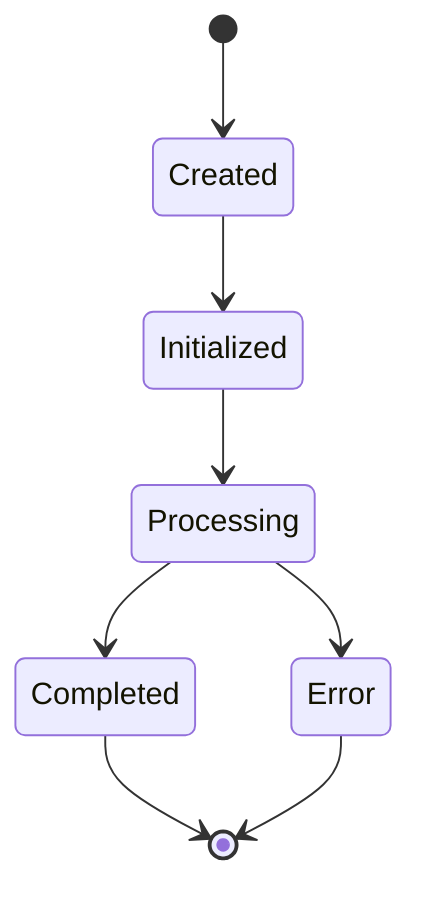
```mermaid
stateDiagram-v2
    [*] --> Created
    Created --> Initialized
    Initialized --> Processing
    Processing --> Completed
    Completed --> [*]
    
    Processing --> Error
    Error --> [*]
```

### Transições de Métodos

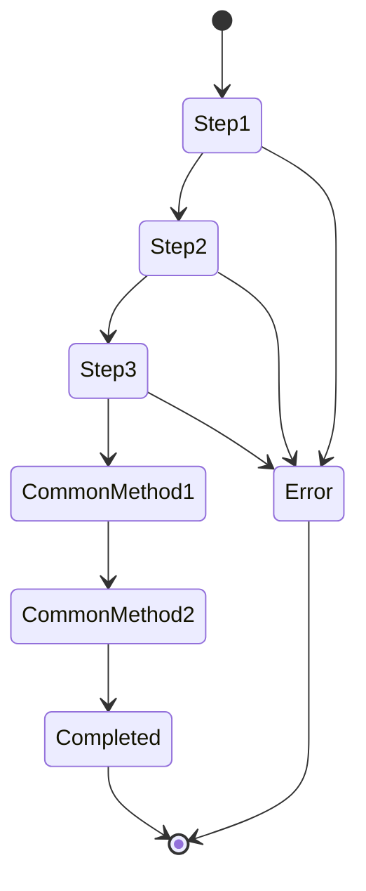
```mermaid
stateDiagram-v2
    [*] --> Step1
    Step1 --> Step2
    Step2 --> Step3
    Step3 --> CommonMethod1
    CommonMethod1 --> CommonMethod2
    CommonMethod2 --> Completed
    Completed --> [*]
    
    Step1 --> Error
    Step2 --> Error
    Step3 --> Error
    Error --> [*]
```

## 🔄 Fluxos de Erro

### Tratamento de Erros

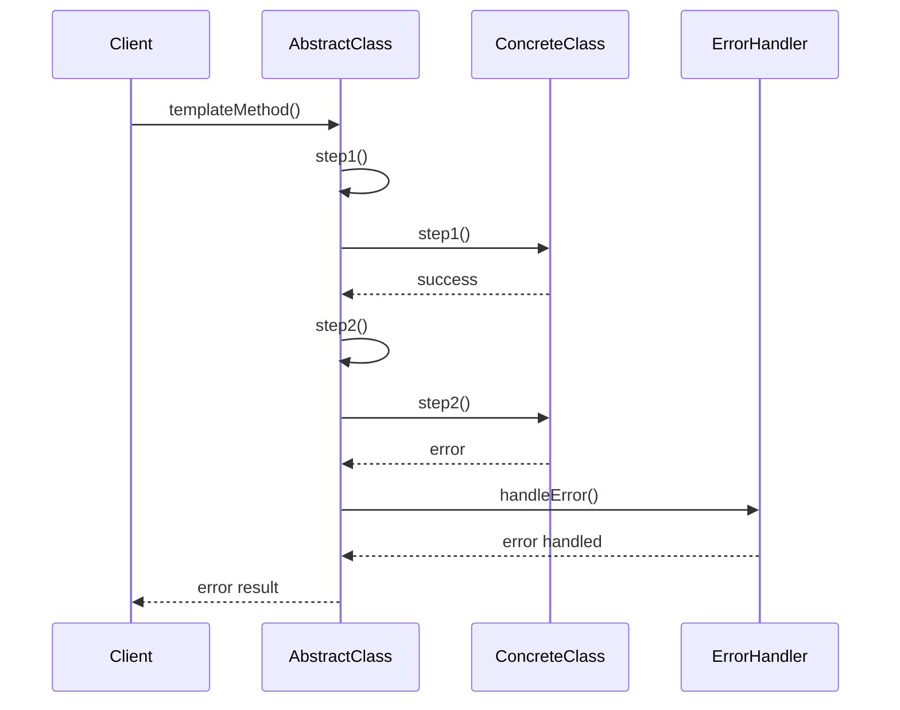
```mermaid
sequenceDiagram
    participant Client
    participant AbstractClass
    participant ConcreteClass
    participant ErrorHandler
    
    Client->>AbstractClass: templateMethod()
    
    AbstractClass->>AbstractClass: step1()
    AbstractClass->>ConcreteClass: step1()
    ConcreteClass-->>AbstractClass: success
    
    AbstractClass->>AbstractClass: step2()
    AbstractClass->>ConcreteClass: step2()
    ConcreteClass-->>AbstractClass: error
    AbstractClass->>ErrorHandler: handleError()
    ErrorHandler-->>AbstractClass: error handled
    
    AbstractClass-->>Client: error result
```

### Validação de Entrada

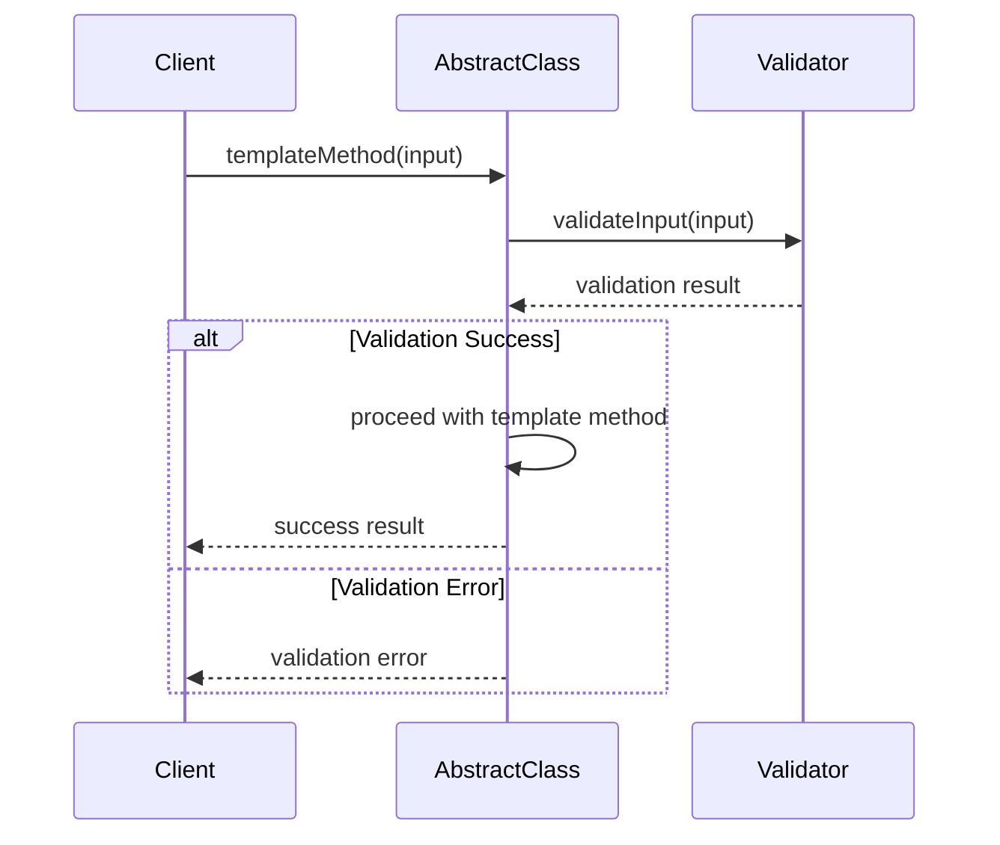
```mermaid
sequenceDiagram
    participant Client
    participant AbstractClass
    participant Validator
    
    Client->>AbstractClass: templateMethod(input)
    
    AbstractClass->>Validator: validateInput(input)
    Validator-->>AbstractClass: validation result
    
    alt Validation Success
        AbstractClass->>AbstractClass: proceed with template method
        AbstractClass-->>Client: success result
    else Validation Error
        AbstractClass-->>Client: validation error
    end
```

### Rollback em Caso de Erro

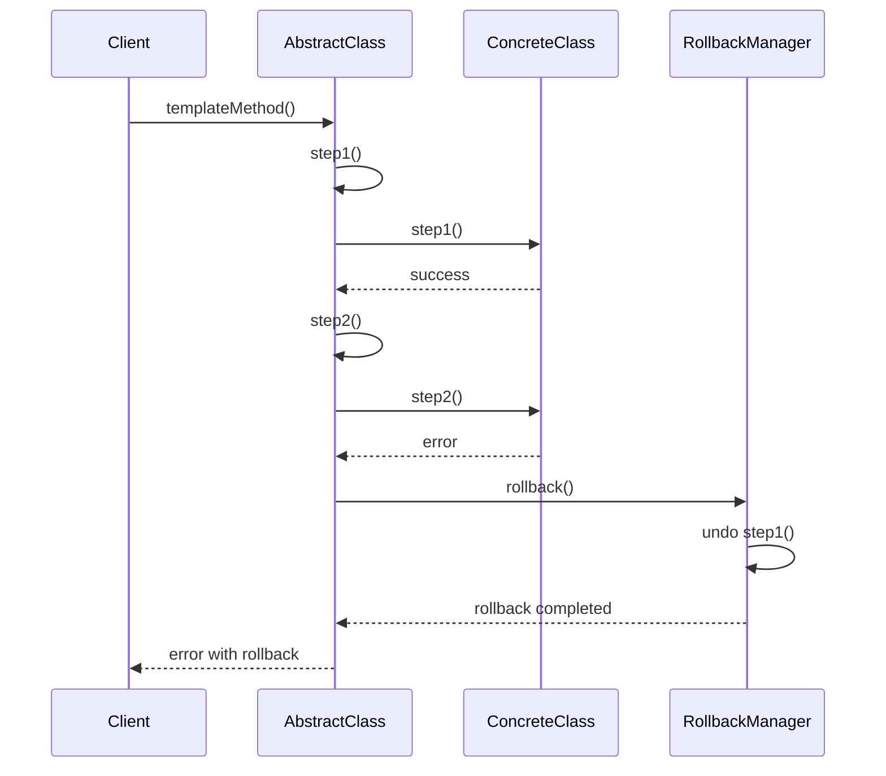
```mermaid
sequenceDiagram
    participant Client
    participant AbstractClass
    participant ConcreteClass
    participant RollbackManager
    
    Client->>AbstractClass: templateMethod()
    
    AbstractClass->>AbstractClass: step1()
    AbstractClass->>ConcreteClass: step1()
    ConcreteClass-->>AbstractClass: success
    
    AbstractClass->>AbstractClass: step2()
    AbstractClass->>ConcreteClass: step2()
    ConcreteClass-->>AbstractClass: error
    
    AbstractClass->>RollbackManager: rollback()
    RollbackManager->>RollbackManager: undo step1()
    RollbackManager-->>AbstractClass: rollback completed
    
    AbstractClass-->>Client: error with rollback
```

## 🎨 Padrões Relacionados

### Template Method + Strategy

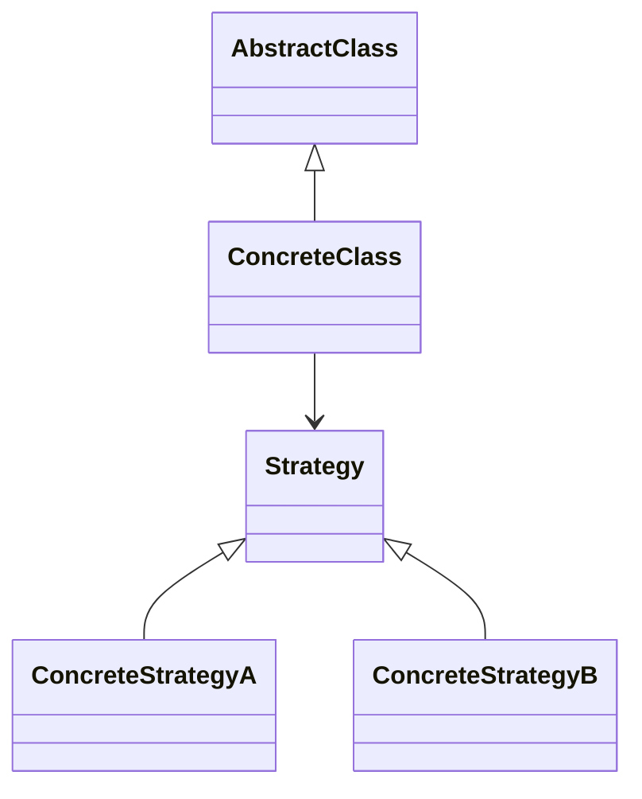
```mermaid
classDiagram
    class AbstractClass
    class Strategy
    class ConcreteStrategyA
    class ConcreteStrategyB
    class ConcreteClass
    
    AbstractClass <|-- ConcreteClass
    ConcreteClass --> Strategy
    Strategy <|-- ConcreteStrategyA
    Strategy <|-- ConcreteStrategyB
```

### Template Method + Observer

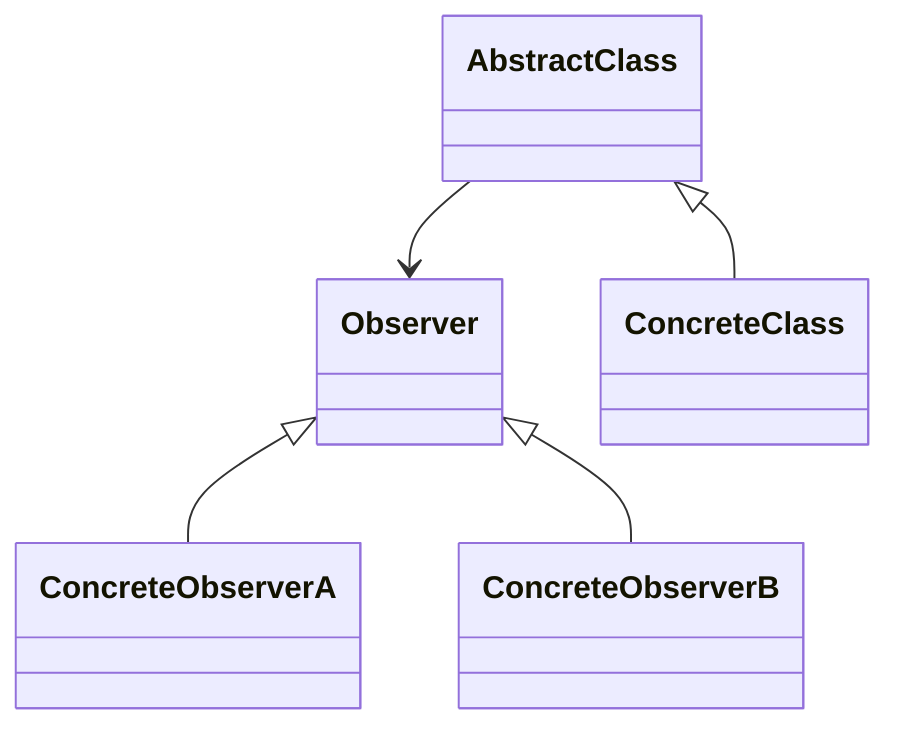
```mermaid
classDiagram
    class AbstractClass
    class Observer
    class ConcreteObserverA
    class ConcreteObserverB
    class ConcreteClass
    
    AbstractClass <|-- ConcreteClass
    AbstractClass --> Observer
    Observer <|-- ConcreteObserverA
    Observer <|-- ConcreteObserverB
```

### Template Method + Factory

```mermaid
classDiagram
    class AbstractClass
    class Product
    class ConcreteProductA
    class ConcreteProductB
    class ConcreteClass
    
    AbstractClass <|-- ConcreteClass
    AbstractClass --> Product
    Product <|-- ConcreteProductA
    Product <|-- ConcreteProductB
```

## 📈 Métricas e Monitoramento

### Diagrama de Métricas

```mermaid
graph TB
    subgraph "Métricas de Performance"
        MP[Performance Metrics]
        MP1[Execution Time]
        MP2[Memory Usage]
        MP3[Error Rate]
    end
    
    subgraph "Métricas de Negócio"
        MB[Business Metrics]
        MB1[Success Rate]
        MB2[User Satisfaction]
        MB3[System Health]
    end
    
    subgraph "Métricas Técnicas"
        MT[Technical Metrics]
        MT1[Code Coverage]
        MT2[Test Coverage]
        MT3[Maintainability]
    end
    
    MP --> MP1
    MP --> MP2
    MP --> MP3
    
    MB --> MB1
    MB --> MB2
    MB --> MB3
    
    MT --> MT1
    MT --> MT2
    MT --> MT3
```

### Fluxo de Monitoramento

```mermaid
sequenceDiagram
    participant Client
    participant AbstractClass
    participant Monitor
    participant Metrics
    
    Client->>AbstractClass: templateMethod()
    AbstractClass->>Monitor: startTimer()
    
    AbstractClass->>AbstractClass: execute steps
    AbstractClass->>Monitor: endTimer()
    
    Monitor->>Metrics: recordMetrics()
    Metrics-->>Monitor: metrics recorded
    
    AbstractClass-->>Client: result
```

## 🔄 Evolução do Padrão

### Versão Simples

```mermaid
graph TB
    AC[Abstract Class]
    CC[Concrete Class]
    
    AC --> CC
```

### Versão com Hooks

```mermaid
graph TB
    AC[Abstract Class]
    H1[Hook 1]
    H2[Hook 2]
    CC[Concrete Class]
    
    AC --> H1
    AC --> H2
    AC --> CC
```

### Versão com Strategy

```mermaid
graph TB
    AC[Abstract Class]
    S[Strategy]
    CC[Concrete Class]
    
    AC --> S
    AC --> CC
    S --> CC
```

### Versão com Observer

```mermaid
graph TB
    AC[Abstract Class]
    O[Observer]
    CC[Concrete Class]
    
    AC --> O
    AC --> CC
    O --> CC
```

## 🎯 Comparação com Outros Padrões

### Template Method vs Strategy

```mermaid
graph TB
    subgraph "Template Method"
        TM[Abstract Class]
        TMC[Concrete Class]
    end
    
    subgraph "Strategy"
        S[Strategy Interface]
        SC[Concrete Strategy]
        C[Context]
    end
    
    TM --> TMC
    S --> SC
    C --> S
```

### Template Method vs Factory

```mermaid
graph TB
    subgraph "Template Method"
        TM[Abstract Class]
        TMC[Concrete Class]
    end
    
    subgraph "Factory"
        F[Factory Interface]
        FC[Concrete Factory]
        P[Product]
    end
    
    TM --> TMC
    F --> FC
    FC --> P
```

### Template Method vs Command

```mermaid
graph TB
    subgraph "Template Method"
        TM[Abstract Class]
        TMC[Concrete Class]
    end
    
    subgraph "Command"
        C[Command Interface]
        CC[Concrete Command]
        I[Invoker]
    end
    
    TM --> TMC
    C --> CC
    I --> C
```

## 🔧 Implementação Avançada

### Template Method com Dependency Injection

```mermaid
classDiagram
    class AbstractClass {
        +templateMethod()
        #step1()
        #step2()
        #step3()
        +commonMethod()
        -dependency: Dependency
    }
    
    class Dependency {
        +execute()
    }
    
    class ConcreteDependencyA {
        +execute()
    }
    
    class ConcreteDependencyB {
        +execute()
    }
    
    class ConcreteClass {
        #step1()
        #step2()
        #step3()
    }
    
    AbstractClass <|-- ConcreteClass
    AbstractClass --> Dependency
    Dependency <|-- ConcreteDependencyA
    Dependency <|-- ConcreteDependencyB
```

### Template Method com Builder

```mermaid
classDiagram
    class AbstractClass {
        +templateMethod()
        #step1()
        #step2()
        #step3()
        +commonMethod()
        +build()
    }
    
    class Builder {
        +build()
    }
    
    class ConcreteBuilderA {
        +build()
    }
    
    class ConcreteBuilderB {
        +build()
    }
    
    class ConcreteClass {
        #step1()
        #step2()
        #step3()
    }
    
    AbstractClass <|-- ConcreteClass
    AbstractClass --> Builder
    Builder <|-- ConcreteBuilderA
    Builder <|-- ConcreteBuilderB
```

### Template Method com Chain of Responsibility

```mermaid
classDiagram
    class AbstractClass {
        +templateMethod()
        #step1()
        #step2()
        #step3()
        +commonMethod()
        +handleRequest()
    }
    
    class Handler {
        +handleRequest()
        +setNext()
    }
    
    class ConcreteHandlerA {
        +handleRequest()
    }
    
    class ConcreteHandlerB {
        +handleRequest()
    }
    
    class ConcreteClass {
        #step1()
        #step2()
        #step3()
    }
    
    AbstractClass <|-- ConcreteClass
    AbstractClass --> Handler
    Handler <|-- ConcreteHandlerA
    Handler <|-- ConcreteHandlerB
    ConcreteHandlerA --> ConcreteHandlerB
```

