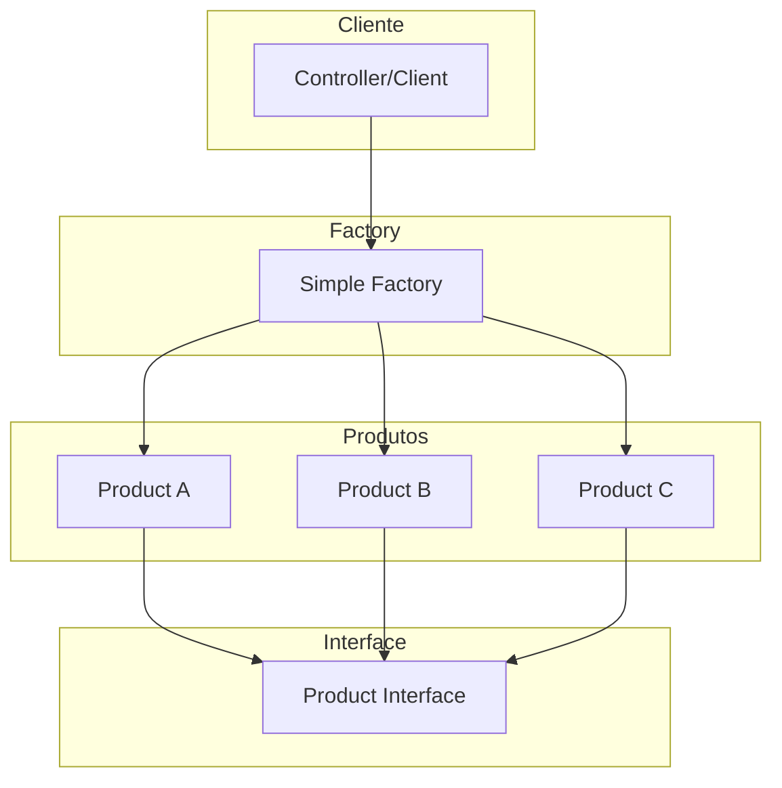
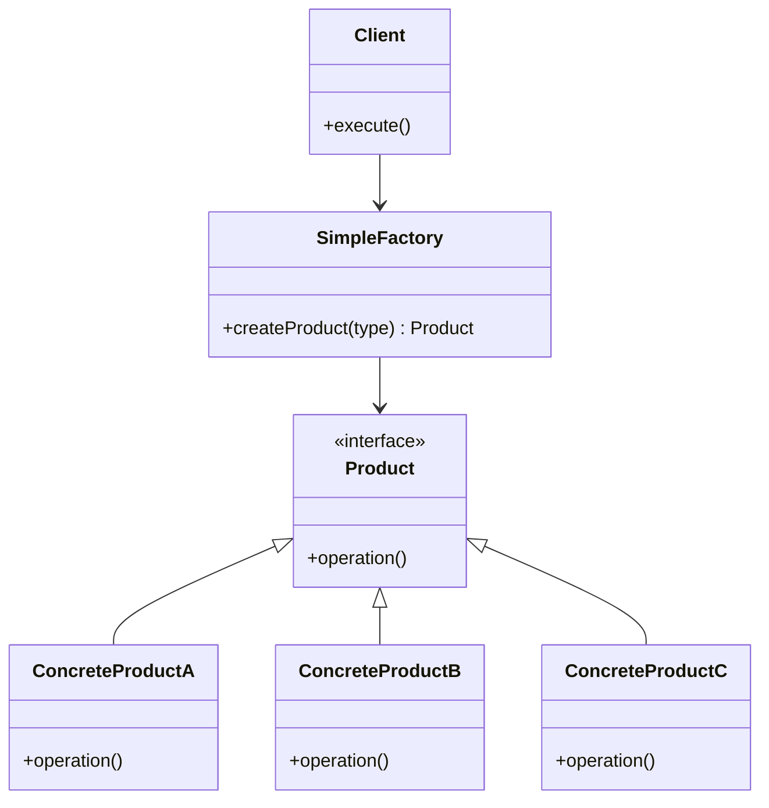

# Padrão Simple Factory (Fábrica Simples)

## 🎯 Visão Geral

O **Padrão Simple Factory** é um padrão criacional que centraliza a responsabilidade de criar objetos baseado em parâmetros de entrada. É um padrão extremamente simples, porém muito poderoso, que oferece flexibilidade para reutilização de código.

## 📚 Características Importantes

### **Não é um Padrão Oficial do GOF**
- **Não catalogado** no livro oficial dos padrões de projeto
- **Reconhecido** como introdução aos padrões **Abstract Factory** e **Factory Method**
- **Pontapé inicial** para implementação de padrões mais avançados
- **Não catalogado** não significa que não tem aplicabilidade no dia a dia

### **Combo Poderoso com Strategy**
- **Combinação perfeita** com o padrão Strategy
- **Flexibilidade máxima** quando usado junto
- **Aplicação extremamente interessante** dos dois padrões juntos

## 🚨 Problema que Resolve

### Cenário: Sistema de Notificações

Imagine um sistema onde usuários podem enviar notificações para outros usuários através de diferentes canais (Email, SMS, Slack).

#### ❌ **Problema sem Simple Factory**

```php
class NotificationController 
{
    public function sendNotification(Request $request): JsonResponse 
    {
        $notificationType = $request->get('notification_type');
        $recipient = $request->get('recipient');
        $message = $request->get('message');
        
        // Problema: Muitos ifs para diferentes tipos
        if ($notificationType === 'email') {
            $notification = new EmailNotification();
        } elseif ($notificationType === 'sms') {
            $notification = new SMSNotification();
        } elseif ($notificationType === 'slack') {
            $notification = new SlackNotification();
        } else {
            throw new InvalidArgumentException('Tipo de notificação inválido');
        }
        
        $notification->send($message, $recipient);
        
        return new JsonResponse(['status' => 'success']);
    }
}
```

#### 🔥 **Problemas Identificados**

1. **Violação do Open/Closed Principle (OCP)**
   - Para adicionar WhatsApp, precisa modificar o Controller
   - Classe aberta para modificação, não para extensão

2. **Duplicação de Código**
   - Mesma lógica de criação em múltiplos endpoints
   - Dificuldade para lembrar todos os lugares que usam notificação

3. **Acoplamento Alto**
   - Controller conhece todas as implementações concretas
   - Dificulta manutenção e testes

4. **Crescimento Infinito**
   - Cada novo tipo de notificação adiciona mais ifs
   - Controllers com milhares de linhas

## 🏗️ Arquitetura da Solução

### Componentes do Simple Factory



### Estrutura de Classes



## ✅ Vantagens

### 1. **Centralização da Responsabilidade**
- **Ponto único** para criação de objetos
- **Reutilização** em múltiplos lugares
- **Manutenção** centralizada

### 2. **Flexibilidade**
- **Fácil adição** de novos tipos
- **Configuração** baseada em parâmetros
- **Extensibilidade** do sistema

### 3. **Simplicidade**
- **Implementação simples** e direta
- **Fácil entendimento** para desenvolvedores
- **Baixa complexidade** inicial

### 4. **Reutilização**
- **Elimina duplicação** de código
- **Consistência** na criação de objetos
- **Padronização** do processo

## ❌ Desvantagens

### 1. **Violação do Open/Closed Principle**
- **Modificação necessária** para novos tipos
- **Não é extensível** sem alterar código
- **Fere princípios SOLID**

### 2. **Métodos Estáticos**
- **Inimigo dos testes** unitários
- **Dificulta mocking** e stubbing
- **Acoplamento** com implementação

### 3. **Responsabilidade Única**
- **Factory cresce** com novos tipos
- **Múltiplas responsabilidades** em uma classe
- **Complexidade** aumenta com o tempo

### 4. **Limitações de Escalabilidade**
- **Não adequado** para muitos tipos
- **Necessidade** de padrões mais avançados
- **Refatoração** para Abstract Factory ou Factory Method

## 🎯 Casos de Uso Comuns

### 1. **Sistemas de Notificação**
- Email, SMS, Push, WhatsApp, Slack
- Diferentes provedores de notificação

### 2. **Sistemas de Pagamento**
- Cartão, PIX, Boleto, Débito
- Múltiplos gateways de pagamento

### 3. **Sistemas de Relatórios**
- PDF, Excel, CSV, JSON
- Diferentes formatos de saída

### 4. **Sistemas de Armazenamento**
- Local, AWS S3, Google Cloud, Azure
- Múltiplos provedores de storage

### 5. **Sistemas de Cache**
- Redis, Memcached, In-memory
- Diferentes implementações de cache

## 🔄 Comparação: Com vs Sem Simple Factory

### ❌ **Sem Simple Factory (Problema)**

```php
// Controller com muitos ifs
class NotificationController 
{
    public function sendNotification(Request $request): JsonResponse 
    {
        $notificationType = $request->get('notification_type');
        
        if ($notificationType === 'email') {
            $notification = new EmailNotification();
        } elseif ($notificationType === 'sms') {
            $notification = new SMSNotification();
        } elseif ($notificationType === 'slack') {
            $notification = new SlackNotification();
        } elseif ($notificationType === 'whatsapp') {
            $notification = new WhatsAppNotification();
        } else {
            throw new InvalidArgumentException('Tipo inválido');
        }
        
        $notification->send($request->get('message'), $request->get('recipient'));
        return new JsonResponse(['status' => 'success']);
    }
}
```

**Problemas:**
- Múltiplos ifs/elseif
- Violação do OCP
- Duplicação de código
- Dificuldade de manutenção

### ✅ **Com Simple Factory (Solução)**

```php
// Interface para notificações
interface NotificationInterface 
{
    public function send(string $message, string $recipient): void;
}

// Factory centralizada
class NotificationFactory 
{
    public static function create(string $type): NotificationInterface 
    {
        return match($type) {
            'email' => new EmailNotification(),
            'sms' => new SMSNotification(),
            'slack' => new SlackNotification(),
            'whatsapp' => new WhatsAppNotification(),
            default => throw new InvalidArgumentException("Tipo '{$type}' não suportado")
        };
    }
}

// Controller simplificado
class NotificationController 
{
    public function sendNotification(Request $request): JsonResponse 
    {
        $notification = NotificationFactory::create($request->get('notification_type'));
        $notification->send($request->get('message'), $request->get('recipient'));
        
        return new JsonResponse(['status' => 'success']);
    }
}
```

**Benefícios:**
- Código limpo e organizado
- Centralização da criação
- Fácil reutilização
- Manutenção simplificada

## 🛠️ Boas Práticas

### 1. **Use Simple Factory Quando:**
- **Poucos tipos** de objetos para criar
- **Lógica simples** de criação
- **Necessidade** de centralização
- **Protótipo** para padrões mais avançados

### 2. **Evite Simple Factory Quando:**
- **Muitos tipos** de objetos
- **Lógica complexa** de criação
- **Necessidade** de extensibilidade
- **Violação** de princípios SOLID

### 3. **Implementação Correta:**
- **Interface comum** para todos os produtos
- **Método estático** para criação
- **Tratamento de erros** adequado
- **Documentação** clara

### 4. **Cuidados com Métodos Estáticos:**
- **Inimigo dos testes** unitários
- **Use com moderação**
- **Considere injeção de dependência**
- **Prefira instâncias** quando possível

## 🔧 Extensões Avançadas

### 1. **Simple Factory com Strategy**
- **Combinação poderosa** dos dois padrões
- **Flexibilidade máxima** na criação e execução
- **Aplicação** em sistemas complexos

### 2. **Simple Factory com Registry**
- **Registry** de tipos disponíveis
- **Descoberta automática** de implementações
- **Configuração** dinâmica

### 3. **Simple Factory com Builder**
- **Builder** para configuração complexa
- **Validação** de parâmetros
- **Configuração** flexível

### 4. **Migração para Abstract Factory**
- **Evolução natural** do Simple Factory
- **Padrão mais avançado** quando necessário
- **Manutenção** da compatibilidade

## 📊 Quando Migrar para Padrões Mais Avançados

### **Migre para Abstract Factory quando:**
- **Múltiplas famílias** de produtos
- **Necessidade** de compatibilidade entre produtos
- **Complexidade** na criação

### **Migre para Factory Method quando:**
- **Delegação** da criação para subclasses
- **Extensibilidade** sem modificação
- **Polimorfismo** na criação

### **Migre para Builder quando:**
- **Configuração complexa** de objetos
- **Múltiplos parâmetros** opcionais
- **Validação** de configuração

## 🎯 Conclusão

O padrão Simple Factory é uma ferramenta poderosa para centralizar a criação de objetos, mas deve ser usado com sabedoria. É ideal para casos simples com poucos tipos, mas pode evoluir para padrões mais avançados conforme a complexidade cresce.

**Use quando:** Poucos tipos, lógica simples, necessidade de centralização
**Evite quando:** Muitos tipos, lógica complexa, necessidade de extensibilidade
**Lembre-se:** É uma introdução para padrões mais avançados como Abstract Factory e Factory Method


