# Diagramas - Padrão Simple Factory

## 🏗️ Arquitetura Geral

### Estrutura de Classes

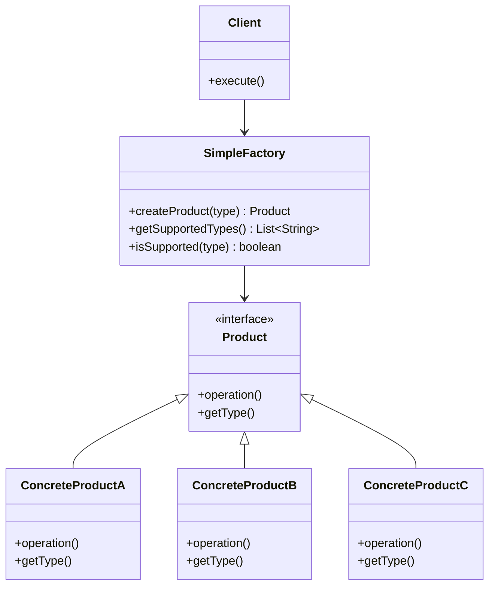
```mermaid
classDiagram
    class Client {
        +execute()
    }
    
    class SimpleFactory {
        +createProduct(type) Product
        +getSupportedTypes() List~String~
        +isSupported(type) boolean
    }
    
    class Product {
        <<interface>>
        +operation()
        +getType()
    }
    
    class ConcreteProductA {
        +operation()
        +getType()
    }
    
    class ConcreteProductB {
        +operation()
        +getType()
    }
    
    class ConcreteProductC {
        +operation()
        +getType()
    }
    
    Client --> SimpleFactory
    SimpleFactory --> Product
    Product <|-- ConcreteProductA
    Product <|-- ConcreteProductB
    Product <|-- ConcreteProductC
```

### Diagrama de Componentes

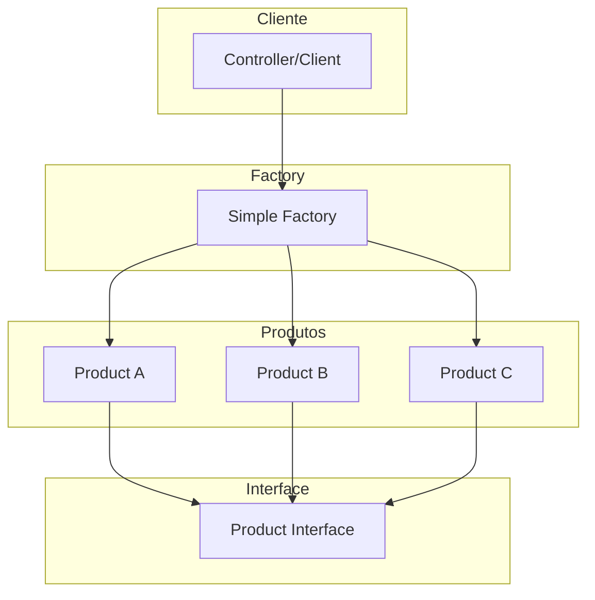
```mermaid
graph TB
    subgraph "Cliente"
        C[Controller/Client]
    end
    
    subgraph "Factory"
        F[Simple Factory]
    end
    
    subgraph "Produtos"
        P1[Product A]
        P2[Product B]
        P3[Product C]
    end
    
    subgraph "Interface"
        I[Product Interface]
    end
    
    C --> F
    F --> P1
    F --> P2
    F --> P3
    P1 --> I
    P2 --> I
    P3 --> I
```

## 🔄 Fluxos de Funcionamento

### Fluxo Básico do Simple Factory

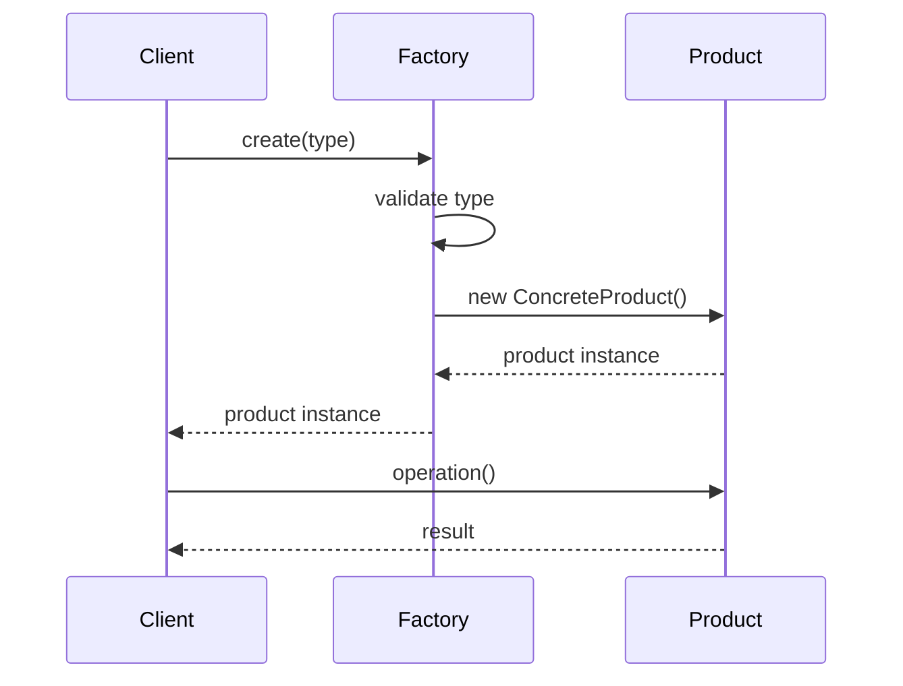
```mermaid
sequenceDiagram
    participant Client
    participant Factory
    participant Product
    
    Client->>Factory: create(type)
    Factory->>Factory: validate type
    Factory->>Product: new ConcreteProduct()
    Product-->>Factory: product instance
    Factory-->>Client: product instance
    Client->>Product: operation()
    Product-->>Client: result
```

### Fluxo com Validação

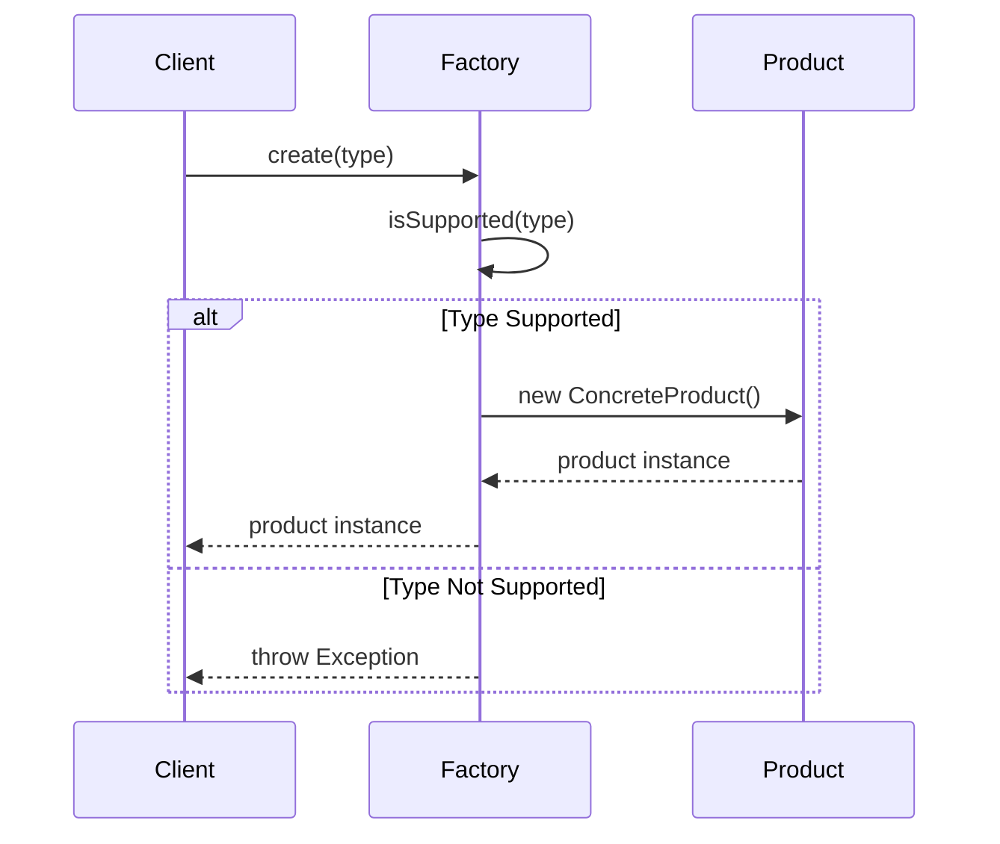
```mermaid
sequenceDiagram
    participant Client
    participant Factory
    participant Product
    
    Client->>Factory: create(type)
    Factory->>Factory: isSupported(type)
    
    alt Type Supported
        Factory->>Product: new ConcreteProduct()
        Product-->>Factory: product instance
        Factory-->>Client: product instance
    else Type Not Supported
        Factory-->>Client: throw Exception
    end
```

### Fluxo de Reutilização

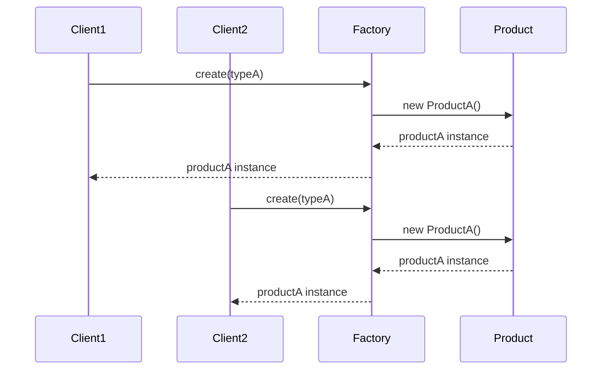
```mermaid
sequenceDiagram
    participant Client1
    participant Client2
    participant Factory
    participant Product
    
    Client1->>Factory: create(typeA)
    Factory->>Product: new ProductA()
    Product-->>Factory: productA instance
    Factory-->>Client1: productA instance
    
    Client2->>Factory: create(typeA)
    Factory->>Product: new ProductA()
    Product-->>Factory: productA instance
    Factory-->>Client2: productA instance
```

## 🎯 Casos de Uso Específicos

### Sistema de Notificações

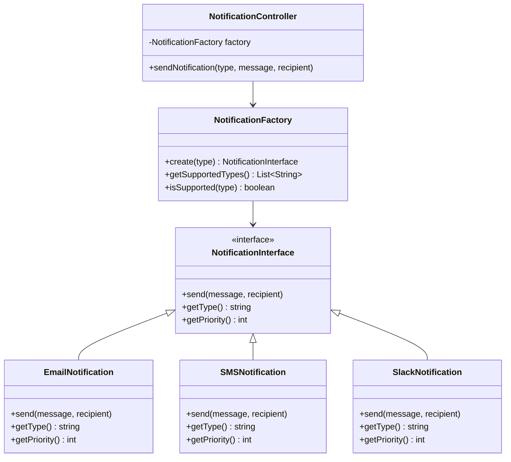
```mermaid
classDiagram
    class NotificationController {
        -NotificationFactory factory
        +sendNotification(type, message, recipient)
    }
    
    class NotificationFactory {
        +create(type) NotificationInterface
        +getSupportedTypes() List~String~
        +isSupported(type) boolean
    }
    
    class NotificationInterface {
        <<interface>>
        +send(message, recipient)
        +getType() string
        +getPriority() int
    }
    
    class EmailNotification {
        +send(message, recipient)
        +getType() string
        +getPriority() int
    }
    
    class SMSNotification {
        +send(message, recipient)
        +getType() string
        +getPriority() int
    }
    
    class SlackNotification {
        +send(message, recipient)
        +getType() string
        +getPriority() int
    }
    
    NotificationController --> NotificationFactory
    NotificationFactory --> NotificationInterface
    NotificationInterface <|-- EmailNotification
    NotificationInterface <|-- SMSNotification
    NotificationInterface <|-- SlackNotification
```

### Sistema de Pagamentos

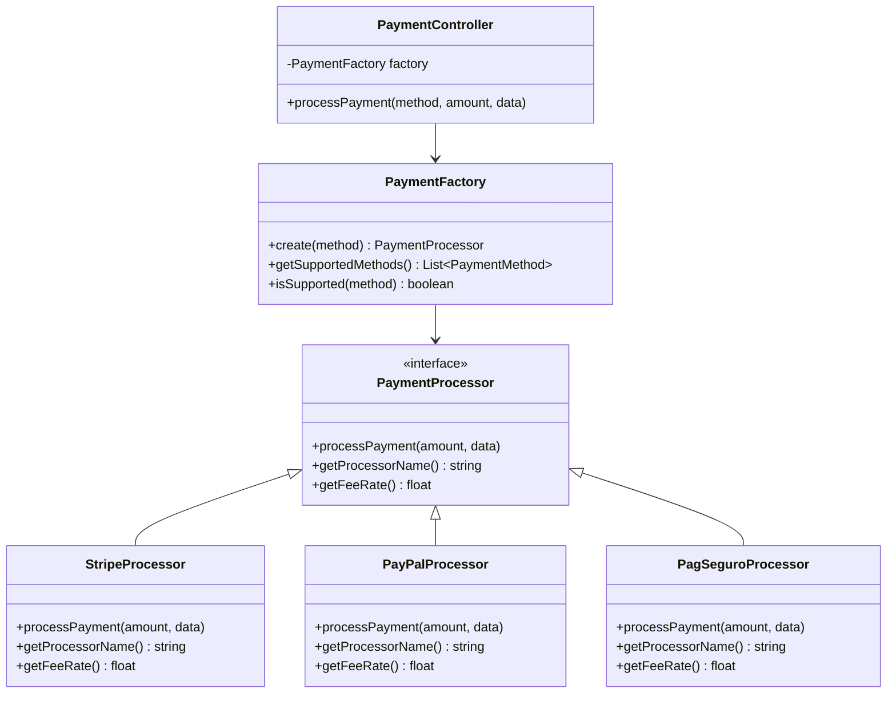
```mermaid
classDiagram
    class PaymentController {
        -PaymentFactory factory
        +processPayment(method, amount, data)
    }
    
    class PaymentFactory {
        +create(method) PaymentProcessor
        +getSupportedMethods() List~PaymentMethod~
        +isSupported(method) boolean
    }
    
    class PaymentProcessor {
        <<interface>>
        +processPayment(amount, data)
        +getProcessorName() string
        +getFeeRate() float
    }
    
    class StripeProcessor {
        +processPayment(amount, data)
        +getProcessorName() string
        +getFeeRate() float
    }
    
    class PayPalProcessor {
        +processPayment(amount, data)
        +getProcessorName() string
        +getFeeRate() float
    }
    
    class PagSeguroProcessor {
        +processPayment(amount, data)
        +getProcessorName() string
        +getFeeRate() float
    }
    
    PaymentController --> PaymentFactory
    PaymentFactory --> PaymentProcessor
    PaymentProcessor <|-- StripeProcessor
    PaymentProcessor <|-- PayPalProcessor
    PaymentProcessor <|-- PagSeguroProcessor
```

### Sistema de Relatórios

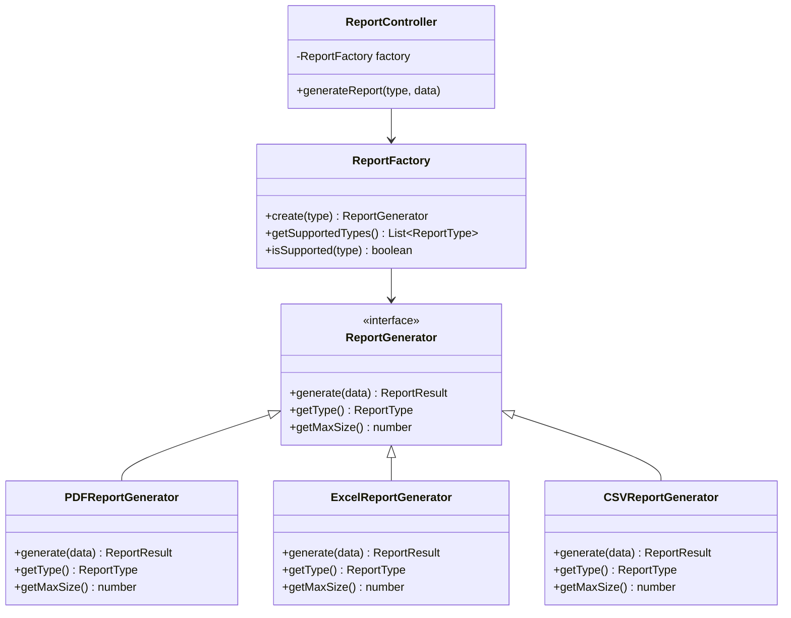
```mermaid
classDiagram
    class ReportController {
        -ReportFactory factory
        +generateReport(type, data)
    }
    
    class ReportFactory {
        +create(type) ReportGenerator
        +getSupportedTypes() List~ReportType~
        +isSupported(type) boolean
    }
    
    class ReportGenerator {
        <<interface>>
        +generate(data) ReportResult
        +getType() ReportType
        +getMaxSize() number
    }
    
    class PDFReportGenerator {
        +generate(data) ReportResult
        +getType() ReportType
        +getMaxSize() number
    }
    
    class ExcelReportGenerator {
        +generate(data) ReportResult
        +getType() ReportType
        +getMaxSize() number
    }
    
    class CSVReportGenerator {
        +generate(data) ReportResult
        +getType() ReportType
        +getMaxSize() number
    }
    
    ReportController --> ReportFactory
    ReportFactory --> ReportGenerator
    ReportGenerator <|-- PDFReportGenerator
    ReportGenerator <|-- ExcelReportGenerator
    ReportGenerator <|-- CSVReportGenerator
```

## 🔧 Variações do Padrão

### Simple Factory com Strategy

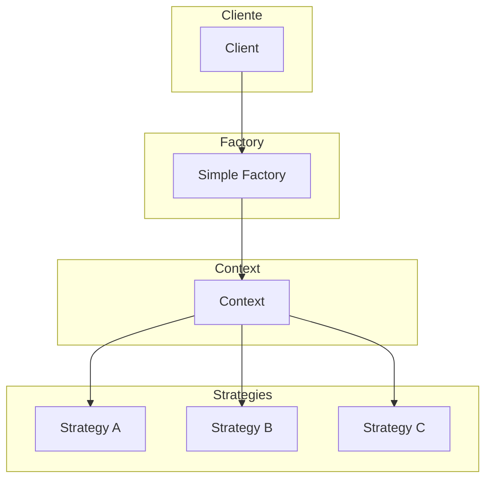
```mermaid
graph TB
    subgraph "Cliente"
        C[Client]
    end
    
    subgraph "Factory"
        F[Simple Factory]
    end
    
    subgraph "Context"
        CTX[Context]
    end
    
    subgraph "Strategies"
        S1[Strategy A]
        S2[Strategy B]
        S3[Strategy C]
    end
    
    C --> F
    F --> CTX
    CTX --> S1
    CTX --> S2
    CTX --> S3
```

### Simple Factory com Registry

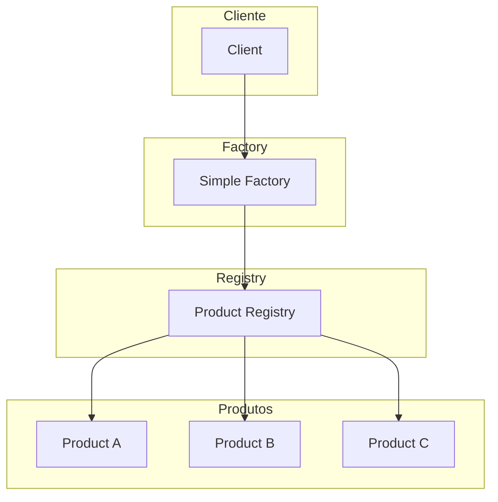
```mermaid
graph TB
    subgraph "Cliente"
        C[Client]
    end
    
    subgraph "Factory"
        F[Simple Factory]
    end
    
    subgraph "Registry"
        R[Product Registry]
    end
    
    subgraph "Produtos"
        P1[Product A]
        P2[Product B]
        P3[Product C]
    end
    
    C --> F
    F --> R
    R --> P1
    R --> P2
    R --> P3
```

### Simple Factory com Builder

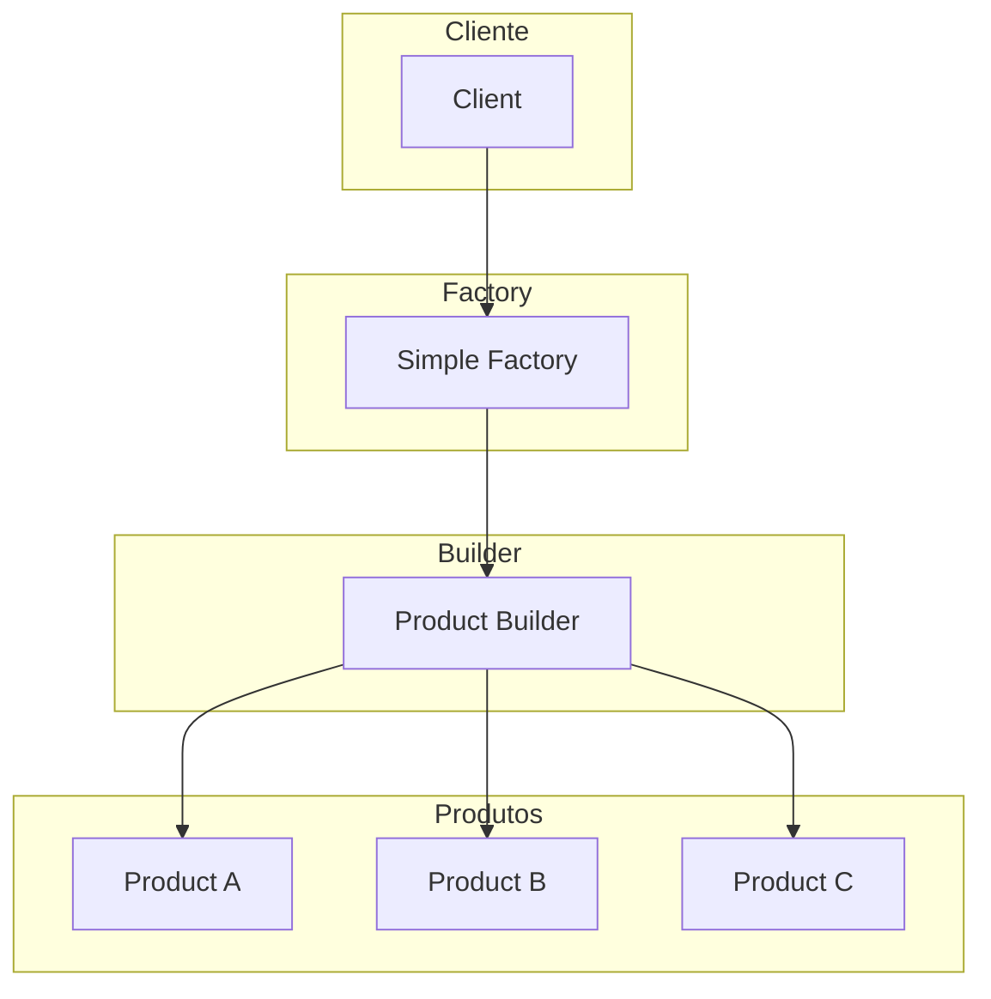
```mermaid
graph TB
    subgraph "Cliente"
        C[Client]
    end
    
    subgraph "Factory"
        F[Simple Factory]
    end
    
    subgraph "Builder"
        B[Product Builder]
    end
    
    subgraph "Produtos"
        P1[Product A]
        P2[Product B]
        P3[Product C]
    end
    
    C --> F
    F --> B
    B --> P1
    B --> P2
    B --> P3
```

## 📊 Métricas e Monitoramento

### Diagrama de Métricas

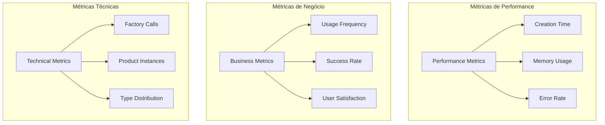
```mermaid
graph TB
    subgraph "Métricas de Performance"
        MP[Performance Metrics]
        MP1[Creation Time]
        MP2[Memory Usage]
        MP3[Error Rate]
    end
    
    subgraph "Métricas de Negócio"
        MB[Business Metrics]
        MB1[Usage Frequency]
        MB2[Success Rate]
        MB3[User Satisfaction]
    end
    
    subgraph "Métricas Técnicas"
        MT[Technical Metrics]
        MT1[Factory Calls]
        MT2[Product Instances]
        MT3[Type Distribution]
    end
    
    MP --> MP1
    MP --> MP2
    MP --> MP3
    
    MB --> MB1
    MB --> MB2
    MB --> MB3
    
    MT --> MT1
    MT --> MT2
    MT --> MT3
```

### Fluxo de Monitoramento

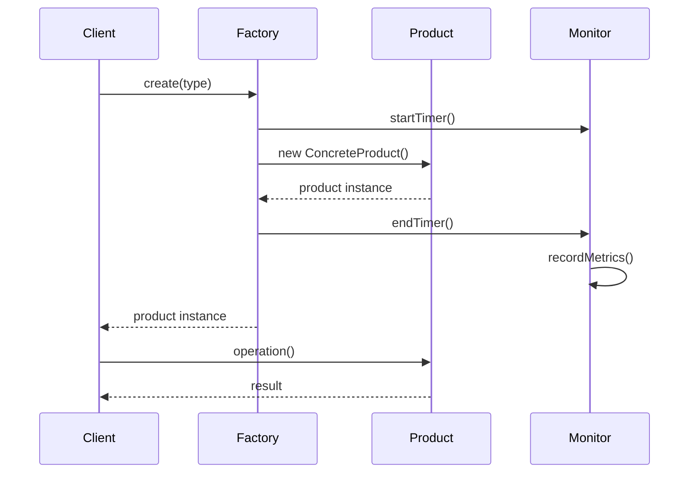
```mermaid
sequenceDiagram
    participant Client
    participant Factory
    participant Product
    participant Monitor
    
    Client->>Factory: create(type)
    Factory->>Monitor: startTimer()
    Factory->>Product: new ConcreteProduct()
    Product-->>Factory: product instance
    Factory->>Monitor: endTimer()
    Monitor->>Monitor: recordMetrics()
    Factory-->>Client: product instance
    Client->>Product: operation()
    Product-->>Client: result
```

## 🎨 Padrões Relacionados

### Simple Factory + Strategy

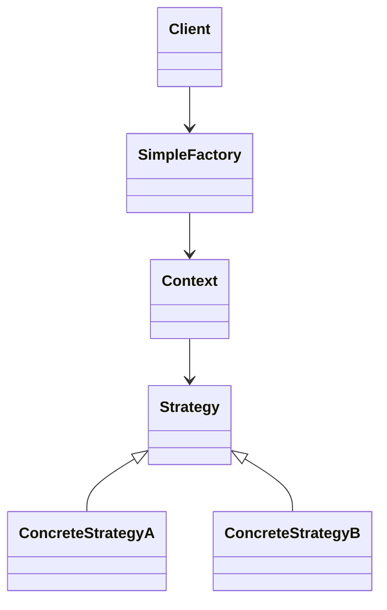
```mermaid
classDiagram
    class Client
    class SimpleFactory
    class Context
    class Strategy
    class ConcreteStrategyA
    class ConcreteStrategyB
    
    Client --> SimpleFactory
    SimpleFactory --> Context
    Context --> Strategy
    Strategy <|-- ConcreteStrategyA
    Strategy <|-- ConcreteStrategyB
```

### Simple Factory + Template Method

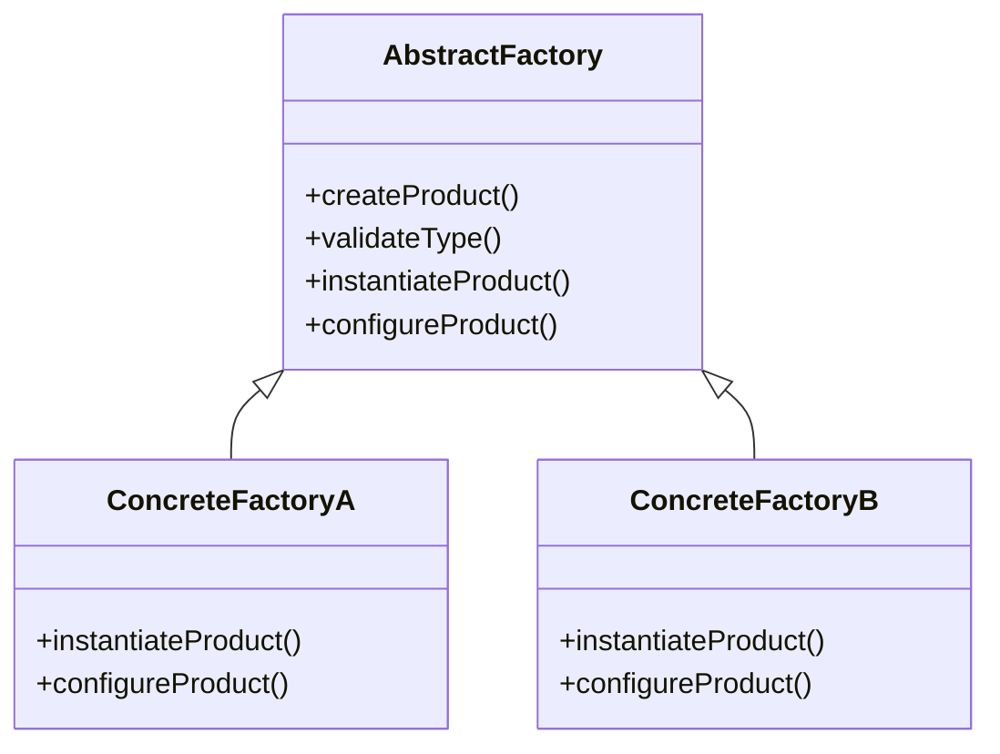
```mermaid
classDiagram
    class AbstractFactory {
        +createProduct()
        +validateType()
        +instantiateProduct()
        +configureProduct()
    }
    
    class ConcreteFactoryA {
        +instantiateProduct()
        +configureProduct()
    }
    
    class ConcreteFactoryB {
        +instantiateProduct()
        +configureProduct()
    }
    
    AbstractFactory <|-- ConcreteFactoryA
    AbstractFactory <|-- ConcreteFactoryB
```

### Simple Factory + Chain of Responsibility

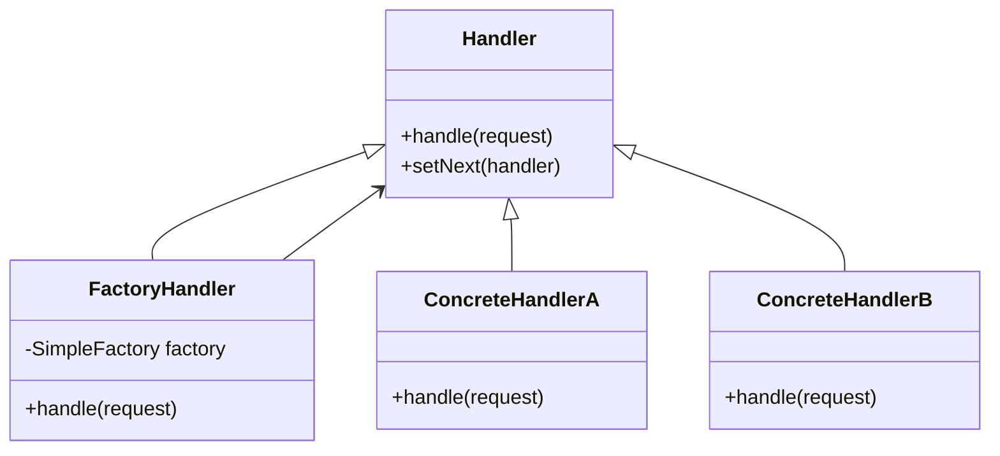
```mermaid
classDiagram
    class Handler {
        +handle(request)
        +setNext(handler)
    }
    
    class FactoryHandler {
        -SimpleFactory factory
        +handle(request)
    }
    
    class ConcreteHandlerA {
        +handle(request)
    }
    
    class ConcreteHandlerB {
        +handle(request)
    }
    
    Handler <|-- FactoryHandler
    Handler <|-- ConcreteHandlerA
    Handler <|-- ConcreteHandlerB
    FactoryHandler --> Handler
```

## 🔄 Estados e Transições

### Estado da Factory

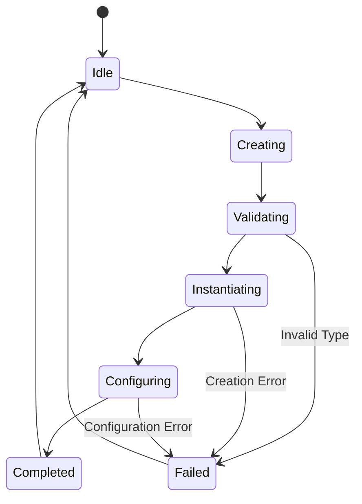
```mermaid
stateDiagram-v2
    [*] --> Idle
    Idle --> Creating
    Creating --> Validating
    Validating --> Instantiating
    Instantiating --> Configuring
    Configuring --> Completed
    Completed --> Idle
    
    Validating --> Failed : Invalid Type
    Instantiating --> Failed : Creation Error
    Configuring --> Failed : Configuration Error
    Failed --> Idle
```

### Transições de Produto

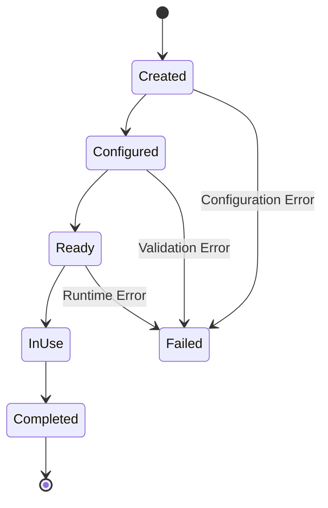
```mermaid
stateDiagram-v2
    [*] --> Created
    Created --> Configured
    Configured --> Ready
    Ready --> InUse
    InUse --> Completed
    Completed --> [*]
    
    Created --> Failed : Configuration Error
    Configured --> Failed : Validation Error
    Ready --> Failed : Runtime Error
```

## 📈 Evolução do Padrão

### Versão Simples

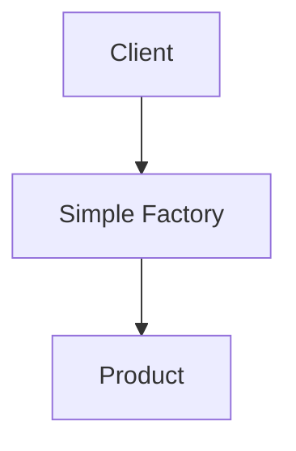
```mermaid
graph TB
    C[Client]
    F[Simple Factory]
    P[Product]
    
    C --> F
    F --> P
```

### Versão com Validação

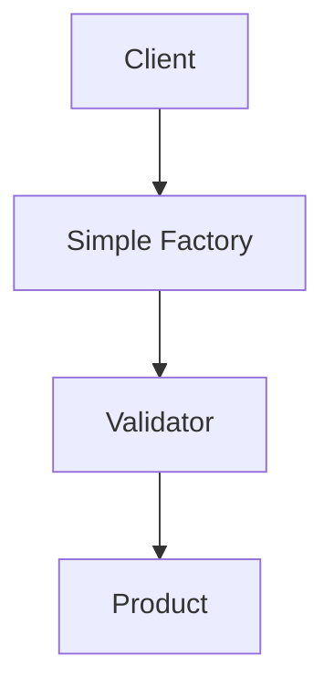
```mermaid
graph TB
    C[Client]
    F[Simple Factory]
    V[Validator]
    P[Product]
    
    C --> F
    F --> V
    V --> P
```

### Versão com Registry

```mermaid
graph TB
    C[Client]
    F[Simple Factory]
    R[Registry]
    P[Product]
    
    C --> F
    F --> R
    R --> P
```

### Versão com Builder

```mermaid
graph TB
    C[Client]
    F[Simple Factory]
    B[Builder]
    P[Product]
    
    C --> F
    F --> B
    B --> P
```

## 🔄 Fluxos de Erro

### Tratamento de Erros

```mermaid
sequenceDiagram
    participant Client
    participant Factory
    participant Product
    
    Client->>Factory: create(invalidType)
    Factory->>Factory: validate type
    
    alt Type Invalid
        Factory-->>Client: throw InvalidArgumentException
    else Type Valid
        Factory->>Product: new ConcreteProduct()
        
        alt Creation Success
            Product-->>Factory: product instance
            Factory-->>Client: product instance
        else Creation Failed
            Factory-->>Client: throw CreationException
        end
    end
```

### Fallback Strategy

```mermaid
sequenceDiagram
    participant Client
    participant Factory
    participant Product
    participant Fallback
    
    Client->>Factory: create(type)
    Factory->>Factory: validate type
    
    alt Type Supported
        Factory->>Product: new ConcreteProduct()
        Product-->>Factory: product instance
        Factory-->>Client: product instance
    else Type Not Supported
        Factory->>Fallback: createDefault()
        Fallback-->>Factory: default product
        Factory-->>Client: default product
    end
```

## 🎯 Comparação com Outros Padrões

### Simple Factory vs Abstract Factory

```mermaid
graph TB
    subgraph "Simple Factory"
        SF[Simple Factory]
        SP1[Product A]
        SP2[Product B]
    end
    
    subgraph "Abstract Factory"
        AF[Abstract Factory]
        AP1[Product Family A]
        AP2[Product Family B]
    end
    
    SF --> SP1
    SF --> SP2
    AF --> AP1
    AF --> AP2
```

### Simple Factory vs Factory Method

```mermaid
graph TB
    subgraph "Simple Factory"
        SF[Simple Factory]
        SP[Product]
    end
    
    subgraph "Factory Method"
        FM[Factory Method]
        FP[Product]
        CF[Concrete Factory]
    end
    
    SF --> SP
    FM --> CF
    CF --> FP
```

### Simple Factory vs Builder

```mermaid
graph TB
    subgraph "Simple Factory"
        SF[Simple Factory]
        SP[Product]
    end
    
    subgraph "Builder"
        B[Builder]
        BP[Product]
        D[Director]
    end
    
    SF --> SP
    B --> BP
    D --> B
```

