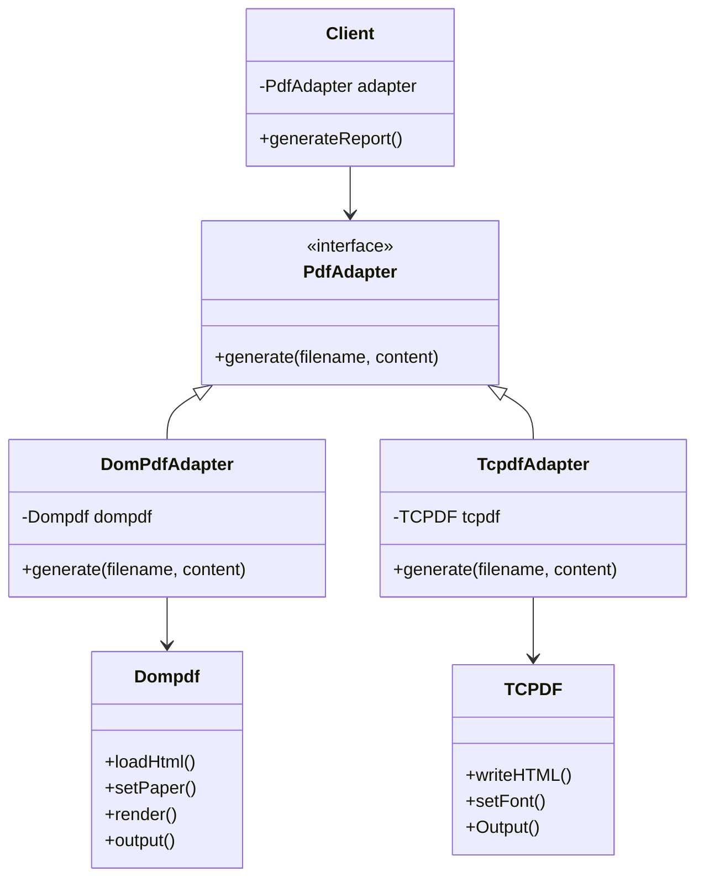
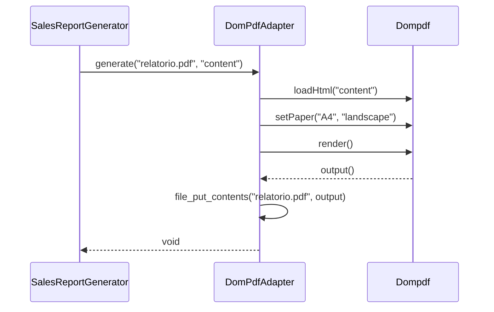

# Padrão Adapter - Design Pattern Estrutural

## 📋 Visão Geral

O **Padrão Adapter** é um padrão de projeto estrutural que permite que interfaces incompatíveis trabalhem juntas. Ele atua como uma ponte entre duas interfaces incompatíveis, permitindo que classes com interfaces diferentes colaborem sem modificar seu código fonte.

## 🎯 Problema que Resolve

### Analogias do Mundo Real

#### 1. **Adaptador de Tomada**
- **Problema**: Carregador brasileiro (3 pinos) não funciona em tomada americana
- **Solução**: Adaptador que converte 3 pinos para padrão americano
- **Resultado**: Funciona sem modificar o carregador ou a tomada

#### 2. **Carro e Trilho de Trem**
- **Problema**: Carro urbano não pode andar em trilho de trem
- **Solução**: Adaptador que converte interface do carro para trilho
- **Resultado**: Carro funciona no trilho sem modificações

### Problemas Técnicos Comuns

#### 1. **Alto Acoplamento com Bibliotecas Externas**
```php
// ❌ PROBLEMA: Classe altamente acoplada
class SalesReportGenerator {
    public function generate(): void {
        $dompdf = new Dompdf();
        $dompdf->loadHtml('<h1>Relatório de Vendas</h1>');
        $dompdf->setPaper('A4', 'landscape');
        $dompdf->render();
        file_put_contents('relatorio.pdf', $dompdf->output());
    }
}
```

#### 2. **Violação dos Princípios SOLID**
- **Single Responsibility**: Classe tem múltiplas responsabilidades
- **Dependency Inversion**: Depende de implementação concreta
- **Open/Closed**: Precisa modificar para trocar biblioteca

#### 3. **Dificuldade para Testes**
- Impossível mockar dependências
- Testes dependem de bibliotecas externas
- Código não é testável unitariamente

## 🏗️ Solução com o Padrão Adapter

### Arquitetura da Solução



### Componentes do Padrão

#### 1. **Target (Alvo)**
- Interface que o cliente espera
- Define o contrato que deve ser seguido
- Exemplo: `PdfAdapter`

#### 2. **Adapter (Adaptador)**
- Implementa a interface Target
- Envolve o Adaptee (objeto a ser adaptado)
- Converte chamadas para o formato correto
- Exemplo: `DomPdfAdapter`, `TcpdfAdapter`

#### 3. **Adaptee (Adaptado)**
- Classe existente que precisa ser adaptada
- Interface incompatível com o cliente
- Exemplo: `Dompdf`, `TCPDF`

#### 4. **Client (Cliente)**
- Usa a interface Target
- Não conhece o Adaptee
- Exemplo: `SalesReportGenerator`

## 🔄 Fluxo de Funcionamento

### Sequência de Operações



### Vantagens da Solução

#### ✅ **Desacoplamento**
- Cliente não conhece implementação específica
- Fácil troca de bibliotecas
- Código mais limpo e manutenível

#### ✅ **Testabilidade**
- Possível mockar o adapter
- Testes unitários independentes
- Cobertura de código completa

#### ✅ **Flexibilidade**
- Múltiplas implementações
- Troca dinâmica de adapters
- Extensibilidade sem modificação

#### ✅ **Princípios SOLID**
- Single Responsibility respeitado
- Dependency Inversion aplicado
- Open/Closed principle seguido

## 💡 Vantagens do Padrão Adapter

### ✅ Benefícios

1. **Reutilização de Código**
   - Aproveita bibliotecas existentes
   - Não precisa reescrever funcionalidades
   - Integração com sistemas legados

2. **Flexibilidade**
   - Troca fácil de implementações
   - Múltiplos adapters para mesma interface
   - Configuração dinâmica

3. **Testabilidade**
   - Mocking de dependências
   - Testes unitários isolados
   - Cobertura de código completa

4. **Manutenibilidade**
   - Código mais limpo
   - Responsabilidades bem definidas
   - Fácil modificação e extensão

### ❌ Desvantagens

1. **Complexidade Adicional**
   - Mais classes para gerenciar
   - Pode ser overkill para casos simples
   - Curva de aprendizado

2. **Overhead de Performance**
   - Camada adicional de abstração
   - Chamadas indiretas
   - Possível impacto na performance

## 🛠️ Implementação Prática

### Estrutura de Arquivos

```
src/
├── Adapter/
│   ├── PdfAdapter.php           # Interface
│   ├── DomPdfAdapter.php        # Adapter para DomPDF
│   └── TcpdfAdapter.php         # Adapter para TCPDF
├── SalesReportGenerator.php     # Cliente
└── command.php                  # Código cliente
```

### Implementação em PHP

#### 1. Interface Target
```php
<?php

interface PdfAdapter {
    public function generate(string $filename, string $content): void;
}
```

#### 2. Adapter para DomPDF
```php
<?php

class DomPdfAdapter implements PdfAdapter {
    private Dompdf $dompdf;
    
    public function __construct() {
        $this->dompdf = new Dompdf();
    }
    
    public function generate(string $filename, string $content): void {
        $this->dompdf->loadHtml($content);
        $this->dompdf->setPaper('A4', 'landscape');
        $this->dompdf->render();
        file_put_contents($filename, $this->dompdf->output());
    }
}
```

#### 3. Adapter para TCPDF
```php
<?php

class TcpdfAdapter implements PdfAdapter {
    private TCPDF $tcpdf;
    
    public function __construct() {
        $this->tcpdf = new TCPDF();
    }
    
    public function generate(string $filename, string $content): void {
        $this->tcpdf->writeHTML($content);
        $this->tcpdf->setFont('helvetica', '', 12);
        $this->tcpdf->Output($filename, 'F');
    }
}
```

#### 4. Cliente
```php
<?php

class SalesReportGenerator {
    private PdfAdapter $pdfAdapter;
    
    public function __construct(PdfAdapter $pdfAdapter) {
        $this->pdfAdapter = $pdfAdapter;
    }
    
    public function generate(): void {
        $filename = 'relatorio_' . time() . '.pdf';
        $content = '<h1>Relatório de Vendas</h1><p>Conteúdo do relatório...</p>';
        
        $this->pdfAdapter->generate($filename, $content);
        echo "Relatório gerado: {$filename}\n";
    }
}
```

#### 5. Código Cliente
```php
<?php

// Usando DomPDF
$domPdfAdapter = new DomPdfAdapter();
$generator = new SalesReportGenerator($domPdfAdapter);
$generator->generate();

// Usando TCPDF
$tcpdfAdapter = new TcpdfAdapter();
$generator = new SalesReportGenerator($tcpdfAdapter);
$generator->generate();
```

## 🎯 Casos de Uso Comuns

### 1. **Integração com APIs Externas**
- Diferentes formatos de dados
- Protocolos incompatíveis
- Versões diferentes de APIs

### 2. **Sistemas Legados**
- Integração com sistemas antigos
- Interfaces desatualizadas
- Código legado sem modificação

### 3. **Bibliotecas de Terceiros**
- Diferentes implementações
- APIs incompatíveis
- Troca de bibliotecas

### 4. **Formatos de Dados**
- Conversão entre formatos
- Serialização/Deserialização
- Transformação de dados

### 5. **Sistemas de Pagamento**
- Diferentes gateways
- APIs incompatíveis
- Integração transparente

## 🔧 Boas Práticas

### 1. **Nomenclatura Clara**
```php
// ✅ BOM: Nomes descritivos
class DomPdfAdapter implements PdfAdapter
class TcpdfAdapter implements PdfAdapter
class StripePaymentAdapter implements PaymentAdapter

// ❌ RUIM: Nomes genéricos
class Adapter1 implements PdfAdapter
class Adapter2 implements PdfAdapter
```

### 2. **Interface Bem Definida**
```php
// ✅ BOM: Interface clara e específica
interface PdfAdapter {
    public function generate(string $filename, string $content): void;
    public function setPageSize(string $size): void;
    public function setOrientation(string $orientation): void;
}

// ❌ RUIM: Interface muito genérica
interface Adapter {
    public function doSomething($data): void;
}
```

### 3. **Tratamento de Erros**
```php
// ✅ BOM: Tratamento adequado de erros
public function generate(string $filename, string $content): void {
    try {
        $this->dompdf->loadHtml($content);
        $this->dompdf->render();
        file_put_contents($filename, $this->dompdf->output());
    } catch (Exception $e) {
        throw new PdfGenerationException("Erro ao gerar PDF: " . $e->getMessage());
    }
}
```

### 4. **Documentação Clara**
```php
/**
 * Adapter para biblioteca DomPDF
 * 
 * Converte a interface da biblioteca DomPDF para
 * a interface padrão PdfAdapter
 * 
 * @package Adapter
 * @author Seu Nome
 * @version 1.0
 */
class DomPdfAdapter implements PdfAdapter {
    // Implementação...
}
```

## 🚀 Extensões Avançadas

### 1. **Adapter com Configuração**
```php
class ConfigurablePdfAdapter implements PdfAdapter {
    private array $config;
    
    public function __construct(array $config = []) {
        $this->config = array_merge([
            'page_size' => 'A4',
            'orientation' => 'portrait',
            'font' => 'helvetica'
        ], $config);
    }
    
    public function generate(string $filename, string $content): void {
        // Usar configurações específicas
    }
}
```

### 2. **Adapter com Cache**
```php
class CachedPdfAdapter implements PdfAdapter {
    private PdfAdapter $adapter;
    private CacheInterface $cache;
    
    public function generate(string $filename, string $content): void {
        $cacheKey = md5($content);
        
        if ($this->cache->has($cacheKey)) {
            $this->cache->get($cacheKey);
            return;
        }
        
        $this->adapter->generate($filename, $content);
        $this->cache->set($cacheKey, $filename);
    }
}
```

### 3. **Adapter com Logging**
```php
class LoggedPdfAdapter implements PdfAdapter {
    private PdfAdapter $adapter;
    private LoggerInterface $logger;
    
    public function generate(string $filename, string $content): void {
        $this->logger->info("Gerando PDF: {$filename}");
        
        $startTime = microtime(true);
        $this->adapter->generate($filename, $content);
        $duration = microtime(true) - $startTime;
        
        $this->logger->info("PDF gerado em {$duration}s");
    }
}
```

## 📊 Comparação: Com vs Sem Padrão Adapter

### Sem Padrão Adapter
```php
class SalesReportGenerator {
    public function generate(): void {
        // Alto acoplamento com DomPDF
        $dompdf = new Dompdf();
        $dompdf->loadHtml('<h1>Relatório</h1>');
        $dompdf->setPaper('A4', 'landscape');
        $dompdf->render();
        file_put_contents('relatorio.pdf', $dompdf->output());
    }
}
```

### Com Padrão Adapter
```php
class SalesReportGenerator {
    private PdfAdapter $pdfAdapter;
    
    public function __construct(PdfAdapter $pdfAdapter) {
        $this->pdfAdapter = $pdfAdapter;
    }
    
    public function generate(): void {
        // Baixo acoplamento, fácil troca
        $this->pdfAdapter->generate('relatorio.pdf', '<h1>Relatório</h1>');
    }
}
```

## 🎓 Conclusão

O **Padrão Adapter** é uma ferramenta essencial para:

- **Integrar sistemas incompatíveis** sem modificá-los
- **Reduzir acoplamento** entre componentes
- **Facilitar testes** com mocking de dependências
- **Permitir troca de implementações** sem quebrar código
- **Seguir princípios SOLID** e boas práticas

### Quando Usar
- Interfaces incompatíveis
- Integração com bibliotecas externas
- Sistemas legados
- Necessidade de flexibilidade

### Quando NÃO Usar
- Interfaces já compatíveis
- Casos simples sem necessidade
- Quando a complexidade não justifica

---

**Última atualização**: $(date)
**Mantenedor**: Equipe Skynet
**Versão**: 1.0


