# Diagramas do Padrão Adapter

## 📊 Arquitetura Geral

### Diagrama de Classes

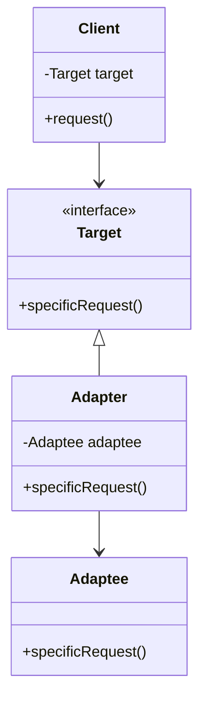
```mermaid
classDiagram
    class Client {
        -Target target
        +request()
    }
    
    class Target {
        <<interface>>
        +specificRequest()
    }
    
    class Adapter {
        -Adaptee adaptee
        +specificRequest()
    }
    
    class Adaptee {
        +specificRequest()
    }
    
    Client --> Target
    Target <|-- Adapter
    Adapter --> Adaptee
```

### Componentes do Padrão

| Componente | Responsabilidade | Exemplo |
|------------|------------------|---------|
| **Client** | Usa a interface Target | `SalesReportGenerator` |
| **Target** | Interface que o cliente espera | `PdfAdapter` |
| **Adapter** | Implementa Target e envolve Adaptee | `DomPdfAdapter` |
| **Adaptee** | Classe existente a ser adaptada | `Dompdf` |

## 🔄 Fluxo de Funcionamento

### Diagrama de Sequência - Fluxo Normal

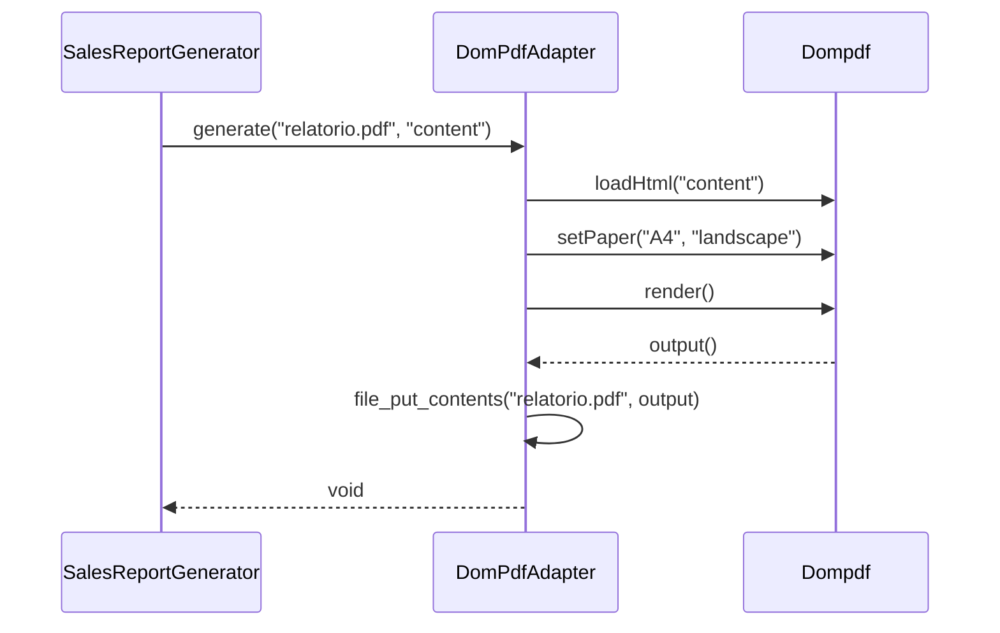
```mermaid
sequenceDiagram
    participant Client as SalesReportGenerator
    participant Adapter as DomPdfAdapter
    participant Adaptee as Dompdf
    
    Client->>Adapter: generate("relatorio.pdf", "content")
    Adapter->>Adaptee: loadHtml("content")
    Adapter->>Adaptee: setPaper("A4", "landscape")
    Adapter->>Adaptee: render()
    Adaptee-->>Adapter: output()
    Adapter->>Adapter: file_put_contents("relatorio.pdf", output)
    Adapter-->>Client: void
```

### Diagrama de Sequência - Troca de Biblioteca

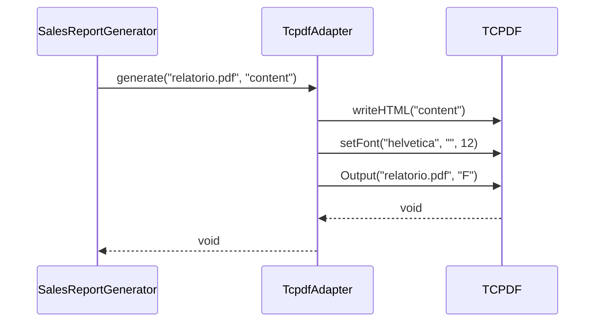
```mermaid
sequenceDiagram
    participant Client as SalesReportGenerator
    participant Adapter as TcpdfAdapter
    participant Adaptee as TCPDF
    
    Client->>Adapter: generate("relatorio.pdf", "content")
    Adapter->>Adaptee: writeHTML("content")
    Adapter->>Adaptee: setFont("helvetica", "", 12)
    Adapter->>Adaptee: Output("relatorio.pdf", "F")
    Adaptee-->>Adapter: void
    Adapter-->>Client: void
```

## 🏗️ Arquitetura Detalhada

### Estrutura de Arquivos

```
src/
├── Adapter/
│   ├── PdfAdapter.php           # Interface Target
│   ├── DomPdfAdapter.php        # Adapter para DomPDF
│   └── TcpdfAdapter.php         # Adapter para TCPDF
├── SalesReportGenerator.php     # Cliente
└── command.php                  # Código cliente
```

### Diagrama de Dependências

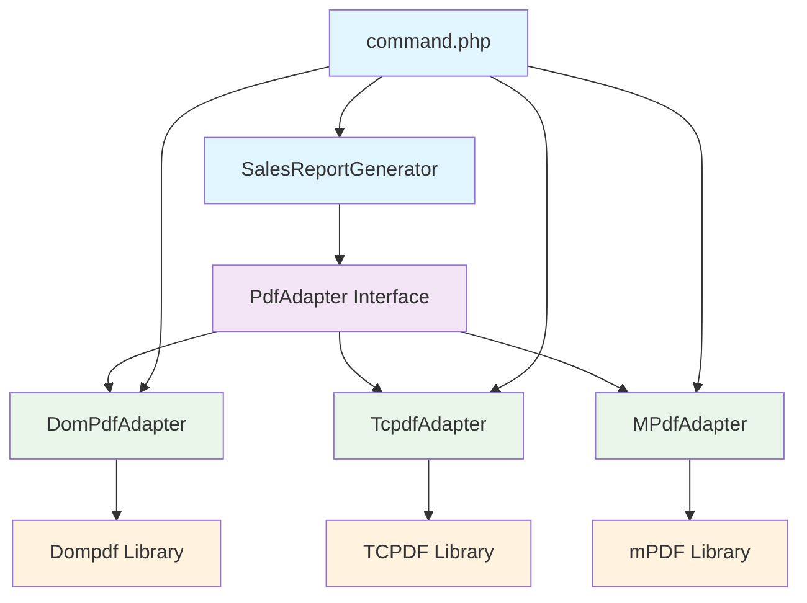
```mermaid
graph TD
    A[SalesReportGenerator] --> B[PdfAdapter Interface]
    B --> C[DomPdfAdapter]
    B --> D[TcpdfAdapter]
    B --> E[MPdfAdapter]
    
    C --> F[Dompdf Library]
    D --> G[TCPDF Library]
    E --> H[mPDF Library]
    
    I[command.php] --> A
    I --> C
    I --> D
    I --> E
    
    classDef client fill:#e1f5fe
    classDef interface fill:#f3e5f5
    classDef adapter fill:#e8f5e8
    classDef library fill:#fff3e0
    
    class A,I client
    class B interface
    class C,D,E adapter
    class F,G,H library
```

## 🎯 Padrões de Implementação

### 1. Interface Target

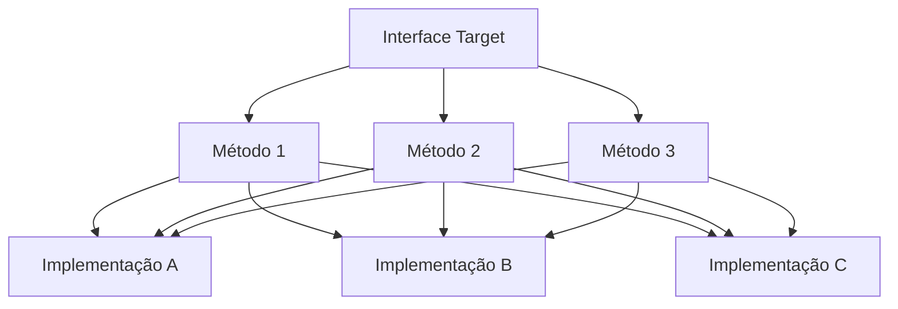
```mermaid
graph TD
    A[Interface Target] --> B[Método 1]
    A --> C[Método 2]
    A --> D[Método 3]
    
    B --> E[Implementação A]
    B --> F[Implementação B]
    B --> G[Implementação C]
    
    C --> E
    C --> F
    C --> G
    
    D --> E
    D --> F
    D --> G
```

### 2. Adapter com Múltiplas Implementações

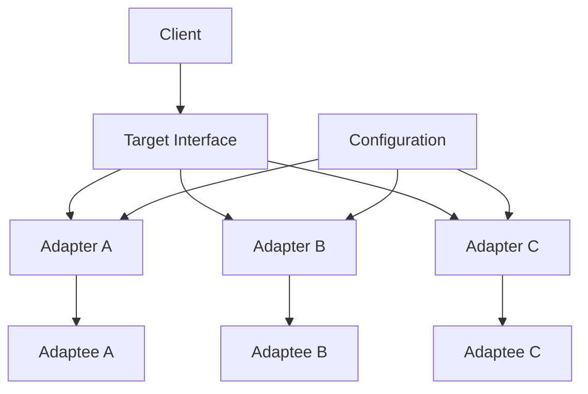
```mermaid
graph TD
    A[Client] --> B[Target Interface]
    B --> C[Adapter A]
    B --> D[Adapter B]
    B --> E[Adapter C]
    
    C --> F[Adaptee A]
    D --> G[Adaptee B]
    E --> H[Adaptee C]
    
    I[Configuration] --> C
    I --> D
    I --> E
```

## 🔧 Variações do Padrão

### 1. Object Adapter

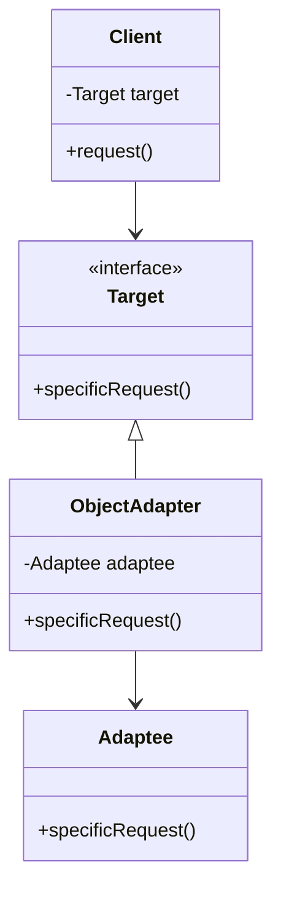
```mermaid
classDiagram
    class Client {
        -Target target
        +request()
    }
    
    class Target {
        <<interface>>
        +specificRequest()
    }
    
    class ObjectAdapter {
        -Adaptee adaptee
        +specificRequest()
    }
    
    class Adaptee {
        +specificRequest()
    }
    
    Client --> Target
    Target <|-- ObjectAdapter
    ObjectAdapter --> Adaptee
```

### 2. Class Adapter

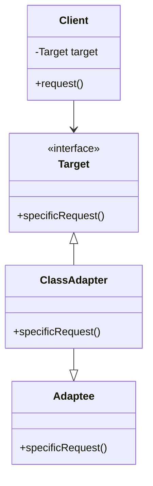
```mermaid
classDiagram
    class Client {
        -Target target
        +request()
    }
    
    class Target {
        <<interface>>
        +specificRequest()
    }
    
    class ClassAdapter {
        +specificRequest()
    }
    
    class Adaptee {
        +specificRequest()
    }
    
    Client --> Target
    Target <|-- ClassAdapter
    ClassAdapter --|> Adaptee
```

### 3. Adapter com Decorator

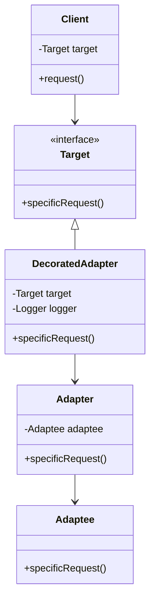
```mermaid
classDiagram
    class Client {
        -Target target
        +request()
    }
    
    class Target {
        <<interface>>
        +specificRequest()
    }
    
    class DecoratedAdapter {
        -Target target
        -Logger logger
        +specificRequest()
    }
    
    class Adapter {
        -Adaptee adaptee
        +specificRequest()
    }
    
    class Adaptee {
        +specificRequest()
    }
    
    Client --> Target
    Target <|-- DecoratedAdapter
    DecoratedAdapter --> Adapter
    Adapter --> Adaptee
```

## 📈 Métricas e Monitoramento

### Diagrama de Métricas

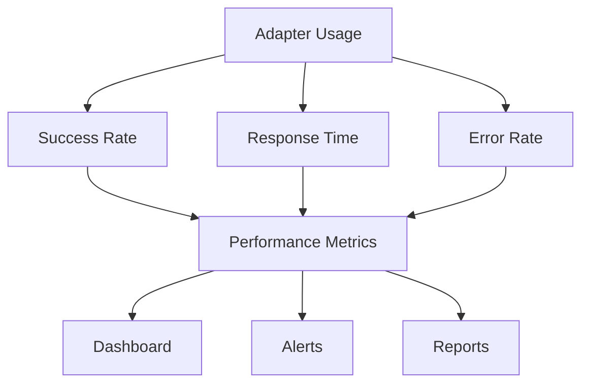
```mermaid
graph TD
    A[Adapter Usage] --> B[Success Rate]
    A --> C[Response Time]
    A --> D[Error Rate]
    
    B --> E[Performance Metrics]
    C --> E
    D --> E
    
    E --> F[Dashboard]
    E --> G[Alerts]
    E --> H[Reports]
```

### Tabela de Métricas

| Métrica | Descrição | Valor Ideal |
|---------|------------|--------------|
| **Taxa de Sucesso** | % de operações bem-sucedidas | > 99% |
| **Tempo de Resposta** | Latência média das operações | < 100ms |
| **Taxa de Erro** | % de operações que falharam | < 1% |
| **Throughput** | Operações por segundo | > 1000 |

## 🚀 Extensões Avançadas

### 1. Adapter Factory

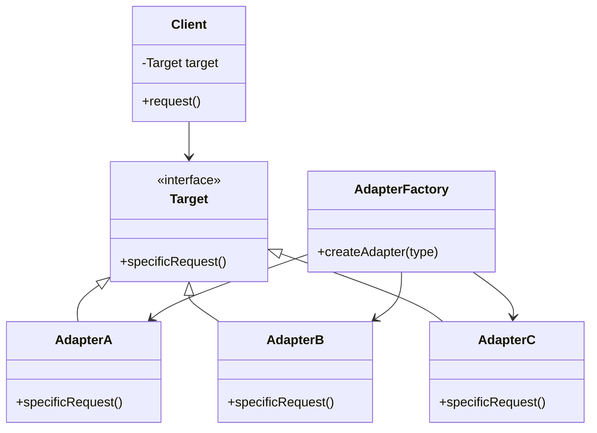
```mermaid
classDiagram
    class Client {
        -Target target
        +request()
    }
    
    class Target {
        <<interface>>
        +specificRequest()
    }
    
    class AdapterFactory {
        +createAdapter(type)
    }
    
    class AdapterA {
        +specificRequest()
    }
    
    class AdapterB {
        +specificRequest()
    }
    
    class AdapterC {
        +specificRequest()
    }
    
    Client --> Target
    Target <|-- AdapterA
    Target <|-- AdapterB
    Target <|-- AdapterC
    AdapterFactory --> AdapterA
    AdapterFactory --> AdapterB
    AdapterFactory --> AdapterC
```

### 2. Adapter Chain

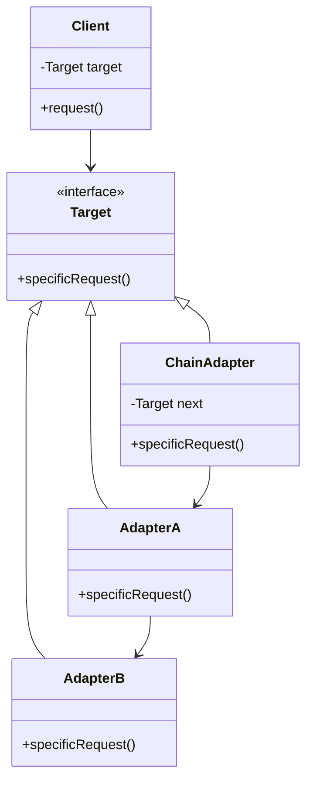
```mermaid
classDiagram
    class Client {
        -Target target
        +request()
    }
    
    class Target {
        <<interface>>
        +specificRequest()
    }
    
    class ChainAdapter {
        -Target next
        +specificRequest()
    }
    
    class AdapterA {
        +specificRequest()
    }
    
    class AdapterB {
        +specificRequest()
    }
    
    Client --> Target
    Target <|-- ChainAdapter
    Target <|-- AdapterA
    Target <|-- AdapterB
    ChainAdapter --> AdapterA
    AdapterA --> AdapterB
```

### 3. Adapter Pool

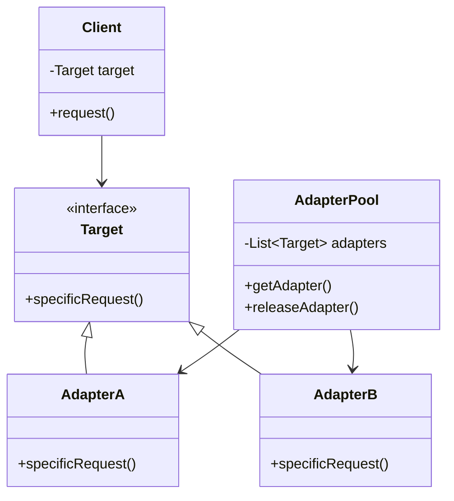
```mermaid
classDiagram
    class Client {
        -Target target
        +request()
    }
    
    class Target {
        <<interface>>
        +specificRequest()
    }
    
    class AdapterPool {
        -List~Target~ adapters
        +getAdapter()
        +releaseAdapter()
    }
    
    class AdapterA {
        +specificRequest()
    }
    
    class AdapterB {
        +specificRequest()
    }
    
    Client --> Target
    Target <|-- AdapterA
    Target <|-- AdapterB
    AdapterPool --> AdapterA
    AdapterPool --> AdapterB
```

## 🎯 Casos de Uso Específicos

### 1. Sistema de Pagamentos

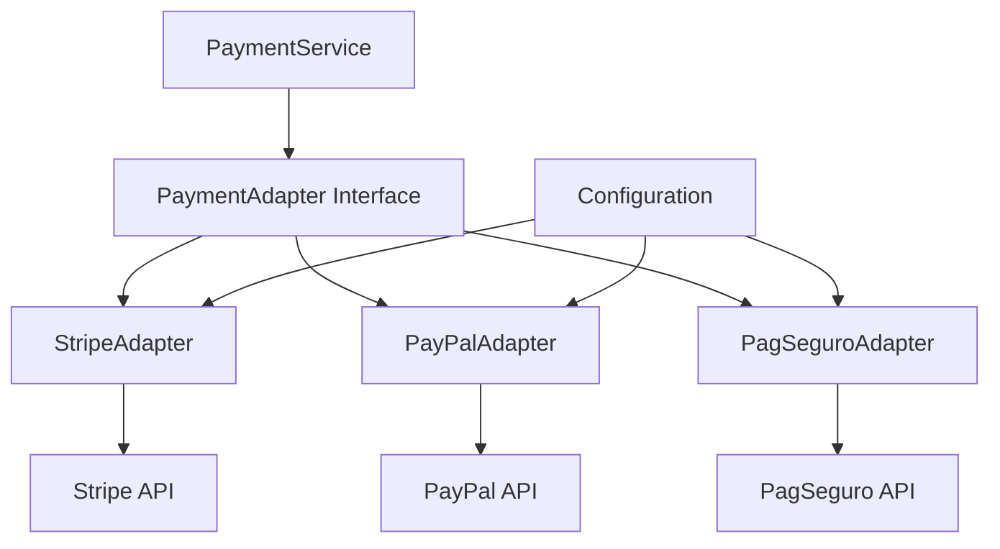
```mermaid
graph TD
    A[PaymentService] --> B[PaymentAdapter Interface]
    B --> C[StripeAdapter]
    B --> D[PayPalAdapter]
    B --> E[PagSeguroAdapter]
    
    C --> F[Stripe API]
    D --> G[PayPal API]
    E --> H[PagSeguro API]
    
    I[Configuration] --> C
    I --> D
    I --> E
```

### 2. Sistema de Notificações

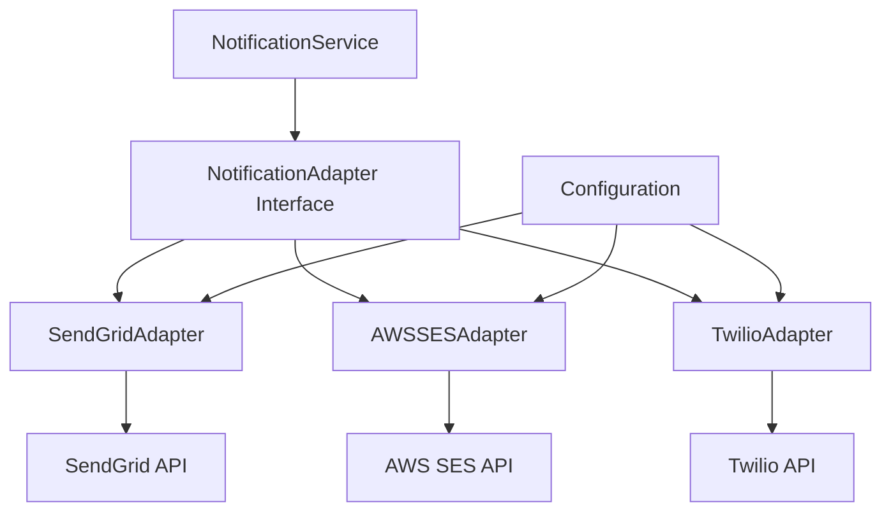
```mermaid
graph TD
    A[NotificationService] --> B[NotificationAdapter Interface]
    B --> C[SendGridAdapter]
    B --> D[AWSSESAdapter]
    B --> E[TwilioAdapter]
    
    C --> F[SendGrid API]
    D --> G[AWS SES API]
    E --> H[Twilio API]
    
    I[Configuration] --> C
    I --> D
    I --> E
```

### 3. Sistema de Armazenamento

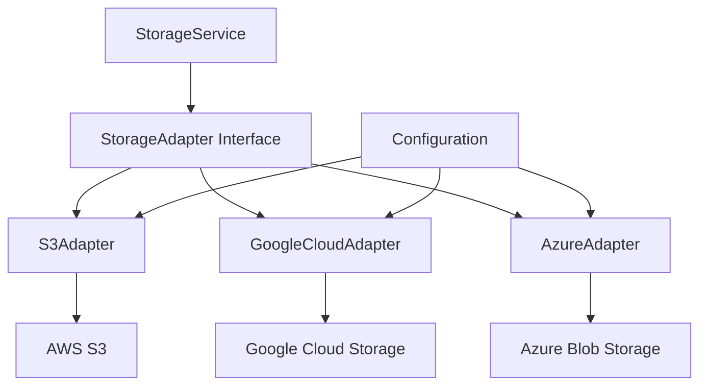
```mermaid
graph TD
    A[StorageService] --> B[StorageAdapter Interface]
    B --> C[S3Adapter]
    B --> D[GoogleCloudAdapter]
    B --> E[AzureAdapter]
    
    C --> F[AWS S3]
    D --> G[Google Cloud Storage]
    E --> H[Azure Blob Storage]
    
    I[Configuration] --> C
    I --> D
    I --> E
```

## 🔧 Implementação por Linguagem

### PHP
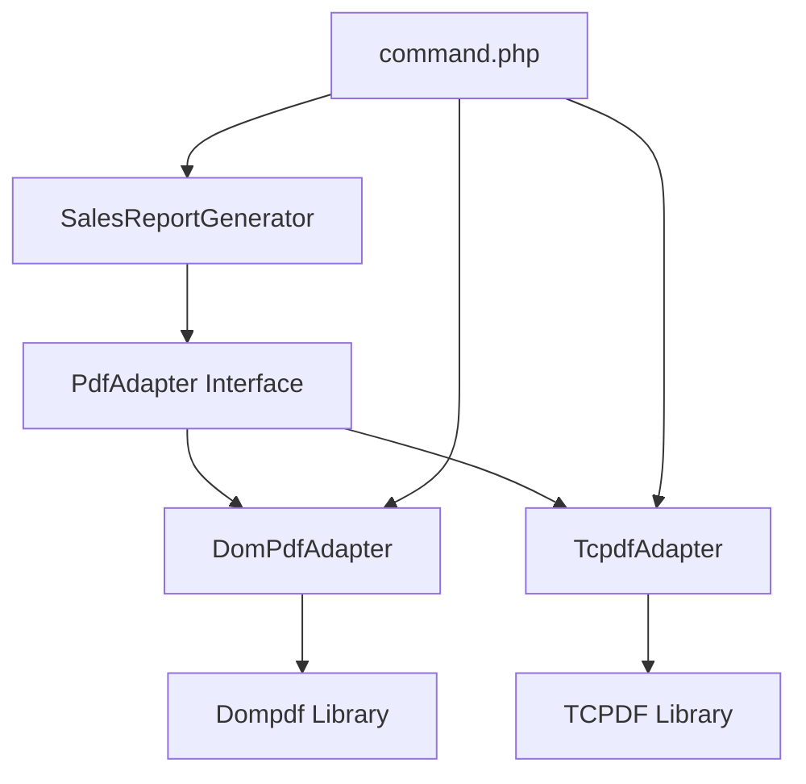
```mermaid
graph TD
    A[SalesReportGenerator] --> B[PdfAdapter Interface]
    B --> C[DomPdfAdapter]
    B --> D[TcpdfAdapter]
    
    C --> E[Dompdf Library]
    D --> F[TCPDF Library]
    
    G[command.php] --> A
    G --> C
    G --> D
```

### Python
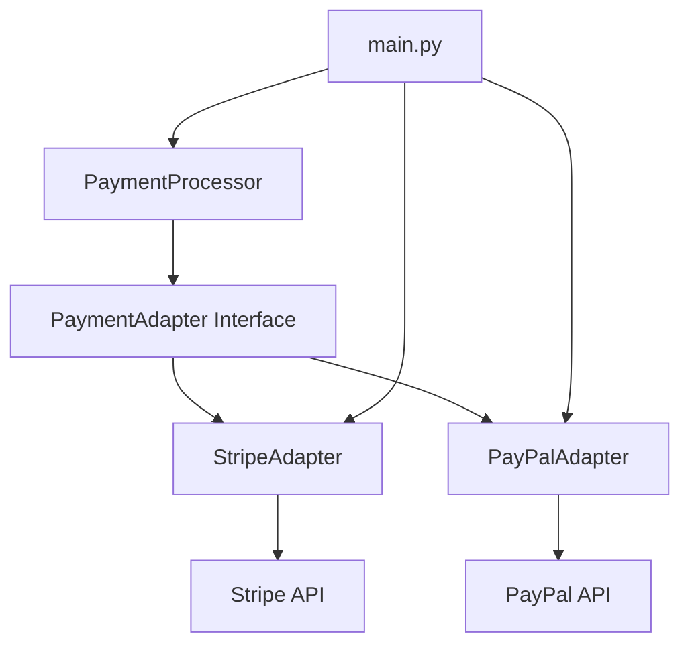
```mermaid
graph TD
    A[PaymentProcessor] --> B[PaymentAdapter Interface]
    B --> C[StripeAdapter]
    B --> D[PayPalAdapter]
    
    C --> E[Stripe API]
    D --> F[PayPal API]
    
    G[main.py] --> A
    G --> C
    G --> D
```

### TypeScript
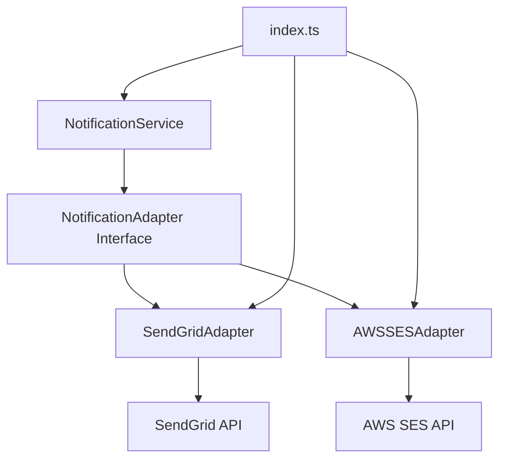
```mermaid
graph TD
    A[NotificationService] --> B[NotificationAdapter Interface]
    B --> C[SendGridAdapter]
    B --> D[AWSSESAdapter]
    
    C --> E[SendGrid API]
    D --> F[AWS SES API]
    
    G[index.ts] --> A
    G --> C
    G --> D
```

## 📊 Comparação de Implementações

### Sem Padrão Adapter
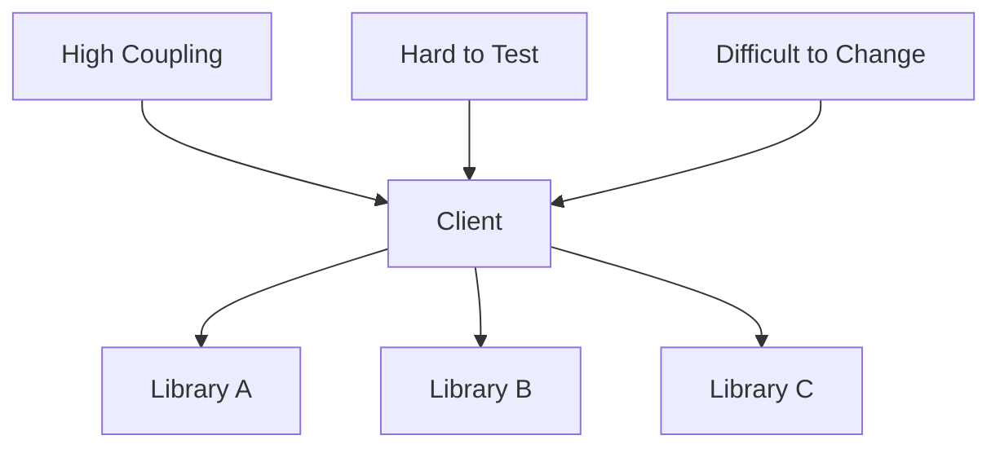
```mermaid
graph TD
    A[Client] --> B[Library A]
    A --> C[Library B]
    A --> D[Library C]
    
    E[High Coupling] --> A
    F[Hard to Test] --> A
    G[Difficult to Change] --> A
```

### Com Padrão Adapter
```mermaid
graph TD
    A[Client] --> B[Adapter Interface]
    B --> C[Adapter A]
    B --> D[Adapter B]
    B --> E[Adapter C]
    
    C --> F[Library A]
    D --> G[Library B]
    E --> H[Library C]
    
    I[Low Coupling] --> A
    J[Easy to Test] --> A
    K[Easy to Change] --> A
```

## 🎯 Conclusão

Os diagramas apresentados mostram:

1. **Arquitetura clara** do padrão Adapter
2. **Fluxos de funcionamento** bem definidos
3. **Flexibilidade** para múltiplas implementações
4. **Extensibilidade** para casos complexos
5. **Monitoramento** e métricas de qualidade

O padrão Adapter oferece uma solução robusta e escalável para integrar sistemas incompatíveis, garantindo que o código cliente permaneça estável e testável.

---

**Última atualização**: $(date)
**Mantenedor**: Equipe Skynet
**Versão**: 1.0


