# Diagramas do Padrão Adapter

## 📊 Arquitetura Geral

### Diagrama de Classes


### Componentes do Padrão

| Componente | Responsabilidade | Exemplo |
|------------|------------------|---------|
| **Client** | Usa a interface Target | `SalesReportGenerator` |
| **Target** | Interface que o cliente espera | `PdfAdapter` |
| **Adapter** | Implementa Target e envolve Adaptee | `DomPdfAdapter` |
| **Adaptee** | Classe existente a ser adaptada | `Dompdf` |

## 🔄 Fluxo de Funcionamento

### Diagrama de Sequência - Fluxo Normal


### Diagrama de Sequência - Troca de Biblioteca


## 🏗️ Arquitetura Detalhada

### Estrutura de Arquivos

```
src/
├── Adapter/
│   ├── PdfAdapter.php           # Interface Target
│   ├── DomPdfAdapter.php        # Adapter para DomPDF
│   └── TcpdfAdapter.php         # Adapter para TCPDF
├── SalesReportGenerator.php     # Cliente
└── command.php                  # Código cliente
```

### Diagrama de Dependências


## 🎯 Padrões de Implementação

### 1. Interface Target

```mermaid
graph TD
    A[Interface Target] --> B[Método 1]
    A --> C[Método 2]
    A --> D[Método 3]
    
    B --> E[Implementação A]
    B --> F[Implementação B]
    B --> G[Implementação C]
    
    C --> E
    C --> F
    C --> G
    
    D --> E
    D --> F
    D --> G
```



### 2. Adapter com Múltiplas Implementações


## 🔧 Variações do Padrão

### 1. Object Adapter


### 2. Class Adapter


### 3. Adapter com Decorator


## 📈 Métricas e Monitoramento

### Diagrama de Métricas


### Tabela de Métricas

| Métrica | Descrição | Valor Ideal |
|---------|------------|--------------|
| **Taxa de Sucesso** | % de operações bem-sucedidas | > 99% |
| **Tempo de Resposta** | Latência média das operações | < 100ms |
| **Taxa de Erro** | % de operações que falharam | < 1% |
| **Throughput** | Operações por segundo | > 1000 |

## 🚀 Extensões Avançadas

### 1. Adapter Factory


### 2. Adapter Chain


### 3. Adapter Pool


## 🎯 Casos de Uso Específicos

### 1. Sistema de Pagamentos


### 2. Sistema de Notificações


### 3. Sistema de Armazenamento


## 🔧 Implementação por Linguagem

### PHP


### Python


### TypeScript


## 📊 Comparação de Implementações

### Sem Padrão Adapter


### Com Padrão Adapter
```mermaid
graph TD
    A[Client] --> B[Adapter Interface]
    B --> C[Adapter A]
    B --> D[Adapter B]
    B --> E[Adapter C]
    
    C --> F[Library A]
    D --> G[Library B]
    E --> H[Library C]
    
    I[Low Coupling] --> A
    J[Easy to Test] --> A
    K[Easy to Change] --> A
```

## 🎯 Conclusão

Os diagramas apresentados mostram:

1. **Arquitetura clara** do padrão Adapter
2. **Fluxos de funcionamento** bem definidos
3. **Flexibilidade** para múltiplas implementações
4. **Extensibilidade** para casos complexos
5. **Monitoramento** e métricas de qualidade

O padrão Adapter oferece uma solução robusta e escalável para integrar sistemas incompatíveis, garantindo que o código cliente permaneça estável e testável.

---

**Última atualização**: $(date)
**Mantenedor**: Equipe Skynet
**Versão**: 1.0


