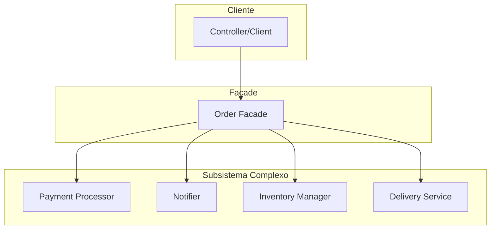
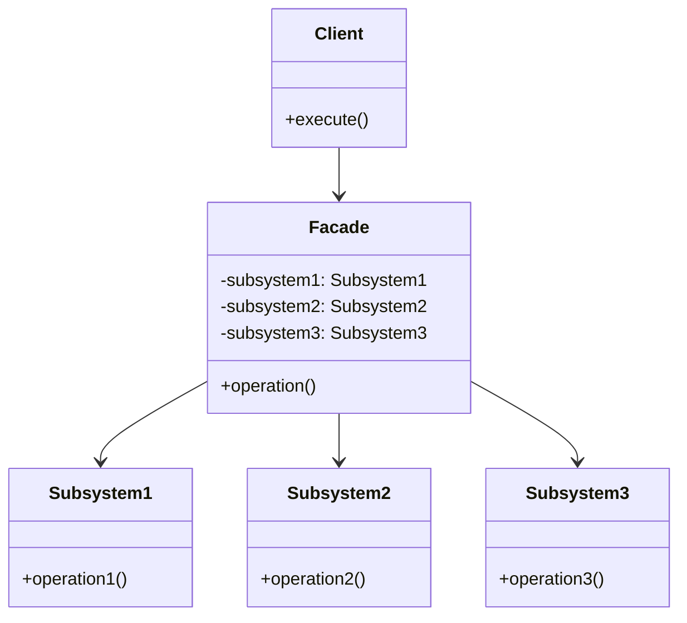

# Padrão Facade (Fachada)

## 🎯 Visão Geral

O **Padrão Facade** é um padrão estrutural que fornece uma interface simplificada para um subsistema complexo. É uma interface entre o código cliente e a complexidade que se deseja ocultar, tornando o código mais estável e fácil de usar.

## 🏗️ Características Importantes

### **Padrão Mais Simples de Implementar**
- **Extremamente fácil** de implementar
- **Sem sombra de dúvidas** o padrão mais simples
- **Agnóstico de linguagem** - funciona em qualquer linguagem
- **Aplicável** em qualquer framework

### **Oculta Complexidade**
- **Interface simplificada** para subsistemas complexos
- **Encapsula** instanciação de objetos
- **Controla** fluxo de regras de negócio
- **Centraliza** lógica de controle

## 🚨 Problema que Resolve

### Cenário: Sistema de E-commerce

Imagine um sistema de e-commerce onde um pedido precisa passar por múltiplas etapas complexas.

#### ❌ **Problema sem Facade**

```php
class OrderController 
{
    public function createOrder(Request $request): JsonResponse 
    {
        $orderDetails = $request->get('order_details');
        
        // Problema: Controller conhece demais sobre o fluxo
        $paymentProcessor = new PaymentProcessor();
        $paymentProcessor->processPayment($orderDetails);
        
        $notifier = new Notifier();
        $notifier->sendConfirmation($orderDetails);
        
        $inventoryManager = new InventoryManager();
        $inventoryManager->updateStock($orderDetails);
        
        $deliveryService = new DeliveryService();
        $deliveryService->initializeDelivery($orderDetails);
        
        return new JsonResponse(['status' => 'success']);
    }
}
```

#### 🔥 **Problemas Identificados**

1. **Controller Conhece Demais**
   - Sabe sobre fluxo de processamento
   - Conhece ordem das operações
   - Entende regras de negócio

2. **Violação de Responsabilidade**
   - Controller não deveria gerenciar fluxo
   - Mistura de responsabilidades
   - Dificulta manutenção

3. **Duplicação de Código**
   - Mesmo fluxo em múltiplos controllers
   - Dificuldade para lembrar todos os lugares
   - Inconsistência entre implementações

4. **Ordem Crítica**
   - Se inverter ordem, pode dar problema
   - Enviar confirmação antes de processar pagamento
   - Falha em uma etapa quebra todo o fluxo

## 🏗️ Arquitetura da Solução

### Componentes do Facade



### Estrutura de Classes



## ✅ Vantagens

### 1. **Simplicidade**
- **Interface única** para subsistema complexo
- **Fácil de usar** para o cliente
- **Oculta complexidade** interna

### 2. **Desacoplamento**
- **Cliente não conhece** detalhes internos
- **Independência** entre cliente e subsistema
- **Flexibilidade** para mudanças internas

### 3. **Manutenibilidade**
- **Centralização** da lógica complexa
- **Fácil modificação** do fluxo
- **Consistência** entre diferentes pontos de uso

### 4. **Reutilização**
- **Múltiplos clientes** podem usar a mesma facade
- **Elimina duplicação** de código
- **Padronização** do comportamento

## ❌ Desvantagens

### 1. **Potencial Violação do SRP**
- **Múltiplas responsabilidades** em uma classe
- **Filosofia do SRP** pode ser questionada
- **Debate polêmico** sobre o padrão

### 2. **Acoplamento com Subsistema**
- **Dependência** das classes do subsistema
- **Mudanças** no subsistema afetam a facade
- **Dificuldade** para testar isoladamente

### 3. **Complexidade Interna**
- **Pode crescer** muito com o tempo
- **Dificulta entendimento** do fluxo completo
- **Manutenção** pode se tornar complexa

### 4. **Limitações de Flexibilidade**
- **Interface fixa** pode limitar casos específicos
- **Dificuldade** para customizações
- **Over-engineering** para casos simples

## 🎯 Casos de Uso Comuns

### 1. **Sistemas de E-commerce**
- Processamento de pedidos
- Gestão de estoque
- Processamento de pagamentos
- Logística de entrega

### 2. **Sistemas de Notificação**
- Envio de emails
- Notificações push
- SMS e WhatsApp
- Integração com redes sociais

### 3. **Sistemas de Autenticação**
- Login e registro
- Validação de credenciais
- Gerenciamento de sessões
- Integração com OAuth

### 4. **Sistemas de Relatórios**
- Geração de relatórios
- Exportação de dados
- Envio por email
- Armazenamento em nuvem

### 5. **Sistemas de Pagamento**
- Processamento de pagamentos
- Validação de cartões
- Integração com gateways
- Gestão de transações

## 🔄 Comparação: Com vs Sem Facade

### ❌ **Sem Facade (Problema)**

```php
// Controller com muita responsabilidade
class OrderController 
{
    public function createOrder(Request $request): JsonResponse 
    {
        $orderDetails = $request->get('order_details');
        
        // Controller conhece demais sobre o fluxo
        $paymentProcessor = new PaymentProcessor();
        $paymentProcessor->processPayment($orderDetails);
        
        $notifier = new Notifier();
        $notifier->sendConfirmation($orderDetails);
        
        $inventoryManager = new InventoryManager();
        $inventoryManager->updateStock($orderDetails);
        
        $deliveryService = new DeliveryService();
        $deliveryService->initializeDelivery($orderDetails);
        
        return new JsonResponse(['status' => 'success']);
    }
}
```

**Problemas:**
- Controller conhece demais sobre o fluxo
- Violação de responsabilidade única
- Duplicação de código
- Ordem crítica das operações

### ✅ **Com Facade (Solução)**

```php
// Facade que encapsula a complexidade
class OrderFacade 
{
    private PaymentProcessor $paymentProcessor;
    private Notifier $notifier;
    private InventoryManager $inventoryManager;
    private DeliveryService $deliveryService;
    
    public function __construct() 
    {
        $this->paymentProcessor = new PaymentProcessor();
        $this->notifier = new Notifier();
        $this->inventoryManager = new InventoryManager();
        $this->deliveryService = new DeliveryService();
    }
    
    public function processOrder(array $orderDetails): void 
    {
        // Encapsula todo o fluxo complexo
        $this->paymentProcessor->processPayment($orderDetails);
        $this->notifier->sendConfirmation($orderDetails);
        $this->inventoryManager->updateStock($orderDetails);
        $this->deliveryService->initializeDelivery($orderDetails);
    }
}

// Controller simplificado
class OrderController 
{
    private OrderFacade $orderFacade;
    
    public function __construct(OrderFacade $orderFacade) 
    {
        $this->orderFacade = $orderFacade;
    }
    
    public function createOrder(Request $request): JsonResponse 
    {
        $orderDetails = $request->get('order_details');
        
        // Apenas chama a facade
        $this->orderFacade->processOrder($orderDetails);
        
        return new JsonResponse(['status' => 'success']);
    }
}
```

**Benefícios:**
- Controller simplificado
- Complexidade encapsulada
- Fácil reutilização
- Manutenção centralizada

## 🛠️ Boas Práticas

### 1. **Use Facade Quando:**
- **Subsistema complexo** com múltiplas classes
- **Fluxo de operações** bem definido
- **Múltiplos clientes** precisam da mesma funcionalidade
- **Necessidade** de simplificar interface

### 2. **Evite Facade Quando:**
- **Subsistema simples** com poucas classes
- **Necessidade** de flexibilidade máxima
- **Casos específicos** que não se encaixam no padrão
- **Over-engineering** para casos simples

### 3. **Implementação Correta:**
- **Interface única** e clara
- **Encapsulamento** completo da complexidade
- **Documentação** clara do comportamento
- **Testes** para validar o fluxo

### 4. **Cuidados com SRP:**
- **Debate polêmico** sobre violação do SRP
- **Filosofia** do princípio pode ser questionada
- **Contexto** é importante para decisão
- **Parcimônia** na aplicação do padrão

## 🔧 Extensões Avançadas

### 1. **Facade com Strategy**
- **Múltiplas implementações** da facade
- **Estratégias diferentes** para o mesmo fluxo
- **Flexibilidade** na escolha da implementação

### 2. **Facade com Builder**
- **Configuração complexa** da facade
- **Parâmetros opcionais** para o fluxo
- **Validação** de configuração

### 3. **Facade com Observer**
- **Notificações** sobre o progresso
- **Eventos** durante o processamento
- **Monitoramento** do fluxo

### 4. **Facade com Command**
- **Operações** podem ser desfeitas
- **Histórico** de operações
- **Rollback** em caso de falha

## 📊 Quando Usar Facade

### **Indicadores Positivos**
- **Subsistema complexo** com muitas classes
- **Fluxo bem definido** e estável
- **Múltiplos clientes** precisam da funcionalidade
- **Necessidade** de simplificar interface

### **Indicadores Negativos**
- **Subsistema simples** com poucas classes
- **Necessidade** de flexibilidade máxima
- **Casos específicos** que não se encaixam
- **Over-engineering** para casos simples

### **Alternativas**
- **Service Layer** para casos mais simples
- **Command Pattern** para operações complexas
- **Mediator Pattern** para coordenação
- **Strategy Pattern** para flexibilidade

## 🎯 Conclusão

O padrão Facade é uma ferramenta poderosa para simplificar interfaces complexas, mas deve ser usado com sabedoria. É o padrão mais simples de implementar, mas pode gerar debate sobre violação do SRP.

**Use quando:** Subsistema complexo, fluxo bem definido, múltiplos clientes
**Evite quando:** Subsistema simples, necessidade de flexibilidade máxima
**Lembre-se:** É uma interface que oculta complexidade, não resolve todos os problemas


