# Diagramas - Padrão Facade

## 🏗️ Arquitetura Geral

### Estrutura de Classes

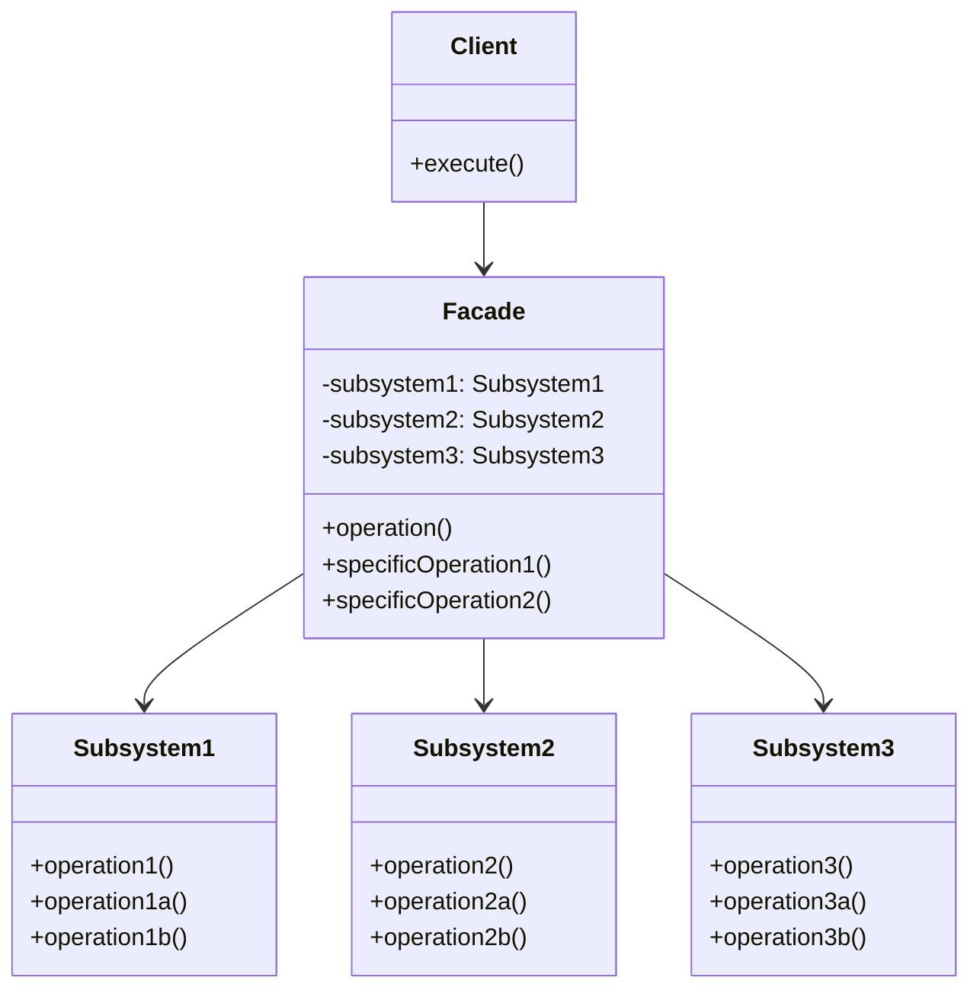
```mermaid
classDiagram
    class Client {
        +execute()
    }
    
    class Facade {
        -subsystem1: Subsystem1
        -subsystem2: Subsystem2
        -subsystem3: Subsystem3
        +operation()
        +specificOperation1()
        +specificOperation2()
    }
    
    class Subsystem1 {
        +operation1()
        +operation1a()
        +operation1b()
    }
    
    class Subsystem2 {
        +operation2()
        +operation2a()
        +operation2b()
    }
    
    class Subsystem3 {
        +operation3()
        +operation3a()
        +operation3b()
    }
    
    Client --> Facade
    Facade --> Subsystem1
    Facade --> Subsystem2
    Facade --> Subsystem3
```

### Diagrama de Componentes

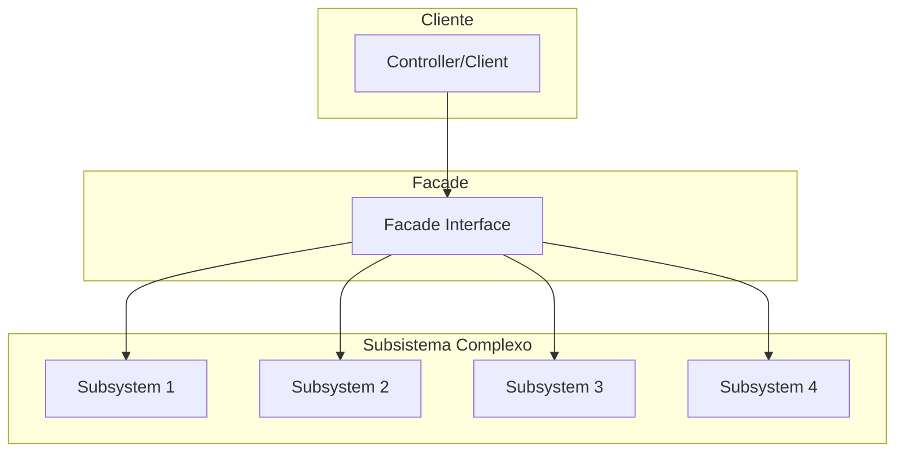
```mermaid
graph TB
    subgraph "Cliente"
        C[Controller/Client]
    end
    
    subgraph "Facade"
        F[Facade Interface]
    end
    
    subgraph "Subsistema Complexo"
        S1[Subsystem 1]
        S2[Subsystem 2]
        S3[Subsystem 3]
        S4[Subsystem 4]
    end
    
    C --> F
    F --> S1
    F --> S2
    F --> S3
    F --> S4
```

## 🔄 Fluxos de Funcionamento

### Fluxo Básico do Facade

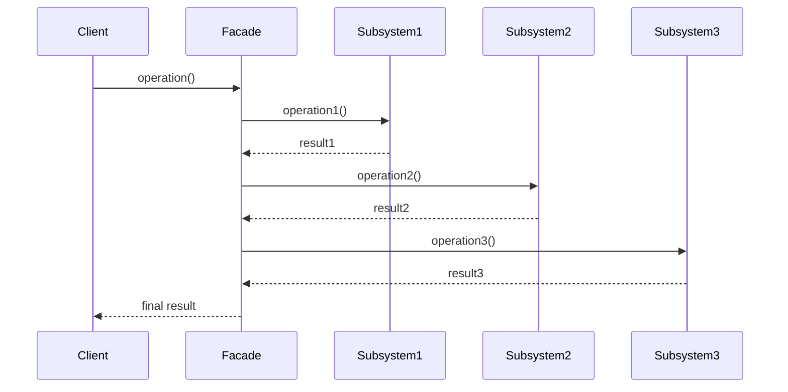
```mermaid
sequenceDiagram
    participant Client
    participant Facade
    participant Subsystem1
    participant Subsystem2
    participant Subsystem3
    
    Client->>Facade: operation()
    Facade->>Subsystem1: operation1()
    Subsystem1-->>Facade: result1
    Facade->>Subsystem2: operation2()
    Subsystem2-->>Facade: result2
    Facade->>Subsystem3: operation3()
    Subsystem3-->>Facade: result3
    Facade-->>Client: final result
```

### Fluxo com Tratamento de Erros

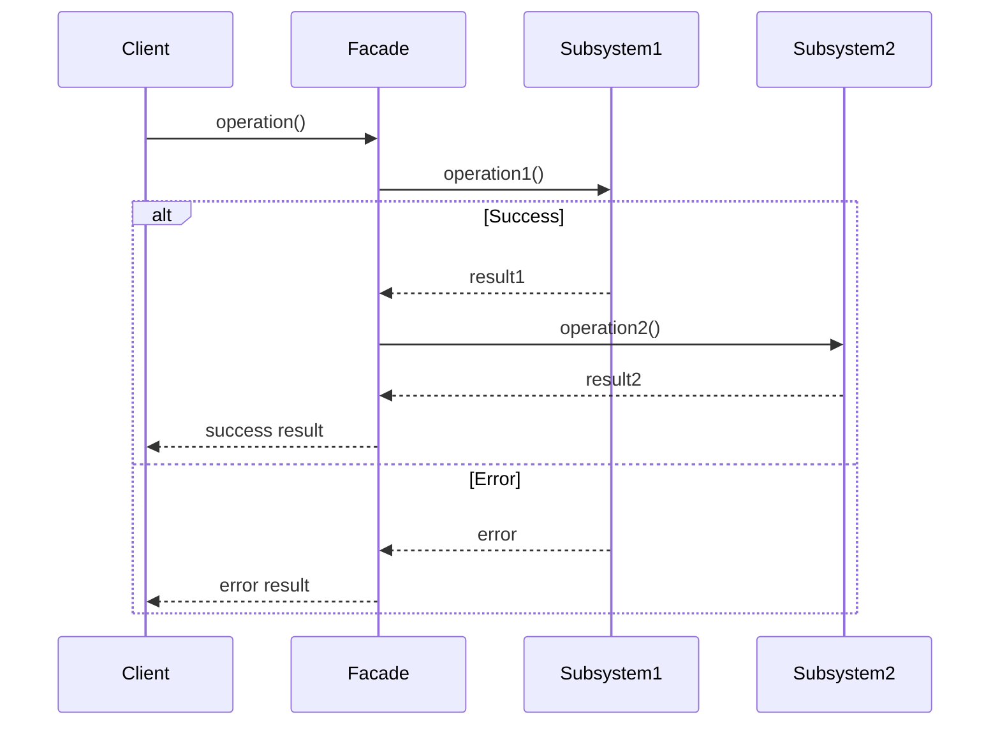
```mermaid
sequenceDiagram
    participant Client
    participant Facade
    participant Subsystem1
    participant Subsystem2
    
    Client->>Facade: operation()
    Facade->>Subsystem1: operation1()
    
    alt Success
        Subsystem1-->>Facade: result1
        Facade->>Subsystem2: operation2()
        Subsystem2-->>Facade: result2
        Facade-->>Client: success result
    else Error
        Subsystem1-->>Facade: error
        Facade-->>Client: error result
    end
```

### Fluxo de Operações Específicas

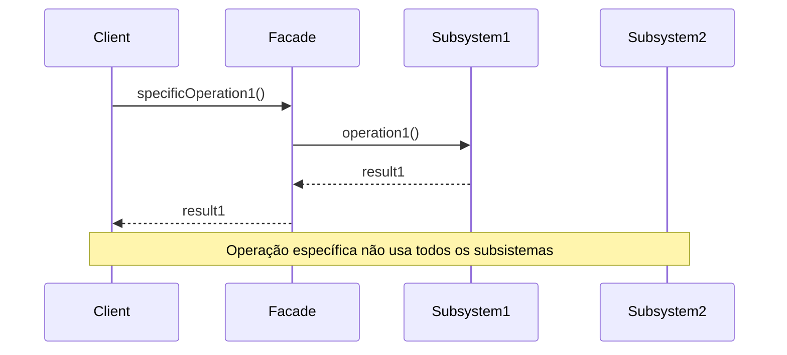
```mermaid
sequenceDiagram
    participant Client
    participant Facade
    participant Subsystem1
    participant Subsystem2
    
    Client->>Facade: specificOperation1()
    Facade->>Subsystem1: operation1()
    Subsystem1-->>Facade: result1
    Facade-->>Client: result1
    
    Note over Client,Subsystem2: Operação específica não usa todos os subsistemas
```

## 🎯 Casos de Uso Específicos

### Sistema de E-commerce

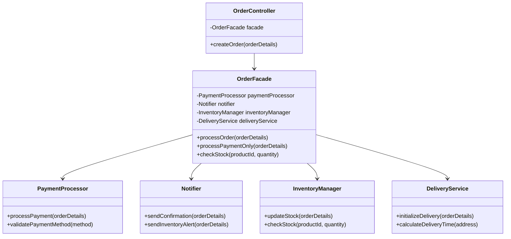
```mermaid
classDiagram
    class OrderController {
        -OrderFacade facade
        +createOrder(orderDetails)
    }
    
    class OrderFacade {
        -PaymentProcessor paymentProcessor
        -Notifier notifier
        -InventoryManager inventoryManager
        -DeliveryService deliveryService
        +processOrder(orderDetails)
        +processPaymentOnly(orderDetails)
        +checkStock(productId, quantity)
    }
    
    class PaymentProcessor {
        +processPayment(orderDetails)
        +validatePaymentMethod(method)
    }
    
    class Notifier {
        +sendConfirmation(orderDetails)
        +sendInventoryAlert(orderDetails)
    }
    
    class InventoryManager {
        +updateStock(orderDetails)
        +checkStock(productId, quantity)
    }
    
    class DeliveryService {
        +initializeDelivery(orderDetails)
        +calculateDeliveryTime(address)
    }
    
    OrderController --> OrderFacade
    OrderFacade --> PaymentProcessor
    OrderFacade --> Notifier
    OrderFacade --> InventoryManager
    OrderFacade --> DeliveryService
```

### Sistema de Notificação

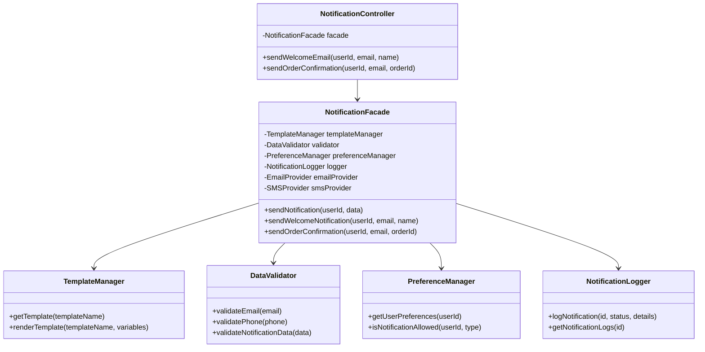
```mermaid
classDiagram
    class NotificationController {
        -NotificationFacade facade
        +sendWelcomeEmail(userId, email, name)
        +sendOrderConfirmation(userId, email, orderId)
    }
    
    class NotificationFacade {
        -TemplateManager templateManager
        -DataValidator validator
        -PreferenceManager preferenceManager
        -NotificationLogger logger
        -EmailProvider emailProvider
        -SMSProvider smsProvider
        +sendNotification(userId, data)
        +sendWelcomeNotification(userId, email, name)
        +sendOrderConfirmation(userId, email, orderId)
    }
    
    class TemplateManager {
        +getTemplate(templateName)
        +renderTemplate(templateName, variables)
    }
    
    class DataValidator {
        +validateEmail(email)
        +validatePhone(phone)
        +validateNotificationData(data)
    }
    
    class PreferenceManager {
        +getUserPreferences(userId)
        +isNotificationAllowed(userId, type)
    }
    
    class NotificationLogger {
        +logNotification(id, status, details)
        +getNotificationLogs(id)
    }
    
    NotificationController --> NotificationFacade
    NotificationFacade --> TemplateManager
    NotificationFacade --> DataValidator
    NotificationFacade --> PreferenceManager
    NotificationFacade --> NotificationLogger
```

### Sistema de Autenticação

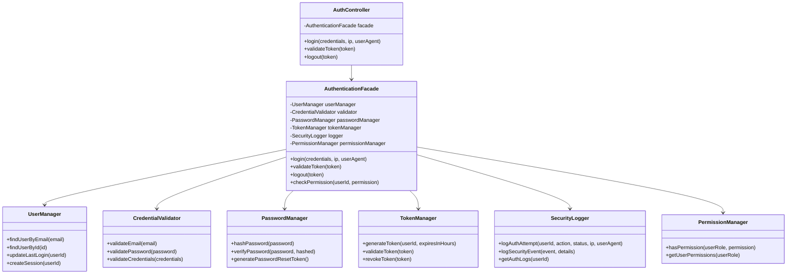
```mermaid
classDiagram
    class AuthController {
        -AuthenticationFacade facade
        +login(credentials, ip, userAgent)
        +validateToken(token)
        +logout(token)
    }
    
    class AuthenticationFacade {
        -UserManager userManager
        -CredentialValidator validator
        -PasswordManager passwordManager
        -TokenManager tokenManager
        -SecurityLogger logger
        -PermissionManager permissionManager
        +login(credentials, ip, userAgent)
        +validateToken(token)
        +logout(token)
        +checkPermission(userId, permission)
    }
    
    class UserManager {
        +findUserByEmail(email)
        +findUserById(id)
        +updateLastLogin(userId)
        +createSession(userId)
    }
    
    class CredentialValidator {
        +validateEmail(email)
        +validatePassword(password)
        +validateCredentials(credentials)
    }
    
    class PasswordManager {
        +hashPassword(password)
        +verifyPassword(password, hashed)
        +generatePasswordResetToken()
    }
    
    class TokenManager {
        +generateToken(userId, expiresInHours)
        +validateToken(token)
        +revokeToken(token)
    }
    
    class SecurityLogger {
        +logAuthAttempt(userId, action, status, ip, userAgent)
        +logSecurityEvent(event, details)
        +getAuthLogs(userId)
    }
    
    class PermissionManager {
        +hasPermission(userRole, permission)
        +getUserPermissions(userRole)
    }
    
    AuthController --> AuthenticationFacade
    AuthenticationFacade --> UserManager
    AuthenticationFacade --> CredentialValidator
    AuthenticationFacade --> PasswordManager
    AuthenticationFacade --> TokenManager
    AuthenticationFacade --> SecurityLogger
    AuthenticationFacade --> PermissionManager
```

## 🔧 Variações do Padrão

### Facade com Strategy

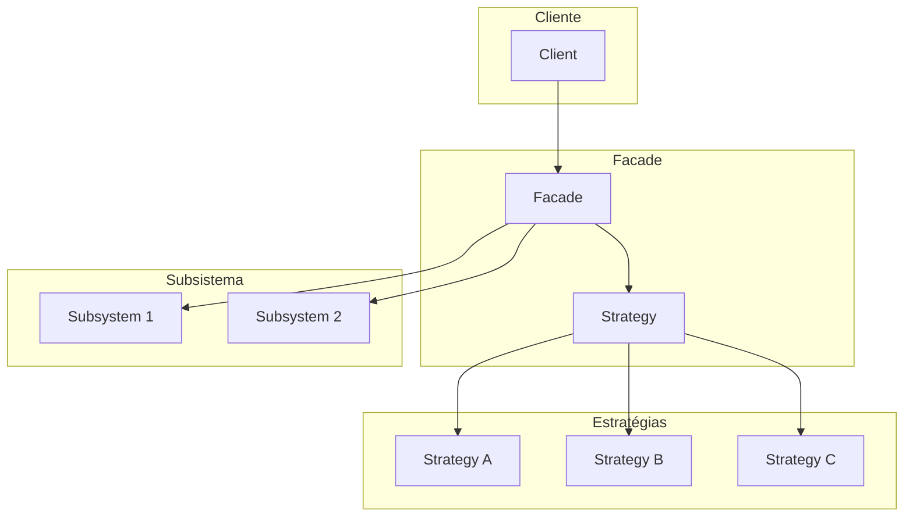
```mermaid
graph TB
    subgraph "Cliente"
        C[Client]
    end
    
    subgraph "Facade"
        F[Facade]
        S[Strategy]
    end
    
    subgraph "Estratégias"
        S1[Strategy A]
        S2[Strategy B]
        S3[Strategy C]
    end
    
    subgraph "Subsistema"
        SS1[Subsystem 1]
        SS2[Subsystem 2]
    end
    
    C --> F
    F --> S
    S --> S1
    S --> S2
    S --> S3
    F --> SS1
    F --> SS2
```

### Facade com Observer

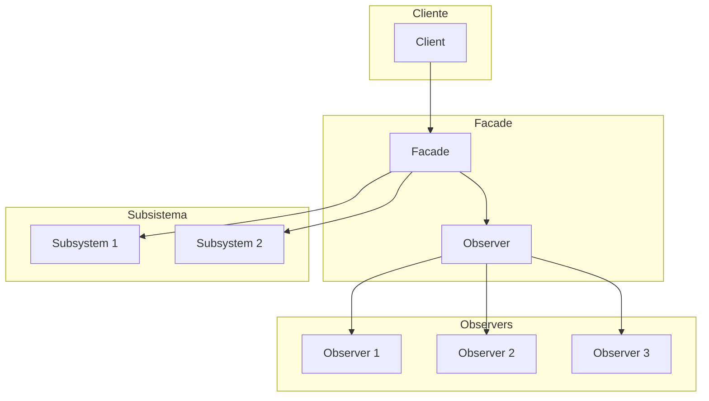
```mermaid
graph TB
    subgraph "Cliente"
        C[Client]
    end
    
    subgraph "Facade"
        F[Facade]
        O[Observer]
    end
    
    subgraph "Observers"
        O1[Observer 1]
        O2[Observer 2]
        O3[Observer 3]
    end
    
    subgraph "Subsistema"
        SS1[Subsystem 1]
        SS2[Subsystem 2]
    end
    
    C --> F
    F --> O
    O --> O1
    O --> O2
    O --> O3
    F --> SS1
    F --> SS2
```

### Facade com Command

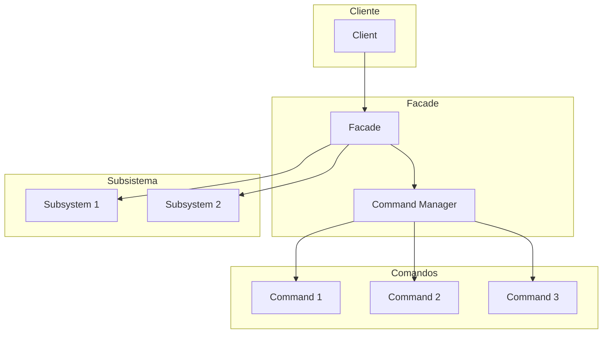
```mermaid
graph TB
    subgraph "Cliente"
        C[Client]
    end
    
    subgraph "Facade"
        F[Facade]
        CM[Command Manager]
    end
    
    subgraph "Comandos"
        C1[Command 1]
        C2[Command 2]
        C3[Command 3]
    end
    
    subgraph "Subsistema"
        SS1[Subsystem 1]
        SS2[Subsystem 2]
    end
    
    C --> F
    F --> CM
    CM --> C1
    CM --> C2
    CM --> C3
    F --> SS1
    F --> SS2
```

## 📊 Estados e Transições

### Estado da Facade

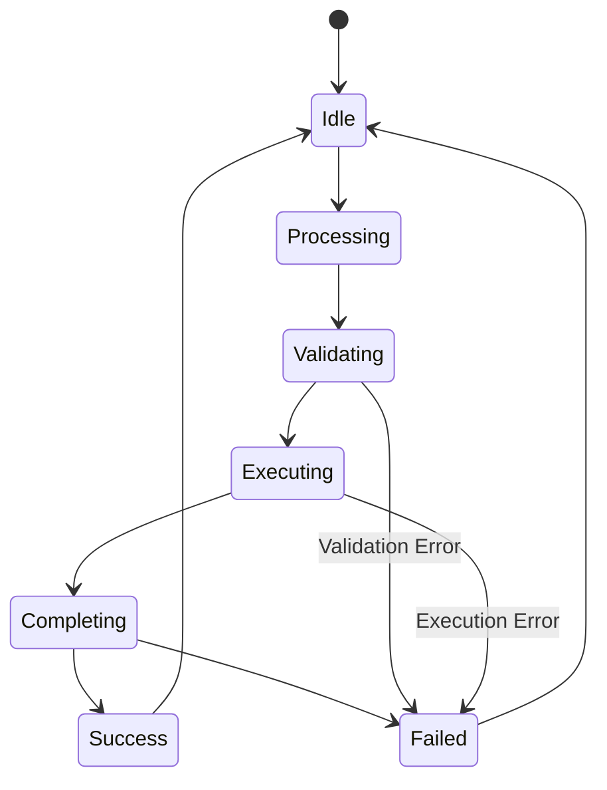
```mermaid
stateDiagram-v2
    [*] --> Idle
    Idle --> Processing
    Processing --> Validating
    Validating --> Executing
    Executing --> Completing
    Completing --> Success
    Completing --> Failed
    Success --> Idle
    Failed --> Idle
    
    Validating --> Failed : Validation Error
    Executing --> Failed : Execution Error
```

### Transições de Operação

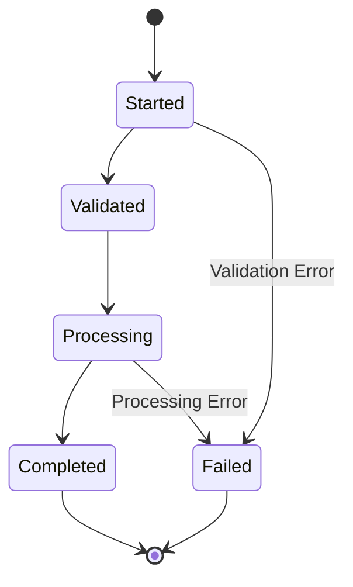
```mermaid
stateDiagram-v2
    [*] --> Started
    Started --> Validated
    Validated --> Processing
    Processing --> Completed
    Completed --> [*]
    
    Started --> Failed : Validation Error
    Processing --> Failed : Processing Error
    Failed --> [*]
```

## 🔄 Fluxos de Erro

### Tratamento de Erros

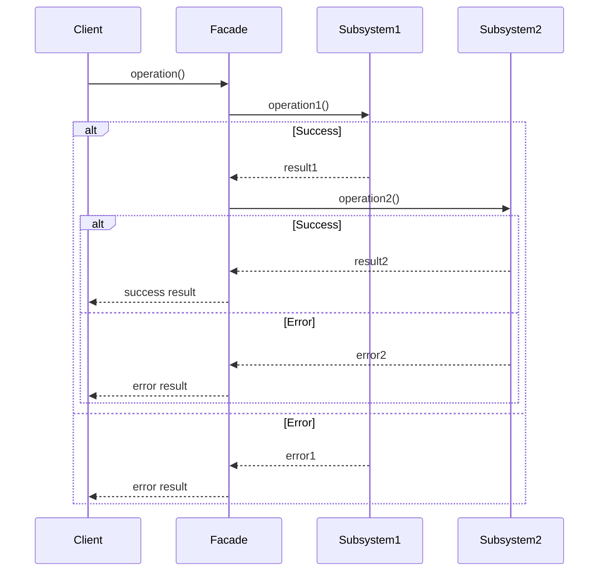
```mermaid
sequenceDiagram
    participant Client
    participant Facade
    participant Subsystem1
    participant Subsystem2
    
    Client->>Facade: operation()
    Facade->>Subsystem1: operation1()
    
    alt Success
        Subsystem1-->>Facade: result1
        Facade->>Subsystem2: operation2()
        
        alt Success
            Subsystem2-->>Facade: result2
            Facade-->>Client: success result
        else Error
            Subsystem2-->>Facade: error2
            Facade-->>Client: error result
        end
    else Error
        Subsystem1-->>Facade: error1
        Facade-->>Client: error result
    end
```

### Rollback Strategy

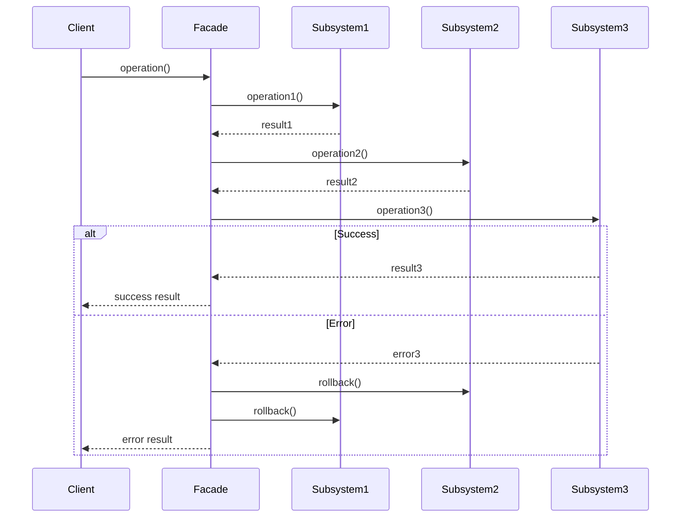
```mermaid
sequenceDiagram
    participant Client
    participant Facade
    participant Subsystem1
    participant Subsystem2
    participant Subsystem3
    
    Client->>Facade: operation()
    Facade->>Subsystem1: operation1()
    Subsystem1-->>Facade: result1
    Facade->>Subsystem2: operation2()
    Subsystem2-->>Facade: result2
    Facade->>Subsystem3: operation3()
    
    alt Success
        Subsystem3-->>Facade: result3
        Facade-->>Client: success result
    else Error
        Subsystem3-->>Facade: error3
        Facade->>Subsystem2: rollback()
        Facade->>Subsystem1: rollback()
        Facade-->>Client: error result
    end
```

## 🎨 Padrões Relacionados

### Facade + Strategy

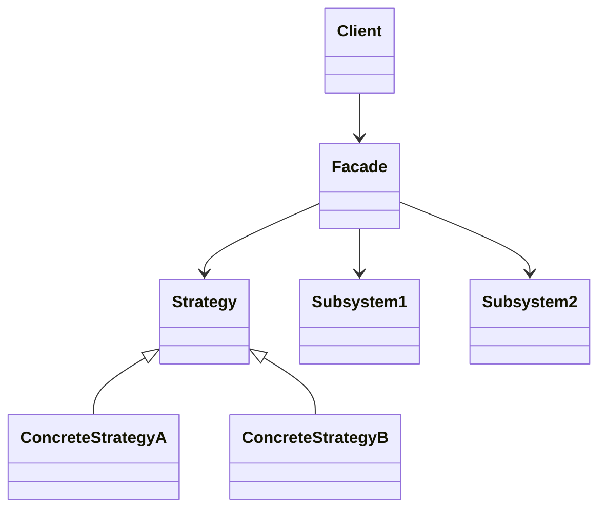
```mermaid
classDiagram
    class Client
    class Facade
    class Strategy
    class ConcreteStrategyA
    class ConcreteStrategyB
    class Subsystem1
    class Subsystem2
    
    Client --> Facade
    Facade --> Strategy
    Strategy <|-- ConcreteStrategyA
    Strategy <|-- ConcreteStrategyB
    Facade --> Subsystem1
    Facade --> Subsystem2
```

### Facade + Observer

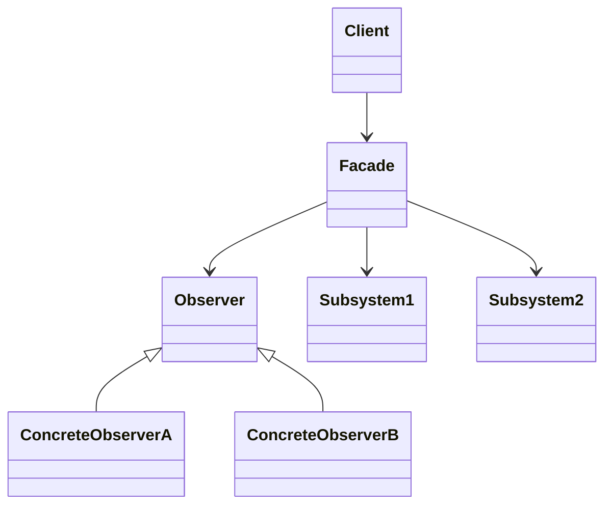
```mermaid
classDiagram
    class Client
    class Facade
    class Observer
    class ConcreteObserverA
    class ConcreteObserverB
    class Subsystem1
    class Subsystem2
    
    Client --> Facade
    Facade --> Observer
    Observer <|-- ConcreteObserverA
    Observer <|-- ConcreteObserverB
    Facade --> Subsystem1
    Facade --> Subsystem2
```

### Facade + Command

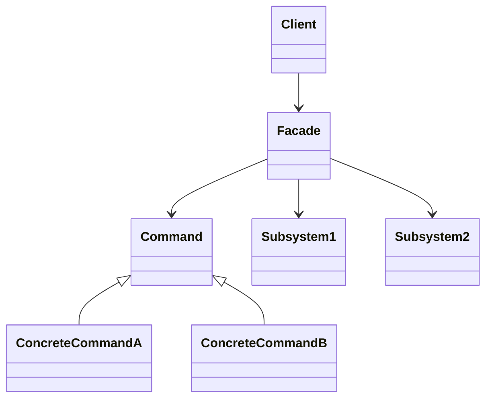
```mermaid
classDiagram
    class Client
    class Facade
    class Command
    class ConcreteCommandA
    class ConcreteCommandB
    class Subsystem1
    class Subsystem2
    
    Client --> Facade
    Facade --> Command
    Command <|-- ConcreteCommandA
    Command <|-- ConcreteCommandB
    Facade --> Subsystem1
    Facade --> Subsystem2
```

## 📈 Métricas e Monitoramento

### Diagrama de Métricas

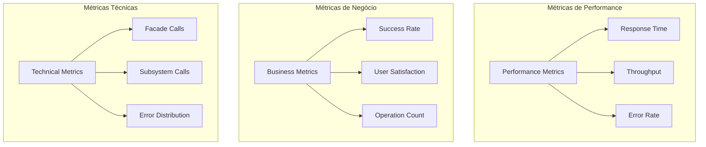
```mermaid
graph TB
    subgraph "Métricas de Performance"
        MP[Performance Metrics]
        MP1[Response Time]
        MP2[Throughput]
        MP3[Error Rate]
    end
    
    subgraph "Métricas de Negócio"
        MB[Business Metrics]
        MB1[Success Rate]
        MB2[User Satisfaction]
        MB3[Operation Count]
    end
    
    subgraph "Métricas Técnicas"
        MT[Technical Metrics]
        MT1[Facade Calls]
        MT2[Subsystem Calls]
        MT3[Error Distribution]
    end
    
    MP --> MP1
    MP --> MP2
    MP --> MP3
    
    MB --> MB1
    MB --> MB2
    MB --> MB3
    
    MT --> MT1
    MT --> MT2
    MT --> MT3
```

### Fluxo de Monitoramento

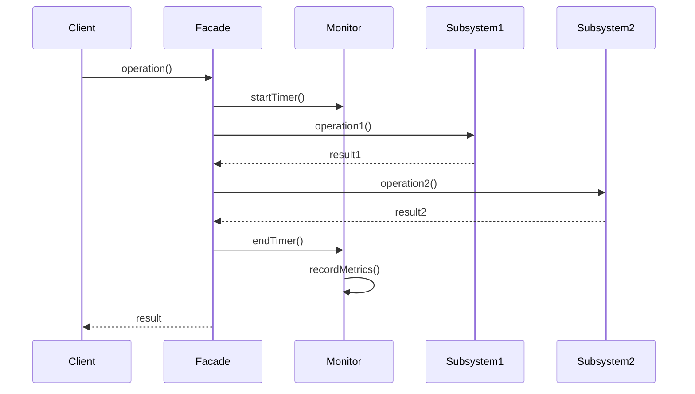
```mermaid
sequenceDiagram
    participant Client
    participant Facade
    participant Monitor
    participant Subsystem1
    participant Subsystem2
    
    Client->>Facade: operation()
    Facade->>Monitor: startTimer()
    Facade->>Subsystem1: operation1()
    Subsystem1-->>Facade: result1
    Facade->>Subsystem2: operation2()
    Subsystem2-->>Facade: result2
    Facade->>Monitor: endTimer()
    Monitor->>Monitor: recordMetrics()
    Facade-->>Client: result
```

## 🔄 Evolução do Padrão

### Versão Simples

```mermaid
graph TB
    C[Client]
    F[Facade]
    S[Subsystem]
    
    C --> F
    F --> S
```

### Versão com Validação

```mermaid
graph TB
    C[Client]
    F[Facade]
    V[Validator]
    S[Subsystem]
    
    C --> F
    F --> V
    V --> S
```

### Versão com Logging

```mermaid
graph TB
    C[Client]
    F[Facade]
    L[Logger]
    S[Subsystem]
    
    C --> F
    F --> L
    F --> S
```

### Versão com Monitoramento

```mermaid
graph TB
    C[Client]
    F[Facade]
    M[Monitor]
    L[Logger]
    S[Subsystem]
    
    C --> F
    F --> M
    F --> L
    F --> S
```

## 🎯 Comparação com Outros Padrões

### Facade vs Adapter

```mermaid
graph TB
    subgraph "Facade"
        F[Facade]
        S1[Subsystem 1]
        S2[Subsystem 2]
    end
    
    subgraph "Adapter"
        A[Adapter]
        T[Target]
        A2[Adaptee]
    end
    
    F --> S1
    F --> S2
    A --> T
    A --> A2
```

### Facade vs Mediator

```mermaid
graph TB
    subgraph "Facade"
        F[Facade]
        S1[Subsystem 1]
        S2[Subsystem 2]
    end
    
    subgraph "Mediator"
        M[Mediator]
        C1[Colleague 1]
        C2[Colleague 2]
    end
    
    F --> S1
    F --> S2
    M --> C1
    M --> C2
```

### Facade vs Proxy

```mermaid
graph TB
    subgraph "Facade"
        F[Facade]
        S[Subsystem]
    end
    
    subgraph "Proxy"
        P[Proxy]
        R[Real Subject]
    end
    
    F --> S
    P --> R
```

