# Diagramas - Padrão Facade

## 🏗️ Arquitetura Geral

### Estrutura de Classes


### Diagrama de Componentes


## 🔄 Fluxos de Funcionamento

### Fluxo Básico do Facade


### Fluxo com Tratamento de Erros


### Fluxo de Operações Específicas

```mermaid
sequenceDiagram
    participant Client
    participant Facade
    participant Subsystem1
    participant Subsystem2
    
    Client->>Facade: specificOperation1()
    Facade->>Subsystem1: operation1()
    Subsystem1-->>Facade: result1
    Facade-->>Client: result1
    
    Note over Client,Subsystem2: Operação específica não usa todos os subsistemas
```



## 🎯 Casos de Uso Específicos

### Sistema de E-commerce


### Sistema de Notificação


### Sistema de Autenticação


## 🔧 Variações do Padrão

### Facade com Strategy


### Facade com Observer


### Facade com Command


## 📊 Estados e Transições

### Estado da Facade


### Transições de Operação


## 🔄 Fluxos de Erro

### Tratamento de Erros


### Rollback Strategy


## 🎨 Padrões Relacionados

### Facade + Strategy


### Facade + Observer


### Facade + Command


## 📈 Métricas e Monitoramento

### Diagrama de Métricas

```mermaid
graph TB
    subgraph "Métricas de Performance"
        MP[Performance Metrics]
        MP1[Response Time]
        MP2[Throughput]
        MP3[Error Rate]
    end
    
    subgraph "Métricas de Negócio"
        MB[Business Metrics]
        MB1[Success Rate]
        MB2[User Satisfaction]
        MB3[Operation Count]
    end
    
    subgraph "Métricas Técnicas"
        MT[Technical Metrics]
        MT1[Facade Calls]
        MT2[Subsystem Calls]
        MT3[Error Distribution]
    end
    
    MP --> MP1
    MP --> MP2
    MP --> MP3
    
    MB --> MB1
    MB --> MB2
    MB --> MB3
    
    MT --> MT1
    MT --> MT2
    MT --> MT3
```



### Fluxo de Monitoramento


## 🔄 Evolução do Padrão

### Versão Simples

```mermaid
graph TB
    C[Client]
    F[Facade]
    S[Subsystem]
    
    C --> F
    F --> S
```

### Versão com Validação

```mermaid
graph TB
    C[Client]
    F[Facade]
    V[Validator]
    S[Subsystem]
    
    C --> F
    F --> V
    V --> S
```

### Versão com Logging

```mermaid
graph TB
    C[Client]
    F[Facade]
    L[Logger]
    S[Subsystem]
    
    C --> F
    F --> L
    F --> S
```

### Versão com Monitoramento

```mermaid
graph TB
    C[Client]
    F[Facade]
    M[Monitor]
    L[Logger]
    S[Subsystem]
    
    C --> F
    F --> M
    F --> L
    F --> S
```

## 🎯 Comparação com Outros Padrões

### Facade vs Adapter

```mermaid
graph TB
    subgraph "Facade"
        F[Facade]
        S1[Subsystem 1]
        S2[Subsystem 2]
    end
    
    subgraph "Adapter"
        A[Adapter]
        T[Target]
        A2[Adaptee]
    end
    
    F --> S1
    F --> S2
    A --> T
    A --> A2
```

### Facade vs Mediator

```mermaid
graph TB
    subgraph "Facade"
        F[Facade]
        S1[Subsystem 1]
        S2[Subsystem 2]
    end
    
    subgraph "Mediator"
        M[Mediator]
        C1[Colleague 1]
        C2[Colleague 2]
    end
    
    F --> S1
    F --> S2
    M --> C1
    M --> C2
```

### Facade vs Proxy

```mermaid
graph TB
    subgraph "Facade"
        F[Facade]
        S[Subsystem]
    end
    
    subgraph "Proxy"
        P[Proxy]
        R[Real Subject]
    end
    
    F --> S
    P --> R
```


