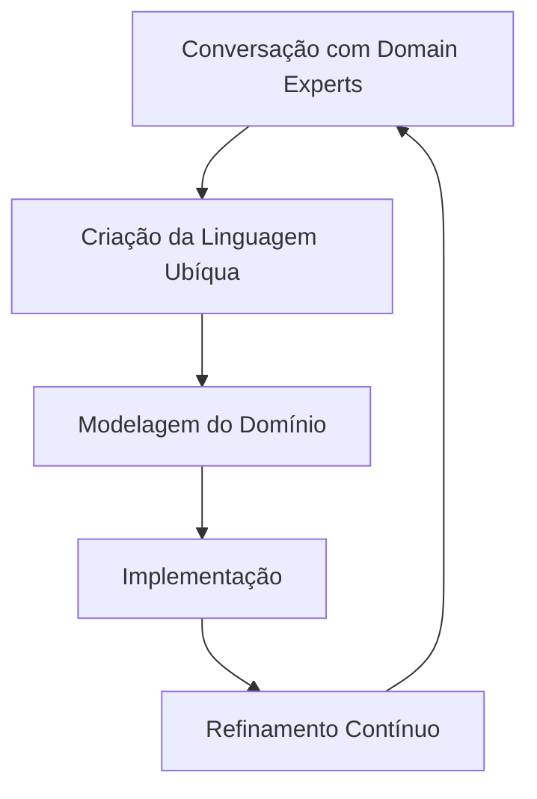

# 🏗️ **Domain-Driven Design (DDD)**

## 🎯 **Visão Geral**

Domain-Driven Design é uma metodologia de design de software que coloca o domínio de negócio no centro do desenvolvimento, focando na comunicação clara e na modelagem precisa dos problemas reais que o software deve resolver.

## 📚 **Documentação Disponível**

### **Conceitos Fundamentais**
- [**Conceitos Fundamentais de DDD**](./conceitos-fundamentais-ddd.md)
  - Diferenças entre Software Design e Software Architecture
  - Domain, Domain Experts e Ubiquitous Language
  - Processo de desenvolvimento com DDD
  - Princípios e benefícios

### **Conceitos Avançados** *(Em Desenvolvimento)*
- [**Aggregates**](./aggregates.md) - Agregados e consistência
- [**Value Objects**](./value-objects.md) - Objetos de valor
- [**Domain Events**](./domain-events.md) - Eventos de domínio
- [**Bounded Contexts**](./bounded-contexts.md) - Contextos delimitados
- [**Entities**](./entities.md) - Entidades de domínio
- [**Use Cases**](./use-cases.md) - Casos de uso

### **Implementação Prática** *(Em Desenvolvimento)*
- [**Padrões de Implementação**](./implementacao/padroes.md)
- [**Exemplos em Flutter**](./implementacao/flutter-examples.md)
- [**Exemplos em Django**](./implementacao/django-examples.md)
- [**Testes com DDD**](./implementacao/testes.md)

## 🎯 **Conceitos Centrais**

### **1. Domain (Domínio)**
Área de conhecimento compartilhado entre todos os envolvidos no desenvolvimento do software.

### **2. Domain Experts (Especialistas do Domínio)**
Pessoas que compreendem profundamente o problema de negócio que o software resolve.

### **3. Ubiquitous Language (Linguagem Ubíqua)**
Linguagem universal usada por todos os envolvidos no projeto, eliminando ambiguidades.

## 🔄 **Processo de Desenvolvimento**

## 📊 **DDD vs Outras Abordagens**

| Aspecto | DDD | Clean Architecture | MVC |
|---------|-----|-------------------|-----|
| **Foco** | Domínio de negócio | Estrutura técnica | Separação de responsabilidades |
| **Comunicação** | Linguagem ubíqua | Interfaces bem definidas | Controllers, Models, Views |
| **Flexibilidade** | Alta | Alta | Média |
| **Complexidade** | Média-Alta | Alta | Baixa |

## 🚀 **Benefícios**

### **Comunicação**
- Elimina mal-entendidos entre equipes
- Reduz retrabalho
- Melhora qualidade dos requisitos

### **Qualidade**
- Código mais expressivo
- Regras de negócio claras
- Testes mais precisos

### **Manutenibilidade**
- Facilita evolução do sistema
- Reduz acoplamento
- Melhora compreensão do código

## ⚠️ **Considerações**

### **Quando Usar DDD**
- ✅ Domínios complexos
- ✅ Equipes grandes
- ✅ Projetos de longo prazo
- ✅ Regras de negócio complexas

### **Quando NÃO Usar DDD**
- ❌ Projetos simples
- ❌ CRUDs básicos
- ❌ Protótipos rápidos
- ❌ Equipes pequenas e experientes

## 📚 **Recursos Recomendados**

### **Livros**
- **"Domain-Driven Design"** - Eric Evans (Blue Book)
- **"Implementing Domain-Driven Design"** - Vaughn Vernon
- **"Domain-Driven Design Distilled"** - Vaughn Vernon

### **Artigos e Blogs**
- [Martin Fowler - Domain-Driven Design](https://martinfowler.com/bliki/DomainDrivenDesign.html)
- [DDD Community](https://www.domainlanguage.com/)
- [EventStorming](https://www.eventstorming.com/)

## 🔗 **Links Relacionados**

- [Design Patterns](../design-patterns/) - Padrões de design
- [Clean Architecture](../clean-architecture/) - Arquitetura limpa
- [Templates de Documentação](../../templates/) - Templates para documentação
- [Processos de Desenvolvimento](../../processes/) - Metodologias

## 📈 **Métricas de Sucesso**

### **Indicadores de DDD Bem Aplicado**
- **Comunicação**: Redução de ambiguidades em requisitos
- **Qualidade**: Menos bugs relacionados a regras de negócio
- **Manutenibilidade**: Facilidade para evoluir o sistema
- **Satisfação**: Domain experts compreendem o software

### **Sinais de Alerta**
- Domain experts não entendem o código
- Múltiplas interpretações dos mesmos conceitos
- Regras de negócio espalhadas pelo código
- Dificuldade para evoluir funcionalidades

## 🎯 **Roadmap de Aprendizado**

### **Nível Iniciante**
1. ✅ Compreender conceitos fundamentais
2. ✅ Diferenciar Software Design de Architecture
3. ✅ Entender Domain, Domain Experts e Ubiquitous Language

### **Nível Intermediário**
4. 🔄 Aprender sobre Aggregates e Value Objects
5. 🔄 Compreender Bounded Contexts
6. 🔄 Implementar Domain Events

### **Nível Avançado**
7. ⏳ Dominar padrões de implementação
8. ⏳ Aplicar em projetos reais
9. ⏳ Ensinar outros desenvolvedores

---

**Última atualização**: $(date)  
**Mantenedor**: Equipe Skynet  
**Versão**: 1.0  
**Status**: Em Desenvolvimento
