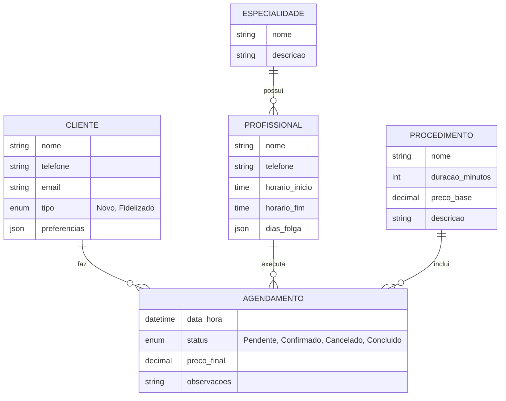

# 💇‍♀️ **Exemplo Prático: Sistema para Salão de Beleza**

## 🎯 **Cenário**

Vamos desenvolver um sistema de agendamento para um salão de beleza, aplicando os conceitos fundamentais de DDD.

## 👥 **Domain Experts Identificados**

### **1. Proprietário do Salão**
- Conhece regras de negócio
- Define políticas de preços
- Entende fluxo de atendimento

### **2. Recepcionista**
- Lida com agendamentos diariamente
- Conhece disponibilidade dos profissionais
- Entende preferências dos clientes

### **3. Barbeiro/Cabeleireiro**
- Executa os serviços
- Conhece tempo necessário para cada serviço
- Entende limitações e restrições

## 🗣️ **Processo de Conversação**

### **Primeira Conversa - Descoberta de Conceitos**

**Programador**: "Preciso entender como funciona o agendamento aqui no salão."

**Recepcionista**: "Bom, quando um cliente chega ou liga, eu verifico a agenda do barbeiro. Se tem horário livre, eu marco. Se não tem, eu ofereço outro horário ou outro barbeiro."

**Programador**: "E como vocês chamam essas pessoas que fazem os serviços?"

**Barbeiro**: "Eu sou barbeiro, mas tem cabeleireira também. A gente chama de profissional mesmo."

**Proprietário**: "Na verdade, a gente tem diferentes tipos: barbeiro, cabeleireiro, manicure, pedicure. Cada um tem sua especialidade."

### **Segunda Conversa - Refinamento de Conceitos**

**Programador**: "E quando o cliente chega, como vocês identificam ele?"

**Recepcionista**: "Se é cliente novo, a gente cadastra. Se é cliente antigo, a gente busca pelo nome ou telefone."

**Barbeiro**: "Cliente antigo a gente já conhece, sabe o que ele gosta, como corta o cabelo."

**Proprietário**: "Cliente fidelizado é diferente de cliente novo. Cliente fidelizado tem desconto."

## 🎯 **Linguagem Ubíqua Emergente**

### **Entidades Identificadas**

| Conceito | Linguagem do Programador | Linguagem Ubíqua |
|----------|-------------------------|------------------|
| Pessoa que usa o serviço | User, Customer, Client | **Cliente** |
| Pessoa que executa o serviço | Employee, Worker, Staff | **Profissional** |
| Tipo de profissional | Role, Position, Job | **Especialidade** |
| Horário marcado | Appointment, Schedule | **Agendamento** |
| Serviço oferecido | Service, Product | **Procedimento** |

### **Verbos e Ações**

| Ação | Linguagem do Programador | Linguagem Ubíqua |
|------|-------------------------|------------------|
| Marcar horário | Create Appointment | **Agendar** |
| Cancelar horário | Cancel Appointment | **Desmarcar** |
| Confirmar presença | Confirm Attendance | **Confirmar** |
| Verificar disponibilidade | Check Availability | **Consultar Agenda** |

### **Regras de Negócio Descobertas**

```markdown
## Regras de Agendamento

### Cliente
- Cliente pode ser **Novo** ou **Fidelizado**
- Cliente fidelizado tem desconto de 10%
- Cliente pode ter **Preferências** (barbeiro específico, horário)

### Profissional
- Cada profissional tem **Especialidades** (corte, barba, manicure)
- Profissional tem **Horário de Funcionamento**
- Profissional pode ter **Dias de Folga**

### Agendamento
- Agendamento deve ser feito com **Antecedência mínima** de 2 horas
- Agendamento pode ser **Confirmado** ou **Pendente**
- Cliente pode **Desmarcar** até 1 hora antes

### Procedimento
- Cada procedimento tem **Duração** específica
- Procedimento tem **Preço** base
- Cliente fidelizado tem **Desconto** aplicado
```

## 🏗️ **Modelo de Domínio**

### **Diagrama de Entidades**



### **Regras de Negócio em Código**

```dart
// Exemplo em Dart/Flutter
class Cliente {
  final String nome;
  final String telefone;
  final TipoCliente tipo;
  final PreferenciasCliente preferencias;
  
  // Regra: Cliente fidelizado tem desconto
  bool get temDesconto => tipo == TipoCliente.fidelizado;
  
  double calcularPrecoFinal(double precoBase) {
    if (temDesconto) {
      return precoBase * 0.9; // 10% de desconto
    }
    return precoBase;
  }
}

class Agendamento {
  final Cliente cliente;
  final Profissional profissional;
  final List<Procedimento> procedimentos;
  final DateTime dataHora;
  final StatusAgendamento status;
  
  // Regra: Antecedência mínima de 2 horas
  bool get podeSerAgendado {
    final agora = DateTime.now();
    final diferenca = dataHora.difference(agora);
    return diferenca.inHours >= 2;
  }
  
  // Regra: Pode desmarcar até 1 hora antes
  bool get podeSerDesmarcado {
    final agora = DateTime.now();
    final diferenca = dataHora.difference(agora);
    return diferenca.inHours >= 1;
  }
  
  double calcularPrecoFinal() {
    double total = 0;
    for (var procedimento in procedimentos) {
      total += cliente.calcularPrecoFinal(procedimento.precoBase);
    }
    return total;
  }
}
```

## 📋 **Casos de Uso Identificados**

### **1. Agendar Procedimento**
```markdown
**Ator**: Recepcionista
**Objetivo**: Marcar um procedimento para um cliente

**Fluxo Principal**:
1. Recepcionista identifica o cliente
2. Cliente escolhe o procedimento
3. Sistema consulta agenda do profissional
4. Sistema verifica disponibilidade
5. Sistema cria o agendamento
6. Sistema confirma o agendamento

**Regras de Negócio**:
- Antecedência mínima de 2 horas
- Profissional deve ter a especialidade
- Horário deve estar dentro do funcionamento
```

### **2. Consultar Agenda**
```markdown
**Ator**: Recepcionista, Profissional
**Objetivo**: Verificar horários disponíveis

**Fluxo Principal**:
1. Usuário seleciona o profissional
2. Usuário escolhe a data
3. Sistema consulta agendamentos existentes
4. Sistema calcula horários livres
5. Sistema exibe disponibilidade

**Regras de Negócio**:
- Considerar horário de funcionamento
- Considerar dias de folga
- Considerar duração dos procedimentos
```

## 🎯 **Benefícios Alcançados**

### **1. Comunicação Clara**
- Todos falam a mesma linguagem
- Eliminação de ambiguidades
- Requisitos mais precisos

### **2. Modelo Rico**
- Representa fielmente o negócio
- Regras de negócio explícitas
- Facilita manutenção

### **3. Qualidade do Código**
- Código expressivo e legível
- Testes mais precisos
- Menos bugs relacionados a regras de negócio

## 📚 **Lições Aprendidas**

### **1. Importância da Conversação**
- Domain experts têm conhecimento valioso
- Múltiplas perspectivas enriquecem o modelo
- Linguagem natural é mais expressiva

### **2. Evolução Contínua**
- Linguagem ubíqua evolui com o tempo
- Modelo deve ser refinado constantemente
- Feedback dos usuários é essencial

### **3. Foco no Domínio**
- Tecnologia é secundária
- Regras de negócio são primordiais
- Código deve refletir o domínio

## 🔗 **Próximos Passos**

### **Implementação Técnica**
- Definir arquitetura de software
- Implementar casos de uso
- Criar testes automatizados
- Desenvolver interface de usuário

### **Refinamento do Modelo**
- Identificar novos conceitos
- Refinar regras de negócio
- Expandir linguagem ubíqua
- Validar com domain experts

---

**Última atualização**: $(date)  
**Mantenedor**: Equipe Skynet  
**Versão**: 1.0  
**Baseado em**: Exemplo prático de aplicação de DDD
