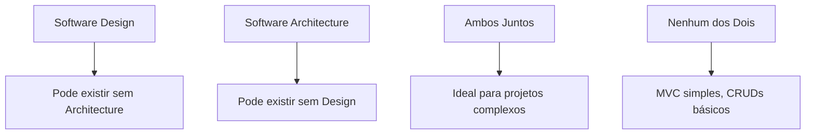

# 🏗️ **Software Design vs Software Architecture**

## 🎯 **Visão Geral**

Uma das confusões mais comuns na comunidade de desenvolvimento é a diferença entre **Software Design** e **Software Architecture**. Embora relacionados, são conceitos distintos que servem a propósitos diferentes no desenvolvimento de software.

## 📊 **Comparação Direta**

| Aspecto | Software Design | Software Architecture |
|---------|-----------------|----------------------|
| **Foco Principal** | Compreensão e modelagem do problema de negócio | Estrutura técnica e organização do código |
| **Escopo** | Domínio de negócio e regras | Componentes, camadas e dependências |
| **Linguagem** | Linguagem ubíqua do domínio | Linguagem técnica e padrões |
| **Resultado** | Modelo conceitual do problema | Estrutura de código e componentes |
| **Audiência** | Domain experts, stakeholders, desenvolvedores | Desenvolvedores, arquitetos de software |
| **Tempo de Vida** | Evolui com o domínio de negócio | Evolui com a tecnologia e requisitos técnicos |

## 🎯 **Software Design**

### **Definição**
Software Design é o processo de **converter um problema real em software**, ensinando como correlacionar os problemas enfrentados no desenvolvimento de software com as necessidades do cliente.

### **Características**
- **Foco no Domínio**: Centrado no problema de negócio
- **Comunicação**: Envolve conversas com domain experts
- **Linguagem Ubíqua**: Cria vocabulário compartilhado
- **Modelagem Conceitual**: Representa o problema, não a solução
- **Independente de Tecnologia**: Pode ser feito sem código

### **Exemplo Prático**
```markdown
# Problema: Sistema de Agendamento para Salão de Beleza

## Software Design
- Identificar domain experts (barbeiro, recepcionista, proprietário)
- Descobrir conceitos (Cliente, Profissional, Agendamento, Procedimento)
- Criar linguagem ubíqua (não "User", mas "Cliente")
- Definir regras de negócio (desconto para cliente fidelizado)
- Modelar relacionamentos entre conceitos
```

### **Artefatos Típicos**
- **Linguagem Ubíqua**: Vocabulário compartilhado
- **Modelo de Domínio**: Representação conceitual
- **Regras de Negócio**: Lógica específica do domínio
- **Casos de Uso**: Cenários de uso do sistema
- **Diagramas de Domínio**: Representação visual dos conceitos

## 🏗️ **Software Architecture**

### **Definição**
Software Architecture é a **estrutura técnica e organização do código**, focando em como os componentes se relacionam, como as dependências são gerenciadas e como o sistema é estruturado.

### **Características**
- **Foco Técnico**: Centrado na estrutura do código
- **Desacoplamento**: Separação de responsabilidades
- **Padrões Técnicos**: SOLID, Clean Architecture, MVC
- **Dependências**: Inversão de dependência, injeção
- **Dependente de Tecnologia**: Requer implementação em código

### **Exemplo Prático**
```markdown
# Solução: Arquitetura para Sistema de Agendamento

## Software Architecture
- Definir camadas (Domain, Application, Infrastructure, Presentation)
- Implementar padrões (Repository, Service, Controller)
- Gerenciar dependências (Dependency Injection)
- Estruturar pastas e organização do código
- Definir interfaces e contratos
```

### **Artefatos Típicos**
- **Diagramas de Arquitetura**: C4 Model, Component Diagrams
- **Código Estruturado**: Organização em camadas
- **Padrões Implementados**: Repository, Service, Factory
- **Configurações**: Dependency Injection, Database
- **Documentação Técnica**: APIs, Interfaces, Contratos

## 🔄 **Relacionamento entre os Conceitos**

### **Pode Existir Independentemente**


### **Cenários Possíveis**

#### **1. DDD sem Clean Architecture**
```dart
// Código bem modelado, mas sem arquitetura complexa
class Cliente {
  final String nome;
  final TipoCliente tipo;
  
  double calcularDesconto(double preco) {
    return tipo == TipoCliente.fidelizado ? preco * 0.9 : preco;
  }
}

// Simples, mas expressivo
class AgendamentoService {
  void agendar(Cliente cliente, Procedimento procedimento) {
    // Lógica simples, mas clara
  }
}
```

#### **2. Clean Architecture sem DDD**
```dart
// Arquitetura complexa, mas sem foco no domínio
class UserRepository {
  Future<User> findById(String id);
  Future<void> save(User user);
}

class UserService {
  final UserRepository repository;
  
  UserService(this.repository);
  
  Future<User> getUser(String id) {
    return repository.findById(id);
  }
}
```

#### **3. Ambos Juntos (Ideal)**
```dart
// Domínio rico + Arquitetura limpa
class Cliente {
  final String nome;
  final TipoCliente tipo;
  
  double calcularPrecoFinal(double precoBase) {
    return tipo == TipoCliente.fidelizado ? precoBase * 0.9 : precoBase;
  }
}

class ClienteRepository {
  Future<Cliente> buscarPorId(String id);
  Future<void> salvar(Cliente cliente);
}

class AgendamentoService {
  final ClienteRepository clienteRepository;
  final AgendamentoRepository agendamentoRepository;
  
  AgendamentoService(this.clienteRepository, this.agendamentoRepository);
  
  Future<Agendamento> criarAgendamento(String clienteId, Procedimento procedimento) {
    final cliente = await clienteRepository.buscarPorId(clienteId);
    final precoFinal = cliente.calcularPrecoFinal(procedimento.precoBase);
    
    return Agendamento(cliente: cliente, procedimento: procedimento, preco: precoFinal);
  }
}
```

## 🎯 **Quando Usar Cada Um**

### **Software Design (DDD)**
- ✅ **Domínios Complexos**: Regras de negócio complexas
- ✅ **Equipes Grandes**: Múltiplos desenvolvedores
- ✅ **Projetos de Longo Prazo**: Evolução contínua
- ✅ **Comunicação Crítica**: Múltiplos stakeholders

### **Software Architecture (Clean Architecture)**
- ✅ **Sistemas Grandes**: Múltiplos módulos
- ✅ **Manutenibilidade**: Código que muda frequentemente
- ✅ **Testabilidade**: Testes automatizados importantes
- ✅ **Escalabilidade**: Crescimento técnico esperado

### **Ambos Juntos**
- ✅ **Projetos Empresariais**: Sistemas críticos de negócio
- ✅ **Equipes Experientes**: Conhecimento em ambos os conceitos
- ✅ **Orçamento Adequado**: Tempo para implementação completa
- ✅ **Longo Prazo**: Projetos com vida útil longa

## ⚠️ **Armadilhas Comuns**

### **1. Confundir os Conceitos**
```markdown
❌ ERRADO: "Vou aplicar DDD criando camadas de arquitetura"
✅ CORRETO: "Vou aplicar DDD modelando o domínio, depois implementar com Clean Architecture"
```

### **2. Focar Apenas na Arquitetura**
```markdown
❌ ERRADO: Criar interfaces complexas sem entender o domínio
✅ CORRETO: Primeiro entender o domínio, depois criar interfaces apropriadas
```

### **3. Ignorar a Comunicação**
```markdown
❌ ERRADO: Implementar regras de negócio sem conversar com domain experts
✅ CORRETO: Conversar com domain experts para entender as regras reais
```

## 📚 **Exemplos Práticos**

### **Exemplo 1: E-commerce Simples**
```markdown
## Software Design
- Cliente, Produto, Pedido, Pagamento
- Regras: desconto por quantidade, frete grátis acima de R$ 100
- Linguagem: "Carrinho" não "Shopping Cart"

## Software Architecture
- MVC simples
- Repository para dados
- Service para lógica
- Controller para HTTP
```

### **Exemplo 2: Sistema Bancário**
```markdown
## Software Design
- Conta, Cliente, Transação, Saldo
- Regras: limite de saque, juros, tarifas
- Linguagem: "Conta Corrente" não "Current Account"

## Software Architecture
- Clean Architecture
- Domain Events
- CQRS
- Event Sourcing
```

## 🎯 **Benefícios de Entender a Diferença**

### **1. Comunicação Mais Clara**
- Evita confusões em reuniões
- Facilita discussões técnicas
- Melhora entendimento entre equipes

### **2. Decisões Mais Informadas**
- Escolha adequada de abordagens
- Investimento correto de tempo
- Resultados mais eficazes

### **3. Projetos Mais Bem Sucedidos**
- Menos retrabalho
- Maior satisfação do cliente
- Código mais maintível

## 🔗 **Links Relacionados**

- [Conceitos Fundamentais de DDD](./conceitos-fundamentais-ddd.md)
- [Exemplo Prático - Salão de Beleza](./exemplos-praticos/caso-salao-beleza.md)
- [Design Patterns](../design-patterns/) - Padrões de design
- Clean Architecture - Arquitetura limpa *(a ser documentado)*

## 📈 **Métricas de Sucesso**

### **Software Design Bem Aplicado**
- Domain experts compreendem o código
- Regras de negócio estão claras
- Linguagem ubíqua é consistente
- Requisitos são precisos

### **Software Architecture Bem Aplicada**
- Código é testável
- Dependências são claras
- Componentes são desacoplados
- Sistema é maintível

---

**Última atualização**: $(date)  
**Mantenedor**: Equipe Skynet  
**Versão**: 1.0  
**Baseado em**: Transcrição de aula sobre DDD
