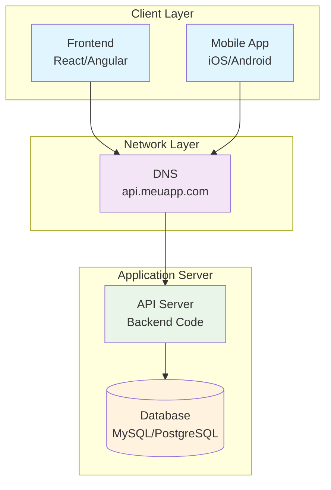

# Diagrama - Arquitetura Inicial

## Arquitetura Monolítica Básica

## Características da Arquitetura Inicial

- **Simplicidade**: Fácil de desenvolver e deployar
- **Custo baixo**: Apenas um servidor necessário
- **Ponto único de falha**: Se o servidor falha, tudo para
- **Competição por recursos**: API e DB competem por CPU/RAM
- **Escalabilidade limitada**: Não consegue crescer horizontalmente

## Limitações

| Aspecto | Limitação |
|---------|-----------|
| Usuários simultâneos | 100-1.000 |
| Requisições/segundo | 10-100 |
| Tempo de resposta | 200-500ms |
| Uptime | 95-99% |
| Capacidade de crescimento | Muito limitada |
