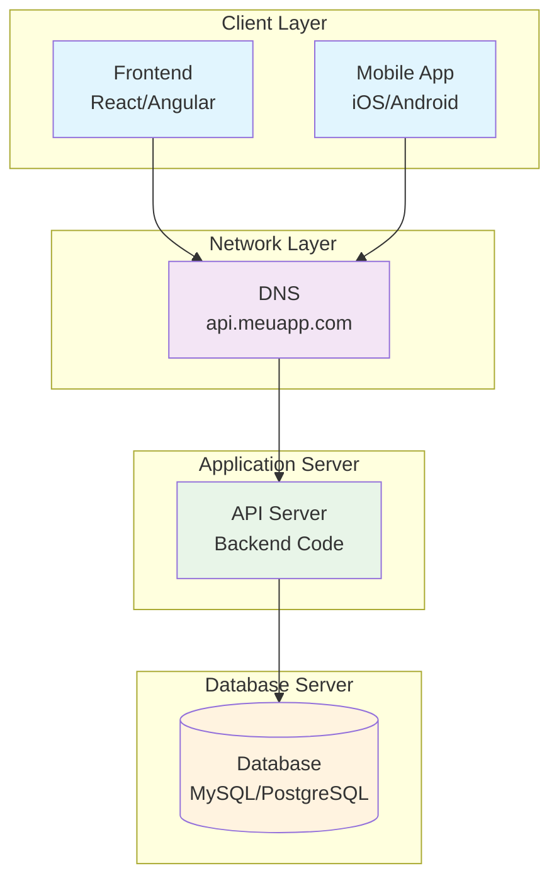

# Diagrama - Separação de Servidores

## Arquitetura com Servidores Separados

## Benefícios Alcançados

- **Recursos dedicados**: API e DB têm recursos próprios
- **Dimensionamento independente**: Pode escalar cada componente separadamente
- **Manutenção isolada**: Pode reiniciar um sem afetar o outro
- **Performance melhorada**: Sem competição por recursos

## Limitações Mantidas

- **Ponto único de falha**: Ainda existe SPOF
- **Escalabilidade limitada**: Não resolve problemas de alta disponibilidade
- **Sem redundância**: Falha de qualquer servidor derruba o sistema

## Métricas Melhoradas

| Métrica | Antes | Depois |
|---------|-------|--------|
| Usuários simultâneos | 100-1.000 | 1.000-5.000 |
| Requisições/segundo | 10-100 | 100-500 |
| Tempo de resposta | 200-500ms | 150-300ms |
| Uptime | 95-99% | 98-99% |
| Capacidade de crescimento | Muito limitada | Moderada |
