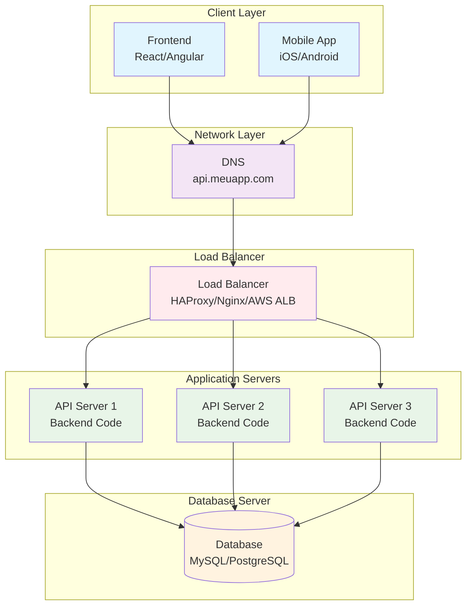

# Diagrama - Load Balancing

## Arquitetura com Load Balancer

## Benefícios do Load Balancing

- **Alta disponibilidade**: Falha de um servidor não derruba o sistema
- **Escalabilidade horizontal**: Pode adicionar mais servidores conforme necessário
- **Distribuição de carga**: Requisições distribuídas uniformemente
- **Failover automático**: Servidores com falha são removidos automaticamente

## Tipos de Load Balancing

### 1. Round Robin
- Distribui requisições sequencialmente
- Mais simples de implementar
- Não considera carga dos servidores

### 2. Least Connections
- Direciona para servidor com menos conexões ativas
- Melhor para conexões de longa duração
- Considera estado atual dos servidores

### 3. Weighted Round Robin
- Permite pesos diferentes para servidores
- Útil para servidores com capacidades diferentes
- Flexibilidade na distribuição

## Métricas Melhoradas

| Métrica | Antes | Depois |
|---------|-------|--------|
| Usuários simultâneos | 1.000-5.000 | 5.000-15.000 |
| Requisições/segundo | 100-500 | 500-1.500 |
| Tempo de resposta | 150-300ms | 100-200ms |
| Uptime | 98-99% | 99.5-99.9% |
| Capacidade de crescimento | Moderada | Alta |
