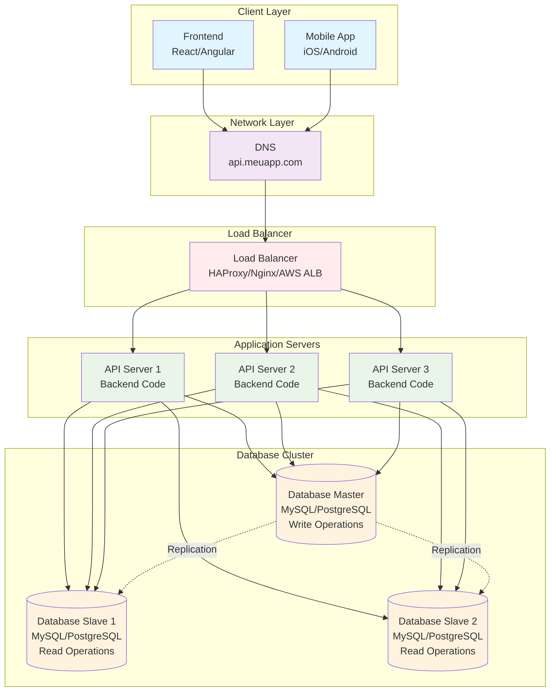

# Diagrama - Database Replication

## Arquitetura com Replicação de Banco de Dados



## Benefícios da Replicação

- **Eliminação de SPOF**: Banco de dados não é mais ponto único de falha
- **Distribuição de carga**: Leituras distribuídas entre slaves
- **Alta disponibilidade**: Falha do Master não derruba o sistema
- **Performance**: Leituras mais rápidas com slaves dedicados

## Tipos de Replicação

### 1. Master-Slave (Read Replicas)
- **Master**: Apenas escritas (INSERT, UPDATE, DELETE)
- **Slaves**: Apenas leituras (SELECT)
- **Replicação**: Assíncrona do Master para Slaves

### 2. Master-Master
- Ambos servidores aceitam leitura e escrita
- Replicação bidirecional
- Maior complexidade de sincronização

### 3. Multi-Master
- Múltiplos masters
- Replicação em anel ou mesh
- Máxima disponibilidade

## Consistência Eventual

### O Problema
```javascript
// Cenário: Usuário insere dados e imediatamente consulta
async function createAndReadUser() {
  // 1. Inserir usuário (vai para Master)
  await createUser({ name: 'João', email: 'joao@email.com' });
  
  // 2. Consultar usuário (pode ir para Slave que ainda não replicou)
  const users = await getUsers(); // Pode não encontrar o usuário recém-criado
}
```

### Soluções

#### 1. Read-Your-Writes Consistency
```javascript
// Sempre ler do Master após escrita
async function createAndReadUser() {
  await createUser({ name: 'João', email: 'joao@email.com' });
  
  // Ler do Master para garantir consistência
  const users = await getUsersFromMaster();
}
```

## Métricas Melhoradas

| Métrica | Antes | Depois |
|---------|-------|--------|
| Usuários simultâneos | 5.000-15.000 | 15.000-50.000 |
| Requisições/segundo | 500-1.500 | 1.500-5.000 |
| Tempo de resposta (Read) | 100-200ms | 50-100ms |
| Tempo de resposta (Write) | 100-200ms | 100-200ms |
| Uptime | 99.5-99.9% | 99.9-99.99% |
