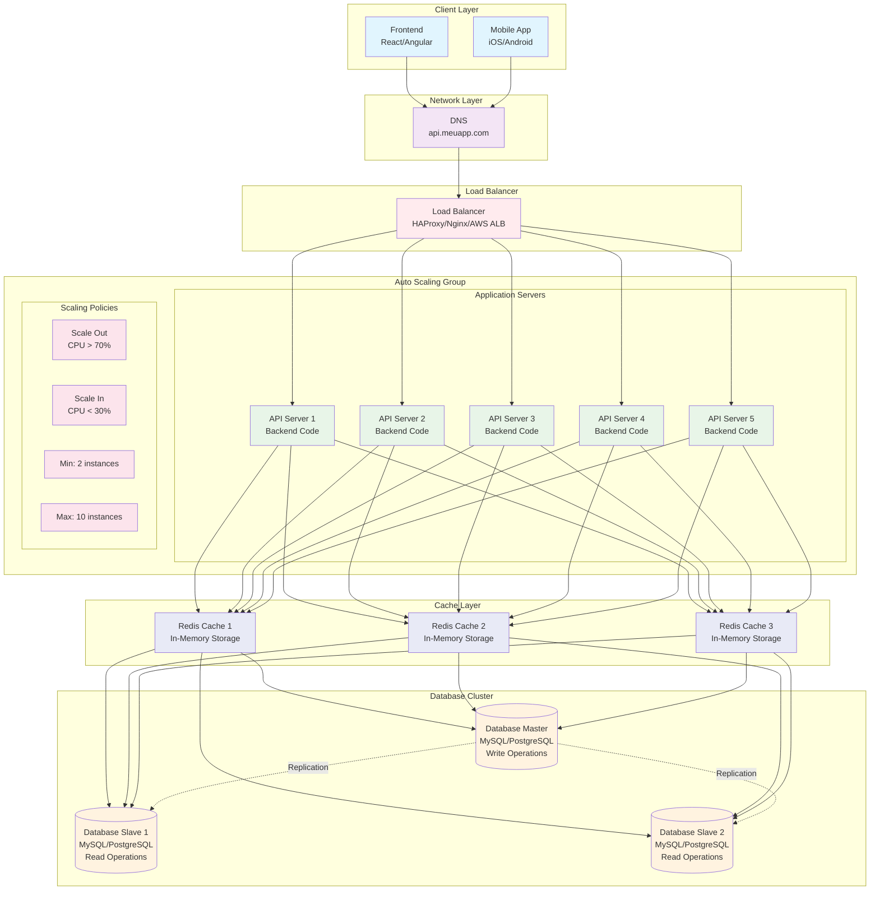

# Diagrama - Auto Scaling

## Arquitetura com Auto Scaling



## Tipos de Auto Scaling

### 1. Horizontal Scaling (Scale-Out/Scale-In)
- Adiciona/remove instâncias da aplicação
- Mais comum e eficaz
- Mantém performance individual

### 2. Vertical Scaling (Scale-Up/Scale-Down)
- Aumenta/diminui recursos da instância
- Menos comum em produção
- Pode causar downtime

## Configuração Auto Scaling

### Launch Template
```yaml
LaunchTemplate:
  ImageId: ami-0c02fb55956c7d316
  InstanceType: t3.medium
  SecurityGroupIds: [sg-12345678]
  UserData: |
    #!/bin/bash
    yum update -y
    yum install -y nodejs
    systemctl enable nodejs
    systemctl start nodejs
```

### Scaling Policies
```yaml
ScalingPolicies:
  ScaleOut:
    MetricName: CPUUtilization
    Threshold: 70
    ComparisonOperator: GreaterThanThreshold
    EvaluationPeriods: 2
    ScalingAdjustment: 1
    AdjustmentType: ChangeInCapacity
  
  ScaleIn:
    MetricName: CPUUtilization
    Threshold: 30
    ComparisonOperator: LessThanThreshold
    EvaluationPeriods: 2
    ScalingAdjustment: -1
    AdjustmentType: ChangeInCapacity
```

## Benefícios do Auto Scaling

- **Elasticidade**: Adaptação automática à demanda
- **Economia**: Paga apenas pelos recursos utilizados
- **Alta disponibilidade**: Redundância automática
- **Performance**: Mantém performance mesmo com picos de tráfego

## Métricas Melhoradas

| Métrica | Antes | Depois |
|---------|-------|--------|
| Usuários simultâneos | 50.000-200.000 | 200.000-1.000.000+ |
| Requisições/segundo | 5.000-20.000 | 20.000-100.000+ |
| Tempo de resposta | 10-50ms | 10-50ms (consistente) |
| Uptime | 99.9-99.99% | 99.99-99.999% |
| Custo | Fixo | Variável (paga pelo uso) |
