# Diagrama - Arquitetura Final

## Arquitetura Final - Suportando Milhões de Usuários

```mermaid
graph TB
    subgraph "Global CDN + DNS"
        CDN[CloudFront + Route 53<br/>Global Distribution]
    end
    
    subgraph "US East (N. Virginia)"
        subgraph "Load Balancer"
            LB1[Application Load Balancer]
        end
        
        subgraph "Microservices"
            API1[User Service]
            API2[Order Service]
            API3[Product Service]
            API4[Payment Service]
        end
        
        subgraph "Message Queues"
            MQ1[Email Queue]
            MQ2[Report Queue]
            MQ3[Notification Queue]
        end
        
        subgraph "Workers"
            W1[Email Worker]
            W2[Report Worker]
            W3[Notification Worker]
        end
        
        subgraph "Cache Layer"
            CACHE1[Redis Cluster]
        end
        
        subgraph "Database Shards"
            DB1[(User Shard)]
            DB2[(Order Shard)]
            DB3[(Product Shard)]
        end
    end
    
    subgraph "US West (Oregon)"
        subgraph "Load Balancer"
            LB2[Application Load Balancer]
        end
        
        subgraph "Microservices"
            API5[User Service]
            API6[Order Service]
            API7[Product Service]
            API8[Payment Service]
        end
        
        subgraph "Message Queues"
            MQ4[Email Queue]
            MQ5[Report Queue]
            MQ6[Notification Queue]
        end
        
        subgraph "Workers"
            W4[Email Worker]
            W5[Report Worker]
            W6[Notification Worker]
        end
        
        subgraph "Cache Layer"
            CACHE2[Redis Cluster]
        end
        
        subgraph "Database Shards"
            DB4[(User Shard)]
            DB5[(Order Shard)]
            DB6[(Product Shard)]
        end
    end
    
    subgraph "EU West (Ireland)"
        subgraph "Load Balancer"
            LB3[Application Load Balancer]
        end
        
        subgraph "Microservices"
            API9[User Service]
            API10[Order Service]
            API11[Product Service]
            API12[Payment Service]
        end
        
        subgraph "Message Queues"
            MQ7[Email Queue]
            MQ8[Report Queue]
            MQ9[Notification Queue]
        end
        
        subgraph "Workers"
            W7[Email Worker]
            W8[Report Worker]
            W9[Notification Worker]
        end
        
        subgraph "Cache Layer"
            CACHE3[Redis Cluster]
        end
        
        subgraph "Database Shards"
            DB7[(User Shard)]
            DB8[(Order Shard)]
            DB9[(Product Shard)]
        end
    end
    
    CDN --> LB1
    CDN --> LB2
    CDN --> LB3
    
    LB1 --> API1
    LB1 --> API2
    LB1 --> API3
    LB1 --> API4
    
    LB2 --> API5
    LB2 --> API6
    LB2 --> API7
    LB2 --> API8
    
    LB3 --> API9
    LB3 --> API10
    LB3 --> API11
    LB3 --> API12
    
    API1 --> MQ1
    API1 --> MQ2
    API1 --> MQ3
    
    API2 --> MQ1
    API2 --> MQ2
    API2 --> MQ3
    
    API3 --> MQ1
    API3 --> MQ2
    API3 --> MQ3
    
    API4 --> MQ1
    API4 --> MQ2
    API4 --> MQ3
    
    MQ1 --> W1
    MQ2 --> W2
    MQ3 --> W3
    
    MQ4 --> W4
    MQ5 --> W5
    MQ6 --> W6
    
    MQ7 --> W7
    MQ8 --> W8
    MQ9 --> W9
    
    W1 --> CACHE1
    W2 --> CACHE1
    W3 --> CACHE1
    
    W4 --> CACHE2
    W5 --> CACHE2
    W6 --> CACHE2
    
    W7 --> CACHE3
    W8 --> CACHE3
    W9 --> CACHE3
    
    CACHE1 --> DB1
    CACHE1 --> DB2
    CACHE1 --> DB3
    
    CACHE2 --> DB4
    CACHE2 --> DB5
    CACHE2 --> DB6
    
    CACHE3 --> DB7
    CACHE3 --> DB8
    CACHE3 --> DB9
    
    DB1 -.->|Cross-Region Replication| DB4
    DB1 -.->|Cross-Region Replication| DB7
    
    DB2 -.->|Cross-Region Replication| DB5
    DB2 -.->|Cross-Region Replication| DB8
    
    DB3 -.->|Cross-Region Replication| DB6
    DB3 -.->|Cross-Region Replication| DB9
    
    CACHE1 -.->|Cross-Region Replication| CACHE2
    CACHE1 -.->|Cross-Region Replication| CACHE3
    
    classDef global fill:#e3f2fd
    classDef region fill:#f3e5f5
    classDef loadbalancer fill:#ffebee
    classDef microservice fill:#e8f5e8
    classDef queue fill:#e0f2f1
    classDef worker fill:#fff8e1
    classDef cache fill:#e8eaf6
    classDef database fill:#fff3e0
    classDef replication fill:#f1f8e9
    
    class CDN global
    class LB1,LB2,LB3 loadbalancer
    class API1,API2,API3,API4,API5,API6,API7,API8,API9,API10,API11,API12 microservice
    class MQ1,MQ2,MQ3,MQ4,MQ5,MQ6,MQ7,MQ8,MQ9 queue
    class W1,W2,W3,W4,W5,W6,W7,W8,W9 worker
    class CACHE1,CACHE2,CACHE3 cache
    class DB1,DB2,DB3,DB4,DB5,DB6,DB7,DB8,DB9 database
```

## Componentes da Arquitetura Final

### 1. Global CDN + DNS
- **CloudFront**: Distribuição global de conteúdo
- **Route 53**: DNS com health checks
- **SSL/TLS**: Criptografia end-to-end

### 2. Load Balancing
- **Application Load Balancer**: Distribuição de carga
- **Health Checks**: Monitoramento de saúde
- **SSL Termination**: Criptografia na borda

### 3. Auto Scaling
- **Auto Scaling Groups**: Escalabilidade automática
- **Launch Templates**: Configuração padronizada
- **Scaling Policies**: Baseadas em métricas

### 4. Microserviços
- **API Gateway**: Roteamento e autenticação
- **Serviços Independentes**: Escalabilidade individual
- **Service Discovery**: Descoberta automática

### 5. Cache Distribuído
- **Redis Cluster**: Cache de alta performance
- **Cross-Region Replication**: Sincronização global
- **Cache Strategies**: Múltiplas estratégias

### 6. Message Queues
- **SQS/Kafka**: Processamento assíncrono
- **Dead Letter Queues**: Tratamento de falhas
- **Event Streaming**: Processamento em tempo real

### 7. Database Sharding
- **Horizontal Sharding**: Distribuição de dados
- **Read Replicas**: Escalabilidade de leitura
- **Cross-Region Replication**: Backup global

## Benefícios da Arquitetura Final

### ✅ Capacidades Alcançadas
- **Escalabilidade**: Suporte a milhões de usuários
- **Alta Disponibilidade**: 99.999% de uptime
- **Performance**: Latência < 100ms globalmente
- **Resiliência**: Tolerância a falhas regionais
- **Elasticidade**: Adaptação automática à demanda

### 📊 Métricas Finais
| Métrica | Valor |
|---------|-------|
| Usuários simultâneos | 1.000.000+ |
| Requisições/segundo | 100.000+ |
| Latência média | 50-100ms |
| Uptime | 99.999% |
| RTO (Recovery Time Objective) | 5-15 minutos |
| RPO (Recovery Point Objective) | 1-5 minutos |
| Throughput | 1.000.000+ req/s |
| Capacidade de picos | Ilimitada |

## Custos Estimados (AWS)

### Infraestrutura Base
- **EC2 Instances**: $2.000-5.000/mês
- **RDS**: $1.000-3.000/mês
- **ElastiCache**: $500-1.500/mês
- **SQS**: $100-500/mês
- **CloudFront**: $200-1.000/mês
- **Route 53**: $50-200/mês

### Total Estimado
- **Desenvolvimento**: $3.850-11.200/mês
- **Produção**: $7.700-22.400/mês
- **Enterprise**: $15.400-44.800/mês
