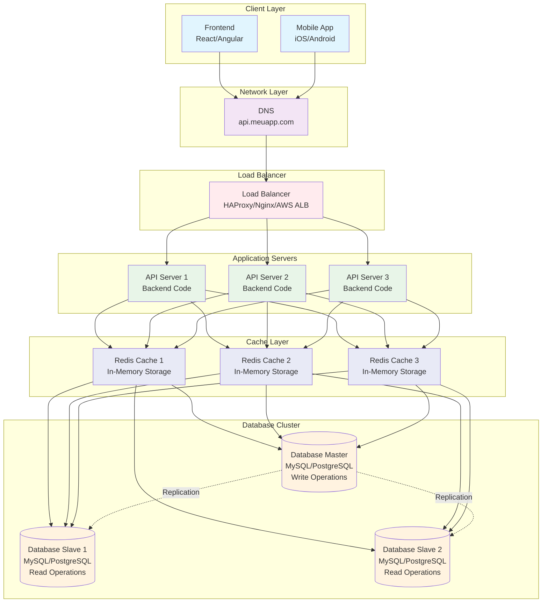

# Diagrama - Cache Layer

## Arquitetura com Cache Layer



## Padrões de Cache

### 1. Cache-Aside (Lazy Loading)
```javascript
async function getUser(id) {
  // 1. Verificar cache primeiro
  let user = await redis.get(`user:${id}`);
  
  if (user) {
    return JSON.parse(user);
  }
  
  // 2. Se não estiver no cache, buscar no banco
  user = await db.query('SELECT * FROM users WHERE id = ?', [id]);
  
  // 3. Armazenar no cache para próximas consultas
  await redis.setex(`user:${id}`, 3600, JSON.stringify(user));
  
  return user;
}
```

### 2. Write-Through
```javascript
async function createUser(userData) {
  // 1. Escrever no banco
  const user = await db.query(
    'INSERT INTO users (name, email) VALUES (?, ?)',
    [userData.name, userData.email]
  );
  
  // 2. Escrever no cache imediatamente
  await redis.setex(
    `user:${user.id}`, 
    3600, 
    JSON.stringify(user)
  );
  
  return user;
}
```

### 3. Write-Behind (Write-Back)
```javascript
async function updateUser(id, userData) {
  // 1. Atualizar cache imediatamente
  await redis.setex(
    `user:${id}`, 
    3600, 
    JSON.stringify(userData)
  );
  
  // 2. Agendar escrita no banco (assíncrona)
  scheduleDatabaseUpdate(id, userData);
  
  return userData;
}
```

## Benefícios do Cache

- **Performance**: Redução drástica no tempo de resposta
- **Redução de carga**: Menos consultas ao banco de dados
- **Escalabilidade**: Suporte a mais usuários simultâneos
- **Economia**: Menos recursos de banco necessários

## Métricas Melhoradas

| Métrica | Antes | Depois |
|---------|-------|--------|
| Usuários simultâneos | 15.000-50.000 | 50.000-200.000 |
| Requisições/segundo | 1.500-5.000 | 5.000-20.000 |
| Tempo de resposta (Cache Hit) | 100-200ms | 10-50ms |
| Tempo de resposta (Cache Miss) | 100-200ms | 100-200ms |
| Hit Rate | 0% | 80-95% |
| Carga no banco | 100% | 20-50% |
