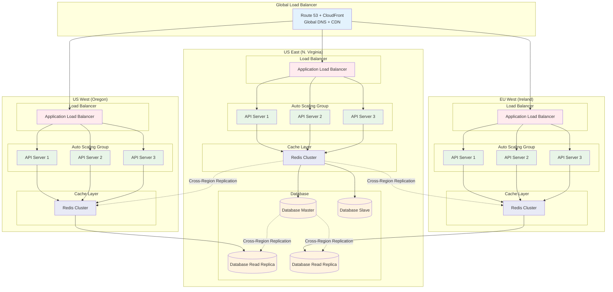

# Diagrama - Multi-Region

## Arquitetura Multi-Region

## Estratégias de Multi-Region

### 1. Active-Passive (Hot Standby)
- Uma região ativa, outras em standby
- Failover manual ou automático
- Menor custo, maior RTO

### 2. Active-Active
- Múltiplas regiões ativas simultaneamente
- Distribuição de carga global
- Maior custo, menor RTO

### 3. Active-Active com Read Replicas
- Escrita em uma região, leitura em todas
- Balanceamento de leitura global
- Compromisso entre custo e performance

## Benefícios do Multi-Region

- **Disaster Recovery**: Continuidade mesmo com falhas regionais
- **Latência Global**: Usuários atendidos pela região mais próxima
- **Alta Disponibilidade**: 99.99%+ de uptime
- **Compliance**: Dados armazenados em regiões específicas

## Métricas Melhoradas

| Métrica | Antes | Depois |
|---------|-------|--------|
| Usuários simultâneos | 200.000-1.000.000+ | 1.000.000+ (global) |
| Latência média | 100-200ms | 50-100ms (por região) |
| Uptime | 99.99% | 99.999% |
| RTO (Recovery Time Objective) | 4-8 horas | 15-30 minutos |
| RPO (Recovery Point Objective) | 1-4 horas | 5-15 minutos |
