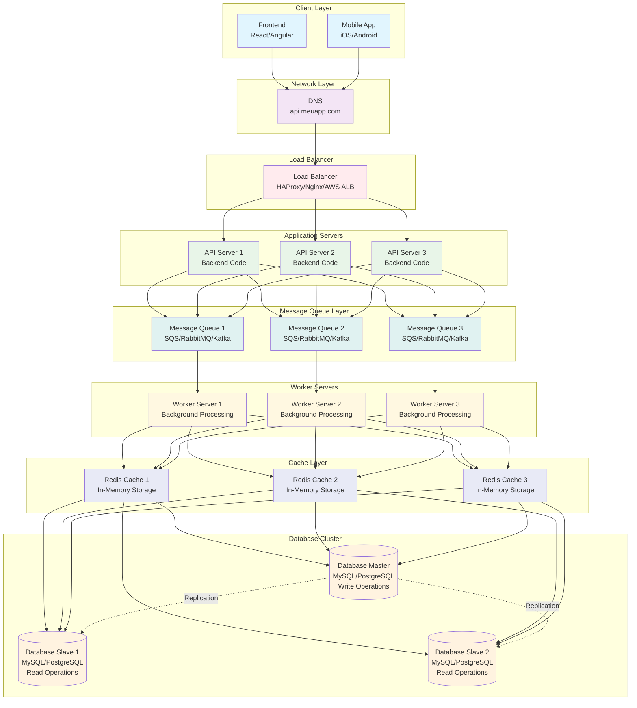

# Diagrama - Message Queues

## Arquitetura com Message Queues



## Tipos de Message Queues

### 1. Point-to-Point (Fila)
- Uma mensagem para um consumidor
- Ordem garantida
- Exemplo: SQS, RabbitMQ

### 2. Publish-Subscribe (Tópico)
- Uma mensagem para múltiplos consumidores
- Broadcasting
- Exemplo: SNS, Apache Kafka

### 3. Request-Reply
- Padrão síncrono com queue
- RPC over message queue
- Exemplo: RabbitMQ RPC

## Padrões de Processamento

### 1. Fan-Out Pattern
```javascript
// Um produtor, múltiplos consumidores
class FanOutProducer {
  async publishToMultipleQueues(message) {
    const queues = ['email-queue', 'sms-queue', 'push-queue'];
    
    const promises = queues.map(queue => 
      this.publishToQueue(queue, message)
    );
    
    await Promise.all(promises);
  }
}
```

### 2. Work Queue Pattern
```javascript
// Distribuição de trabalho entre workers
class WorkQueue {
  async distributeWork(tasks) {
    for (const task of tasks) {
      await this.publishToQueue('work-queue', task);
    }
  }
}
```

### 3. Request-Reply Pattern
```javascript
class RequestReply {
  async sendRequest(request) {
    const correlationId = this.generateCorrelationId();
    const replyQueue = `reply-${correlationId}`;
    
    // Criar queue temporária para resposta
    await this.createTempQueue(replyQueue);
    
    // Enviar requisição
    await this.publishToQueue('request-queue', {
      ...request,
      correlationId,
      replyTo: replyQueue
    });
    
    // Aguardar resposta
    return this.waitForReply(replyQueue, correlationId);
  }
}
```

## Benefícios das Message Queues

- **Responsividade**: API responde imediatamente
- **Escalabilidade**: Processamento distribuído
- **Resiliência**: Falhas não afetam a API
- **Throughput**: Maior capacidade de processamento

## Métricas Melhoradas

| Métrica | Antes | Depois |
|---------|-------|--------|
| Tempo de resposta da API | 200-500ms | 50-100ms |
| Throughput | 1.000-5.000 req/s | 5.000-20.000 req/s |
| Processamento assíncrono | 0% | 80-90% |
| Disponibilidade | 99.9% | 99.99% |
| Capacidade de picos | Limitada | Ilimitada |
